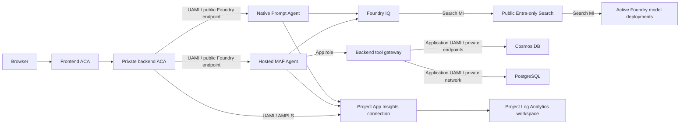

# Azure Deployment Plan - Cosmos Semantic Memory Cutover

> **Status:** Deployed and Verified

Generated: 2026-07-15

## 1. Project overview

**Goal:** Replace PostgreSQL/pgvector with Azure Cosmos DB for NoSQL vector
search for semantic conversation memory, restore backend availability, and then
decommission every PostgreSQL-specific Azure and repository component.

**Path:** Modify the existing deployment.

**Decisions:**

- Azure Cosmos DB for NoSQL is the selected semantic-memory store.
- Existing PostgreSQL semantic-memory records will not be migrated or retained.
- Semantic memory starts empty after cutover.
- Service interruption during revision replacement is acceptable.
- No dual writes, backfill, compatibility bridge, or zero-downtime machinery
  will be built.
- PostgreSQL destruction is a separate gated phase after the Cosmos-backed
  backend passes live acceptance checks.

## 2. Confirmed requirements and Azure context

| Attribute | Confirmed value |
|---|---|
| Classification | Demo / proof of concept |
| Scale | Small, owner-filtered semantic-memory collection |
| Budget | Cost optimized; reuse the existing serverless Cosmos account |
| Subscription | `ME-MngEnvMCAP372348-mimarusa-1` (`7bc68c68-f434-49ad-ab3e-b883ec39da86`), confirmed 2026-07-15 |
| Cosmos location | East US 2, confirmed 2026-07-15 |
| Resource group | `rg-agent-memory-rag` |
| Cosmos account | `agmem5df652cosmos` |
| Cosmos database | `support` |
| PostgreSQL resource | `agmem5df652pgnc` in North Central US |
| Authentication | Existing user-assigned managed identity and Cosmos data-plane RBAC |
| Networking | Existing Cosmos private endpoint; public access and local authentication remain disabled |
| Data retention | Preserve existing `history` and `profiles` containers and all their data |
| API compatibility | Preserve the current `/memories` request and response contract |

## 3. Components and change scope

| Component | Technology / service | Planned impact |
|---|---|---|
| Frontend | Lit/Vite on Azure Container Apps | No functional change; existing API contract remains |
| Backend | Python/FastAPI on Azure Container Apps | Replace `asyncpg` store internals with asynchronous Cosmos CRUD/vector queries |
| Conversation history | Cosmos `support/history` | No schema, data, or resource change |
| User profiles | Cosmos `support/profiles` | No schema, data, or resource change |
| Semantic memory | PostgreSQL/pgvector -> Cosmos `support/memories` | New empty vector-enabled container |
| Embeddings | Foundry `text-embedding-3-large` | Retain 3,072-dimensional embeddings |
| Enterprise retrieval | Azure AI Search / Foundry IQ | No index, capacity, or permission change |
| Infrastructure | Terraform with AzureRM and AzAPI | Add Cosmos capability/container, then remove PostgreSQL resources in a later phase |
| Deployment | Existing ACR builds and Container App updates | Backend image update only for cutover; frontend image need not change |

No specialized Copilot SDK, Azure Functions, cross-cloud migration, or App
Service workflow is present.

## 4. Deployment recipe

**Selected:** Existing Terraform/AzAPI infrastructure plus the current ACR and
Container Apps image deployment workflow.

**Rationale:**

- The repository already manages the environment with Terraform.
- AzureRM manages the Cosmos account but its installed provider schema cannot
  express a SQL container vector embedding policy.
- A child `azapi_resource` using the stable
  `Microsoft.DocumentDB/databaseAccounts/sqlDatabases/containers@2024-11-15`
  schema can manage only the new vector-enabled container without taking over
  the existing `history` or `profiles` containers.
- No `azd init` or template conversion is required.
- Preparation must pass `azure-validate`; deployment and destruction must run
  through `azure-deploy`.

## 5. Target architecture and contracts

### 5.1 Cosmos account and container

Update the existing Cosmos account in place with the Microsoft-documented
`az cosmosdb update --capabilities` operation, invoked idempotently through a
`terraform_data` resource. The command asserts that both `EnableServerless` and
`EnableNoSQLVectorSearch` remain active. AzureRM continues to own the account
but ignores capability drift so it never plans the account replacement that
its capability block would require. Wait 15 minutes for the capability to
propagate before creating the vector-enabled container.

Create one child container:

| Property | Value |
|---|---|
| Name | `memories` |
| Database | `support` |
| Partition key | `/user_id`, version 2 |
| Vector path | `/embedding` |
| Vector data type | `float32` |
| Dimensions | `3072` |
| Distance function | `cosine` |
| Vector index | `quantizedFlat` |
| Throughput | None specified; inherited serverless behavior |
| Scalar indexing | Index public metadata fields; exclude `_etag` and the raw vector path from ordinary scalar indexing |

`quantizedFlat` supports up to 4,096 dimensions. With fewer than 1,000 vectors,
Cosmos uses a full scan; this is acceptable for the expected small,
partition-scoped dataset. The implementation must always use `TOP N` and route
queries to the authenticated user's partition.

The account-scoped `Cosmos DB Built-in Data Contributor` assignment already
covers the new container. The existing private endpoint and private DNS also
cover it, so no new RBAC, secret, key, endpoint, or DNS resource is required.

### 5.2 Memory item and API contract

Use one item per `(user_id, conversation_id)`:

```text
id                = conversation_id
user_id           = authenticated tenant-scoped principal key
conversation_id   = application conversation ID
summary           = generated conversation summary
source_title      = optional conversation title
message_count     = summarized message count
embedding         = 3,072 float values
created_at        = first creation time
updated_at        = most recent upsert time
```

Using `conversation_id` as the item ID gives deterministic, idempotent upsert
and direct cascade deletion. Cosmos permits the same ID in different logical
partitions, while every operation still supplies `/user_id`.

Preserve these public fields and semantics:

- `id`, `conversation_id`, `summary`, `source_title`, `message_count`,
  `created_at`, and `updated_at`;
- `similarity` on vector-search results;
- create-by-conversation remains an upsert that preserves the original
  `created_at`;
- list remains newest-created first;
- delete returns `404` when the authenticated user has no matching item.

Cosmos internal fields, owner keys, partition information, and embeddings remain
absent from API responses.

### 5.3 Availability and degraded behavior

Semantic memory is optional application functionality and must not control
Container Apps traffic eligibility:

- `/health/live` remains process-only.
- `/health/ready` still probes `cosmos_memory` and reports sanitized status, but
  a semantic-memory-only failure does not change the HTTP response to `503`.
- Memory API calls return an explicit sanitized `503` when the store is
  unavailable; they must not silently return success-shaped empty data.
- The agent `check_memory` tool degrades to no memory context on typed Cosmos
  availability failures, while recording the failure in logs/telemetry.
- Conversation deletion remains successful if optional semantic-memory cleanup
  encounters a typed Cosmos availability failure; the cleanup failure is
  logged and observable rather than swallowed.
- Unexpected programming errors continue to propagate.

This behavior directly prevents an optional memory outage from hiding agents or
durable thread history.

## 6. Provisioning limit and eligibility check

The mandatory `az quota` check for `Microsoft.DocumentDB` in East US 2 returned
`BadRequest`, which is the documented unsupported-provider behavior. The
fallback is the official Cosmos service-limit documentation plus a live
control-plane inventory.

Live inventory:

- one database: `support`;
- two containers: `history`, `profiles`;
- one existing serverless Cosmos account;
- current account capability: `EnableServerless`.

| Resource type / operation | Number added | Total after cutover | Limit / eligibility | Source and result |
|---|---:|---:|---|---|
| `Microsoft.DocumentDB/databaseAccounts` | 0 | 1 | 250 accounts per subscription by default | Existing account; no account provisioning |
| Databases and containers in `agmem5df652cosmos` | 1 container | 4 combined resources | 500 databases and containers per account | Official Cosmos limits; within limit |
| `EnableNoSQLVectorSearch` account capability | 1 in-place update | Enabled | Supported on serverless containers; activation can take approximately 15 minutes | Official Cosmos vector/serverless documentation |
| 3,072-dimensional `quantizedFlat` vector index | 1 | 1 | Maximum 4,096 dimensions | Official Cosmos vector documentation; within limit |

**Capacity status:** All planned additions are within documented limits. No
quota increase or new regional service capacity is required.

The current Cosmos account is single-region, serverless, periodically backed
up, and not zone redundant. This cutover does not change those account-level
resilience characteristics.

## 7. Backend implementation plan

### 7.1 Replace the store internals

Keep the `ConversationMemoryStore` class and public method surface to minimize
call-site changes:

- `initialize`
- `close`
- `enabled`
- `health_check`
- `create_memory`
- `list_memories`
- `search`
- `delete_memory`
- `delete_by_conversation`

Replace PostgreSQL pooling, vector literals, token caching, and SQL with the
existing asynchronous Cosmos SDK/managed-identity pattern used by history and
profile storage.

Implementation details:

1. Add `COSMOS_MEMORY_CONTAINER`, defaulting to `memories`.
2. Initialize `azure.cosmos.aio.CosmosClient` through the existing credential
   helper; retain key authentication only for local development consistency.
3. Validate every embedding has exactly 3,072 finite numeric values before
   writing or querying.
4. Implement bounded optimistic-concurrency retries for create/update conflicts,
   preserving stable `id` and `created_at`.
5. Use partition-scoped, parameterized queries containing an explicit owner
   predicate even when the SDK also receives `partition_key=user_id`.
6. Convert Cosmos cosine distance to the existing API's similarity convention
   only after a known-vector test confirms the service result semantics.
7. Map known Cosmos availability responses to a typed memory-store exception;
   do not add broad exception catches.
8. Use existing telemetry spans renamed from `store.postgres.*` to
   `store.cosmos.memory.*`.

### 7.2 Configuration and dependencies

- Remove all `POSTGRES_*`, `PG_AUTH_MODE`, and token-refresh settings.
- Remove `postgres_configured`.
- Remove `asyncpg` from `backend/pyproject.toml`.
- Keep `azure-cosmos`, which is already a backend dependency.
- Add `COSMOS_MEMORY_CONTAINER=memories` to Container App configuration and the
  local environment example.

### 7.3 Call-site hardening

- Update startup and readiness labels from `postgres_memory` to
  `cosmos_memory`.
- Keep `/memories` request/response DTOs unchanged.
- Keep owner derivation exclusively server-side.
- Make coordinator cascade cleanup nonblocking only for typed optional-store
  availability failures.
- Make hosted-agent memory lookup fail open only for the same typed failures.

## 8. Test plan

### 8.1 Store tests

Add focused asynchronous tests for:

- item serialization and public-field filtering;
- exact 3,072-dimension validation and rejection of nonfinite values;
- deterministic ID and owner partition usage;
- first create and repeat upsert preserving `id`/`created_at`;
- bounded ETag conflict retry;
- owner-scoped list ordering and pagination;
- vector query construction, `TOP N`, partition routing, owner filter, ordering,
  and score conversion;
- point delete, missing delete, and conversation cascade delete;
- empty container behavior;
- sanitized typed availability errors;
- client close/lifecycle behavior.

### 8.2 API and integration-boundary tests

Update or extend the existing test suites to prove:

- one user cannot list, search, overwrite, or delete another user's memory;
- the `/memories` API contract remains unchanged;
- a memory health failure is visible in readiness details but readiness remains
  HTTP `200`;
- agent listings and conversation history remain available during a simulated
  semantic-memory outage;
- the hosted `check_memory` tool returns a no-memory fallback on typed store
  unavailability;
- conversation deletion succeeds and logs a failed optional-memory cleanup;
- unexpected exceptions are not converted into successful responses.

### 8.3 Repository validation

Run the existing backend unit-test discovery, frontend TypeScript production
build, Terraform formatting, Terraform validation, and non-destructive
Terraform plans. Do not introduce a new test or lint framework.

## 9. Two-gate cutover sequence

### Gate A - Additive Cosmos cutover

1. Run the existing baseline backend tests, frontend build, and Terraform
   validation before edits.
2. Implement the Cosmos store, degraded-readiness behavior, tests, configuration,
   and directly related documentation.
3. Add `EnableNoSQLVectorSearch` and the `memories` child container.
4. Keep every PostgreSQL Azure resource and Terraform declaration intact.
5. Produce and inspect an additive Terraform plan. It may update the Cosmos
   account in place, create one container, and update backend environment
   configuration. It must contain:
   - no resource destroy;
   - no Cosmos account/database/history/profile replacement;
   - no Search, Foundry, networking, or identity replacement.
6. Mark this plan `Ready for Validation` and invoke `azure-validate`.
7. After validation, invoke `azure-deploy` for the additive infrastructure and
   Cosmos-backed backend image. Temporary backend downtime is accepted.
8. Wait for the Cosmos capability to report enabled and confirm the deployed
   container policy through the control plane.
9. Perform live acceptance checks:
   - backend liveness and readiness;
   - authenticated `/api/me`;
   - both configured `/api/agents`;
   - existing `/api/conversations` and conversation detail;
   - create/list/upsert/search/delete memory;
   - hosted-agent `check_memory`;
   - delete a disposable test conversation and confirm cascade behavior;
   - logs contain no PostgreSQL connection or token-refresh attempts.

No migration or backfill runs. The first memory list is expected to be empty.

### Gate B - PostgreSQL decommission

Proceed only after Gate A acceptance succeeds.

1. Remove PostgreSQL-specific code, infrastructure declarations, deployment
   steps, setup package, and active documentation references listed below.
2. Run the full repository validation again.
3. Produce a saved, full Terraform plan without `-target`.
4. Verify every destroy is explicitly expected and that Cosmos, history,
   profiles, Search, Foundry, Container Apps, ACR, and shared networking remain.
5. Use `ask_user` to obtain explicit destructive-action confirmation for the
   reviewed PostgreSQL destroy set. Confirmed on 2026-07-15.
6. Mark the decommission plan `Ready for Validation` and invoke
   `azure-validate`.
7. Invoke `azure-deploy` to apply the reviewed destruction.
8. Re-run the live acceptance checks and final inventory checks.

## 10. PostgreSQL decommission inventory

### Azure/Terraform resources to remove

- `azurerm_postgresql_flexible_server.main`
- `azurerm_postgresql_flexible_server_database.memory`
- `azurerm_postgresql_flexible_server_configuration.extensions`
- `azurerm_postgresql_flexible_server_active_directory_administrator.bootstrap`
- `azurerm_private_endpoint.postgres`
- PostgreSQL private DNS zone map entry and its generated VNet link
- `azurerm_user_assigned_identity.postgres_bootstrap`
- `azurerm_role_assignment.postgres_bootstrap_acr_pull`
- `azurerm_container_app_job.postgres_setup`
- PostgreSQL backend environment variables
- `postgres_location`
- `postgres_fqdn` and `postgres_setup_job_name` outputs
- PostgreSQL and setup-job naming locals

### Repository artifacts to remove or update

- remove `setup/postgres/`;
- remove PostgreSQL bootstrap image/job steps from `scripts/deploy_images.sh`;
- remove PostgreSQL settings and token-cache code;
- remove `asyncpg`;
- update `README.md`, `backend/README.md`,
  `docs/PRD-Solution-Challenges-1-5.md`, `docs/IMPLEMENTATION-PLAN.md`, and
  `docs/architecture.html`;
- preserve the historical deployment record below as history rather than
  rewriting it.

Old `pg-bootstrap` image tags in ACR are not part of this decommission apply.
Deleting registry artifacts would be a separate optional destructive cleanup.

## 11. Acceptance criteria

Gate A is accepted only when:

- Cosmos vector search is enabled without replacing the account;
- `support/memories` exists with `/user_id` and the approved vector policy;
- existing `history` and `profiles` resource IDs and data remain intact;
- liveness and readiness return `200`;
- both configured agents are visible;
- existing thread history is visible;
- memory CRUD, upsert, vector search, owner isolation, and cascade behavior pass;
- semantic-memory failure no longer removes the backend replica from ingress;
- no runtime path attempts PostgreSQL access.

Gate B is accepted only when:

- the reviewed PostgreSQL resources no longer exist in Azure;
- no PostgreSQL resources remain in Terraform state;
- no active runtime, infrastructure, build, or setup path references
  PostgreSQL;
- the backend remains ready with no PostgreSQL configuration;
- agents, history, profiles, Foundry IQ, and Cosmos-backed memory still pass
  live checks.

## 12. Risks, mitigations, and rollback

| Risk | Mitigation / boundary |
|---|---|
| Cosmos account replacement or unintended history/profile change | Reject any plan showing replacement or change to those resources |
| Vector feature activation delay | Apply capability/container before backend acceptance and poll control-plane state |
| Vector policy is difficult to change after data exists | Use a new isolated container and validate the policy while it is empty |
| Memory failure again gates all APIs | Make memory a reported optional dependency, not an ACA readiness condition |
| Cross-user data exposure | Partition every operation by trusted `user_id`, include owner filters, and test negative access |
| Full scan below 1,000 vectors consumes more RUs | Keep queries partition-scoped and bounded; monitor RU consumption |
| Existing Cosmos account is single-region and not zone redundant | Record as an existing limitation; this cutover neither worsens nor solves regional resilience |
| Failed cutover | Stop before Gate B, retain PostgreSQL resources, repair the Cosmos path, and redeploy |
| Rollback to old backend | Not a service-recovery option because policy keeps PostgreSQL stopped; remediation is roll-forward on Cosmos |
| Accidental destructive scope | Separate Gate B, save and inspect the full plan, then obtain explicit confirmation |

## 13. Execution checklist

### Planning

- [x] Analyze workspace and deployment
- [x] Confirm no specialized deployment skill supersedes this workflow
- [x] Confirm subscription
- [x] Confirm Cosmos location
- [x] Compare Cosmos, HorizonDB, and the existing Azure AI Search service
- [x] Select Cosmos DB for NoSQL
- [x] Confirm no migration and no zero-downtime requirement
- [x] Verify serverless vector support and stable ARM schema
- [x] Complete quota/limit check
- [x] Define cutover and decommission gates
- [x] User approves this completed plan

### Gate A preparation, validation, and deployment

- [x] Capture baseline validation results
- [x] Implement Cosmos memory store and availability behavior
- [x] Add tests and update directly related documentation
- [x] Add vector capability/container without PostgreSQL destroys
- [x] Run repository validation
- [x] Inspect additive Terraform plan
- [x] Set status to `Ready for Validation`
- [x] Invoke `azure-validate`
- [x] Invoke `azure-deploy`
- [x] Complete live Gate A acceptance

### Gate B decommission, validation, and deployment

- [x] Remove PostgreSQL code and infrastructure
- [x] Run repository validation
- [x] Inspect saved full destroy plan
- [x] Obtain explicit destroy confirmation
- [x] Set status to `Ready for Validation`
- [x] Invoke `azure-validate`
- [x] Invoke `azure-deploy`
- [x] Complete final live and inventory acceptance

## 14. Validation proof

### All validation checks pass - Gate A - 2026-07-15

- [x] Terraform installation: `terraform 1.13.3`
- [x] Azure CLI installation: `azure-cli 2.80.0`
- [x] Authentication: subscription
  `ME-MngEnvMCAP372348-mimarusa-1`
  (`7bc68c68-f434-49ad-ab3e-b883ec39da86`) is enabled in tenant
  `a7b1484c-f66a-496a-b1cf-35631a50396c`
- [x] Initialize: `terraform -chdir=infra init -input=false -no-color`
- [x] Format: `terraform -chdir=infra fmt -check -recursive`
- [x] Syntax: `terraform -chdir=infra validate -no-color`
- [x] State backend: accessible with 74 tracked resources
- [x] Plan preview: saved no-refresh plan action set asserted exactly
- [x] Azure Policy: CLI fallback returned no applicable assignments at the
  resource-group scope; the MCP policy identity lacked subscription Reader
- [x] Template resolution: no unresolved `{{ .Env.* }}` expressions
- [x] Backend tests:
  `uv run --project backend python -m unittest discover -s backend/tests`
  passed all 54 tests
- [x] Frontend build: `npm --prefix frontend run build` succeeded
- [x] Code-quality review: required deletion, timeout, and Cosmos capability
  propagation findings resolved before validation

### Terraform plan proof

Because the policy-stopped PostgreSQL server rejects refresh of its child
resources, Gate A used `terraform plan -refresh=false`. The saved plan contains
only:

- create `terraform_data.cosmos_vector_search` to invoke the documented
  in-place Azure CLI capability update;
- create `time_sleep.cosmos_vector_search_propagation`;
- create `azapi_resource.cosmos_memories`;
- update `azurerm_container_app.backend` in place with
  `COSMOS_MEMORY_CONTAINER=memories`.

The plan has zero deletes and zero replacements. Existing Cosmos account,
database, `history`, `profiles`, RBAC assignments, and private endpoint are
unchanged.

### Role Assignment Verification

- **Status:** Verified.
- **Identity:** existing user-assigned application identity
  `id-agmem-5df652`.
- **Role:** account-scoped Cosmos DB Built-in Data Contributor
  (`00000000-0000-0000-0000-000000000002`).
- **Scope:** existing account `agmem5df652cosmos`; this already covers the new
  `support/memories` container.
- **Local deployer:** the existing account-scoped Cosmos data contributor
  assignment is unchanged.
- **Issues:** none; no RBAC mutation is present in the Gate A plan.

### All validation checks pass - Gate B - 2026-07-15

- [x] Terraform installation: `terraform 1.13.3`
- [x] Azure CLI installation: `azure-cli 2.80.0`
- [x] Authentication: confirmed enabled default subscription
  `ME-MngEnvMCAP372348-mimarusa-1`
  (`7bc68c68-f434-49ad-ab3e-b883ec39da86`) in tenant
  `a7b1484c-f66a-496a-b1cf-35631a50396c`
- [x] Initialize: `terraform -chdir=infra init -input=false -no-color`
- [x] Format: `terraform -chdir=infra fmt -check -recursive`
- [x] Syntax: `terraform -chdir=infra validate -no-color`
- [x] State backend: accessible with 77 tracked resources before decommission
- [x] Full plan: saved with `-refresh=false` because the policy-stopped server
  rejects child-resource refresh
- [x] Exact action assertion: zero creates, one in-place backend environment
  update, and exactly ten approved destroys
- [x] Protected resources: no Cosmos account/database/container, Search, Foundry,
  ACR, Container Apps environment, shared network, history, or profile action
- [x] Backend update: removes only the five retired database environment
  variables; the Cosmos image will be explicitly reasserted after apply because
  Terraform intentionally ignores image drift
- [x] Azure Policy: applicable management-group/subscription assignments were
  retrieved; the plan creates nothing and introduces no location, SKU, network,
  or security-policy change
- [x] Template resolution: no unresolved `{{ .Env.* }}` expressions
- [x] Static role verification: application Cosmos data contributor, ACR pull,
  Foundry/model, Search reader, and telemetry publisher assignments remain
  unchanged and resource-scoped; only the retired bootstrap assignment is
  destroyed
- [x] Backend tests:
  `uv run --project backend python -m unittest discover -s backend/tests`
  passed all 54 tests
- [x] Frontend build: `npm --prefix frontend run build` succeeded
- [x] Architecture explorer: 41 components, 76 flows, and 8 views passed model,
  browser interaction, desktop/mobile, light/dark, deep-link, keyboard, and
  reduced-motion checks
- [x] Active-source scan: no runtime, infrastructure, build, setup, or current
  architecture reference to PostgreSQL, pgvector, or asyncpg remains
- [x] Destructive confirmation: the user approved the exact reviewed ten-resource
  destroy set through the confirmation prompt on 2026-07-15

### Gate B Terraform plan proof

The saved full plan contains one in-place update:

- `azurerm_container_app.backend` removes `PG_AUTH_MODE`, `POSTGRES_DB`,
  `POSTGRES_HOST`, `POSTGRES_PORT`, and `POSTGRES_USER`.

It contains exactly these ten destroys:

- `azurerm_container_app_job.postgres_setup`
- `azurerm_postgresql_flexible_server.main`
- `azurerm_postgresql_flexible_server_active_directory_administrator.bootstrap`
- `azurerm_postgresql_flexible_server_configuration.extensions`
- `azurerm_postgresql_flexible_server_database.memory`
- `azurerm_private_dns_zone.zones["postgres"]`
- `azurerm_private_dns_zone_virtual_network_link.links["postgres"]`
- `azurerm_private_endpoint.postgres`
- `azurerm_role_assignment.postgres_bootstrap_acr_pull`
- `azurerm_user_assigned_identity.postgres_bootstrap`

### Gate B deployment and acceptance proof

Gate B was deployed and verified on 2026-07-15.

- The first apply removed the bootstrap job and its ACR role assignment. Azure
  rejected deletion of PostgreSQL child resources while policy kept the server
  stopped, so the database, extension configuration, and Entra administrator
  were removed from Terraform state after confirming the platform could not
  delete them independently.
- Azure also enforced a control-plane dependency cycle: the private endpoint
  could not be deleted while the server was stopped, and the server could not
  be deleted while the endpoint was connected. The server was started
  temporarily, the endpoint was deleted, and then the server was deleted.
- The final apply removed PostgreSQL private DNS and all five backend PostgreSQL
  environment variables. The approved Cosmos backend image was reasserted as
  `agmem5df652acr.azurecr.io/backend:cosmos-memory-20260715`.
- Revision `ca-agmem-backend--0000028` is provisioned, healthy, has one replica,
  and receives 100% of traffic.
- A separately discovered, unassociated PostgreSQL-named NSG was outside
  Terraform and the reviewed ten-resource destroy set. The user separately
  approved its deletion on 2026-07-15; it had no subnet, NIC, or security rules
  and is now absent.
- A refreshed full Terraform plan reports `No changes`; state contains 67
  resources and no PostgreSQL entries.

Final live acceptance:

- `https://ca-agmem-frontend.salmonmeadow-d85c9acb.eastus2.azurecontainerapps.io`
  serves the application; liveness is `ok` and readiness is `ready`, with all
  dependencies including optional `cosmos_memory` healthy and no degraded
  dependencies.
- Authenticated API checks returned both configured agents as available, all 14
  existing conversations, a durable conversation detail, and the current
  profile.
- A disposable Hosted Agent conversation exercised memory create, idempotent
  upsert with stable ID and creation timestamp, list, vector search, explicit
  delete, recreate, live Hosted `check_memory`, conversation deletion, and
  cascade cleanup. The conversation count returned from 15 to 14 and the
  disposable memory was absent afterward.
- The Cosmos account reports `EnableServerless` and
  `EnableNoSQLVectorSearch`. `support/memories` uses partition key `/user_id`,
  a 3,072-dimensional `float32` cosine vector at `/embedding`, and a
  `quantizedFlat` vector index.
- Azure inventory contains no PostgreSQL resource, setup job, bootstrap
  identity, endpoint, DNS resource, NSG, or PostgreSQL-named role assignment.
  The backend environment contains no PostgreSQL variables.
- Live RBAC still gives the application identity ACR pull, Search data reader,
  metrics publisher, OpenAI user, custom Foundry Agent Consumer, and Cosmos
  Data Contributor access. The frontend identity retains only ACR pull.
- The latest 233 backend revision log lines contain no PostgreSQL, Cosmos-memory,
  runtime, or conversation-persistence error.

**Current phase:** Gate B deployed and verified; the Cosmos cutover and
PostgreSQL decommission are complete.

---

# Historical Deployment Record - Final Infrastructure and Observability

**Status:** Deployed and Verified

## 1. Scope and deployment recipe

This is a **MODIFY** deployment for the existing `agent-memory-rag` application.

Use:

- Terraform/AzAPI for managed Azure infrastructure;
- direct Python SDK execution for the native Prompt Agent and Foundry IQ setup;
- the existing container-based `azd` deployment for the Hosted MAF Agent;
- explicit Azure CLI deletion only for the diagnostic resources that are outside
  Terraform state.

The implementation must preserve the existing resource group, subscription,
regions, tenant policies, application data, active agent project, and Entra
registration.

## 2. Confirmed Azure context

| Setting | Value |
| --- | --- |
| Subscription | `ME-MngEnvMCAP372348-mimarusa-1` |
| Subscription ID | `7bc68c68-f434-49ad-ab3e-b883ec39da86` |
| Tenant ID | `a7b1484c-f66a-496a-b1cf-35631a50396c` |
| Resource group | `rg-agent-memory-rag` |
| Primary region | `eastus2` |
| PostgreSQL region | `northcentralus` |
| Search region | `westeurope` |

The Azure context must be reconfirmed immediately before validation/deployment.

## 3. Discovery results

### 3.1 Foundry generations

The resource group contains two AIServices accounts:

| Account | Purpose | Network | Model deployments |
| --- | --- | --- | --- |
| `agmem5df652aif` | Legacy application model account | Private only | `gpt-4o-mini`, `text-embedding-3-large` |
| `agmem5df652aif2` | Active Foundry account/project and both agents | Public Entra/RBAC plus private endpoint | Identical chat and embedding deployments |

The active Foundry project is `agmem-agents`. Its only current project connection
is the Foundry IQ `RemoteTool` connection. It has no Application Insights
connection and the account has no diagnostic setting.

The legacy project `agmem-project` has no project connections. Active Prompt and
Hosted agent state is in the new project, not the legacy project.

### 3.2 Remaining legacy-account consumers

The old account cannot be deleted immediately because:

- the backend uses it for profile/memory chat and embeddings;
- setup environment variables point to it;
- the Foundry IQ knowledge base model currently uses
  `https://agmem5df652aif.openai.azure.com`;
- Search has an approved shared private link to the old account;
- application, setup, and Search identities have roles scoped to it.

The new account has the same model names, versions, SKUs, and capacities, so these
consumers can move without a model contract change.

### 3.3 Current networking

- Public Entra/RBAC-only: active Foundry, Search, ACR.
- Private application data: Cosmos DB and PostgreSQL.
- Private application boundary: backend Container App ingress.
- Public application edge: frontend Container App.
- Private endpoints currently exist for:
  - legacy Foundry;
  - active Foundry;
  - ACR;
  - Cosmos DB;
  - PostgreSQL;
  - Azure Monitor Private Link Scope.
- No Search private endpoint exists.

The active Foundry private endpoint is no longer required by the accepted public
Foundry design. The ACR private endpoint remains required for Container Apps image
pulls, while public ACR access remains required by the non-network-injected Hosted
Agent runtime.

### 3.4 Observability

`appi-agmem-5df652` is workspace-based and uses
`log-agmem-5df652`, with 30-day retention.

Current Application Insights restrictions are:

- local authentication disabled;
- public ingestion disabled;
- public query disabled;
- private ingestion/query available through AMPLS.

The backend already emits privacy-safe Azure Monitor OpenTelemetry using its UAMI
and the private Azure Monitor path. The Container Apps environment already writes
platform/container logs to the same Log Analytics workspace.

Foundry server-side tracing requires a project Application Insights connection.
The currently documented project connection uses the Application Insights
connection string and does not use managed identity by default. The non-injected
Foundry/Hosted runtime also requires public ingestion. Full Foundry traces can
contain prompts, outputs, retrieval data, tool arguments, and tool results.

The approved posture is:

- enable full Foundry server-side tracing;
- accept the platform-required connection-string/local-auth exception;
- enable public ingestion and authenticated public query;
- set AMPLS access modes to `Open` so Foundry's public platform path is not
  blocked, while retaining private DNS/private endpoint routing for the backend's
  UAMI-authenticated telemetry;
- restrict trace access with Azure RBAC;
- retain 30-day workspace retention;
- do not enable extra Agent Framework sensitive-data capture.

### 3.5 Release and setup execution

- Native Prompt Agent publication is a direct `azure-ai-projects` SDK operation and
  does not require an image or Container Apps Job.
- Foundry IQ/Search setup can run directly after both Search and the active model
  account are public Entra/RBAC-only.
- PostgreSQL bootstrap must remain a VNet-integrated Container Apps Job because
  PostgreSQL is private.
- Hosted MAF will retain the established container-based deployment and ACR image.
- Foundry source-code Hosted Agent deployment without an image is available in
  preview and must be documented as a future simplification, not adopted now.

### 3.6 Diagnostic resources outside Terraform

The following resources are dedicated to the obsolete jump workflow:

- VM `vm-agmem-jump` and policy extension;
- NIC `nic-agmem-jump`;
- OS disk `osdisk-vm-agmem-jump`;
- Developer Bastion `bas-agmem-5df652`;
- NAT gateway `nat-agmem-jump`;
- public IP `pip-agmem-jump-egress`;
- NSG `nsg-agmem-jump`;
- VNet subnet `snet-jump`.

There is also an unmanaged obsolete Container Apps Job:

- `kb-setup`

The Terraform-managed replacement jobs are:

- `caj-agmem-kbsetup`;
- `caj-agmem-agentsetup`;
- `caj-agmem-pgsetup`.

Only the PostgreSQL job remains in the target architecture.

## 4. Target architecture



The final project contains one Foundry account/project, one native Prompt Agent,
one container-hosted MAF Agent, one Foundry IQ knowledge base, and one project
Application Insights/Log Analytics observability plane.

## 5. Planned implementation

### 5.1 Migrate model consumers before deletion

1. Grant the application UAMI `Cognitive Services OpenAI User` on the active
   Foundry account.
2. Grant the Search service identity `Cognitive Services User` on the active
   Foundry account.
3. Give the authenticated deployment principal the minimum Foundry/Search/model
   roles needed for direct setup and release.
4. Repoint backend and setup configuration to the active Foundry account's
   cognitive/OpenAI endpoint and existing chat/embedding deployments.
5. Run the knowledge-base setup directly to replace the live knowledge-base model
   `resourceUri` with `https://agmem5df652aif2.openai.azure.com`.
6. Verify Foundry IQ retrieval from both agents before any old-account deletion.

### 5.2 Connect complete agent observability

1. Add an AzAPI project child connection:
   `Microsoft.CognitiveServices/accounts/projects/connections`.
2. Configure it as:
   - category `AppInsights`;
   - target `appi-agmem-5df652`;
   - connection-string credential;
   - Application Insights resource ID metadata.
3. Enable Application Insights public ingestion and query plus local
   authentication for this Foundry platform integration.
4. Keep the existing AMPLS resources, private endpoint/DNS, and backend UAMI
   publisher role, with AMPLS ingestion/query modes set to `Open`.
5. Add an active Foundry-account diagnostic setting to the project Log Analytics
   workspace for:
   - `Audit`;
   - `RequestResponse`;
   - `AzureOpenAIRequestUsage`;
   - `Trace`;
   - `AllMetrics`.
6. Keep `ENABLE_SENSITIVE_DATA=false` for Hosted MAF and do not enable additional
   OpenTelemetry message-content capture variables.
7. Add explicit Hosted application-log export only if deployed verification shows
   that standard Python logs are not arriving through the platform connection;
   avoid duplicate exporters by default.
8. Record safe dimensions for service, agent type/version, release ID, latency,
   token/tool/citation counts, and error code.

The project connection is a documented platform exception to the preferred
managed-identity-only telemetry pattern. Application runtime data access remains
managed-identity-only.

### 5.3 Remove unnecessary setup containers

1. Remove Terraform jobs:
   - `azurerm_container_app_job.knowledge_setup`;
   - `azurerm_container_app_job.agent_setup`.
2. Keep `azurerm_container_app_job.postgres_setup`.
3. Replace the removed jobs with authenticated direct commands for:
   - Foundry IQ/Search setup;
   - Prompt Agent publication.
4. Remove their image build targets and unused Dockerfiles.
5. Remove the now-unused setup UAMI and its role assignments after direct release
   succeeds.
6. Retain the Hosted MAF Dockerfile, ACR repository, project ACR pull access, and
   container-based `azd` release.
7. Delete only the unused `kb-setup` and `prompt-agent-release` ACR repositories;
   preserve Hosted repositories and versions for rollback.

### 5.4 Remove obsolete Terraform-managed infrastructure

After migration verification, remove:

- legacy account `azurerm_cognitive_account.main`;
- legacy project `azurerm_cognitive_account_project.main`;
- legacy chat and embedding deployments;
- legacy Foundry private endpoint;
- active Foundry private endpoint;
- Search-to-legacy-Foundry shared private link;
- old-account role assignments;
- obsolete setup identity/jobs/roles;
- private DNS zones and VNet links used only by removed endpoints:
  - `privatelink.openai.azure.com`;
  - `privatelink.cognitiveservices.azure.com`;
  - `privatelink.services.ai.azure.com`;
  - `privatelink.search.windows.net`.

Preserve:

- active Foundry account/project, agents, and model deployments;
- Foundry IQ resources;
- Search service, indexes, knowledge sources, and knowledge base;
- ACR public endpoint and ACR private endpoint;
- Cosmos DB and its private endpoint/DNS;
- PostgreSQL and its private networking/DNS;
- AMPLS, monitor private endpoint, and monitor DNS;
- frontend/backend Container Apps and Container Apps environment;
- Entra application and identities still used at runtime.

### 5.5 Delete unmanaged diagnostic resources

After explicit destructive confirmation, delete the exact resources listed in
section 3.6 and the unmanaged `kb-setup` job.

Deletion order:

1. unmanaged setup job;
2. jump VM (including extension);
3. NIC and OS disk;
4. Developer Bastion;
5. NAT gateway;
6. public IP;
7. NSG;
8. `snet-jump`.

## 6. Safe deployment sequence

### Stage A - Add and migrate, no legacy deletion

1. Implement release-script, configuration, RBAC, and observability
   changes while retaining the old account and all existing endpoints.
2. Run repository tests, type checks, builds, Terraform formatting/validation, and
   policy/security checks.
3. Produce a non-destructive Terraform plan.
4. Validate and apply through the Azure validation/deployment workflow.
5. Rebuild/deploy backend and Hosted MAF images as required.
6. Run direct Foundry IQ setup and direct Prompt Agent publication.
7. Verify:
   - backend memory/profile chat and embeddings use the active account;
   - the KB model URI references the active account;
   - Prompt and Hosted agents both retrieve grounded citations;
   - Hosted application tools still pass app-role authorization;
   - new Prompt and Hosted traces appear in Application Insights;
   - Foundry account diagnostics appear in Log Analytics;

### Stage B - Destructive cleanup

1. Remove legacy Terraform resources from configuration.
2. Run `terraform validate` and generate a saved Terraform plan.
3. Confirm the plan contains only the expected deletes/updates/creates.
4. Present the exact Terraform delete set and unmanaged Azure delete set for
   explicit user confirmation.
5. Apply the approved cleanup through the Azure deployment workflow.
6. Delete the approved unmanaged resources and unused ACR setup repositories.
7. Run final application, agent, identity, networking, telemetry, and drift checks.

## 7. Validation Proof

### All validation checks pass

- [x] Terraform installed: `1.13.3`.
- [x] Azure CLI installed: `2.80.0`.
- [x] Authenticated to the approved subscription and tenant.
- [x] `terraform init -input=false`.
- [x] `terraform fmt -check -recursive`.
- [x] `terraform validate`.
- [x] Saved Terraform plan generated and reviewed.
- [x] Terraform state backend accessible: 102 resources listed.
- [x] Azure Policy state reviewed.
- [x] No unresolved `{{ .Env.* }}` Terraform template variables.
- [x] Backend test suite: 41 passed.
- [x] Frontend production build passed.
- [x] Bash syntax checks passed for all deployment scripts.
- [x] Python compilation passed for both direct setup modules.

### Composer frontend release revalidation

Validated at `2026-07-13T21:00:46+02:00` for a frontend-image-only
release using immutable tag `frontend:composer-20260713210046`:

- confirmed subscription
  `ME-MngEnvMCAP372348-mimarusa-1`
  (`7bc68c68-f434-49ad-ab3e-b883ec39da86`), tenant
  `a7b1484c-f66a-496a-b1cf-35631a50396c`, and existing region `eastus2`;
- Terraform `1.13.3` and Azure CLI `2.80.0` are installed and authenticated;
- `terraform init -input=false`, `terraform fmt -check -recursive`, and
  `terraform validate` passed;
- a full-refresh `terraform plan -detailed-exitcode` returned `0` with no
  changes, 74 Terraform state resources remain accessible, and no unresolved
  Terraform `{{ .Env.* }}` placeholders exist;
- six visible inherited/subscription policy assignments were reviewed; this
  release creates no Azure resources and changes no policy-governed settings;
- static RBAC review confirmed the frontend UAMI receives `AcrPull` on the
  registry, and live RBAC confirmed `id-agmem-frontend-5df652` currently has
  that assignment on `agmem5df652acr`;
- the frontend TypeScript/Vite production build passed with 180 modules, and
  scoped `git diff --check` passed;
- Docker is unavailable locally, so the established ACR Tasks remote-build
  path will provide the clean container build verification;
- the resource group and Container Apps environment are provisioned
  successfully in East US 2;
- frontend revision `ca-agmem-frontend--0000015`, using
  `frontend:simplification-20260713193832`, is the latest ready revision;
- frontend `/`, `/config.js`, `/api/health/live`, and `/api/health/ready`
  return HTTP `200`, while anonymous `/api/me` correctly returns `401`;
- `frontend/Dockerfile` exposes `8080`, matching the Container Apps ingress
  target port;
- the tag `frontend:composer-20260713210046` did not exist at validation time.

Release scope:

- remotely build the current `frontend/` tree with `frontend/Dockerfile`;
- update only `ca-agmem-frontend` to the immutable uniquely tagged image;
- preserve the backend revision, agents, jobs, identities, data services,
  Terraform-managed infrastructure, Entra configuration, and traffic mode;
- rollback to revision `ca-agmem-frontend--0000015` and image
  `frontend:simplification-20260713193832` if acceptance fails.

### Conversation metadata release revalidation

Validated at `2026-07-12T21:11:04+02:00` for an application-image-only release:

- confirmed subscription
  `ME-MngEnvMCAP372348-mimarusa-1`
  (`7bc68c68-f434-49ad-ab3e-b883ec39da86`) and existing region `eastus2`;
- Terraform `1.13.3` and Azure CLI `2.80.0` are installed;
- `terraform init -input=false`, `terraform fmt -check -recursive`, and
  `terraform validate` passed;
- full-refresh `terraform plan -detailed-exitcode` returned `0` with no changes,
  and 75 Terraform state resources remain accessible;
- six visible inherited/subscription policy assignments were reviewed; this
  release creates no Azure resources and changes no policy-governed settings;
- static RBAC review confirmed `AcrPull` for both application identities and the
  Cosmos DB built-in data contributor role used by conversation persistence;
- live RBAC review confirmed `AcrPull` for `id-agmem-5df652` and
  `id-agmem-frontend-5df652` on `agmem5df652acr`;
- no unresolved Terraform `{{ .Env.* }}` placeholders exist, deployment-script
  Bash syntax checks passed, and scoped `git diff --check` passed;
- all 45 backend tests passed and backend/contract Python compilation succeeded;
- the frontend TypeScript/Vite production build passed with 168 modules;
- Docker is unavailable locally, so the established ACR Tasks remote-build path
  will provide image build verification;
- the resource group, Container Apps environment, ACR, backend app, and frontend
  app are all provisioned successfully in East US 2;
- the current backend revision `ca-agmem-backend--0000021` and frontend revision
  `ca-agmem-frontend--0000013` are healthy, active, and receive 100% traffic;
- frontend `/`, `/config.js`, `/api/health/live`, and `/api/health/ready` return
  HTTP `200`; readiness reports every dependency and both agents available;
- Docker ports match Container Apps ingress: backend `8000`, frontend `8080`.

Release scope:

- build uniquely tagged `backend/Dockerfile` and `frontend/Dockerfile` images
  through ACR Tasks;
- update only `ca-agmem-backend` and `ca-agmem-frontend`;
- preserve Terraform-managed infrastructure, agents, jobs, data services,
  identities, configuration, and traffic mode;
- rollback backend to `ca-agmem-backend--0000021` /
  `backend:dual-iq-only-20260711174034` and frontend to
  `ca-agmem-frontend--0000013` / `frontend:frontend-20260712172659`.

### Terraform plan proof

Saved plan:

`~/.copilot/session-state/9eb676ef-f372-4646-b43d-08bec7088050/files/stage-a.tfplan`

Result:

- 5 creates;
- 4 in-place updates;
- 0 replacements;
- 0 destroys.

The first plan applied successfully. A follow-up least-privilege release-principal
plan was then validated with:

- 4 role-assignment creates;
- 0 updates;
- 0 replacements;
- 0 destroys.

Follow-up saved plan:

`~/.copilot/session-state/9eb676ef-f372-4646-b43d-08bec7088050/files/stage-a-rbac.tfplan`

Creates:

- Foundry project Application Insights connection;
- active Foundry diagnostic setting;
- active-account OpenAI role for the application UAMI;
- active-account OpenAI role for the temporary setup UAMI;
- active-account Cognitive Services role for the Search identity.

Updates:

- Application Insights public/local-auth ingestion/query configuration;
- AMPLS access modes from `PrivateOnly` to `Open`;
- backend model endpoint configuration;
- temporary knowledge setup job model endpoint configuration.

### Stage B cleanup plan proof

Saved plan:

`~/.copilot/session-state/9eb676ef-f372-4646-b43d-08bec7088050/files/stage-b-cleanup.tfplan`

Result:

- 0 creates;
- 0 in-place updates;
- 0 replacements;
- 27 deletes.

Exact Terraform delete set:

- legacy Foundry account, project, chat deployment, and embedding deployment;
- legacy and active Foundry private endpoints;
- Search-to-legacy-Foundry shared private link;
- obsolete knowledge and Prompt Agent Container Apps Jobs;
- setup UAMI;
- nine obsolete legacy/setup role assignments;
- four stale Foundry/Search private DNS zones and their four VNet links.

Independent review confirmed that the active Foundry account/project/model
deployments, Search, Cosmos DB, PostgreSQL, backend/frontend Container Apps, ACR
private endpoint, AMPLS/private endpoint, and PostgreSQL setup job are all
unchanged. No dangling Terraform references were found.

Stage B source validation:

- backend tests: 41 passed;
- frontend production build passed;
- Bash syntax passed for all four retained deployment scripts;
- Python compilation passed for both direct setup modules;
- Terraform formatting and validation passed.

Mandatory Stage B validation reran at `2026-07-11T20:01:36Z`:

- `terraform init -input=false`;
- `terraform fmt -check -recursive`;
- `terraform validate`;
- `terraform state list`;
- unresolved `{{ .Env.* }}` template search;
- saved `terraform plan` plus JSON action assertion.

The regenerated saved plan remains exactly 27 deletes with no create, update, or
replacement actions.

Live inventory confirmed the unmanaged delete set in section 3.6, the empty
resource-lock set, and the two unused ACR repositories:

- `kb-setup`;
- `prompt-agent-release`.

### Stage B deployment proof

- The initial saved-plan apply completed 25 deletes. Terraform returned nonzero
  after provider-side delete ordering left only the legacy Foundry project/account.
- A fresh saved remainder plan contained exactly those two deletes and no other
  actions; its apply completed successfully.
- The approved unmanaged job, jump VM/extension/NIC/disk, Bastion, jump
  NAT/public IP/NSG/subnet, and two obsolete ACR repositories were deleted.
- A final Terraform plan reports: `No changes. Your infrastructure matches the
  configuration.`
- Live topology contains one Foundry account/project, one PostgreSQL setup job,
  no stale jump/setup resources, no Foundry/Search private DNS zones, and only
  the intended ACR repositories.

### Azure Policy validation

- Management-group policy state reports no noncompliant `deny` or `denyAction`
  definitions.
- Current noncompliance is limited to `deployIfNotExists`, `auditIfNotExists`, and
  `audit` definitions across existing resources; it does not block this
  deletion-only cleanup.
- Existing resource-group security-baseline findings are audit-only.
- No evaluated policy currently applies to the Application Insights or AMPLS
  resources being updated.
- Active Foundry diagnostics remain managed and are not in the Stage B delete set.

### Role Assignment Verification

- **Status:** Verified.
- Deployment principal:
  - `Cognitive Services OpenAI User` on the active Foundry account;
  - `Foundry Project Manager` on the active project;
  - Search service and index data contributor roles on the Search service.
- Application UAMI:
  - `Cognitive Services OpenAI User` on the active Foundry account;
  - project-scoped Foundry agent consumer role;
  - Search index reader;
  - Cosmos data contributor;
  - Application Insights publisher;
  - ACR pull.
- Search system identity:
  - `Cognitive Services User` on the active Foundry account for Foundry IQ model
    query planning.
- Foundry project identity:
  - Foundry user on the account;
  - Search index reader;
  - ACR pull;
  - Log Analytics reader.
- PostgreSQL bootstrap and frontend identities retain their existing narrowly
  scoped roles.
- Current assignments are scoped to the target account/resource; no application
  data-plane assignment is subscription- or resource-group-wide.

### Post-deployment acceptance

### Agents and retrieval

- Both agent choices remain immutable per conversation.
- Existing conversation history remains readable and owner-isolated.
- Prompt Agent exposes only Foundry IQ.
- Hosted MAF exposes Foundry IQ plus protected application tools.
- Both agents return grounded citations from the existing knowledge base.
- The KB and backend use only the active Foundry model deployments.
- No runtime request reaches the legacy account.

### Observability

- The active project lists the Application Insights connection.
- New Prompt and Hosted runs produce traces in `appi-agmem-5df652`.
- Foundry `RequestResponse` diagnostics arrive in `log-agmem-5df652`; all
  configured diagnostic categories and `AllMetrics` target that workspace.
- Backend telemetry continues through UAMI/AMPLS.
- Hosted MAF does not enable duplicate sensitive-data instrumentation.
- Trace access is RBAC restricted and retention remains 30 days.

### Security and networking

- Cosmos DB, PostgreSQL, and backend ingress remain private.
- Foundry and Search remain public with local/key authentication disabled.
- ACR remains public for Hosted pulls, with admin/anonymous access disabled, and
  retains its ACA private endpoint.
- Application Insights public ingestion is enabled only for the documented
  Foundry tracing exception; trace reads remain Entra/RBAC controlled.
- No application identity receives broader data access than required.
- Delegated frontend tokens cannot invoke the internal agent tool gateway.

### Infrastructure

- Terraform reports no drift after cleanup.
- Only one Foundry account/project remains.
- Only the PostgreSQL setup Container Apps Job remains.
- No jump, Bastion, jump NAT/public IP/NSG/subnet, or unmanaged setup job remains.
- No stale Foundry/Search private DNS zones remain.
- Active agents, Search data, Cosmos data, PostgreSQL data, and application
  revisions are intact.

## 8. Documentation changes after deployment

Update the latest-state PRD and README only after final verification:

- one active Foundry account/project and two agents;
- public Foundry/Search and dual-path public/private ACR;
- private Cosmos/PostgreSQL/backend;
- project Application Insights connection and full-trace privacy implications;
- Application Insights public/local-auth platform exception;
- direct Prompt/knowledge publication and retained PostgreSQL job;
- retained container-based Hosted MAF deployment;
- preview source-code Hosted Agent deployment as a future review item;
- exact managed-identity and platform-identity boundaries.

Remove legacy topology and historical rollout text.

## 9. Rollback

- Stage A retains the old account until all consumers are proven on the active
  account.
- Keep previous backend/frontend revisions and Hosted/Prompt agent versions.
- Repoint the KB/backend to the legacy model endpoint only before Stage B.
- Do not begin Stage B if agent, retrieval, memory/profile, or telemetry
  verification fails.
- After Stage B, rollback uses retained active-account model and agent versions;
  the deleted legacy account is not recreated automatically.

## 10. Approval gates

1. [x] User approved this implementation plan after removing the login UX change.
2. [x] Azure context was reconfirmed before execution.
3. [x] Stage A implementation produced a non-destructive Terraform plan:
   5 creates, 4 in-place updates, 0 destroys.
4. [x] Backend tests, script syntax checks, Terraform formatting, and Terraform
   validation passed.
5. [x] Stage A deployed and passed live verification without deleting legacy
   resources.
6. [x] The exact Stage B Terraform plan was independently reviewed.
7. [x] The user explicitly confirms the destructive Terraform, unmanaged-resource,
   and ACR-repository delete set.
8. [x] Stage B completed through Azure validation and deployment after confirmation.

## 11. Primary references

- Foundry tracing setup:
  https://learn.microsoft.com/azure/foundry/observability/how-to/trace-agent-setup
- Agent Framework tracing:
  https://learn.microsoft.com/azure/foundry/observability/how-to/trace-agent-framework
- Hosted agent permissions:
  https://learn.microsoft.com/azure/foundry/agents/concepts/hosted-agent-permissions
- Hosted agent container deployment:
  https://learn.microsoft.com/azure/foundry/agents/how-to/deploy-hosted-agent
- Hosted agent source-code deployment preview:
  https://learn.microsoft.com/azure/foundry/agents/how-to/deploy-hosted-agent-code
- Prompt Agent direct SDK publication:
  https://learn.microsoft.com/azure/foundry/agents/quickstarts/prompt-agent
- Foundry project connection ARM resource:
  https://learn.microsoft.com/azure/templates/microsoft.cognitiveservices/accounts/projects/connections

## 12. Frontend-only release - 2026-07-11

**Scope:** Build `frontend/Dockerfile` through ACR Tasks and update only
`ca-agmem-frontend` to image tag `frontend-20260711205615`.

Preserve all infrastructure, backend, jobs, agents, data services, identities,
configuration, and traffic settings.

### Validation proof

- User explicitly requested a frontend-only Azure release.
- Subscription `ME-MngEnvMCAP372348-mimarusa-1`
  (`7bc68c68-f434-49ad-ab3e-b883ec39da86`) and `eastus2` were reconfirmed.
- Independent frontend review found no blocking correctness, security, API,
  streaming, or performance issues.
- `npm run build` passed, including TypeScript compilation and the Vite production
  build.
- `git diff --check -- frontend` passed.
- Terraform initialization, formatting, and validation passed.
- Terraform reports no infrastructure changes.
- The frontend UAMI has live `AcrPull` on `agmem5df652acr`.
- The target Container Apps environment and frontend app are healthy.

### Rollback

- Current revision: `ca-agmem-frontend--0000010`.
- Current image:
  `agmem5df652acr.azurecr.io/frontend:dual-basic-20260711163702`.
- If acceptance fails, restore the previous image or move traffic back to revision
  `ca-agmem-frontend--0000010`.

### Deployment result

- ACR build `ch1d` published
  `agmem5df652acr.azurecr.io/frontend:frontend-20260711205615`.
- Image digest:
  `sha256:f84ba0c2415483c9d764ff56f0a471f8658989a1ba4e9057125a4e6a49a53506`.
- New revision `ca-agmem-frontend--0000011` is healthy, running, and receives
  100% of frontend traffic.
- Root page, `/config.js`, and `/api/health` return successfully.
- Runtime configuration reports Entra authentication with tenant, client, and API
  scope values present.
- Backend revision `ca-agmem-backend--0000021`, PostgreSQL bootstrap job, agents,
  and infrastructure were unchanged.
- Post-release Terraform plan reports no drift.

## 13. Login-first frontend release - 2026-07-12

**Scope:** Build `frontend/Dockerfile` through ACR Tasks and update only
`ca-agmem-frontend` to image tag `frontend-20260712183209`.

Preserve all infrastructure, backend, jobs, agents, data services, identities,
runtime configuration, and traffic settings.

### Validation proof

- User confirmed subscription `ME-MngEnvMCAP372348-mimarusa-1`
  (`7bc68c68-f434-49ad-ab3e-b883ec39da86`) and existing `eastus2` deployment.
- `npm run build` passed with TypeScript compilation and the Vite production build.
- `git diff --check -- frontend` passed.
- An independent five-axis review found one popup-only MSAL lifecycle issue; it was
  corrected before deployment.
- Headless-browser validation confirmed the unauthenticated Entra state renders the
  login shell, does not render the application shell, and makes no `/api/`
  user-scoped requests.
- Terraform `1.13.3` initialization, formatting, and validation passed.
- A normal Terraform refresh was attempted but could not read PostgreSQL child
  resources because the cost-controlled server is stopped. Starting that unrelated
  data service is outside this frontend-only release.
- `terraform plan -refresh=false -detailed-exitcode` returned `0` with no
  configuration changes; 75 state resources remain accessible.
- No unresolved `{{ .Env.* }}` Terraform template variables exist.
- Azure Policy assignments were reviewed through the approved Azure CLI identity.
- The Container Apps environment and target frontend app are healthy.
- The frontend UAMI has live `AcrPull` on `agmem5df652acr`.
- Current backend baseline is revision `ca-agmem-backend--0000021`; the only
  Container Apps Job remains `caj-agmem-pgsetup`.

### Rollback

- Current revision: `ca-agmem-frontend--0000011`.
- Current image:
  `agmem5df652acr.azurecr.io/frontend:frontend-20260711205615`.
- If acceptance fails, restore the previous image or move traffic back to revision
  `ca-agmem-frontend--0000011`.

### Deployment result

- ACR build `ch1e` published
  `agmem5df652acr.azurecr.io/frontend:frontend-20260712183209`.
- Image digest:
  `sha256:ad3ba664c87a088ce6f9c7fa78a67a7e2d5e114b83f847bd387af1553dceeb46`.
- New revision `ca-agmem-frontend--0000012` is healthy, running, and receives
  100% of frontend traffic.
- Root page and `/config.js` return HTTP `200`.
- Runtime configuration reports Entra authentication with tenant, client, and API
  scope values present.
- Fresh-browser production validation shows the Entra sign-in screen, no application
  shell, and no user-scoped `/api/` requests before authentication.
- Backend revision `ca-agmem-backend--0000021`, PostgreSQL bootstrap job, agents,
  and infrastructure were unchanged.
- The backend's own liveness probe remains HTTP `200`, but its readiness probe is
  HTTP `503` while the cost-controlled PostgreSQL server is stopped. Consequently,
  frontend-proxied API calls remain unavailable until PostgreSQL is started; this
  pre-existing operational state was not changed by the frontend-only release.
- Post-release `terraform plan -refresh=false -detailed-exitcode` returned `0`
  with no configuration drift. A full live refresh remains blocked by the stopped
  PostgreSQL server as documented in validation.

### Post-release readiness restoration - 2026-07-12

After an authenticated-user investigation, the operator explicitly approved
restarting the cost-controlled PostgreSQL Flexible Server. Server
`agmem5df652pgnc` returned to `Ready`, and the existing backend revision recovered
without a deployment:

- `/api/health/ready` returns HTTP `200`;
- Cosmos history/profile, PostgreSQL memory, Foundry IQ, both agent runtimes, and
  the Hosted Agent tool gateway all report `ok`;
- the current Entra account resolves as `System Administrator` and can read its
  owner-scoped data (16 conversations and 2 semantic memories);
- its application memory profile is legitimately uninitialized (`version: 0`);
- the frontend identity-label correction remains local and has not been deployed.

## 14. Merged frontend identity release - 2026-07-12

**Scope:** Deploy only `ca-agmem-frontend`, merging the operator's latest frontend
styling with the authenticated identity correction. Preserve the backend, agents,
data services, infrastructure, identities, runtime configuration, and traffic model.

### Validation proof

Validated at `2026-07-12T19:26:23+02:00`:

- confirmed subscription
  `ME-MngEnvMCAP372348-mimarusa-1`
  (`7bc68c68-f434-49ad-ab3e-b883ec39da86`) and existing region `eastus2`;
- focused independent review approved the merged frontend after hoisting the invalid
  nested `auth-spin` keyframe;
- `npm run build` completed successfully (`tsc` plus Vite, 169 modules);
- source assertions confirmed the Entra display fallback, MSAL username projection,
  and valid top-level `auth-spin` keyframes;
- `git diff --check -- frontend` passed;
- the local Docker daemon was unavailable, so local image validation was skipped and
  the established ACR remote build path will be used;
- resource group `rg-agent-memory-rag`, Container Apps environment
  `cae-agmem-5df652`, and frontend Container App are provisioned successfully in
  East US 2;
- frontend UAMI `id-agmem-frontend-5df652` retains `AcrPull` on
  `agmem5df652acr`;
- subscription and inherited policy assignments were reviewed; the image-only update
  does not create resources or alter policy-governed configuration;
- `terraform fmt -check -recursive` and `terraform validate` passed;
- full-refresh `terraform plan -detailed-exitcode` returned `0` with no changes;
- the current frontend root and backend readiness endpoint return successfully, with
  every backend dependency reporting `ok`.

### Deployment and rollback

- build `frontend/Dockerfile` through ACR Tasks with a unique immutable tag;
- update only `ca-agmem-frontend` to that tag;
- verify the new revision is healthy and receives 100% traffic;
- verify login-first behavior, runtime configuration, authenticated owner data, and
  the corrected user-turn identity;
- rollback target: revision `ca-agmem-frontend--0000012` and image
  `frontend-20260712183209`.

### Deployment result

- ACR build `ch1f` published
  `agmem5df652acr.azurecr.io/frontend:frontend-20260712172659`;
- immutable image digest:
  `sha256:5db48dda1d683ad0ca8110fa430b83a09f4dc85ee70643dabaaf2fe8b178de49`;
- revision `ca-agmem-frontend--0000013` is healthy, provisioned, and receives
  100% of frontend traffic;
- the served page references the expected merged bundle
  `assets/index-DOqM3NAi.js`, and runtime configuration remains Entra-only;
- a clean Edge profile rendered the Entra sign-in action, did not render the
  application shell, and issued zero pre-authentication `/api/` requests;
- delegated API verification resolved `System Administrator`, 16 owner-scoped
  conversations, and 2 semantic memories;
- deployed-bundle DOM verification rendered `System Administrator` for both the
  sidebar identity and the user message label when `/me` was unavailable;
- `/api/health/ready` returned HTTP `200` with every dependency `ok`;
- live `AcrPull` verification passed and the latest ready revision matches the
  latest revision;
- the post-release full-refresh Terraform plan returned `0` with no drift;
- backend revision `ca-agmem-backend--0000021`, agents, jobs, data services,
  identities, and infrastructure were not changed.

## 15. Conversation metadata release - 2026-07-12

**Scope:** Deploy the backend persistence/event contract and matching compact
frontend presentation for message timestamps, token usage, real tool history,
citations, feedback, and copy actions. Preserve infrastructure, agents, jobs,
data services, identities, configuration, and traffic mode.

### Deployment and rollback

- release tag: `conversation-metadata-20260712211104`;
- update only `ca-agmem-backend` and `ca-agmem-frontend`;
- backend rollback target: revision `ca-agmem-backend--0000021`, image
  `backend:dual-iq-only-20260711174034`;
- frontend rollback target: revision `ca-agmem-frontend--0000013`, image
  `frontend:frontend-20260712172659`.

### Deployment result

Verified at `2026-07-12T21:25:24+02:00`:

- ACR build `ch1h` published backend digest
  `sha256:ff0814fe2ce380e1921fb11e6b5cf2a28fae457c590cf6b99ccb678376a8444f`;
- ACR build `ch1g` published frontend digest
  `sha256:8fa703c7dd97d84e84b4f9a43af598541ea520e9a911643b91d6ace483a1b0a6`;
- backend revision `ca-agmem-backend--0000022` and frontend revision
  `ca-agmem-frontend--0000014` are healthy, provisioned, active, and receive
  100% traffic;
- both Container Apps reference the expected immutable release images;
- the public frontend, `/config.js`, `/api/health/live`, and
  `/api/health/ready` return HTTP `200`;
- readiness reports Cosmos history/profile, PostgreSQL memory, Foundry IQ,
  Prompt Agent, Hosted MAF, and the hosted tool gateway as `ok`;
- unauthenticated `/api/me` returns HTTP `401`, preserving the API boundary;
- runtime configuration remains Entra-only with tenant, client, and scope
  values present;
- the served `assets/index-Ds62Mj_7.js` bundle contains the `agent_usage` and
  `agent_citations` event contracts plus the new message action surfaces;
- live RBAC verification passed for backend/frontend ACR pull, backend Search
  index read, backend Foundry OpenAI use, and backend Cosmos data contribution;
- PostgreSQL bootstrap job image and all agents remain unchanged;
- the post-release full-refresh Terraform plan returned `0` with no drift.

Production URL:

`https://ca-agmem-frontend.salmonmeadow-d85c9acb.eastus2.azurecontainerapps.io`

## 16. Simplified architecture release - 2026-07-13

**Scope:** Deploy the reviewed backend package/orchestration refactor, componentized
frontend, shared agent contracts, Hosted MAF gateway changes, consolidated Search
provisioning, retained PostgreSQL bootstrap image, and the matching Terraform
cleanup. Preserve application data, identities, agents, resource names, regions,
and traffic mode.

### Validation proof

Validated at `2026-07-13T19:38:32+02:00`:

- the user confirmed subscription `ME-MngEnvMCAP372348-mimarusa-1`
  (`7bc68c68-f434-49ad-ab3e-b883ec39da86`) and the existing primary region
  `eastus2`;
- Azure CLI `2.80.0` and Terraform `1.13.3` are installed and authenticated to
  tenant `a7b1484c-f66a-496a-b1cf-35631a50396c`;
- resource group `rg-agent-memory-rag`, Container Apps environment
  `cae-agmem-5df652`, backend, and frontend are provisioned successfully;
- all 44 backend tests passed, Python compilation passed, the frontend TypeScript
  and Vite production build passed with 180 modules, shell syntax passed, and
  `git diff --check` passed;
- Docker is unavailable locally, so the established ACR Tasks remote-build path
  will perform clean image builds;
- backend port `8000` and frontend port `8080` match their Dockerfiles and
  Container Apps ingress targets;
- `terraform init -input=false`, `terraform fmt -check -recursive`, and
  `terraform validate` passed, and 75 state resources are accessible;
- no unresolved `{{ .Env.* }}` Terraform variables exist;
- six inherited/subscription policy assignments were reviewed and do not block
  this release;
- static RBAC review confirmed least-privilege roles for the backend, frontend,
  PostgreSQL bootstrap, Search, and Foundry project identities;
- live `AcrPull` verification passed for `id-agmem-5df652`,
  `id-agmem-frontend-5df652`, `id-agmem-pgbootstrap-5df652`, and the Foundry
  project identity;
- the saved full-refresh Terraform plan contains exactly 0 creates, 1 in-place
  backend Container App update, and 1 delete;
- the backend update removes obsolete Search index environment variables while
  retaining both knowledge-source identifiers;
- the delete is the unattached `snet-postgres` subnet (`10.42.3.0/24`), which has
  no IP configurations or private endpoints; PostgreSQL remains reachable through
  its private endpoint in `snet-pe`;
- the user explicitly approved applying this exact update and subnet delete.

Saved plan:

`/Users/mimarusa/.copilot/session-state/b1242311-ffb6-4008-bbc8-118327688c5d/files/terraform-20260713.tfplan`

### Deployment and rollback

- release tag: `simplification-20260713193832`;
- apply only the saved Terraform plan above;
- build backend, frontend, PostgreSQL bootstrap, and Hosted MAF images through
  ACR Tasks;
- update the backend, frontend, and PostgreSQL bootstrap image references;
- deploy the Hosted MAF release through its existing `azd` environment;
- idempotently publish Search/Foundry IQ and the native Prompt Agent;
- backend rollback target: revision `ca-agmem-backend--0000022`, image
  `backend:conversation-metadata-20260712211104`;
- frontend rollback target: revision `ca-agmem-frontend--0000014`, image
  `frontend:conversation-metadata-20260712211104`;
- PostgreSQL bootstrap rollback image: `pg-bootstrap:dual-basic-20260711163702`;
- Hosted MAF rollback digest:
  `sha256:ecf42a0e0effc4e9b4e40dd47238e7e2251a5b24347020d6883673d441b37820`.

### Deployment results

Verified at `2026-07-13T20:08:29+02:00`:

- the approved Terraform plan applied successfully with `0` additions, `1`
  in-place backend update, and `1` deletion of the unused `snet-postgres`
  subnet;
- Search indexes, documents, knowledge sources, and the Foundry IQ knowledge
  base were republished idempotently;
- Prompt Agent version `3` was published with prompt hash
  `91624a09f7efa857892d39a18153b6ca0091e43e3ed9e313ca4da3c9871bcfb0`;
- Hosted MAF version `2` is active on image digest
  `sha256:93ebbc883ea25792458116d5beddb95c9637f79ba56ab44495c7ff331110cde3`;
- frontend revision `ca-agmem-frontend--0000015` is healthy, provisioned, and
  receives `100%` traffic on image
  `frontend:simplification-20260713193832`;
- PostgreSQL bootstrap job `caj-agmem-pgsetup` uses image
  `pg-bootstrap:simplification-20260713193832`;
- the first backend image exposed a clean-build packaging regression:
  `aiohttp` was no longer declared even though the async Azure Identity
  transport requires it. Revision `ca-agmem-backend--0000024` therefore failed
  readiness while single-revision rollout kept the previous healthy revision
  serving traffic;
- `aiohttp>=3.9.0` was restored as a direct runtime dependency, all `44`
  backend tests passed, and wheel metadata confirmed the dependency;
- ACR build `ch1p` produced corrected backend image
  `backend:simplification-hotfix-20260713175900` with digest
  `sha256:87aaaee6c324ba60ab582ba6320744a2dcf6e2be0bd0c4a2382f103c195890fa`;
- backend revision `ca-agmem-backend--0000025` is healthy, provisioned, is both
  the latest and latest-ready revision, and receives `100%` traffic;
- production root, runtime configuration, liveness, and readiness return HTTP
  `200`; anonymous `/api/me` returns `401`, and an authenticated `/api/me`
  request returns `200` with the expected identity fields;
- readiness reports Cosmos history/profile, PostgreSQL memory, Foundry IQ,
  Prompt Agent, Hosted MAF, and the Hosted tool gateway as `ok`;
- authenticated end-to-end turns completed through both agent runtimes. The
  Hosted MAF turn invoked `get_order_status` through the application tool
  gateway, and both temporary smoke-test conversations were deleted;
- live RBAC verification passed for backend runtime access, frontend ACR pull,
  Foundry project access, Cosmos data access, and the Hosted MAF
  `AgentTools.Invoke` application role;
- the final full-refresh Terraform plan returned `0` with no drift. Its output
  is stored at
  `/Users/mimarusa/.copilot/session-state/b1242311-ffb6-4008-bbc8-118327688c5d/files/final-terraform-plan.txt`.

Production URL:

`https://ca-agmem-frontend.salmonmeadow-d85c9acb.eastus2.azurecontainerapps.io`

## 17. Composer frontend release - 2026-07-13

**Scope:** Deploy only the reviewed multiline Copilot-style composer and its
responsive behavior. Preserve the backend, agents, jobs, identities, Entra
configuration, data services, infrastructure, and traffic mode.

### Deployment and rollback

- release image: `frontend:composer-20260713210046`;
- update only `ca-agmem-frontend`;
- rollback target: revision `ca-agmem-frontend--0000015`, image
  `frontend:simplification-20260713193832`.

### Deployment result

Verified at `2026-07-13T21:06:11+02:00`:

- ACR build `ch1q` published
  `agmem5df652acr.azurecr.io/frontend:composer-20260713210046`;
- immutable image digest:
  `sha256:69b70ab55eab76b5290993f407754eece04e7869a827950bb1bde24dd87ed40a`;
- frontend revision `ca-agmem-frontend--0000016` is healthy, provisioned,
  active, and is both the latest and latest-ready revision;
- the new revision receives `100%` of frontend traffic and the previous
  revision is inactive;
- production root, `/config.js`, `/api/health/live`, and
  `/api/health/ready` return HTTP `200`, while anonymous `/api/me` returns
  HTTP `401`;
- readiness reports Cosmos history/profile, PostgreSQL memory, Foundry IQ,
  Prompt Agent, Hosted MAF, and the hosted tool gateway as `ok`, with both
  agent choices available;
- the served production bundle contains the `Agent default` selector and the
  disabled future-model-routing notice from the reviewed composer;
- runtime configuration remains Entra-only with the expected tenant and
  configured client and API scope;
- live verification confirmed the frontend UAMI retains its registry-scoped
  `AcrPull` role;
- backend revision `ca-agmem-backend--0000025`, PostgreSQL bootstrap job,
  agent availability, and the 44-resource group inventory remain unchanged;
- the post-release full-refresh Terraform plan returned `0` with no drift.

Production URL:

`https://ca-agmem-frontend.salmonmeadow-d85c9acb.eastus2.azurecontainerapps.io`
