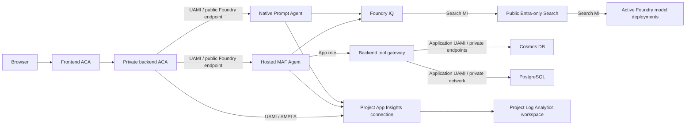

# Azure Deployment Plan - Hosted Agent Identity and Telemetry Remediation

> **Status:** Deployed - Citation UX frontend release active

Generated: 2026-07-15

## 1. Project overview

**Goal:** Replace PostgreSQL/pgvector with Azure Cosmos DB for NoSQL vector
search for semantic conversation memory, restore backend availability, and then
decommission every PostgreSQL-specific Azure and repository component.

**Path:** Modify the existing deployment.

**Decisions:**

- Azure Cosmos DB for NoSQL is the selected semantic-memory store.
- Existing PostgreSQL semantic-memory records will not be migrated or retained.
- Semantic memory starts empty after cutover.
- Service interruption during revision replacement is acceptable.
- No dual writes, backfill, compatibility bridge, or zero-downtime machinery
  will be built.
- PostgreSQL destruction is a separate gated phase after the Cosmos-backed
  backend passes live acceptance checks.

## 2. Confirmed requirements and Azure context

| Attribute | Confirmed value |
|---|---|
| Classification | Demo / proof of concept |
| Scale | Small, owner-filtered semantic-memory collection |
| Budget | Cost optimized; reuse the existing serverless Cosmos account |
| Subscription | `ME-MngEnvMCAP372348-mimarusa-1` (`7bc68c68-f434-49ad-ab3e-b883ec39da86`), confirmed 2026-07-15 |
| Cosmos location | East US 2, confirmed 2026-07-15 |
| Resource group | `rg-agent-memory-rag` |
| Cosmos account | `agmem5df652cosmos` |
| Cosmos database | `support` |
| PostgreSQL resource | `agmem5df652pgnc` in North Central US |
| Authentication | Existing user-assigned managed identity and Cosmos data-plane RBAC |
| Networking | Existing Cosmos private endpoint; public access and local authentication remain disabled |
| Data retention | Preserve existing `history` and `profiles` containers and all their data |
| API compatibility | Preserve the current `/memories` request and response contract |

## 3. Components and change scope

| Component | Technology / service | Planned impact |
|---|---|---|
| Frontend | Lit/Vite on Azure Container Apps | No functional change; existing API contract remains |
| Backend | Python/FastAPI on Azure Container Apps | Replace `asyncpg` store internals with asynchronous Cosmos CRUD/vector queries |
| Conversation history | Cosmos `support/history` | No schema, data, or resource change |
| User profiles | Cosmos `support/profiles` | No schema, data, or resource change |
| Semantic memory | PostgreSQL/pgvector -> Cosmos `support/memories` | New empty vector-enabled container |
| Embeddings | Foundry `text-embedding-3-large` | Retain 3,072-dimensional embeddings |
| Enterprise retrieval | Azure AI Search / Foundry IQ | No index, capacity, or permission change |
| Infrastructure | Terraform with AzureRM and AzAPI | Add Cosmos capability/container, then remove PostgreSQL resources in a later phase |
| Deployment | Existing ACR builds and Container App updates | Backend image update only for cutover; frontend image need not change |

No specialized Copilot SDK, Azure Functions, cross-cloud migration, or App
Service workflow is present.

## 4. Deployment recipe

**Selected:** Existing Terraform/AzAPI infrastructure plus the current ACR and
Container Apps image deployment workflow.

**Rationale:**

- The repository already manages the environment with Terraform.
- AzureRM manages the Cosmos account but its installed provider schema cannot
  express a SQL container vector embedding policy.
- A child `azapi_resource` using the stable
  `Microsoft.DocumentDB/databaseAccounts/sqlDatabases/containers@2024-11-15`
  schema can manage only the new vector-enabled container without taking over
  the existing `history` or `profiles` containers.
- No `azd init` or template conversion is required.
- Preparation must pass `azure-validate`; deployment and destruction must run
  through `azure-deploy`.

## 5. Target architecture and contracts

### 5.1 Cosmos account and container

Update the existing Cosmos account in place with the Microsoft-documented
`az cosmosdb update --capabilities` operation, invoked idempotently through a
`terraform_data` resource. The command asserts that both `EnableServerless` and
`EnableNoSQLVectorSearch` remain active. AzureRM continues to own the account
but ignores capability drift so it never plans the account replacement that
its capability block would require. Wait 15 minutes for the capability to
propagate before creating the vector-enabled container.

Create one child container:

| Property | Value |
|---|---|
| Name | `memories` |
| Database | `support` |
| Partition key | `/user_id`, version 2 |
| Vector path | `/embedding` |
| Vector data type | `float32` |
| Dimensions | `3072` |
| Distance function | `cosine` |
| Vector index | `quantizedFlat` |
| Throughput | None specified; inherited serverless behavior |
| Scalar indexing | Index public metadata fields; exclude `_etag` and the raw vector path from ordinary scalar indexing |

`quantizedFlat` supports up to 4,096 dimensions. With fewer than 1,000 vectors,
Cosmos uses a full scan; this is acceptable for the expected small,
partition-scoped dataset. The implementation must always use `TOP N` and route
queries to the authenticated user's partition.

The account-scoped `Cosmos DB Built-in Data Contributor` assignment already
covers the new container. The existing private endpoint and private DNS also
cover it, so no new RBAC, secret, key, endpoint, or DNS resource is required.

### 5.2 Memory item and API contract

Use one item per `(user_id, conversation_id)`:

```text
id                = conversation_id
user_id           = authenticated tenant-scoped principal key
conversation_id   = application conversation ID
summary           = generated conversation summary
source_title      = optional conversation title
message_count     = summarized message count
embedding         = 3,072 float values
created_at        = first creation time
updated_at        = most recent upsert time
```

Using `conversation_id` as the item ID gives deterministic, idempotent upsert
and direct cascade deletion. Cosmos permits the same ID in different logical
partitions, while every operation still supplies `/user_id`.

Preserve these public fields and semantics:

- `id`, `conversation_id`, `summary`, `source_title`, `message_count`,
  `created_at`, and `updated_at`;
- `similarity` on vector-search results;
- create-by-conversation remains an upsert that preserves the original
  `created_at`;
- list remains newest-created first;
- delete returns `404` when the authenticated user has no matching item.

Cosmos internal fields, owner keys, partition information, and embeddings remain
absent from API responses.

### 5.3 Availability and degraded behavior

Semantic memory is optional application functionality and must not control
Container Apps traffic eligibility:

- `/health/live` remains process-only.
- `/health/ready` still probes `cosmos_memory` and reports sanitized status, but
  a semantic-memory-only failure does not change the HTTP response to `503`.
- Memory API calls return an explicit sanitized `503` when the store is
  unavailable; they must not silently return success-shaped empty data.
- The agent `check_memory` tool degrades to no memory context on typed Cosmos
  availability failures, while recording the failure in logs/telemetry.
- Conversation deletion remains successful if optional semantic-memory cleanup
  encounters a typed Cosmos availability failure; the cleanup failure is
  logged and observable rather than swallowed.
- Unexpected programming errors continue to propagate.

This behavior directly prevents an optional memory outage from hiding agents or
durable thread history.

## 6. Provisioning limit and eligibility check

The mandatory `az quota` check for `Microsoft.DocumentDB` in East US 2 returned
`BadRequest`, which is the documented unsupported-provider behavior. The
fallback is the official Cosmos service-limit documentation plus a live
control-plane inventory.

Live inventory:

- one database: `support`;
- two containers: `history`, `profiles`;
- one existing serverless Cosmos account;
- current account capability: `EnableServerless`.

| Resource type / operation | Number added | Total after cutover | Limit / eligibility | Source and result |
|---|---:|---:|---|---|
| `Microsoft.DocumentDB/databaseAccounts` | 0 | 1 | 250 accounts per subscription by default | Existing account; no account provisioning |
| Databases and containers in `agmem5df652cosmos` | 1 container | 4 combined resources | 500 databases and containers per account | Official Cosmos limits; within limit |
| `EnableNoSQLVectorSearch` account capability | 1 in-place update | Enabled | Supported on serverless containers; activation can take approximately 15 minutes | Official Cosmos vector/serverless documentation |
| 3,072-dimensional `quantizedFlat` vector index | 1 | 1 | Maximum 4,096 dimensions | Official Cosmos vector documentation; within limit |

**Capacity status:** All planned additions are within documented limits. No
quota increase or new regional service capacity is required.

The current Cosmos account is single-region, serverless, periodically backed
up, and not zone redundant. This cutover does not change those account-level
resilience characteristics.

## 7. Backend implementation plan

### 7.1 Replace the store internals

Keep the `ConversationMemoryStore` class and public method surface to minimize
call-site changes:

- `initialize`
- `close`
- `enabled`
- `health_check`
- `create_memory`
- `list_memories`
- `search`
- `delete_memory`
- `delete_by_conversation`

Replace PostgreSQL pooling, vector literals, token caching, and SQL with the
existing asynchronous Cosmos SDK/managed-identity pattern used by history and
profile storage.

Implementation details:

1. Add `COSMOS_MEMORY_CONTAINER`, defaulting to `memories`.
2. Initialize `azure.cosmos.aio.CosmosClient` through the existing credential
   helper; retain key authentication only for local development consistency.
3. Validate every embedding has exactly 3,072 finite numeric values before
   writing or querying.
4. Implement bounded optimistic-concurrency retries for create/update conflicts,
   preserving stable `id` and `created_at`.
5. Use partition-scoped, parameterized queries containing an explicit owner
   predicate even when the SDK also receives `partition_key=user_id`.
6. Convert Cosmos cosine distance to the existing API's similarity convention
   only after a known-vector test confirms the service result semantics.
7. Map known Cosmos availability responses to a typed memory-store exception;
   do not add broad exception catches.
8. Use existing telemetry spans renamed from `store.postgres.*` to
   `store.cosmos.memory.*`.

### 7.2 Configuration and dependencies

- Remove all `POSTGRES_*`, `PG_AUTH_MODE`, and token-refresh settings.
- Remove `postgres_configured`.
- Remove `asyncpg` from `backend/pyproject.toml`.
- Keep `azure-cosmos`, which is already a backend dependency.
- Add `COSMOS_MEMORY_CONTAINER=memories` to Container App configuration and the
  local environment example.

### 7.3 Call-site hardening

- Update startup and readiness labels from `postgres_memory` to
  `cosmos_memory`.
- Keep `/memories` request/response DTOs unchanged.
- Keep owner derivation exclusively server-side.
- Make coordinator cascade cleanup nonblocking only for typed optional-store
  availability failures.
- Make hosted-agent memory lookup fail open only for the same typed failures.

## 8. Test plan

### 8.1 Store tests

Add focused asynchronous tests for:

- item serialization and public-field filtering;
- exact 3,072-dimension validation and rejection of nonfinite values;
- deterministic ID and owner partition usage;
- first create and repeat upsert preserving `id`/`created_at`;
- bounded ETag conflict retry;
- owner-scoped list ordering and pagination;
- vector query construction, `TOP N`, partition routing, owner filter, ordering,
  and score conversion;
- point delete, missing delete, and conversation cascade delete;
- empty container behavior;
- sanitized typed availability errors;
- client close/lifecycle behavior.

### 8.2 API and integration-boundary tests

Update or extend the existing test suites to prove:

- one user cannot list, search, overwrite, or delete another user's memory;
- the `/memories` API contract remains unchanged;
- a memory health failure is visible in readiness details but readiness remains
  HTTP `200`;
- agent listings and conversation history remain available during a simulated
  semantic-memory outage;
- the hosted `check_memory` tool returns a no-memory fallback on typed store
  unavailability;
- conversation deletion succeeds and logs a failed optional-memory cleanup;
- unexpected exceptions are not converted into successful responses.

### 8.3 Repository validation

Run the existing backend unit-test discovery, frontend TypeScript production
build, Terraform formatting, Terraform validation, and non-destructive
Terraform plans. Do not introduce a new test or lint framework.

## 9. Two-gate cutover sequence

### Gate A - Additive Cosmos cutover

1. Run the existing baseline backend tests, frontend build, and Terraform
   validation before edits.
2. Implement the Cosmos store, degraded-readiness behavior, tests, configuration,
   and directly related documentation.
3. Add `EnableNoSQLVectorSearch` and the `memories` child container.
4. Keep every PostgreSQL Azure resource and Terraform declaration intact.
5. Produce and inspect an additive Terraform plan. It may update the Cosmos
   account in place, create one container, and update backend environment
   configuration. It must contain:
   - no resource destroy;
   - no Cosmos account/database/history/profile replacement;
   - no Search, Foundry, networking, or identity replacement.
6. Mark this plan `Ready for Validation` and invoke `azure-validate`.
7. After validation, invoke `azure-deploy` for the additive infrastructure and
   Cosmos-backed backend image. Temporary backend downtime is accepted.
8. Wait for the Cosmos capability to report enabled and confirm the deployed
   container policy through the control plane.
9. Perform live acceptance checks:
   - backend liveness and readiness;
   - authenticated `/api/me`;
   - both configured `/api/agents`;
   - existing `/api/conversations` and conversation detail;
   - create/list/upsert/search/delete memory;
   - hosted-agent `check_memory`;
   - delete a disposable test conversation and confirm cascade behavior;
   - logs contain no PostgreSQL connection or token-refresh attempts.

No migration or backfill runs. The first memory list is expected to be empty.

### Gate B - PostgreSQL decommission

Proceed only after Gate A acceptance succeeds.

1. Remove PostgreSQL-specific code, infrastructure declarations, deployment
   steps, setup package, and active documentation references listed below.
2. Run the full repository validation again.
3. Produce a saved, full Terraform plan without `-target`.
4. Verify every destroy is explicitly expected and that Cosmos, history,
   profiles, Search, Foundry, Container Apps, ACR, and shared networking remain.
5. Use `ask_user` to obtain explicit destructive-action confirmation for the
   reviewed PostgreSQL destroy set. Confirmed on 2026-07-15.
6. Mark the decommission plan `Ready for Validation` and invoke
   `azure-validate`.
7. Invoke `azure-deploy` to apply the reviewed destruction.
8. Re-run the live acceptance checks and final inventory checks.

## 10. PostgreSQL decommission inventory

### Azure/Terraform resources to remove

- `azurerm_postgresql_flexible_server.main`
- `azurerm_postgresql_flexible_server_database.memory`
- `azurerm_postgresql_flexible_server_configuration.extensions`
- `azurerm_postgresql_flexible_server_active_directory_administrator.bootstrap`
- `azurerm_private_endpoint.postgres`
- PostgreSQL private DNS zone map entry and its generated VNet link
- `azurerm_user_assigned_identity.postgres_bootstrap`
- `azurerm_role_assignment.postgres_bootstrap_acr_pull`
- `azurerm_container_app_job.postgres_setup`
- PostgreSQL backend environment variables
- `postgres_location`
- `postgres_fqdn` and `postgres_setup_job_name` outputs
- PostgreSQL and setup-job naming locals

### Repository artifacts to remove or update

- remove `setup/postgres/`;
- remove PostgreSQL bootstrap image/job steps from `scripts/deploy_images.sh`;
- remove PostgreSQL settings and token-cache code;
- remove `asyncpg`;
- update `README.md`, `backend/README.md`,
  `docs/PRD-Solution-Challenges-1-5.md`, `docs/IMPLEMENTATION-PLAN.md`, and
  `docs/architecture.html`;
- preserve the historical deployment record below as history rather than
  rewriting it.

Old `pg-bootstrap` image tags in ACR are not part of this decommission apply.
Deleting registry artifacts would be a separate optional destructive cleanup.

## 11. Acceptance criteria

Gate A is accepted only when:

- Cosmos vector search is enabled without replacing the account;
- `support/memories` exists with `/user_id` and the approved vector policy;
- existing `history` and `profiles` resource IDs and data remain intact;
- liveness and readiness return `200`;
- both configured agents are visible;
- existing thread history is visible;
- memory CRUD, upsert, vector search, owner isolation, and cascade behavior pass;
- semantic-memory failure no longer removes the backend replica from ingress;
- no runtime path attempts PostgreSQL access.

Gate B is accepted only when:

- the reviewed PostgreSQL resources no longer exist in Azure;
- no PostgreSQL resources remain in Terraform state;
- no active runtime, infrastructure, build, or setup path references
  PostgreSQL;
- the backend remains ready with no PostgreSQL configuration;
- agents, history, profiles, Foundry IQ, and Cosmos-backed memory still pass
  live checks.

## 12. Risks, mitigations, and rollback

| Risk | Mitigation / boundary |
|---|---|
| Cosmos account replacement or unintended history/profile change | Reject any plan showing replacement or change to those resources |
| Vector feature activation delay | Apply capability/container before backend acceptance and poll control-plane state |
| Vector policy is difficult to change after data exists | Use a new isolated container and validate the policy while it is empty |
| Memory failure again gates all APIs | Make memory a reported optional dependency, not an ACA readiness condition |
| Cross-user data exposure | Partition every operation by trusted `user_id`, include owner filters, and test negative access |
| Full scan below 1,000 vectors consumes more RUs | Keep queries partition-scoped and bounded; monitor RU consumption |
| Existing Cosmos account is single-region and not zone redundant | Record as an existing limitation; this cutover neither worsens nor solves regional resilience |
| Failed cutover | Stop before Gate B, retain PostgreSQL resources, repair the Cosmos path, and redeploy |
| Rollback to old backend | Not a service-recovery option because policy keeps PostgreSQL stopped; remediation is roll-forward on Cosmos |
| Accidental destructive scope | Separate Gate B, save and inspect the full plan, then obtain explicit confirmation |

## 13. Execution checklist

### Planning

- [x] Analyze workspace and deployment
- [x] Confirm no specialized deployment skill supersedes this workflow
- [x] Confirm subscription
- [x] Confirm Cosmos location
- [x] Compare Cosmos, HorizonDB, and the existing Azure AI Search service
- [x] Select Cosmos DB for NoSQL
- [x] Confirm no migration and no zero-downtime requirement
- [x] Verify serverless vector support and stable ARM schema
- [x] Complete quota/limit check
- [x] Define cutover and decommission gates
- [x] User approves this completed plan

### Gate A preparation, validation, and deployment

- [x] Capture baseline validation results
- [x] Implement Cosmos memory store and availability behavior
- [x] Add tests and update directly related documentation
- [x] Add vector capability/container without PostgreSQL destroys
- [x] Run repository validation
- [x] Inspect additive Terraform plan
- [x] Set status to `Ready for Validation`
- [x] Invoke `azure-validate`
- [x] Invoke `azure-deploy`
- [x] Complete live Gate A acceptance

### Gate B decommission, validation, and deployment

- [x] Remove PostgreSQL code and infrastructure
- [x] Run repository validation
- [x] Inspect saved full destroy plan
- [x] Obtain explicit destroy confirmation
- [x] Set status to `Ready for Validation`
- [x] Invoke `azure-validate`
- [x] Invoke `azure-deploy`
- [x] Complete final live and inventory acceptance

## 14. Validation proof

### All validation checks pass - Gate A - 2026-07-15

- [x] Terraform installation: `terraform 1.13.3`
- [x] Azure CLI installation: `azure-cli 2.80.0`
- [x] Authentication: subscription
  `ME-MngEnvMCAP372348-mimarusa-1`
  (`7bc68c68-f434-49ad-ab3e-b883ec39da86`) is enabled in tenant
  `a7b1484c-f66a-496a-b1cf-35631a50396c`
- [x] Initialize: `terraform -chdir=infra init -input=false -no-color`
- [x] Format: `terraform -chdir=infra fmt -check -recursive`
- [x] Syntax: `terraform -chdir=infra validate -no-color`
- [x] State backend: accessible with 74 tracked resources
- [x] Plan preview: saved no-refresh plan action set asserted exactly
- [x] Azure Policy: CLI fallback returned no applicable assignments at the
  resource-group scope; the MCP policy identity lacked subscription Reader
- [x] Template resolution: no unresolved `{{ .Env.* }}` expressions
- [x] Backend tests:
  `uv run --project backend python -m unittest discover -s backend/tests`
  passed all 54 tests
- [x] Frontend build: `npm --prefix frontend run build` succeeded
- [x] Code-quality review: required deletion, timeout, and Cosmos capability
  propagation findings resolved before validation

### Terraform plan proof

Because the policy-stopped PostgreSQL server rejects refresh of its child
resources, Gate A used `terraform plan -refresh=false`. The saved plan contains
only:

- create `terraform_data.cosmos_vector_search` to invoke the documented
  in-place Azure CLI capability update;
- create `time_sleep.cosmos_vector_search_propagation`;
- create `azapi_resource.cosmos_memories`;
- update `azurerm_container_app.backend` in place with
  `COSMOS_MEMORY_CONTAINER=memories`.

The plan has zero deletes and zero replacements. Existing Cosmos account,
database, `history`, `profiles`, RBAC assignments, and private endpoint are
unchanged.

### Role Assignment Verification

- **Status:** Verified.
- **Identity:** existing user-assigned application identity
  `id-agmem-5df652`.
- **Role:** account-scoped Cosmos DB Built-in Data Contributor
  (`00000000-0000-0000-0000-000000000002`).
- **Scope:** existing account `agmem5df652cosmos`; this already covers the new
  `support/memories` container.
- **Local deployer:** the existing account-scoped Cosmos data contributor
  assignment is unchanged.
- **Issues:** none; no RBAC mutation is present in the Gate A plan.

### All validation checks pass - Gate B - 2026-07-15

- [x] Terraform installation: `terraform 1.13.3`
- [x] Azure CLI installation: `azure-cli 2.80.0`
- [x] Authentication: confirmed enabled default subscription
  `ME-MngEnvMCAP372348-mimarusa-1`
  (`7bc68c68-f434-49ad-ab3e-b883ec39da86`) in tenant
  `a7b1484c-f66a-496a-b1cf-35631a50396c`
- [x] Initialize: `terraform -chdir=infra init -input=false -no-color`
- [x] Format: `terraform -chdir=infra fmt -check -recursive`
- [x] Syntax: `terraform -chdir=infra validate -no-color`
- [x] State backend: accessible with 77 tracked resources before decommission
- [x] Full plan: saved with `-refresh=false` because the policy-stopped server
  rejects child-resource refresh
- [x] Exact action assertion: zero creates, one in-place backend environment
  update, and exactly ten approved destroys
- [x] Protected resources: no Cosmos account/database/container, Search, Foundry,
  ACR, Container Apps environment, shared network, history, or profile action
- [x] Backend update: removes only the five retired database environment
  variables; the Cosmos image will be explicitly reasserted after apply because
  Terraform intentionally ignores image drift
- [x] Azure Policy: applicable management-group/subscription assignments were
  retrieved; the plan creates nothing and introduces no location, SKU, network,
  or security-policy change
- [x] Template resolution: no unresolved `{{ .Env.* }}` expressions
- [x] Static role verification: application Cosmos data contributor, ACR pull,
  Foundry/model, Search reader, and telemetry publisher assignments remain
  unchanged and resource-scoped; only the retired bootstrap assignment is
  destroyed
- [x] Backend tests:
  `uv run --project backend python -m unittest discover -s backend/tests`
  passed all 54 tests
- [x] Frontend build: `npm --prefix frontend run build` succeeded
- [x] Architecture explorer: 41 components, 76 flows, and 8 views passed model,
  browser interaction, desktop/mobile, light/dark, deep-link, keyboard, and
  reduced-motion checks
- [x] Active-source scan: no runtime, infrastructure, build, setup, or current
  architecture reference to PostgreSQL, pgvector, or asyncpg remains
- [x] Destructive confirmation: the user approved the exact reviewed ten-resource
  destroy set through the confirmation prompt on 2026-07-15

### Gate B Terraform plan proof

The saved full plan contains one in-place update:

- `azurerm_container_app.backend` removes `PG_AUTH_MODE`, `POSTGRES_DB`,
  `POSTGRES_HOST`, `POSTGRES_PORT`, and `POSTGRES_USER`.

It contains exactly these ten destroys:

- `azurerm_container_app_job.postgres_setup`
- `azurerm_postgresql_flexible_server.main`
- `azurerm_postgresql_flexible_server_active_directory_administrator.bootstrap`
- `azurerm_postgresql_flexible_server_configuration.extensions`
- `azurerm_postgresql_flexible_server_database.memory`
- `azurerm_private_dns_zone.zones["postgres"]`
- `azurerm_private_dns_zone_virtual_network_link.links["postgres"]`
- `azurerm_private_endpoint.postgres`
- `azurerm_role_assignment.postgres_bootstrap_acr_pull`
- `azurerm_user_assigned_identity.postgres_bootstrap`

### Gate B deployment and acceptance proof

Gate B was deployed and verified on 2026-07-15.

- The first apply removed the bootstrap job and its ACR role assignment. Azure
  rejected deletion of PostgreSQL child resources while policy kept the server
  stopped, so the database, extension configuration, and Entra administrator
  were removed from Terraform state after confirming the platform could not
  delete them independently.
- Azure also enforced a control-plane dependency cycle: the private endpoint
  could not be deleted while the server was stopped, and the server could not
  be deleted while the endpoint was connected. The server was started
  temporarily, the endpoint was deleted, and then the server was deleted.
- The final apply removed PostgreSQL private DNS and all five backend PostgreSQL
  environment variables. The approved Cosmos backend image was reasserted as
  `agmem5df652acr.azurecr.io/backend:cosmos-memory-20260715`.
- Revision `ca-agmem-backend--0000028` is provisioned, healthy, has one replica,
  and receives 100% of traffic.
- A separately discovered, unassociated PostgreSQL-named NSG was outside
  Terraform and the reviewed ten-resource destroy set. The user separately
  approved its deletion on 2026-07-15; it had no subnet, NIC, or security rules
  and is now absent.
- A refreshed full Terraform plan reports `No changes`; state contains 67
  resources and no PostgreSQL entries.

Final live acceptance:

- `https://ca-agmem-frontend.salmonmeadow-d85c9acb.eastus2.azurecontainerapps.io`
  serves the application; liveness is `ok` and readiness is `ready`, with all
  dependencies including optional `cosmos_memory` healthy and no degraded
  dependencies.
- Authenticated API checks returned both configured agents as available, all 14
  existing conversations, a durable conversation detail, and the current
  profile.
- A disposable Hosted Agent conversation exercised memory create, idempotent
  upsert with stable ID and creation timestamp, list, vector search, explicit
  delete, recreate, live Hosted `check_memory`, conversation deletion, and
  cascade cleanup. The conversation count returned from 15 to 14 and the
  disposable memory was absent afterward.
- The Cosmos account reports `EnableServerless` and
  `EnableNoSQLVectorSearch`. `support/memories` uses partition key `/user_id`,
  a 3,072-dimensional `float32` cosine vector at `/embedding`, and a
  `quantizedFlat` vector index.
- Azure inventory contains no PostgreSQL resource, setup job, bootstrap
  identity, endpoint, DNS resource, NSG, or PostgreSQL-named role assignment.
  The backend environment contains no PostgreSQL variables.
- Live RBAC still gives the application identity ACR pull, Search data reader,
  metrics publisher, OpenAI user, custom Foundry Agent Consumer, and Cosmos
  Data Contributor access. The frontend identity retains only ACR pull.
- The latest 233 backend revision log lines contain no PostgreSQL, Cosmos-memory,
  runtime, or conversation-persistence error.

**Current phase:** Gate B deployed and verified; the Cosmos cutover and
PostgreSQL decommission are complete.

---

# Historical Deployment Record - Final Infrastructure and Observability

**Status:** Deployed and Verified

## 1. Scope and deployment recipe

This is a **MODIFY** deployment for the existing `agent-memory-rag` application.

Use:

- Terraform/AzAPI for managed Azure infrastructure;
- direct Python SDK execution for the native Prompt Agent and Foundry IQ setup;
- the existing container-based `azd` deployment for the Hosted MAF Agent;
- explicit Azure CLI deletion only for the diagnostic resources that are outside
  Terraform state.

The implementation must preserve the existing resource group, subscription,
regions, tenant policies, application data, active agent project, and Entra
registration.

## 2. Confirmed Azure context

| Setting | Value |
| --- | --- |
| Subscription | `ME-MngEnvMCAP372348-mimarusa-1` |
| Subscription ID | `7bc68c68-f434-49ad-ab3e-b883ec39da86` |
| Tenant ID | `a7b1484c-f66a-496a-b1cf-35631a50396c` |
| Resource group | `rg-agent-memory-rag` |
| Primary region | `eastus2` |
| PostgreSQL region | `northcentralus` |
| Search region | `westeurope` |

The Azure context must be reconfirmed immediately before validation/deployment.

## 3. Discovery results

### 3.1 Foundry generations

The resource group contains two AIServices accounts:

| Account | Purpose | Network | Model deployments |
| --- | --- | --- | --- |
| `agmem5df652aif` | Legacy application model account | Private only | `gpt-4o-mini`, `text-embedding-3-large` |
| `agmem5df652aif2` | Active Foundry account/project and both agents | Public Entra/RBAC plus private endpoint | Identical chat and embedding deployments |

The active Foundry project is `agmem-agents`. Its only current project connection
is the Foundry IQ `RemoteTool` connection. It has no Application Insights
connection and the account has no diagnostic setting.

The legacy project `agmem-project` has no project connections. Active Prompt and
Hosted agent state is in the new project, not the legacy project.

### 3.2 Remaining legacy-account consumers

The old account cannot be deleted immediately because:

- the backend uses it for profile/memory chat and embeddings;
- setup environment variables point to it;
- the Foundry IQ knowledge base model currently uses
  `https://agmem5df652aif.openai.azure.com`;
- Search has an approved shared private link to the old account;
- application, setup, and Search identities have roles scoped to it.

The new account has the same model names, versions, SKUs, and capacities, so these
consumers can move without a model contract change.

### 3.3 Current networking

- Public Entra/RBAC-only: active Foundry, Search, ACR.
- Private application data: Cosmos DB and PostgreSQL.
- Private application boundary: backend Container App ingress.
- Public application edge: frontend Container App.
- Private endpoints currently exist for:
  - legacy Foundry;
  - active Foundry;
  - ACR;
  - Cosmos DB;
  - PostgreSQL;
  - Azure Monitor Private Link Scope.
- No Search private endpoint exists.

The active Foundry private endpoint is no longer required by the accepted public
Foundry design. The ACR private endpoint remains required for Container Apps image
pulls, while public ACR access remains required by the non-network-injected Hosted
Agent runtime.

### 3.4 Observability

`appi-agmem-5df652` is workspace-based and uses
`log-agmem-5df652`, with 30-day retention.

Current Application Insights restrictions are:

- local authentication disabled;
- public ingestion disabled;
- public query disabled;
- private ingestion/query available through AMPLS.

The backend already emits privacy-safe Azure Monitor OpenTelemetry using its UAMI
and the private Azure Monitor path. The Container Apps environment already writes
platform/container logs to the same Log Analytics workspace.

Foundry server-side tracing requires a project Application Insights connection.
The currently documented project connection uses the Application Insights
connection string and does not use managed identity by default. The non-injected
Foundry/Hosted runtime also requires public ingestion. Full Foundry traces can
contain prompts, outputs, retrieval data, tool arguments, and tool results.

The approved posture is:

- enable full Foundry server-side tracing;
- accept the platform-required connection-string/local-auth exception;
- enable public ingestion and authenticated public query;
- set AMPLS access modes to `Open` so Foundry's public platform path is not
  blocked, while retaining private DNS/private endpoint routing for the backend's
  UAMI-authenticated telemetry;
- restrict trace access with Azure RBAC;
- retain 30-day workspace retention;
- do not enable extra Agent Framework sensitive-data capture.

### 3.5 Release and setup execution

- Native Prompt Agent publication is a direct `azure-ai-projects` SDK operation and
  does not require an image or Container Apps Job.
- Foundry IQ/Search setup can run directly after both Search and the active model
  account are public Entra/RBAC-only.
- PostgreSQL bootstrap must remain a VNet-integrated Container Apps Job because
  PostgreSQL is private.
- Hosted MAF will retain the established container-based deployment and ACR image.
- Foundry source-code Hosted Agent deployment without an image is available in
  preview and must be documented as a future simplification, not adopted now.

### 3.6 Diagnostic resources outside Terraform

The following resources are dedicated to the obsolete jump workflow:

- VM `vm-agmem-jump` and policy extension;
- NIC `nic-agmem-jump`;
- OS disk `osdisk-vm-agmem-jump`;
- Developer Bastion `bas-agmem-5df652`;
- NAT gateway `nat-agmem-jump`;
- public IP `pip-agmem-jump-egress`;
- NSG `nsg-agmem-jump`;
- VNet subnet `snet-jump`.

There is also an unmanaged obsolete Container Apps Job:

- `kb-setup`

The Terraform-managed replacement jobs are:

- `caj-agmem-kbsetup`;
- `caj-agmem-agentsetup`;
- `caj-agmem-pgsetup`.

Only the PostgreSQL job remains in the target architecture.

## 4. Target architecture



The final project contains one Foundry account/project, one native Prompt Agent,
one container-hosted MAF Agent, one Foundry IQ knowledge base, and one project
Application Insights/Log Analytics observability plane.

## 5. Planned implementation

### 5.1 Migrate model consumers before deletion

1. Grant the application UAMI `Cognitive Services OpenAI User` on the active
   Foundry account.
2. Grant the Search service identity `Cognitive Services User` on the active
   Foundry account.
3. Give the authenticated deployment principal the minimum Foundry/Search/model
   roles needed for direct setup and release.
4. Repoint backend and setup configuration to the active Foundry account's
   cognitive/OpenAI endpoint and existing chat/embedding deployments.
5. Run the knowledge-base setup directly to replace the live knowledge-base model
   `resourceUri` with `https://agmem5df652aif2.openai.azure.com`.
6. Verify Foundry IQ retrieval from both agents before any old-account deletion.

### 5.2 Connect complete agent observability

1. Add an AzAPI project child connection:
   `Microsoft.CognitiveServices/accounts/projects/connections`.
2. Configure it as:
   - category `AppInsights`;
   - target `appi-agmem-5df652`;
   - connection-string credential;
   - Application Insights resource ID metadata.
3. Enable Application Insights public ingestion and query plus local
   authentication for this Foundry platform integration.
4. Keep the existing AMPLS resources, private endpoint/DNS, and backend UAMI
   publisher role, with AMPLS ingestion/query modes set to `Open`.
5. Add an active Foundry-account diagnostic setting to the project Log Analytics
   workspace for:
   - `Audit`;
   - `RequestResponse`;
   - `AzureOpenAIRequestUsage`;
   - `Trace`;
   - `AllMetrics`.
6. Keep `ENABLE_SENSITIVE_DATA=false` for Hosted MAF and do not enable additional
   OpenTelemetry message-content capture variables.
7. Add explicit Hosted application-log export only if deployed verification shows
   that standard Python logs are not arriving through the platform connection;
   avoid duplicate exporters by default.
8. Record safe dimensions for service, agent type/version, release ID, latency,
   token/tool/citation counts, and error code.

The project connection is a documented platform exception to the preferred
managed-identity-only telemetry pattern. Application runtime data access remains
managed-identity-only.

### 5.3 Remove unnecessary setup containers

1. Remove Terraform jobs:
   - `azurerm_container_app_job.knowledge_setup`;
   - `azurerm_container_app_job.agent_setup`.
2. Keep `azurerm_container_app_job.postgres_setup`.
3. Replace the removed jobs with authenticated direct commands for:
   - Foundry IQ/Search setup;
   - Prompt Agent publication.
4. Remove their image build targets and unused Dockerfiles.
5. Remove the now-unused setup UAMI and its role assignments after direct release
   succeeds.
6. Retain the Hosted MAF Dockerfile, ACR repository, project ACR pull access, and
   container-based `azd` release.
7. Delete only the unused `kb-setup` and `prompt-agent-release` ACR repositories;
   preserve Hosted repositories and versions for rollback.

### 5.4 Remove obsolete Terraform-managed infrastructure

After migration verification, remove:

- legacy account `azurerm_cognitive_account.main`;
- legacy project `azurerm_cognitive_account_project.main`;
- legacy chat and embedding deployments;
- legacy Foundry private endpoint;
- active Foundry private endpoint;
- Search-to-legacy-Foundry shared private link;
- old-account role assignments;
- obsolete setup identity/jobs/roles;
- private DNS zones and VNet links used only by removed endpoints:
  - `privatelink.openai.azure.com`;
  - `privatelink.cognitiveservices.azure.com`;
  - `privatelink.services.ai.azure.com`;
  - `privatelink.search.windows.net`.

Preserve:

- active Foundry account/project, agents, and model deployments;
- Foundry IQ resources;
- Search service, indexes, knowledge sources, and knowledge base;
- ACR public endpoint and ACR private endpoint;
- Cosmos DB and its private endpoint/DNS;
- PostgreSQL and its private networking/DNS;
- AMPLS, monitor private endpoint, and monitor DNS;
- frontend/backend Container Apps and Container Apps environment;
- Entra application and identities still used at runtime.

### 5.5 Delete unmanaged diagnostic resources

After explicit destructive confirmation, delete the exact resources listed in
section 3.6 and the unmanaged `kb-setup` job.

Deletion order:

1. unmanaged setup job;
2. jump VM (including extension);
3. NIC and OS disk;
4. Developer Bastion;
5. NAT gateway;
6. public IP;
7. NSG;
8. `snet-jump`.

## 6. Safe deployment sequence

### Stage A - Add and migrate, no legacy deletion

1. Implement release-script, configuration, RBAC, and observability
   changes while retaining the old account and all existing endpoints.
2. Run repository tests, type checks, builds, Terraform formatting/validation, and
   policy/security checks.
3. Produce a non-destructive Terraform plan.
4. Validate and apply through the Azure validation/deployment workflow.
5. Rebuild/deploy backend and Hosted MAF images as required.
6. Run direct Foundry IQ setup and direct Prompt Agent publication.
7. Verify:
   - backend memory/profile chat and embeddings use the active account;
   - the KB model URI references the active account;
   - Prompt and Hosted agents both retrieve grounded citations;
   - Hosted application tools still pass app-role authorization;
   - new Prompt and Hosted traces appear in Application Insights;
   - Foundry account diagnostics appear in Log Analytics;

### Stage B - Destructive cleanup

1. Remove legacy Terraform resources from configuration.
2. Run `terraform validate` and generate a saved Terraform plan.
3. Confirm the plan contains only the expected deletes/updates/creates.
4. Present the exact Terraform delete set and unmanaged Azure delete set for
   explicit user confirmation.
5. Apply the approved cleanup through the Azure deployment workflow.
6. Delete the approved unmanaged resources and unused ACR setup repositories.
7. Run final application, agent, identity, networking, telemetry, and drift checks.

## 7. Validation Proof

### All validation checks pass

- [x] Terraform installed: `1.13.3`.
- [x] Azure CLI installed: `2.80.0`.
- [x] Authenticated to the approved subscription and tenant.
- [x] `terraform init -input=false`.
- [x] `terraform fmt -check -recursive`.
- [x] `terraform validate`.
- [x] Saved Terraform plan generated and reviewed.
- [x] Terraform state backend accessible: 102 resources listed.
- [x] Azure Policy state reviewed.
- [x] No unresolved `{{ .Env.* }}` Terraform template variables.
- [x] Backend test suite: 41 passed.
- [x] Frontend production build passed.
- [x] Bash syntax checks passed for all deployment scripts.
- [x] Python compilation passed for both direct setup modules.

#### Directive Phase 3 validation steps

- [x] Confirm authenticated subscription, tenant, and deployed Phase 2 baseline.
- [x] Confirm `gpt-5-nano` `2025-08-07` GA availability and quota in East US 2.
- [x] Run directive ingestion unit tests and Python compilation.
- [x] Run backend, support Hosted Agent, and frontend regression suites/build.
- [x] Run shell syntax, Terraform formatting, initialization, and validation.
- [x] Review exact UAMI ARM and Cosmos role names/scopes statically.
- [x] Generate and inspect a saved Terraform plan with zero deletes or
  replacements.
- [x] Run the mandatory Azure deployment preflight and record all evidence below.

Validated at `2026-07-23T13:05:19Z`:

- Azure CLI is authenticated to enabled subscription
  `7bc68c68-f434-49ad-ab3e-b883ec39da86` and tenant
  `a7b1484c-f66a-496a-b1cf-35631a50396c`; Terraform initialized successfully
  and can read 84 resources from state.
- East US 2 reports `gpt-5-nano` `2025-08-07` as Generally Available with
  Global Standard support. Subscription usage is 0 of 5,000 thousand-token
  capacity units; the plan requests capacity 10.
- All 18 directive ingestion tests pass, including non-publishing preflight,
  generation/idempotency, relations, quarantine, mandates, and Search schema.
  Python compilation passes.
- All 85 backend tests plus five subtests, all nine support Hosted Agent tests,
  and all six frontend tests pass. The frontend production build completes with
  183 modules.
- `terraform fmt -check -recursive`, `terraform validate`, shell syntax,
  `git diff --check`, and runtime bearer-header assertions pass.
- Static role review proves the exact six ARM role name/scope pairs and Cosmos
  built-in Data Contributor role scoped only to `/dbs/directives`.
- Saved plan
  `/Users/mimarusa/.copilot/session-state/9cf0ea64-6411-41dc-a6e6-349d986e6f79/files/phase3-final.tfplan`
  contains 10 creates, two in-place updates, and zero deletes or replacements.
  Creates are only the ingestion UAMI/job, seven role assignments, and the
  dedicated planner deployment. Updates only reconcile Storage and Document
  Intelligence public access from enabled to disabled.
- ACR Task build `ch23` successfully built
  `directive-ingestion:phase3-validation-20260723` from the checked-in
  Dockerfile and fixtures.
- The deployed application `/api/health` endpoint remains healthy; unauthenticated
  `/api/agents` access correctly returns 401.
- Independent multi-model review found no remaining deployment-blocking issue
  and approved the change.

### Shared project Agent Identity authorization revalidation

Validated at `2026-07-20` for the direct-Foundry MCP authorization correction:

- Terraform `1.13.3` and Azure CLI `2.80.0` are installed;
- authenticated subscription
  `7bc68c68-f434-49ad-ab3e-b883ec39da86`, tenant
  `a7b1484c-f66a-496a-b1cf-35631a50396c`, is enabled;
- `terraform init -input=false`, `terraform fmt -check -recursive`, and
  `terraform validate` pass;
- Terraform state is accessible with 68 resources;
- six visible policy assignments were reviewed; this update changes only an
  existing Container App environment variable;
- no unresolved `{{ .Env.* }}` placeholders exist in Terraform inputs;
- saved Terraform plan
  `/Users/mimarusa/.copilot/session-state/59bb6857-8149-485a-8e89-ee81ae64cde8/files/mcp-agent-id-r4-shared-identity.tfplan`
  contains one update to `azurerm_container_app.backend`, with zero creates,
  deletes, or replacements;
- static application-role review confirms the shared project Agent Identity gets
  only `AgentTools.Invoke`; only the published identity gets
  `Agent365.Observability.OtelWrite`;
- the backend suite passes all 58 tests;
- the Hosted MCP descriptor regression test passes;
- the frontend TypeScript/Vite production build passes with 180 modules;
- Python compilation, setup-script syntax, and `git diff --check` pass;
- `azd provision --preview --no-prompt` reports the existing Foundry project and
  no provisioning action;
- `azd ai agent doctor --no-prompt` reports 11 passed, 0 failed, and 2 skipped.

### Agent 365 tenant enrichment r5 validation

Validated at `2026-07-20`:

- Terraform initialization, formatting, and validation pass;
- Terraform state is accessible with 68 resources;
- saved plan
  `/Users/mimarusa/.copilot/session-state/59bb6857-8149-485a-8e89-ee81ae64cde8/files/agent365-tenant-r5.tfplan`
  contains one in-place update to `azurerm_container_app.backend`, with zero
  creates, deletes, or replacements;
- the exact Terraform value change is
  `AGENT_RELEASE_ID=mcp-agent-id-20260720-r4` to
  `mcp-agent-id-20260720-r5`;
- static role verification is unchanged: the published identity has the gateway
  and Agent 365 write roles, while the shared identity has only the gateway role;
- all four Hosted Agent tests and all 58 backend tests pass;
- Python compilation, shell syntax, and `git diff --check` pass;
- `azd provision --preview --no-prompt` makes no resource changes;
- `azd ai agent doctor --no-prompt` reports 11 passed, 0 failed, and 2 skipped;
- `azd package --no-prompt` resolves the immutable r5 Hosted Agent image.

### Agent 365 request baggage r6 validation

Validated at `2026-07-20T22:21:01Z`:

- Terraform `1.13.3` and azd `1.27.1` are installed;
- Azure authentication is active in enabled subscription
  `7bc68c68-f434-49ad-ab3e-b883ec39da86`, tenant
  `a7b1484c-f66a-496a-b1cf-35631a50396c`, and the nested azd environment
  resolves `eastus2`;
- `terraform init -input=false`, `terraform fmt -check -recursive`, and
  `terraform validate` pass, with 68 resources accessible in state;
- saved plan
  `/Users/mimarusa/.copilot/session-state/59bb6857-8149-485a-8e89-ee81ae64cde8/files/agent365-baggage-r6.tfplan`
  contains only one in-place `azurerm_container_app.backend` update from release
  marker r5 to r6, with zero creates, deletes, or replacements;
- no unresolved `{{ .Env.* }}` expressions exist in Terraform inputs;
- the resource-group policy query returned no applicable assignments that block
  this image/version-only deployment;
- static role review is unchanged: the published Agent Identity receives
  `AgentTools.Invoke` and `Agent365.Observability.OtelWrite`; the shared project
  Agent Identity receives only `AgentTools.Invoke`; the backend allowlist
  contains exactly those two principals;
- all nine Hosted Agent tests pass, including the exact Agent 365 exporter
  identity-partition regression;
- all 58 backend tests and the frontend production build pass;
- Hosted Agent compilation, setup-script syntax, and `git diff --check` pass;
- `azd provision --preview --no-prompt` reports the existing Foundry project
  with no provisioning action;
- `azd ai agent doctor --no-prompt` reports 11 passed, 0 failed, and 2 skipped;
- `azd package --no-prompt` resolves immutable image
  `customer-support-maf-hosted:mcp-agent-id-20260720-r6`;
- ACR build `ch1y` succeeded for Linux/amd64 and produced digest
  `sha256:2c619513d6301a7d798d62101fb1076b83791c1057c13fc4c9e2758b391ee802`.

### Composer frontend release revalidation

Validated at `2026-07-13T21:00:46+02:00` for a frontend-image-only
release using immutable tag `frontend:composer-20260713210046`:

- confirmed subscription
  `ME-MngEnvMCAP372348-mimarusa-1`
  (`7bc68c68-f434-49ad-ab3e-b883ec39da86`), tenant
  `a7b1484c-f66a-496a-b1cf-35631a50396c`, and existing region `eastus2`;
- Terraform `1.13.3` and Azure CLI `2.80.0` are installed and authenticated;
- `terraform init -input=false`, `terraform fmt -check -recursive`, and
  `terraform validate` passed;
- a full-refresh `terraform plan -detailed-exitcode` returned `0` with no
  changes, 74 Terraform state resources remain accessible, and no unresolved
  Terraform `{{ .Env.* }}` placeholders exist;
- six visible inherited/subscription policy assignments were reviewed; this
  release creates no Azure resources and changes no policy-governed settings;
- static RBAC review confirmed the frontend UAMI receives `AcrPull` on the
  registry, and live RBAC confirmed `id-agmem-frontend-5df652` currently has
  that assignment on `agmem5df652acr`;
- the frontend TypeScript/Vite production build passed with 180 modules, and
  scoped `git diff --check` passed;
- Docker is unavailable locally, so the established ACR Tasks remote-build
  path will provide the clean container build verification;
- the resource group and Container Apps environment are provisioned
  successfully in East US 2;
- frontend revision `ca-agmem-frontend--0000015`, using
  `frontend:simplification-20260713193832`, is the latest ready revision;
- frontend `/`, `/config.js`, `/api/health/live`, and `/api/health/ready`
  return HTTP `200`, while anonymous `/api/me` correctly returns `401`;
- `frontend/Dockerfile` exposes `8080`, matching the Container Apps ingress
  target port;
- the tag `frontend:composer-20260713210046` did not exist at validation time.

Release scope:

- remotely build the current `frontend/` tree with `frontend/Dockerfile`;
- update only `ca-agmem-frontend` to the immutable uniquely tagged image;
- preserve the backend revision, agents, jobs, identities, data services,
  Terraform-managed infrastructure, Entra configuration, and traffic mode;
- rollback to revision `ca-agmem-frontend--0000015` and image
  `frontend:simplification-20260713193832` if acceptance fails.

### Conversation metadata release revalidation

Validated at `2026-07-12T21:11:04+02:00` for an application-image-only release:

- confirmed subscription
  `ME-MngEnvMCAP372348-mimarusa-1`
  (`7bc68c68-f434-49ad-ab3e-b883ec39da86`) and existing region `eastus2`;
- Terraform `1.13.3` and Azure CLI `2.80.0` are installed;
- `terraform init -input=false`, `terraform fmt -check -recursive`, and
  `terraform validate` passed;
- full-refresh `terraform plan -detailed-exitcode` returned `0` with no changes,
  and 75 Terraform state resources remain accessible;
- six visible inherited/subscription policy assignments were reviewed; this
  release creates no Azure resources and changes no policy-governed settings;
- static RBAC review confirmed `AcrPull` for both application identities and the
  Cosmos DB built-in data contributor role used by conversation persistence;
- live RBAC review confirmed `AcrPull` for `id-agmem-5df652` and
  `id-agmem-frontend-5df652` on `agmem5df652acr`;
- no unresolved Terraform `{{ .Env.* }}` placeholders exist, deployment-script
  Bash syntax checks passed, and scoped `git diff --check` passed;
- all 45 backend tests passed and backend/contract Python compilation succeeded;
- the frontend TypeScript/Vite production build passed with 168 modules;
- Docker is unavailable locally, so the established ACR Tasks remote-build path
  will provide image build verification;
- the resource group, Container Apps environment, ACR, backend app, and frontend
  app are all provisioned successfully in East US 2;
- the current backend revision `ca-agmem-backend--0000021` and frontend revision
  `ca-agmem-frontend--0000013` are healthy, active, and receive 100% traffic;
- frontend `/`, `/config.js`, `/api/health/live`, and `/api/health/ready` return
  HTTP `200`; readiness reports every dependency and both agents available;
- Docker ports match Container Apps ingress: backend `8000`, frontend `8080`.

Release scope:

- build uniquely tagged `backend/Dockerfile` and `frontend/Dockerfile` images
  through ACR Tasks;
- update only `ca-agmem-backend` and `ca-agmem-frontend`;
- preserve Terraform-managed infrastructure, agents, jobs, data services,
  identities, configuration, and traffic mode;
- rollback backend to `ca-agmem-backend--0000021` /
  `backend:dual-iq-only-20260711174034` and frontend to
  `ca-agmem-frontend--0000013` / `frontend:frontend-20260712172659`.

### Terraform plan proof

Saved plan:

`~/.copilot/session-state/9eb676ef-f372-4646-b43d-08bec7088050/files/stage-a.tfplan`

Result:

- 5 creates;
- 4 in-place updates;
- 0 replacements;
- 0 destroys.

The first plan applied successfully. A follow-up least-privilege release-principal
plan was then validated with:

- 4 role-assignment creates;
- 0 updates;
- 0 replacements;
- 0 destroys.

Follow-up saved plan:

`~/.copilot/session-state/9eb676ef-f372-4646-b43d-08bec7088050/files/stage-a-rbac.tfplan`

Creates:

- Foundry project Application Insights connection;
- active Foundry diagnostic setting;
- active-account OpenAI role for the application UAMI;
- active-account OpenAI role for the temporary setup UAMI;
- active-account Cognitive Services role for the Search identity.

Updates:

- Application Insights public/local-auth ingestion/query configuration;
- AMPLS access modes from `PrivateOnly` to `Open`;
- backend model endpoint configuration;
- temporary knowledge setup job model endpoint configuration.

### Stage B cleanup plan proof

Saved plan:

`~/.copilot/session-state/9eb676ef-f372-4646-b43d-08bec7088050/files/stage-b-cleanup.tfplan`

Result:

- 0 creates;
- 0 in-place updates;
- 0 replacements;
- 27 deletes.

Exact Terraform delete set:

- legacy Foundry account, project, chat deployment, and embedding deployment;
- legacy and active Foundry private endpoints;
- Search-to-legacy-Foundry shared private link;
- obsolete knowledge and Prompt Agent Container Apps Jobs;
- setup UAMI;
- nine obsolete legacy/setup role assignments;
- four stale Foundry/Search private DNS zones and their four VNet links.

Independent review confirmed that the active Foundry account/project/model
deployments, Search, Cosmos DB, PostgreSQL, backend/frontend Container Apps, ACR
private endpoint, AMPLS/private endpoint, and PostgreSQL setup job are all
unchanged. No dangling Terraform references were found.

Stage B source validation:

- backend tests: 41 passed;
- frontend production build passed;
- Bash syntax passed for all four retained deployment scripts;
- Python compilation passed for both direct setup modules;
- Terraform formatting and validation passed.

Mandatory Stage B validation reran at `2026-07-11T20:01:36Z`:

- `terraform init -input=false`;
- `terraform fmt -check -recursive`;
- `terraform validate`;
- `terraform state list`;
- unresolved `{{ .Env.* }}` template search;
- saved `terraform plan` plus JSON action assertion.

The regenerated saved plan remains exactly 27 deletes with no create, update, or
replacement actions.

Live inventory confirmed the unmanaged delete set in section 3.6, the empty
resource-lock set, and the two unused ACR repositories:

- `kb-setup`;
- `prompt-agent-release`.

### Stage B deployment proof

- The initial saved-plan apply completed 25 deletes. Terraform returned nonzero
  after provider-side delete ordering left only the legacy Foundry project/account.
- A fresh saved remainder plan contained exactly those two deletes and no other
  actions; its apply completed successfully.
- The approved unmanaged job, jump VM/extension/NIC/disk, Bastion, jump
  NAT/public IP/NSG/subnet, and two obsolete ACR repositories were deleted.
- A final Terraform plan reports: `No changes. Your infrastructure matches the
  configuration.`
- Live topology contains one Foundry account/project, one PostgreSQL setup job,
  no stale jump/setup resources, no Foundry/Search private DNS zones, and only
  the intended ACR repositories.

### Azure Policy validation

- Management-group policy state reports no noncompliant `deny` or `denyAction`
  definitions.
- Current noncompliance is limited to `deployIfNotExists`, `auditIfNotExists`, and
  `audit` definitions across existing resources; it does not block this
  deletion-only cleanup.
- Existing resource-group security-baseline findings are audit-only.
- No evaluated policy currently applies to the Application Insights or AMPLS
  resources being updated.
- Active Foundry diagnostics remain managed and are not in the Stage B delete set.

### Role Assignment Verification

- **Status:** Verified.
- Deployment principal:
  - `Cognitive Services OpenAI User` on the active Foundry account;
  - `Foundry Project Manager` on the active project;
  - Search service and index data contributor roles on the Search service.
- Application UAMI:
  - `Cognitive Services OpenAI User` on the active Foundry account;
  - project-scoped Foundry agent consumer role;
  - Search index reader;
  - Cosmos data contributor;
  - Application Insights publisher;
  - ACR pull.
- Search system identity:
  - `Cognitive Services User` on the active Foundry account for Foundry IQ model
    query planning.
- Foundry project identity:
  - Foundry user on the account;
  - Search index reader;
  - ACR pull;
  - Log Analytics reader.
- PostgreSQL bootstrap and frontend identities retain their existing narrowly
  scoped roles.
- Current assignments are scoped to the target account/resource; no application
  data-plane assignment is subscription- or resource-group-wide.

### Post-deployment acceptance

### Agents and retrieval

- Both agent choices remain immutable per conversation.
- Existing conversation history remains readable and owner-isolated.
- Prompt Agent exposes only Foundry IQ.
- Hosted MAF exposes Foundry IQ plus protected application tools.
- Both agents return grounded citations from the existing knowledge base.
- The KB and backend use only the active Foundry model deployments.
- No runtime request reaches the legacy account.

### Observability

- The active project lists the Application Insights connection.
- New Prompt and Hosted runs produce traces in `appi-agmem-5df652`.
- Foundry `RequestResponse` diagnostics arrive in `log-agmem-5df652`; all
  configured diagnostic categories and `AllMetrics` target that workspace.
- Backend telemetry continues through UAMI/AMPLS.
- Hosted MAF does not enable duplicate sensitive-data instrumentation.
- Trace access is RBAC restricted and retention remains 30 days.

### Security and networking

- Cosmos DB, PostgreSQL, and backend ingress remain private.
- Foundry and Search remain public with local/key authentication disabled.
- ACR remains public for Hosted pulls, with admin/anonymous access disabled, and
  retains its ACA private endpoint.
- Application Insights public ingestion is enabled only for the documented
  Foundry tracing exception; trace reads remain Entra/RBAC controlled.
- No application identity receives broader data access than required.
- Delegated frontend tokens cannot invoke the internal agent tool gateway.

### Infrastructure

- Terraform reports no drift after cleanup.
- Only one Foundry account/project remains.
- Only the PostgreSQL setup Container Apps Job remains.
- No jump, Bastion, jump NAT/public IP/NSG/subnet, or unmanaged setup job remains.
- No stale Foundry/Search private DNS zones remain.
- Active agents, Search data, Cosmos data, PostgreSQL data, and application
  revisions are intact.

## 8. Documentation changes after deployment

Update the latest-state PRD and README only after final verification:

- one active Foundry account/project and two agents;
- public Foundry/Search and dual-path public/private ACR;
- private Cosmos/PostgreSQL/backend;
- project Application Insights connection and full-trace privacy implications;
- Application Insights public/local-auth platform exception;
- direct Prompt/knowledge publication and retained PostgreSQL job;
- retained container-based Hosted MAF deployment;
- preview source-code Hosted Agent deployment as a future review item;
- exact managed-identity and platform-identity boundaries.

Remove legacy topology and historical rollout text.

## 9. Rollback

- Stage A retains the old account until all consumers are proven on the active
  account.
- Keep previous backend/frontend revisions and Hosted/Prompt agent versions.
- Repoint the KB/backend to the legacy model endpoint only before Stage B.
- Do not begin Stage B if agent, retrieval, memory/profile, or telemetry
  verification fails.
- After Stage B, rollback uses retained active-account model and agent versions;
  the deleted legacy account is not recreated automatically.

## 10. Approval gates

1. [x] User approved this implementation plan after removing the login UX change.
2. [x] Azure context was reconfirmed before execution.
3. [x] Stage A implementation produced a non-destructive Terraform plan:
   5 creates, 4 in-place updates, 0 destroys.
4. [x] Backend tests, script syntax checks, Terraform formatting, and Terraform
   validation passed.
5. [x] Stage A deployed and passed live verification without deleting legacy
   resources.
6. [x] The exact Stage B Terraform plan was independently reviewed.
7. [x] The user explicitly confirms the destructive Terraform, unmanaged-resource,
   and ACR-repository delete set.
8. [x] Stage B completed through Azure validation and deployment after confirmation.

## 11. Primary references

- Foundry tracing setup:
  https://learn.microsoft.com/azure/foundry/observability/how-to/trace-agent-setup
- Agent Framework tracing:
  https://learn.microsoft.com/azure/foundry/observability/how-to/trace-agent-framework
- Hosted agent permissions:
  https://learn.microsoft.com/azure/foundry/agents/concepts/hosted-agent-permissions
- Hosted agent container deployment:
  https://learn.microsoft.com/azure/foundry/agents/how-to/deploy-hosted-agent
- Hosted agent source-code deployment preview:
  https://learn.microsoft.com/azure/foundry/agents/how-to/deploy-hosted-agent-code
- Prompt Agent direct SDK publication:
  https://learn.microsoft.com/azure/foundry/agents/quickstarts/prompt-agent
- Foundry project connection ARM resource:
  https://learn.microsoft.com/azure/templates/microsoft.cognitiveservices/accounts/projects/connections

## 12. Frontend-only release - 2026-07-11

**Scope:** Build `frontend/Dockerfile` through ACR Tasks and update only
`ca-agmem-frontend` to image tag `frontend-20260711205615`.

Preserve all infrastructure, backend, jobs, agents, data services, identities,
configuration, and traffic settings.

### Validation proof

- User explicitly requested a frontend-only Azure release.
- Subscription `ME-MngEnvMCAP372348-mimarusa-1`
  (`7bc68c68-f434-49ad-ab3e-b883ec39da86`) and `eastus2` were reconfirmed.
- Independent frontend review found no blocking correctness, security, API,
  streaming, or performance issues.
- `npm run build` passed, including TypeScript compilation and the Vite production
  build.
- `git diff --check -- frontend` passed.
- Terraform initialization, formatting, and validation passed.
- Terraform reports no infrastructure changes.
- The frontend UAMI has live `AcrPull` on `agmem5df652acr`.
- The target Container Apps environment and frontend app are healthy.

### Rollback

- Current revision: `ca-agmem-frontend--0000010`.
- Current image:
  `agmem5df652acr.azurecr.io/frontend:dual-basic-20260711163702`.
- If acceptance fails, restore the previous image or move traffic back to revision
  `ca-agmem-frontend--0000010`.

### Deployment result

- ACR build `ch1d` published
  `agmem5df652acr.azurecr.io/frontend:frontend-20260711205615`.
- Image digest:
  `sha256:f84ba0c2415483c9d764ff56f0a471f8658989a1ba4e9057125a4e6a49a53506`.
- New revision `ca-agmem-frontend--0000011` is healthy, running, and receives
  100% of frontend traffic.
- Root page, `/config.js`, and `/api/health` return successfully.
- Runtime configuration reports Entra authentication with tenant, client, and API
  scope values present.
- Backend revision `ca-agmem-backend--0000021`, PostgreSQL bootstrap job, agents,
  and infrastructure were unchanged.
- Post-release Terraform plan reports no drift.

## 13. Login-first frontend release - 2026-07-12

**Scope:** Build `frontend/Dockerfile` through ACR Tasks and update only
`ca-agmem-frontend` to image tag `frontend-20260712183209`.

Preserve all infrastructure, backend, jobs, agents, data services, identities,
runtime configuration, and traffic settings.

### Validation proof

- User confirmed subscription `ME-MngEnvMCAP372348-mimarusa-1`
  (`7bc68c68-f434-49ad-ab3e-b883ec39da86`) and existing `eastus2` deployment.
- `npm run build` passed with TypeScript compilation and the Vite production build.
- `git diff --check -- frontend` passed.
- An independent five-axis review found one popup-only MSAL lifecycle issue; it was
  corrected before deployment.
- Headless-browser validation confirmed the unauthenticated Entra state renders the
  login shell, does not render the application shell, and makes no `/api/`
  user-scoped requests.
- Terraform `1.13.3` initialization, formatting, and validation passed.
- A normal Terraform refresh was attempted but could not read PostgreSQL child
  resources because the cost-controlled server is stopped. Starting that unrelated
  data service is outside this frontend-only release.
- `terraform plan -refresh=false -detailed-exitcode` returned `0` with no
  configuration changes; 75 state resources remain accessible.
- No unresolved `{{ .Env.* }}` Terraform template variables exist.
- Azure Policy assignments were reviewed through the approved Azure CLI identity.
- The Container Apps environment and target frontend app are healthy.
- The frontend UAMI has live `AcrPull` on `agmem5df652acr`.
- Current backend baseline is revision `ca-agmem-backend--0000021`; the only
  Container Apps Job remains `caj-agmem-pgsetup`.

### Rollback

- Current revision: `ca-agmem-frontend--0000011`.
- Current image:
  `agmem5df652acr.azurecr.io/frontend:frontend-20260711205615`.
- If acceptance fails, restore the previous image or move traffic back to revision
  `ca-agmem-frontend--0000011`.

### Deployment result

- ACR build `ch1e` published
  `agmem5df652acr.azurecr.io/frontend:frontend-20260712183209`.
- Image digest:
  `sha256:ad3ba664c87a088ce6f9c7fa78a67a7e2d5e114b83f847bd387af1553dceeb46`.
- New revision `ca-agmem-frontend--0000012` is healthy, running, and receives
  100% of frontend traffic.
- Root page and `/config.js` return HTTP `200`.
- Runtime configuration reports Entra authentication with tenant, client, and API
  scope values present.
- Fresh-browser production validation shows the Entra sign-in screen, no application
  shell, and no user-scoped `/api/` requests before authentication.
- Backend revision `ca-agmem-backend--0000021`, PostgreSQL bootstrap job, agents,
  and infrastructure were unchanged.
- The backend's own liveness probe remains HTTP `200`, but its readiness probe is
  HTTP `503` while the cost-controlled PostgreSQL server is stopped. Consequently,
  frontend-proxied API calls remain unavailable until PostgreSQL is started; this
  pre-existing operational state was not changed by the frontend-only release.
- Post-release `terraform plan -refresh=false -detailed-exitcode` returned `0`
  with no configuration drift. A full live refresh remains blocked by the stopped
  PostgreSQL server as documented in validation.

### Post-release readiness restoration - 2026-07-12

After an authenticated-user investigation, the operator explicitly approved
restarting the cost-controlled PostgreSQL Flexible Server. Server
`agmem5df652pgnc` returned to `Ready`, and the existing backend revision recovered
without a deployment:

- `/api/health/ready` returns HTTP `200`;
- Cosmos history/profile, PostgreSQL memory, Foundry IQ, both agent runtimes, and
  the Hosted Agent tool gateway all report `ok`;
- the current Entra account resolves as `System Administrator` and can read its
  owner-scoped data (16 conversations and 2 semantic memories);
- its application memory profile is legitimately uninitialized (`version: 0`);
- the frontend identity-label correction remains local and has not been deployed.

## 14. Merged frontend identity release - 2026-07-12

**Scope:** Deploy only `ca-agmem-frontend`, merging the operator's latest frontend
styling with the authenticated identity correction. Preserve the backend, agents,
data services, infrastructure, identities, runtime configuration, and traffic model.

### Validation proof

Validated at `2026-07-12T19:26:23+02:00`:

- confirmed subscription
  `ME-MngEnvMCAP372348-mimarusa-1`
  (`7bc68c68-f434-49ad-ab3e-b883ec39da86`) and existing region `eastus2`;
- focused independent review approved the merged frontend after hoisting the invalid
  nested `auth-spin` keyframe;
- `npm run build` completed successfully (`tsc` plus Vite, 169 modules);
- source assertions confirmed the Entra display fallback, MSAL username projection,
  and valid top-level `auth-spin` keyframes;
- `git diff --check -- frontend` passed;
- the local Docker daemon was unavailable, so local image validation was skipped and
  the established ACR remote build path will be used;
- resource group `rg-agent-memory-rag`, Container Apps environment
  `cae-agmem-5df652`, and frontend Container App are provisioned successfully in
  East US 2;
- frontend UAMI `id-agmem-frontend-5df652` retains `AcrPull` on
  `agmem5df652acr`;
- subscription and inherited policy assignments were reviewed; the image-only update
  does not create resources or alter policy-governed configuration;
- `terraform fmt -check -recursive` and `terraform validate` passed;
- full-refresh `terraform plan -detailed-exitcode` returned `0` with no changes;
- the current frontend root and backend readiness endpoint return successfully, with
  every backend dependency reporting `ok`.

### Deployment and rollback

- build `frontend/Dockerfile` through ACR Tasks with a unique immutable tag;
- update only `ca-agmem-frontend` to that tag;
- verify the new revision is healthy and receives 100% traffic;
- verify login-first behavior, runtime configuration, authenticated owner data, and
  the corrected user-turn identity;
- rollback target: revision `ca-agmem-frontend--0000012` and image
  `frontend-20260712183209`.

### Deployment result

- ACR build `ch1f` published
  `agmem5df652acr.azurecr.io/frontend:frontend-20260712172659`;
- immutable image digest:
  `sha256:5db48dda1d683ad0ca8110fa430b83a09f4dc85ee70643dabaaf2fe8b178de49`;
- revision `ca-agmem-frontend--0000013` is healthy, provisioned, and receives
  100% of frontend traffic;
- the served page references the expected merged bundle
  `assets/index-DOqM3NAi.js`, and runtime configuration remains Entra-only;
- a clean Edge profile rendered the Entra sign-in action, did not render the
  application shell, and issued zero pre-authentication `/api/` requests;
- delegated API verification resolved `System Administrator`, 16 owner-scoped
  conversations, and 2 semantic memories;
- deployed-bundle DOM verification rendered `System Administrator` for both the
  sidebar identity and the user message label when `/me` was unavailable;
- `/api/health/ready` returned HTTP `200` with every dependency `ok`;
- live `AcrPull` verification passed and the latest ready revision matches the
  latest revision;
- the post-release full-refresh Terraform plan returned `0` with no drift;
- backend revision `ca-agmem-backend--0000021`, agents, jobs, data services,
  identities, and infrastructure were not changed.

## 15. Conversation metadata release - 2026-07-12

**Scope:** Deploy the backend persistence/event contract and matching compact
frontend presentation for message timestamps, token usage, real tool history,
citations, feedback, and copy actions. Preserve infrastructure, agents, jobs,
data services, identities, configuration, and traffic mode.

### Deployment and rollback

- release tag: `conversation-metadata-20260712211104`;
- update only `ca-agmem-backend` and `ca-agmem-frontend`;
- backend rollback target: revision `ca-agmem-backend--0000021`, image
  `backend:dual-iq-only-20260711174034`;
- frontend rollback target: revision `ca-agmem-frontend--0000013`, image
  `frontend:frontend-20260712172659`.

### Deployment result

Verified at `2026-07-12T21:25:24+02:00`:

- ACR build `ch1h` published backend digest
  `sha256:ff0814fe2ce380e1921fb11e6b5cf2a28fae457c590cf6b99ccb678376a8444f`;
- ACR build `ch1g` published frontend digest
  `sha256:8fa703c7dd97d84e84b4f9a43af598541ea520e9a911643b91d6ace483a1b0a6`;
- backend revision `ca-agmem-backend--0000022` and frontend revision
  `ca-agmem-frontend--0000014` are healthy, provisioned, active, and receive
  100% traffic;
- both Container Apps reference the expected immutable release images;
- the public frontend, `/config.js`, `/api/health/live`, and
  `/api/health/ready` return HTTP `200`;
- readiness reports Cosmos history/profile, PostgreSQL memory, Foundry IQ,
  Prompt Agent, Hosted MAF, and the hosted tool gateway as `ok`;
- unauthenticated `/api/me` returns HTTP `401`, preserving the API boundary;
- runtime configuration remains Entra-only with tenant, client, and scope
  values present;
- the served `assets/index-Ds62Mj_7.js` bundle contains the `agent_usage` and
  `agent_citations` event contracts plus the new message action surfaces;
- live RBAC verification passed for backend/frontend ACR pull, backend Search
  index read, backend Foundry OpenAI use, and backend Cosmos data contribution;
- PostgreSQL bootstrap job image and all agents remain unchanged;
- the post-release full-refresh Terraform plan returned `0` with no drift.

Production URL:

`https://ca-agmem-frontend.salmonmeadow-d85c9acb.eastus2.azurecontainerapps.io`

## 23. Citation UX frontend release - 2026-07-24

> **Status:** Deployed and verified

### 23.1 Scope and confirmed Azure context

- Deploy only the citation presentation changes in `frontend/`.
- Build `frontend/Dockerfile` through the established ACR Tasks workflow and
  update only Container App `ca-agmem-frontend`.
- Preserve all infrastructure, backend revisions, agents, jobs, data services,
  identities, runtime configuration, networking, and traffic mode.
- The user confirmed subscription `ME-MngEnvMCAP372348-mimarusa-1`
  (`7bc68c68-f434-49ad-ab3e-b883ec39da86`) and the existing `eastus2` region.
- Resource group: `rg-agent-memory-rag`.
- Registry: `agmem5df652acr`.
- Production endpoint:
  `https://ca-agmem-frontend.salmonmeadow-d85c9acb.eastus2.azurecontainerapps.io`.

### 23.2 Validation proof

Validated on 2026-07-24:

- [x] All validation checks pass
  - [x] Frontend unit suite passes with 14 tests.
  - [x] TypeScript compilation and the Vite production build pass.
  - [x] `git diff --check -- frontend` passes.
  - [x] Independent five-axis reviews found and resolved citation fallback,
    status-conflict, landmark, and Safari/VoiceOver list-semantics issues.
  - [x] Terraform `1.13.3` and Azure CLI `2.80.0` are installed.
  - [x] Azure authentication resolves the confirmed subscription and tenant.
  - [x] `terraform init -input=false`, recursive format check, and
    `terraform validate` pass.
  - [x] Terraform state is accessible with 94 tracked resources.
  - [x] No unresolved `{{ .Env.* }}` expressions exist in Terraform inputs.
  - [x] A frontend-targeted live-refresh Terraform plan returns no changes.
  - [x] The full Terraform plan reports `0` additions, `1` unrelated backend
    in-place change, and `0` destroys. It would disable current Directive RAG
    settings, so it is explicitly excluded from this frontend-only deployment
    and must not be applied.
  - [x] Six inherited Microsoft Defender policy assignments were reviewed and
    do not restrict an in-place frontend image update.
  - [x] Static RBAC review confirms the frontend user-assigned identity receives
    resource-scoped `AcrPull` on the existing ACR.
  - [x] Live RBAC verification confirms principal
    `2d5ffcf5-89b7-4689-816c-ccc5c62c98bf` has `AcrPull` on
    `agmem5df652acr`.
  - [x] ACR provisioning is healthy; admin access and anonymous pull remain
    disabled; the frontend registry link uses
    `id-agmem-frontend-5df652`.
  - [x] Resource group `rg-agent-memory-rag`, Container Apps environment
    `cae-agmem-5df652`, and `ca-agmem-frontend` are provisioned successfully.
  - [x] Production root, `/config.js`, `/api/health/live`, and
    `/api/health/ready` return HTTP `200`.

### 23.3 Deployment and rollback

- Build a frontend-only image with a unique immutable `citation-ux-*` tag.
- Update only `ca-agmem-frontend` to the new ACR image.
- Do not run `terraform apply`.
- Verify the new revision is healthy, is latest-ready, and receives 100%
  traffic.
- Verify the public root, runtime configuration, liveness, readiness, deployed
  bundle, and citation UX assets.
- Rollback target: revision `ca-agmem-frontend--0000018`, image
  `agmem5df652acr.azurecr.io/frontend:directive-rag-20260723-r1`.

### 23.4 Deployment result

Verified on 2026-07-24:

- ACR build `ch2j` published
  `agmem5df652acr.azurecr.io/frontend:citation-ux-20260724085259`.
- Immutable image digest:
  `sha256:16b0e46ac16c0cf3db6cee20d514d433865bdf33aee7862629ab77217239a629`.
- Frontend revision `ca-agmem-frontend--0000019` is provisioned,
  latest-ready, and receives 100% traffic.
- The deployed Container App references the expected immutable release image.
- Production root, `/config.js`, `/api/health/live`, and
  `/api/health/ready` return successfully; readiness reports `ready`.
- Runtime configuration remains Entra-only.
- The served `assets/index-MaNHNA2O.js` bundle contains the new Documents
  list and collapsible Sources panel assets.
- Live role verification confirms the frontend identity retains
  resource-scoped `AcrPull` on `agmem5df652acr`.
- A post-release frontend-targeted live-refresh Terraform plan reports no
  drift.
- Backend revision `ca-agmem-backend--0000046`, agents, jobs, data services,
  identities, networking, and Terraform-managed infrastructure were unchanged.
- The unrelated full-plan backend environment drift remains intentionally
  unapplied.

Production URL:

`https://ca-agmem-frontend.salmonmeadow-d85c9acb.eastus2.azurecontainerapps.io`

## 22. Directive follow-up hotfix r2 - 2026-07-23

**Status:** Deployed and verified

### 22.1 Incident and correction

The first Directive Assistant turn succeeds, but a later turn in the same
conversation fails inside the Hosted Agent with
`ChatClientInvalidRequestException`. The inner model client performs stateless
history replay and rejects a complete reasoning/tool-call group when its opaque
`reasoning.encrypted_content` payload is missing.

The deployed
`agent-framework-foundry-hosting==1.0.0a260709` package drops that payload while
converting Agent Framework reasoning content to and from Hosted Responses
output items. Version `1.0.0b260722` preserves the payload in both streaming
emission and replay ingestion. The directive image now pins the corrected
hosting package. `default_options={"store": False}` remains intentional because
the Hosting layer supplies full conversation history rather than an inner
model `previous_response_id`; changing only `store` would not establish
service-side continuation.

The immutable image and backend release metadata advance from
`directive-rag-20260723-r1` to `directive-rag-20260723-r2`. Neither support
agent, Search resource, directive data store, prompt, tool contract, networking
rule, nor RBAC declaration changes.

### 22.2 All validation checks pass

Validated at `2026-07-23T19:45:00Z` for subscription
`ME-MngEnvMCAP372348-mimarusa-1`
(`7bc68c68-f434-49ad-ab3e-b883ec39da86`), tenant
`a7b1484c-f66a-496a-b1cf-35631a50396c`, resource group
`rg-agent-memory-rag`, and existing location `eastus2`.

- [x] Azure CLI `2.80.0`, azd `1.28.1`, and Terraform `1.13.3` are installed.
- [x] Azure CLI and azd resolve the current user credential
  `admin@MngEnvMCAP372348.onmicrosoft.com` in the confirmed subscription.
- [x] The directive `azure.yaml` passes the official stable schema validator.
- [x] `azd provision --preview --no-prompt` reuses the existing Foundry project
  and proposes no resource provisioning.
- [x] `azd ai agent doctor --no-prompt` reports 11 passed, 0 failed, and 2
  skipped.
- [x] `azd package directive-rag-maf-hosted --no-prompt` validates the declared
  prebuilt container package. Deployment will use the established
  `--from-package` image path.
- [x] `terraform fmt -check -recursive` and `terraform validate` pass.
- [x] The saved Terraform plan has 0 additions, 1 in-place update, and 0
  destroys. It changes only backend
  `DIRECTIVE_AGENT_RELEASE_ID` from `directive-rag-20260723-r1` to
  `directive-rag-20260723-r2`.
- [x] Static role verification finds no RBAC resource change. Existing
  resource-scoped Agent Tools, observability, ACR, and shared-project grants
  remain intact.
- [x] The Python 3.13 directive-agent suite passes all 6 tests. Its regression
  probe verifies that opaque encrypted reasoning survives both Hosted Responses
  streaming emission and replay ingestion.
- [x] Python compilation, release-script syntax, and `git diff --check` pass.
- [x] Independent correctness, dependency, architecture, security, and
  performance review approved the version upgrade and retained stateless
  configuration after the complete round-trip test was added.

Saved validation artifacts:

- `directive-followup-r2.tfplan`
- `directive-followup-r2-plan.txt`
- `directive-followup-r2-plan.json`

### 22.3 Deployment and rollback

1. Build only
   `directive-rag-maf-hosted:directive-rag-20260723-r2` through ACR Tasks.
2. Deploy a new version of only `directive-rag-maf-hosted`; do not rebuild or
   republish either support agent.
3. Confirm the active image digest and published Agent Identity. If the
   identity changes, assign the existing least-privilege application roles and
   replace the saved metadata plan with a reviewed plan that preserves both
   old and new directive principals during acceptance.
4. Apply only the reviewed release-metadata Terraform plan.
5. Verify a real first turn and follow-up through the same application
   conversation, then run both unchanged support-agent smoke checks and a final
   full-refresh Terraform no-drift plan.

Version 1 and its immutable image remain available as rollback targets. A
failed r2 acceptance must restore version 1 routing or republish the known-good
r1 image without changing support agents or directive data.

### 22.4 Deployment result

Deployed and accepted on 2026-07-23:

- ACR build `ch2h` published
  `agmem5df652acr.azurecr.io/directive-rag-maf-hosted:directive-rag-20260723-r2`
  with digest
  `sha256:82ed49573f96ed7f936e71a8e3c8b0b99495146e8d9ede9e43af81bb93a450b0`.
- The built Linux image resolves
  `agent-framework-foundry-hosting==1.0.0b260722` and passes the encrypted
  reasoning emission/replay regression probe.
- Hosted Agent `directive-rag-maf-hosted:2` is active and retains managed
  identity `f3d4b5d4-24c0-4fb8-b1e3-530e5a83c1c1`.
- Backend revision `ca-agmem-backend--0000046` is healthy with release metadata
  `directive-rag-20260723-r2`.
- A real application conversation completed a tool-using first turn and a
  follow-up under the same conversation ID. The follow-up returned the correct
  Company Car Policy effective date, April 1, 2026, without
  `Agent run failed`.
- Both unchanged support agents passed live smoke checks, and Application
  Insights contains no new encrypted-replay exceptions.
- Live least-privilege verification is unchanged: the directive agent identity
  has only `AcrPull`, `AgentTools.Invoke`, and
  `Agent365.Observability.OtelWrite`; the shared project identity has only
  `AgentTools.Invoke`.
- All disposable acceptance conversations and the direct Hosted Agent test
  session were deleted after user approval.
- The final refreshed Terraform plan reports 93 no-op resources and no drift.

## 21. Directive RAG application and agent integration - 2026-07-23

> **Status:** Deployed - Phase 8 internal pilot active

### 21.1 Approved scope

Implement, but do not deploy or enable, Phases 4-6 from the approved Directive
RAG implementation plan:

- backend repositories and strict directive tools over the already deployed
  Search, Cosmos, and Blob data planes;
- a separate Microsoft Agent Framework Hosted directive agent using the existing
  GPT-5.6 deployment and only the directive backend tools;
- backend/frontend streaming progress, cancellation, enriched citations, and
  mandatory-status presentation for the third agent.

The user approved this scope with "implement phases 4, 5, 6" on 2026-07-23.
The Prompt Agent and existing customer-support Hosted MAF agent must remain
behavior-compatible. Directive enablement and Azure deployment remain deferred
to the validation and staged-release workflow.

### 21.2 Preparation checklist

- [x] Audit current backend, Hosted Agent, frontend, infrastructure, and tests.
- [x] Finalize repository changes, tool contracts, identity boundaries, budgets,
      and failure behavior.
- [x] Implement Phase 4 repositories, gateway isolation, and tests.
- [x] Implement the separate Phase 5 Hosted Agent package and release wiring.
- [x] Implement Phase 6 protocol, citation, cancellation, and frontend behavior.
- [x] Run repository validation and independent code review.
- [x] Set this section and the document status to `Ready for Validation`.
- [x] Invoke `azure-validate`; do not deploy in this implementation task.

### 21.3 Architecture and security constraints

- The backend is the only directive data-plane principal used at query time.
- The directive Hosted Agent receives no Search, Cosmos, Blob, or mandate roles.
- Tool dispatch is bound to immutable agent type and an agent-specific principal
  allowlist; model arguments cannot supply trusted user identity.
- All Search filters are constructed from typed fields. Tools accept no raw
  OData, arbitrary Blob paths/URLs, or Cosmos queries.
- Current versions are the default. Historical access requires an exact resolved
  version.
- Full-document access follows catalog-owned manifests and returns explicit
  continuation rather than silently truncating.
- Mandatory status is looked up only after source selection and never influences
  retrieval, filtering, or ranking.
- Long operations expose safe workflow stages and cancellation but never model
  reasoning or retrieved document text.

### 21.4 Validation and deployment boundary

Implementation acceptance requires backend/agent/frontend tests, Python
compilation, frontend type-check/build, Terraform formatting/validation, shell
syntax, and diff review. Azure deployment, new RBAC assignments, agent
publication, and feature enablement are out of scope until a separately reviewed
saved plan passes `azure-validate`.

### 21.5 Validation checklist

- [x] All validation checks pass
  - [x] Terraform installation
  - [x] Azure CLI installation
  - [x] Azure authentication and confirmed subscription
  - [x] Terraform initialization
  - [x] Terraform format check
  - [x] Terraform syntax validation
  - [x] Terraform plan preview
  - [x] Terraform state backend access
  - [x] Azure Policy review
  - [x] Template variable resolution
  - [x] Application tests and production build
  - [x] Static least-privilege role verification

### 21.6 Validation proof - 2026-07-23

**Tooling, authentication, and state**

- `terraform version` returned `1.13.3`; `az version` returned `2.80.0`.
- `az account show` confirmed the enabled default subscription
  `ME-MngEnvMCAP372348-mimarusa-1`
  (`7bc68c68-f434-49ad-ab3e-b883ec39da86`) and tenant
  `a7b1484c-f66a-496a-b1cf-35631a50396c`.
- `terraform -chdir=infra init -input=false -no-color` completed against the
  existing backend and locked providers.
- `terraform -chdir=infra state list` read 94 managed state entries.
- `terraform -chdir=infra fmt -check -recursive` and
  `terraform -chdir=infra validate -no-color` passed.
- A recursive template scan found no unresolved `{{ .Env.* }}` expressions.

**Refreshed Terraform plan**

- `terraform -chdir=infra plan -input=false -no-color -detailed-exitcode`
  completed with the expected change exit code `2`.
- Result: `0 to add, 1 to change, 0 to destroy`; the only resource action is an
  in-place update of `azurerm_container_app.backend`.
- Plan-JSON assertions prove that `DIRECTIVE_AGENT_ENABLED=false`,
  `DIRECTIVE_AGENT_VISIBLE=false`, the directive Search API is stable
  `2026-04-01`, the two legacy support principals remain available through the
  explicit config fallback, and no directive principal is configured before
  publication.
- Saved plan evidence:
  - `files/phase456-validation-plan.txt`
  - `files/phase456-validation-plan-full.txt`
  - `files/phase456-validation-plan.json`
  - `files/phase456-validation.tfplan`

**Application verification**

- Backend: 104 tests passed, including current/historical Search filters,
  artifact continuation, mandate isolation, cross-agent authorization, live
  progress, citation persistence, and cancellation cleanup.
- Hosted Agents: all 9 unchanged support-agent tests and all 4 directive-agent
  tests passed.
- Frontend: all 11 tests and the TypeScript/Vite production build passed.
- Python compilation, shell syntax, Terraform formatting, whitespace checks,
  and the directive Search bearer-token source assertion passed.
- Independent five-axis review approved the change after finding one masked
  literal Authorization placeholder in the new directive Search client. The
  header now uses the scoped Entra access token, and a regression test asserts
  both the Search scope and outbound bearer header.

**Azure Policy and static role verification**

- Azure Policy assignment review found inherited management-group deny,
  deploy, audit, and security-baseline initiatives. The deny initiative reports
  zero non-compliant resources. Current audit/deploy findings concern existing
  Search, ACR, VNet, and Foundry diagnostic/private-link posture; this plan
  creates no resources and does not change those resources.
- The backend UAMI retains Search Index Data Reader, directive-database Cosmos
  Data Reader, artifact-container Storage Blob Data Reader, and the existing
  Foundry endpoint-consumer assignment required by the Phase 4 runtime.
- The directive Hosted Agent receives no Search, Cosmos, Blob, or mandate-data
  role. Its future gateway application-role and telemetry grants remain a
  publication-time action in `assign_hosted_agent_access.sh`.
- Support and directive principal/tool allowlists are separate. The support
  allowlist retains its legacy fallback; the directive allowlist remains empty
  while the feature is disabled.
- The previously documented account-scoped backend Cosmos Data Contributor
  remains during staged support-write verification. The narrower support
  contributor and directive reader assignments already exist; removing the
  broad legacy assignment remains a separate post-verification change.

**Boundary**

Validation did not apply Terraform, build or push Azure images, publish a
Hosted Agent, assign a new role, or enable/advertise `directive-rag`. Phase 7
evaluation and a separately approved staged release remain prerequisites to
deployment.

**Phase 8 backend error-contract hotfix revalidation - 2026-07-23T18:37:48Z**

- Current Azure CLI user authentication reconfirmed the enabled default
  subscription and existing East US 2 resource group. The backend Container App
  remains healthy in single-revision mode on port 8000.
- The focused directive regression and full root-context backend suite pass with
  106 tests. An unavailable directive catalog or mandate container now maps to
  `DIRECTIVE_DATA_UNAVAILABLE` instead of escaping the gateway as an unhandled
  HTTP 500. Existing support Cosmos stores retain their prior `RuntimeError`
  contract.
- Independent five-axis re-review approved the remediation with no remaining
  correctness, readability, architecture, security, or performance blocker.
- The immutable local candidate
  `agent-memory-backend:directive-rag-20260723-r1-errorcontract1` built
  successfully and returned `{"status":"ok"}` from `/health/live` on its
  declared port.
- Terraform initialization, formatting, validation, state access, template
  variable scanning, and a full refresh plan all passed. The plan reports no
  infrastructure changes.
- Six inherited policy assignments were reviewed, 11 directive/backend static
  role resources remain in state, and live ACR verification confirms the
  backend identity retains `AcrPull`.

### 21.7 Phase 8 approval and Phase 7 deferral - 2026-07-23

The user explicitly instructed: "skip phase 7 - we will do it later, and
continue with phase 8." This supersedes the Phase 7-before-release ordering for
the current demo rollout but does not mark Phase 7 complete.

- Subscription reconfirmed:
  `ME-MngEnvMCAP372348-mimarusa-1`
  (`7bc68c68-f434-49ad-ab3e-b883ec39da86`).
- Region reconfirmed: East US 2, using existing resource group
  `rg-agent-memory-rag`.
- Immutable directive release ID: `directive-rag-20260723-r1`.
- Apply only a newly refreshed reviewed Terraform plan; never apply the prior
  validation artifact after release metadata changes.
- Deploy backend and frontend application images while
  `DIRECTIVE_AGENT_ENABLED=false` and `DIRECTIVE_AGENT_VISIBLE=false`.
- Build and publish only the separate directive Hosted Agent image. Do not
  rebuild or republish either support agent.
- After publication, explicitly confirm the security-sensitive application-role
  grants, then register the published and shared project Agent Identities only
  in `directive_hosted_agent_principal_ids`.
- Enable the runtime while keeping it hidden, then complete health, support
  regression, authorization, directive smoke, citation, and cancellation checks.
- Pilot visibility may be enabled only after those hidden checks pass. General
  enablement and the full Phase 7 quality/scale/security evaluation remain
  deferred.

Skipping Phase 7 accepts reduced answer-quality and scale confidence for the
pilot. It does not relax current-version enforcement, exact-version historical
retrieval, identity isolation, mandate privacy, citation requirements, or
support-agent compatibility gates.

### 21.8 Phase 8 deployment result - 2026-07-23

**Published agent and identity boundary**

- Azure Developer CLI was upgraded to `1.28.1`; the Foundry agent extension
  remained `1.0.0-beta.6`.
- `directive-rag-maf-hosted:1` is active on the Responses `2.0.0` protocol with
  image
  `agmem5df652acr.azurecr.io/directive-rag-maf-hosted:directive-rag-20260723-r1`
  (digest
  `sha256:83eb1b5a6a525b6dfdf63d27e2ad32652f4af8f23bda0064b867bfc0cfe51c76`).
- The installed non-interactive tooling still selected a build path for the
  documented prebuilt-image manifest. Publication therefore used a locally
  loaded immutable ACR image with
  `azd deploy directive-rag-maf-hosted --from-package <image>`. The deployment
  manifest is isolated from runtime source, and the build Dockerfile remains
  outside the nested azd project.
- Published Agent Identity
  `f3d4b5d4-24c0-4fb8-b1e3-530e5a83c1c1` has only resource-scoped `AcrPull`,
  `AgentTools.Invoke`, and `Agent365.Observability.OtelWrite`.
- Shared project Agent Identity
  `5054c2c8-1110-4867-8762-7a44193084dd` has `AgentTools.Invoke` and no
  `Agent365.Observability.OtelWrite`. The directive identity has no direct
  Search, Cosmos, Blob, mandate, or model data-plane role.

**Hidden enablement and Search correction**

- The reviewed hidden-runtime plan was `0 to add, 1 to change, 0 to destroy`.
  It enabled the runtime, kept visibility false, and allowlisted only the
  published and shared project Agent Identities.
- Initial hidden readiness exposed a deterministic HTTP `400` from the stable
  Search `2026-04-01` retrieve endpoint. Direct reproduction proved that
  `failOnError` and `maxOutputDocuments` are not valid
  `knowledgeSourceParams` fields in that API version.
- The backend now omits those two fields and enforces the configured result bound
  on both returned references and the evidence exposed to the agent. The
  regression test checks the exact stable request shape and rejects unbounded raw
  Search output.
- Final review also found that an uninitialized directive catalog or mandate
  Cosmos container could bypass the directive tool-error contract. Directive
  Cosmos repositories now raise `DirectiveDataUnavailable`, while existing
  support Cosmos stores retain their prior error behavior. Regression coverage
  drives both unavailable repositories through the real executor; the complete
  backend suite passes with 106 tests and 7 subtests.
- Final backend image
  `agmem5df652acr.azurecr.io/backend:directive-rag-20260723-r1-errorcontract1`
  has digest
  `sha256:3db2253ad27b73c9712006af6cb28f04e701db377d51e830561e055c99453525`.
  Revision `ca-agmem-backend--0000045` is healthy and receives 100% of backend
  traffic.

**Hidden acceptance and pilot promotion**

- Live directive scenarios passed for full current-version summary, eligibility
  with explicit unknown-user-fact handling, vacation filing procedure,
  complete exact-version comparison, and parent/sub-directive traversal.
- Responses contained directive/version/section/page citations, personalized
  mandate tri-state, complete coverage accounting, finite progress stages, and
  heartbeat events.
- A five-second client abort followed by a successful turn on the same
  conversation proved cancellation cleanup and turn-lease release.
- The internal gateway rejected a delegated user token with HTTP `403` and an
  anonymous request with HTTP `401`.
- Both unchanged support agents passed live regression turns after the Search
  correction.
- The pilot-visibility plan was `0 to add, 1 to change, 0 to destroy` and changed
  only `DIRECTIVE_AGENT_VISIBLE` from false to true.
- Final readiness has no degraded dependencies. Authenticated `/agents` exposes
  the two existing support agents plus an available `directive-rag` option.
- The final live Search tool result contained 10 references and exactly 10
  bounded evidence entries.
- Microsoft Defender for Storage added its policy-owned
  `storageDataScanner` private-link rule after the initial drift check. Terraform
  now ignores only that externally managed nested rule rather than planning to
  remove the security integration; all other storage-network controls remain
  managed.
- The final full-refresh Terraform plan reports no changes. Live health is ready
  with no degraded dependency, all three agents are authenticated and available,
  and the backend identity retains only `AcrPull` at the registry scope. All ten
  temporary smoke-test conversations were deleted.

Pilot URL:

`https://ca-agmem-frontend.salmonmeadow-d85c9acb.eastus2.azurecontainerapps.io`

Phase 7 and general enablement remain explicitly deferred.

## 20. Directive RAG extension - 2026-07-23

> **Status:** Deployed - Phases 2 and 3 private directive data and ingestion

Sections 20.1–20.14 preserve the pre-deployment validation record. Their local
Azure CLI/public-bootstrap assumption was rejected by live policy behavior and
is superseded by the deployed private-job design and evidence in Section 20.15.

### 20.1 Objective and approval

Add a third, separate Microsoft Agent Framework Hosted Agent for enterprise
directives. The directive agent owns retrieval planning for discovery,
question-answering, full-document summaries, procedures, eligibility guidance,
version comparisons, and two-level linked-directive traversal.

The existing Foundry Prompt Agent and customer-support Hosted MAF agent remain
independent and behavior-compatible. The user reviewed the detailed research
and implementation plan and approved execution with "start with implementation"
on 2026-07-23.

Authoritative design details are also maintained in:

- `docs/i-want-to-tailor-my-rag-scenario-to-some.md`;
- the session implementation plan created from the repository audit.

### 20.2 Confirmed requirements and Azure context

| Attribute | Confirmed value |
|---|---|
| Mode | Modify the existing Azure application |
| Classification | Demo / MVP with production-oriented boundaries |
| Corpus | Approximately 10,000 single-language directives |
| Update frequency | Daily |
| Users | Hundreds, roughly one-percent expected concurrency |
| Quality/latency | Prefer answer quality; no initial SLA; show safe progress |
| Subscription | `ME-MngEnvMCAP372348-mimarusa-1` (`7bc68c68-f434-49ad-ab3e-b883ec39da86`), reconfirmed 2026-07-23 |
| Tenant | `a7b1484c-f66a-496a-b1cf-35631a50396c` |
| Resource group | `rg-agent-memory-rag` |
| Location | East US 2, reconfirmed 2026-07-23 |
| Deployment recipe | Existing Terraform/AzAPI plus existing image and Hosted Agent release scripts |
| Model | Existing `gpt-5.6-sol`, version `2026-07-09` |
| Authentication | Entra tokens, managed identities, and resource-scoped RBAC |
| Initial ingestion identity | Dedicated UAMI `id-agmem-ingestion-5df652` (`f98f333c-4a20-4092-938a-3e405c702c4b`) |
| Initial ingestion network | VNet-integrated Container Apps Job using private Blob, Cosmos, and Document Intelligence endpoints |
| Existing agents | Preserve Prompt Agent and customer-support Hosted MAF agent |

No Copilot SDK, Azure Functions, cross-cloud migration, or App Service
specialized workflow is present. Do not run `azd init` or replace the current
Terraform deployment path.

### 20.3 Phase 0 evidence and constraints

- Existing backend, frontend, Hosted Agent, and Terraform baselines pass.
- A refreshed Terraform plan reports no managed-resource drift.
- `gpt-5.6-sol` works with both direct Responses and Hosted MAF. Its limits are
  1,050,000 total context tokens, 922,000 maximum input tokens, and 128,000
  maximum output tokens.
- The GPT-5.6 deployment exists outside Terraform state and must be imported or
  adopted rather than recreated.
- Independent Hosted Agents can run in the existing Foundry project with
  distinct names, versions, endpoints, GUIDs, and managed identities.
- The stable Search `2026-04-01` knowledge-base retrieve contract works,
  including references, source data, semantic intents, and `filterAddOn`.
  Preview-only `retrievalReasoningEffort` and `outputMode` are not sent.
- Document Intelligence Layout `2024-11-30` produces Markdown and HTML tables
  from the current directive fixtures.
- The current Hosted runtime's project OpenAI client plus `agent_reference`
  call shape is rejected by the deployed service. Each runtime must call its
  physical agent-specific Responses endpoint.
- Current fixtures do not represent a 100-150 page directive. Representative
  token/chunk volume, Search production sizing, and full server-side
  cancellation remain later gates, not blockers to Phase 1.

### 20.4 Target architecture

| Component | Target |
|---|---|
| Directive agent | New Hosted MAF deployment using `gpt-5.6-sol` |
| Discovery/evidence | Version-aware Azure AI Search chunk index and stable knowledge-base retrieve API |
| Catalog | Cosmos DB `directives/catalog`, partitioned by `/directive_id` |
| Mandatory projection | Cosmos DB `directives/user_mandates`, partitioned by `/user_id` |
| Full artifacts | Private Blob container containing canonical Markdown, manifests, section shards, and summaries |
| Extraction | Document Intelligence Layout to canonical Markdown |
| Source | Local folder for MVP; source adapter compatible with future Blob input |
| Backend boundary | Strict typed tools; no raw Blob paths, Cosmos queries, or OData from the model |
| Frontend | Existing chat UI with a third agent, structured progress, cancellation, and directive citations |

Mandatory status is informational, never authorization, filtering, or ranking.
The daily headerless CSV contract is
`user_upn,entra_object_id,directive_id,M`. Ingestion constructs the same
`<tenant_id>:<object_id>` key as application authentication and publishes one
complete sparse snapshot to Cosmos. Runtime never reads the CSV or Microsoft
Graph.

Canonical Markdown, manifests, section shards, and summary payloads use Blob
Storage in every shared environment. Local artifact storage is development-test
only. Source-file disappearance and document deletion are out of MVP scope.

### 20.5 Security and policy constraints

- Production runtime services retain the existing backend user-assigned managed
  identity. Ingestion uses its own dedicated Container Apps Job UAMI.
- Do not add account keys, connection strings, client secrets, or broad
  fallback credentials.
- Grant the backend read-only directive data access. Give the ingestion UAMI
  only the exact publication roles listed and verified in Section 20.15.
- Keep Storage, Cosmos, and Document Intelligence private and Entra-only. The
  VNet-integrated job uses private endpoints and private DNS; no CIDR rule,
  policy exemption, key, SAS token, or connection string is permitted.
- Hosted Agents receive no direct Blob, Cosmos, or Search data access; they call
  the authenticated backend gateway.
- Keep directive and support tool/principal allowlists independent.
- Keep unpublished/future directives out of normal retrieval.
- No applicable resource-group Azure Policy assignments were found during the
  preceding 2026-07-23 release validation.
- Any RBAC mutation, paid Search-plan activation, resource provisioning, or
  destructive action requires its normal reviewed Terraform/deployment gate.

### 20.6 Implementation sequence

1. **Shared contracts and runtime boundary**
   - add `AgentType.DIRECTIVE_RAG` without changing existing enum values;
   - add optional directive citation fields and typed progress events;
   - add a separate versioned directive prompt;
   - migrate Hosted calls to physical agent-specific Responses endpoints;
   - parameterize Hosted runtime identity, endpoint, release, and prompt;
   - add disabled directive settings/runtime composition;
   - preserve old conversation restoration.
2. **Infrastructure**
   - import/adopt the existing GPT-5.6 deployment;
   - add private Blob artifact storage, directive Cosmos containers, Document
     Intelligence access, settings, outputs, and least-privilege RBAC;
   - grant the active Azure CLI identity the two missing ingestion data roles
     and temporarily enable public network reachability for the local bootstrap;
   - retain the existing Search service and support resources.
3. **Ingestion**
   - extract authoritative control metadata from each document;
   - normalize Markdown, preserve tables, build manifests/chunks/relations and
     one summary per version;
   - publish versioned Search/catalog/artifact data atomically;
   - publish a complete generation-qualified mandate snapshot.
4. **Backend tools**
   - add strict resolution, Search, manifest, content, relation, summary, and
     selected-directive mandate tools;
   - enforce current-version defaults, budgets, traversal limits, and
     per-agent tool/principal isolation.
5. **Directive Hosted Agent**
   - deploy a separate package and identity with only directive tools;
   - keep retrieval planning in the agent and data-policy enforcement in the
     backend.
6. **Product integration**
   - stream safe progress and heartbeats;
   - propagate cancellation and release turn leases;
   - render version/section/page citations and mandatory-status badges.
7. **Acceptance and rollout**
   - prove support compatibility, directive quality/security, failure
     isolation, scale, and rollback before enabling agent visibility.

### 20.7 Current Phase 1 execution gate

Phase 1 is complete only when:

- both existing serialized conversation types restore without migration;
- `/agents` still exposes exactly the original two agents while directive
  visibility is false;
- the current support Hosted Agent succeeds through its physical Responses
  endpoint and readiness executes a minimal endpoint probe;
- two Hosted runtime instances retain independent physical names, endpoints,
  releases, prompts, and state;
- contract/config/runtime tests pass without changing existing support
  descriptors or external API behavior.

No Azure resource apply or deployment was part of the Phase 1 implementation
gate. The separately approved backend-only release is recorded in Section 20.12.
The directive feature remains disabled, and existing physical agents and Azure
resources remain unchanged.

### 20.8 Phase 1 result

The Phase 1 implementation completed on 2026-07-23 without provisioning,
Terraform apply, image deployment, Hosted Agent publication, Search publication,
or traffic change. A separate backend-only deployment was approved afterward and
is recorded in Section 20.12.

- Existing agent enum values, prompt behavior, citation keys, and conversation
  restoration remain compatible. Legacy conversations without runtime metadata
  remain support-Hosted conversations and cannot be claimed by `directive-rag`.
- `directive-rag` has separate prompt/release/runtime identity and remains
  disabled and hidden by default. `/agents` returns exactly the original two
  agents while visibility is false.
- Hosted MAF now binds each runtime to the exact URL-encoded physical
  `/agents/{agent}/endpoint/protocols/openai` root with `api-version=v1`.
  `agent_reference` remains exclusive to the native Prompt Agent path.
- Startup runs a non-impersonating Responses request and requires bounded probe
  session cleanup. Failed runtimes close partial clients and recover on a
  per-agent 5-to-300-second exponential backoff without duplicate retry tasks.
- Directive construction and readiness failures are isolated as degraded and
  cannot make the two support agents unavailable. Startup cancellation and
  shutdown reclaim initialized clients, retry tasks, and pending probe sessions.
- The deployed support Hosted endpoint passed the final physical-route probe in
  30.35 seconds. The service rejects `max_output_tokens` on this protocol, so the
  health request intentionally omits that unsupported field.
- Final checks passed: 85 backend tests, Python compilation, diff/whitespace
  checks, 6 frontend tests and production build, 9 support Hosted Agent tests,
  contracts-wheel directive-prompt packaging, and independent correctness,
  architecture, security, and performance review with no remaining required
  findings.

Phase 2 remains the next gate: adopt the existing GPT-5.6 deployment and add
directive Blob, Document Intelligence, Cosmos, configuration, and
least-privilege RBAC through reviewed Terraform. The directive flags remain off
until later ingestion, tool, agent-package, UI, and acceptance phases pass.

### 20.9 Phase 1 deployment approval and scope

The user explicitly approved deployment on 2026-07-23 at 11:47 CEST before
continuing with Phase 2.

- Release only the backend application and its shared `agent_contracts`
  dependency. The frontend and both deployed Foundry agents are unchanged.
- Keep `DIRECTIVE_AGENT_ENABLED=false` and `DIRECTIVE_AGENT_VISIBLE=false`.
- Expect no Azure resource create, update, replacement, or deletion from
  Terraform. Do not apply if validation finds infrastructure drift or a resource
  mutation.
- Build an immutable backend image through the existing ACR Tasks path, update
  the backend Container App to that image, and preserve the current healthy
  revision as the rollback target.
- Before traffic acceptance, require healthy liveness/readiness, exactly the two
  existing agents from `/agents`, authenticated Prompt Agent and support Hosted
  MAF smoke turns, successful physical Hosted endpoint startup verification,
  and no directive dependency exposed as required.
- Follow the mandatory `azure-validate` then `azure-deploy` workflow. No Phase 2
  infrastructure is part of this release.

### 20.10 Phase 1 deployment validation checklist

- [x] Terraform installation verified.
- [x] Azure CLI installation verified.
- [x] Active Azure authentication matches the confirmed subscription and tenant.
- [x] Terraform initialized successfully.
- [x] Recursive Terraform format check passed.
- [x] Terraform syntax validation passed.
- [x] Saved full-refresh Terraform plan reviewed with zero resource changes,
  replacements, or deletions.
- [x] Terraform state backend is accessible.
- [x] Applicable Azure Policy assignments reviewed.
- [x] No unresolved `{{ .Env.* }}` template variables exist.
- [x] Backend tests, Python compilation, support Hosted Agent tests, and package
  build verification passed. The unavailable local Docker daemon is replaced by
  the established ACR Tasks remote-build gate during deployment.
- [x] Static managed-identity and RBAC relationships reviewed with no Phase 1
  mutation.
- [x] Phase 1 validation proof recorded below.

### 20.11 Phase 1 validation proof

Validated at `2026-07-23T11:50:02+02:00` against subscription
`ME-MngEnvMCAP372348-mimarusa-1`
(`7bc68c68-f434-49ad-ab3e-b883ec39da86`), tenant
`a7b1484c-f66a-496a-b1cf-35631a50396c`, resource group
`rg-agent-memory-rag`, and existing East US 2 resources.

- Terraform `1.13.3` and Azure CLI `2.80.0` are installed. The active/default
  Azure account is enabled and exactly matches the confirmed subscription and
  tenant.
- `terraform init -input=false`, `terraform fmt -check -recursive`, and
  `terraform validate` pass. Terraform state is accessible with 68 tracked
  resources.
- The refreshed saved plan has detailed exit code `0`. Its JSON contains zero
  resource changes requiring action and 36 unchanged planned outputs:
  - binary:
    `/Users/mimarusa/.copilot/session-state/9cf0ea64-6411-41dc-a6e6-349d986e6f79/files/phase1-deploy-terraform.tfplan`;
  - text:
    `/Users/mimarusa/.copilot/session-state/9cf0ea64-6411-41dc-a6e6-349d986e6f79/files/phase1-deploy-terraform-plan.txt`.
- Eleven inherited management-group/subscription Azure Policy assignments were
  retrieved and reviewed. This release creates no ARM resources and changes no
  Terraform-managed property, so the deploy/deny/security initiatives introduce
  no new Phase 1 action.
- No unresolved Go-style `{{ .Env.* }}` expression exists in Terraform or
  tfvars JSON files.
- The release build gates pass: 85 backend tests, Python compilation, 9 support
  Hosted Agent tests, contracts-wheel construction, and packaged directive
  prompt verification. Docker client `27.4.0` is installed but its local daemon
  is unavailable; the established Azure ACR Tasks path performs the immutable
  container build during deployment.
- Static RBAC review confirms no role mutation. The backend user-assigned
  identity retains resource-scoped ACR pull, Foundry/OpenAI interaction,
  end-user impersonation, agent session write/delete, Search read, Cosmos data,
  and Application Insights publication permissions required by the existing
  runtime. The account-scoped Cosmos assignment is pre-existing and remains a
  planned Phase 2 narrowing task.
- Validation authorizes only the backend image release described in Section
  20.9. Directive flags remain false; no Terraform apply, frontend deployment,
  Foundry Agent publication, Search publication, or Phase 2 provisioning is
  authorized.

### 20.12 Phase 1 deployment results

Deployed and verified at `2026-07-23T11:58:51+02:00`.

- The user reconfirmed subscription
  `ME-MngEnvMCAP372348-mimarusa-1`
  (`7bc68c68-f434-49ad-ab3e-b883ec39da86`) and East US 2 immediately
  before deployment. Resource group `rg-agent-memory-rag` and Container Apps
  environment `cae-agmem-5df652` were already provisioned and healthy.
- Backend identity `id-agmem-5df652` retained `AcrPull` on
  `agmem5df652acr` before the release.
- ACR Task run `ch22` built only the backend image:
  `agmem5df652acr.azurecr.io/backend:directive-rag-phase1-20260723095245`,
  digest
  `sha256:2fa419aa3ca7d99cddaad241a95ba094c098cd76d9004a8a3c0e31d77f93038c`.
- Container App revision
  `ca-agmem-backend--p1-20260723095245` is provisioned, healthy, latest ready,
  and receives 100 percent of backend traffic. No directive flag override is
  present, so `DIRECTIVE_AGENT_ENABLED` and `DIRECTIVE_AGENT_VISIBLE` retain
  their disabled defaults.
- `https://ca-agmem-frontend.salmonmeadow-d85c9acb.eastus2.azurecontainerapps.io/api/health/live`
  and
  `https://ca-agmem-frontend.salmonmeadow-d85c9acb.eastus2.azurecontainerapps.io/api/health/ready`
  returned HTTP 200. Readiness reported all required support dependencies
  healthy, no degraded dependency, and exactly `foundry-prompt` and
  `agent-framework` as available agents; no directive dependency was required.
- Unauthenticated `/api/agents` access returned HTTP 401. Authenticated
  discovery returned exactly the original two available agents. Authenticated
  end-to-end smoke turns completed for both the Prompt Agent and support Hosted
  MAF agent, and both temporary conversations were deleted successfully.
- Live backend RBAC contains the expected resource-scoped `AcrPull`,
  `Search Index Data Reader`, `Monitoring Metrics Publisher`,
  `Cognitive Services OpenAI User`, and
  `Agent Memory Foundry Agent Consumer` assignments. Cosmos retains the
  pre-existing account-scoped `Cosmos DB Built-in Data Contributor` assignment;
  narrowing remains a Phase 2 task.
- Rollback revision `ca-agmem-backend--0000037` remains directly addressable,
  inactive, healthy, and provisioned on image
  `backend:ranked-simplification-20260723001514`, digest
  `sha256:4ef06aa5d1adf06095e88d6e13e5c474d5d24c8cb06f3a81de253374f467ed75`.
- Frontend revision `ca-agmem-frontend--0000017` and image
  `frontend:ranked-simplification-20260723001514` are unchanged. Neither
  Foundry Agent was rebuilt or republished.
- The post-release full-refresh Terraform plan returned detailed exit code `0`
  with zero creates, updates, deletes, or replacements:
  - binary:
    `/Users/mimarusa/.copilot/session-state/9cf0ea64-6411-41dc-a6e6-349d986e6f79/files/phase1-postdeploy-terraform.tfplan`;
  - text:
    `/Users/mimarusa/.copilot/session-state/9cf0ea64-6411-41dc-a6e6-349d986e6f79/files/phase1-postdeploy-terraform-plan.txt`.

No Terraform apply, frontend deployment, Hosted Agent publication, Search
publication, or Phase 2 provisioning occurred. The verified application URL is
`https://ca-agmem-frontend.salmonmeadow-d85c9acb.eastus2.azurecontainerapps.io`.

### 20.13 Phase 2 infrastructure preparation

Prepared and revised on `2026-07-23` for validation only. No Phase 2 resource
has been provisioned.

**Generated Terraform**

- `infra/directive_data.tf` adopts the existing `gpt-5.6-sol` deployment and
  defines directive-only Storage, Document Intelligence, Cosmos, private
  endpoints, and RBAC.
- `infra/main.tf`, `infra/variables.tf`, `infra/network.tf`,
  `infra/compute.tf`, `infra/outputs.tf`, and
  `infra/terraform.tfvars.example` contain the related names, inputs, private
  DNS, disabled backend settings, and outputs.
- The existing pure-Terraform/AzAPI recipe remains authoritative. No `azd`
  template or second infrastructure path was introduced.

**Model adoption**

- Terraform imports the existing deployment
  `/subscriptions/7bc68c68-f434-49ad-ab3e-b883ec39da86/resourceGroups/rg-agent-memory-rag/providers/Microsoft.CognitiveServices/accounts/agmem5df652aif2/deployments/gpt-5.6-sol`.
- The imported resource is a no-op against live model version `2026-07-09`,
  `GlobalStandard` capacity `250`, RAI policy `Microsoft.DefaultV2`, and
  `OnceNewDefaultVersionAvailable`.
- `prevent_destroy` protects the adopted directive deployment. Existing
  `gpt-4o-mini` and embedding deployments are unchanged.

**Artifact and extraction resources**

- Storage account `agmem5df652docs` is GPv2 Standard LRS by default, with HTTPS
  only, TLS 1.2 minimum, shared-key authentication disabled, OAuth as the
  default, nested public access disabled, 30-day blob/container soft delete,
  and blob versioning.
- Blob container `directive-artifacts` is created through ARM/AzAPI with public
  access disabled; Terraform does not require a storage key.
- For the first local ingestion, the Storage public endpoint is temporarily
  reachable with firewall default action `Allow` and no IPv4 CIDR rules. Shared
  keys, nested/public Blob access, and container anonymous access remain
  disabled, so the public endpoint still requires Entra data-plane RBAC.
  Backend traffic can use the retained Blob private endpoint and
  `privatelink.blob.core.windows.net`.
- Document Intelligence account `agmem5df652docint` uses
  `FormRecognizer`/`S0`, a custom subdomain, system-assigned identity, disabled
  local authentication, temporary public network reachability with no IP
  allowlist, and a retained private endpoint through
  `privatelink.cognitiveservices.azure.com`.
- One explicit variable, `directive_initial_ingestion_public_access`, controls
  both temporary public endpoints and defaults to `true` for the approved
  bootstrap. Setting it to `false` disables public network access and restores
  default-deny network ACLs without removing either private endpoint.

**Catalog, configuration, and least privilege**

- The existing serverless Cosmos account gains database `directives` and
  containers `catalog` (`/directive_id`) and `user_mandates` (`/user_id`), both
  with partition-key version 2 and no default TTL.
- The backend receives `Storage Blob Data Reader` at the artifact-container
  scope and Cosmos built-in Data Reader at `/dbs/directives`.
- Cosmos narrowing is staged safely: a replacement built-in Data Contributor
  assignment is added at `/dbs/support`, while the pre-existing account-wide
  assignment remains until deployed support writes pass. Removing the broad
  assignment is a separate post-verification change.
- Terraform resolves the current Azure CLI credential through
  `data.azurerm_client_config.current`. The refreshed plan binds the bootstrap
  assignments to `admin@MngEnvMCAP372348.onmicrosoft.com`, object ID
  `bb0f05ed-8e4b-4784-926d-fe9e3bfb0cdf`.
- That identity receives `Storage Blob Data Contributor` at the artifact
  container scope and `Cognitive Services User` on Document Intelligence.
  Existing current-deployer assignments already provide Search Index Data
  Contributor, Search Service Contributor, Cosmos Data Contributor, and
  Cognitive Services OpenAI User; Terraform does not duplicate them.
- The superseded `directive_ingestion_principal_ids` and
  `directive_ingestion_allowed_ip_ranges` inputs are removed. Phase 3 ingestion
  will use `AzureCliCredential` for this MVP bootstrap, so runtime does not
  silently select a different local credential.
- Backend environment wiring names the new model, Blob, Cosmos, and future
  Search resources while explicitly keeping
  `DIRECTIVE_AGENT_ENABLED=false` and `DIRECTIVE_AGENT_VISIBLE=false`.
  No directive runtime becomes required or discoverable in this phase.

**Preparation verification**

- Official Azure guidance and the installed AzureRM/AzAPI provider schemas were
  reviewed for passwordless access, Storage firewall/private-endpoint behavior,
  Document Intelligence managed identity/private networking, Search roles,
  Cosmos native RBAC scopes, and Terraform resource contracts.
- `terraform fmt -check -recursive`, `terraform validate`, and
  `git diff --check -- infra` pass.
- Independent code review found no required correctness, security, or logic
  issue.
- The full-refresh saved plan returns detailed exit code `2` and contains:
  - one no-op import of the live GPT deployment;
  - 15 additive creates, including the two current-CLI bootstrap assignments;
  - one in-place backend Container App environment update;
  - zero deletes and zero replacements.
- The 16 changed resource addresses are the previously approved directive
  resources and disabled backend settings plus
  `azurerm_role_assignment.deployer_directive_blob_contributor` and
  `azurerm_role_assignment.deployer_directive_document_intelligence`.
- Saved plan artifacts:
  - binary:
    `/Users/mimarusa/.copilot/session-state/9cf0ea64-6411-41dc-a6e6-349d986e6f79/files/phase2-ingestion-bootstrap.tfplan`;
  - text:
    `/Users/mimarusa/.copilot/session-state/9cf0ea64-6411-41dc-a6e6-349d986e6f79/files/phase2-ingestion-bootstrap-plan.txt`.

At the preparation handoff, this status authorized `azure-validate` only. It did
not authorize `terraform apply`, resource provisioning, backend image
deployment, frontend deployment, Search publication, ingestion, or Hosted Agent
publication.

### 20.14 Phase 2 bootstrap revalidation scope

The earlier `2026-07-23T12:19:03+02:00` validation is superseded because the
user subsequently approved a different initial-ingestion access model. The new
model removes explicit principal/CIDR inputs, grants the two missing data roles
to the current Azure CLI identity, and temporarily allows public network
reachability without enabling anonymous or key-based access.

Preparation checks completed before handoff:

- [x] the active Azure CLI account is
  `admin@MngEnvMCAP372348.onmicrosoft.com`, object ID
  `bb0f05ed-8e4b-4784-926d-fe9e3bfb0cdf`, in the confirmed subscription and
  tenant;
- [x] `data.azurerm_client_config.current.object_id` resolves to the same object
  ID, with no `ARM_CLIENT_ID`, client secret, OIDC, or alternate Terraform
  identity configured;
- [x] `terraform fmt -check -recursive` and `terraform validate` pass;
- [x] the refreshed saved plan has one no-op import, 15 creates, one update,
  zero deletes, and zero replacements;
- [x] planned Storage and Document Intelligence public network access is enabled
  while shared keys, Blob anonymous access, and Document Intelligence local
  authentication remain disabled;
- [x] both private endpoints remain in the plan;
- [x] the two new role assignments target the same current CLI object ID.

**All validation checks pass**

- [x] 1. Terraform installation
- [x] 2. Azure CLI installation
- [x] 3. Azure authentication and target context
- [x] 4. Terraform initialization
- [x] 5. Recursive Terraform format check
- [x] 6. Terraform syntax validation
- [x] 7. Saved full-refresh plan preview and exact-action assertions
- [x] 8. Terraform state backend access
- [x] 9. Azure Policy validation
- [x] 10. Terraform/AZD template-variable resolution check
- [x] 11. Backend, frontend, package, and script build/regression verification
- [x] 12. Static RBAC, identity, network, and data-access review

Validated at `2026-07-23T12:40:27+02:00` against subscription
`ME-MngEnvMCAP372348-mimarusa-1`
(`7bc68c68-f434-49ad-ab3e-b883ec39da86`), tenant
`a7b1484c-f66a-496a-b1cf-35631a50396c`, resource group
`rg-agent-memory-rag`, and East US 2.

**Validation proof**

- Terraform `1.13.3` and Azure CLI `2.80.0` are installed. The enabled current
  account is `admin@MngEnvMCAP372348.onmicrosoft.com`, object ID
  `bb0f05ed-8e4b-4784-926d-fe9e3bfb0cdf`, in the approved subscription and
  tenant. No alternate Terraform client, secret, or OIDC identity is set.
- `terraform init -input=false`, `terraform fmt -check -recursive`, and
  `terraform validate` pass. The remote state is accessible with 68 tracked
  resources. No unresolved `{{ .Env.* }}` expression exists.
- The saved full-refresh plan has detailed exit code `2`: one no-op import of
  `gpt-5.6-sol`, 15 creates, one in-place backend environment update, zero
  deletes, and zero replacements. An exact sorted-address assertion passed for
  all 16 changed resources; the imported model's before/after values are
  identical.
- The two additional creates are only
  `azurerm_role_assignment.deployer_directive_blob_contributor` and
  `azurerm_role_assignment.deployer_directive_document_intelligence`, both
  targeting the current CLI object ID. Their planned roles are respectively
  `Storage Blob Data Contributor` at the artifact-container scope and
  `Cognitive Services User` at the Document Intelligence account scope.
- Live/static role review confirms the same CLI identity already has Search
  Index Data Contributor and Search Service Contributor on
  `agmem5df652search`, Cosmos built-in Data Contributor on
  `agmem5df652cosmos`, Cognitive Services OpenAI User on
  `agmem5df652aif2`, and inherited Owner/User Access Administrator authority.
  No duplicate Search, Cosmos, or OpenAI assignment is planned.
- With the approved bootstrap flag enabled, Storage and Document Intelligence
  public network access are enabled with default action `Allow` and no CIDR
  rules. Storage shared keys, nested/public Blob access, container anonymous
  access, and Document Intelligence local authentication remain disabled.
  Both private endpoints remain planned.
- A second non-persistent plan with
  `directive_initial_ingestion_public_access=false` passed assertions that both
  services disable public network access, both ACLs return to default `Deny`,
  Entra-only settings remain intact, and both private endpoints remain.
- Eleven applicable subscription/management-group policy assignments were
  retrieved. `MCAPSGovDenyPolicies` contains no deny affecting the planned GPv2
  Storage or Form Recognizer account; the only relevant cognitive definition
  denies provisioned Azure OpenAI capacity, while the imported model is
  unchanged Global Standard. The classic-resource deny does not match these ARM
  resources.
- Azure Security Baseline evaluates unrestricted Storage and Azure AI network
  access as `Audit`, not deny. The temporary bootstrap will therefore produce
  an expected audit finding until the flag is closed. Public Blob access is
  separately disabled, shared-key/local-auth controls are compliant, and both
  private endpoints are present.
- Storage name `agmem5df652docs` and Document Intelligence subdomain
  `agmem5df652docint` remain available. Private-endpoint subnet `snet-pe` is
  healthy at `10.42.2.0/24`, has 17 existing IP configurations, and has capacity
  for the two additive endpoints.
- Regression gates pass: 85 backend tests plus 5 subtests, 9 support Hosted
  Agent tests, 6 frontend tests, the 183-module frontend production build,
  Python compilation, shell syntax, synchronized report copies, and
  `git diff --check`.
- Independent five-axis review found no required correctness, architecture,
  security, or performance issue in the bootstrap-access revision.

This validation authorized the Phase 2 apply recorded in Section 20.15. Its
local-ingestion bootstrap assumption is superseded by the Azure Policy finding
and private-job plan below.

### 20.15 Policy-constrained first-ingestion revision

> **Status:** Deployed

Phase 2 deployed successfully on `2026-07-23`, but post-deployment verification
found that management-group policy `StorageAccountPublicNetworkModify` changes
`Microsoft.Storage/storageAccounts/publicNetworkAccess` to `Disabled` on every
write. Reapplying Terraform and explicitly requesting `Enabled` through Azure
CLI both completed successfully but were modified back to `Disabled`. Therefore
a local ingestion process using the current Azure CLI credential cannot reach
the private artifact container.

The user selected the compliant alternative: a VNet-integrated Azure Container
Apps Job using managed identity and the existing private endpoints.

#### 20.15.1 Scope and recipe

- Modify the existing pure Terraform/AzAPI deployment; do not add a second IaC
  path or run `azd init`.
- Add a separate Python package and image under `setup/directive_ingest/`.
  Keep `setup/knowledgebase/setup_search.py` and both support agents unchanged.
- Add a dedicated `gpt-5-nano` `2025-08-07` Global Standard deployment at
  capacity 10 for Azure AI Search knowledge-base query planning. Stable Search
  API `2026-04-01` does not support `gpt-4o-mini` for this role; the existing
  `gpt-5.6-sol` deployment remains the directive summary/agent model.
- Bake the seven MVP PDFs and complete headerless `mandatory/mand.csv` fixture
  into the first immutable image. The source-adapter boundary remains compatible
  with a later Blob source.
- Create only a manual-trigger Container Apps Job for the first run. Daily
  scheduling is deferred until the first run and idempotent rerun pass.
- Build the image through the existing ACR Tasks path, update only the job image,
  start one execution, and wait for its terminal state and logs.

#### 20.15.2 Job and identity

- Add UAMI `id-agmem-ingestion-5df652` and job
  `job-agmem-directive-ingest` in existing environment `cae-agmem-5df652`.
- Use one replica, parallelism one, one required completion, retry limit one,
  timeout 7,200 seconds, and Consumption allocation 1 vCPU/2 GiB.
- Use `ManagedIdentityCredential(client_id=AZURE_CLIENT_ID)` in Azure. Do not use
  `DefaultAzureCredential`, Azure CLI tokens, keys, SAS, connection strings, or
  secrets in the hosted job.
- Use the existing VNet integration, private DNS links, Blob/Document
  Intelligence/Cosmos private endpoints, and ACR private endpoint. Search and
  Foundry remain their existing public Entra-only endpoints.
- Assign only:
  - `AcrPull` on `agmem5df652acr`;
  - `Storage Blob Data Contributor` on `directive-artifacts`;
  - `Cognitive Services User` on `agmem5df652docint`;
  - `Search Service Contributor` and `Search Index Data Contributor` on
    `agmem5df652search`;
  - Cosmos built-in Data Contributor scoped to `/dbs/directives`;
  - `Cognitive Services OpenAI User` on `agmem5df652aif2`.
- Keep the two previously deployed current-user bootstrap role assignments in
  this phase to avoid an unrelated destructive plan. They are unused by the job
  and can be removed in a separately confirmed cleanup.

#### 20.15.3 Policy reconciliation

- Remove the public-ingestion behavior from desired state. Storage and Document
  Intelligence use `public_network_access_enabled=false` and default-deny ACLs;
  all private endpoints remain.
- Remove the obsolete `directive_initial_ingestion_public_access` input rather
  than ignoring drift. The management-group policy and Terraform must agree on
  private Storage.
- Do not create a policy exemption, IPv4 rule, VPN, jump VM, or access-token
  transfer workaround.

#### 20.15.4 Ingestion contract

1. Enumerate only `setup/directives/pdf/*.pdf`, hash each source, and treat
   filename values as validation hints.
2. Extract every PDF with Document Intelligence Layout `2024-11-30`, Markdown
   output, and the job UAMI. Preserve HTML tables.
3. Parse the first document-control table as authoritative metadata, validate
   required fields, normalize canonical Markdown, and determine exactly one
   current version for each stable directive ID.
4. Build structure/table-aware chunks, ordered section shards, a manifest, exact
   relation edges, relation-review records, and one generated summary per
   version.
5. Store content-hash-addressed artifacts under
   `directives/{directive_id}/{directive_version_id}/{source_hash}/` in Blob.
6. Upsert deterministic directive, version, relation, review, and ingestion
   records to Cosmos `directives/catalog`, partitioned by `/directive_id`.
7. Create/update Search index `directive-chunks-v1`, knowledge source
   `directive-chunks-ks-v1`, and knowledge base `directive-kb-v1` through Entra
   REST calls. Upload 3,072-dimensional `text-embedding-3-large` vectors with
   deterministic chunk IDs and complete version/citation fields.
8. Validate the complete headerless CSV contract
   `user_upn,entra_object_id,directive_id,M`. Publish snapshot-qualified sparse
   assignments to `directives/user_mandates` and atomically switch the global
   active-snapshot pointer only after the full file succeeds.
9. Publish a version only after artifacts, catalog staging, embeddings, and
   Search upload succeed. A failed document is quarantined and cannot demote or
   corrupt an already published version.
10. Exit nonzero on quarantine, partial publication, mandate snapshot failure,
    invalid current-version state, orphan chunks, invalid relations, or count
    mismatch.

#### 20.15.5 Expected first-run evidence

- Seven PDFs extracted and seven directive-version records published.
- Four stable directive IDs with exactly four current versions.
- One accepted company-car parent/sub-directive relation and no cycle/depth
  violation.
- Five sparse mandatory assignments from two users and three directive IDs,
  with one active snapshot.
- Blob contains canonical Markdown, manifests, section shards, and summaries for
  every version.
- Search chunk count equals the manifest totals, every chunk resolves to a
  catalog version, vector dimensions equal 3,072, and current-version filtering
  returns only four versions.
- Knowledge base `directive-kb-v1` uses deployment
  `gpt-5-nano-directive-kb` with GA model name `gpt-5-nano`; a stable
  `2026-04-01` create/read probe must succeed before document publication.
- A second execution is idempotent: no duplicate Blob paths, Cosmos records,
  mandate assignments, or Search documents.

#### 20.15.6 Verification and deployment gates

- Unit tests cover metadata parsing, current-version selection, chunk/table
  boundaries, relations, mandate validation, deterministic IDs, quarantine, and
  the seven checked-in Markdown fixtures.
- `terraform fmt`, `terraform validate`, exact saved-plan review, policy review,
  static RBAC review, Python compilation/tests, Docker build through ACR, and
  existing backend/frontend/support-agent regressions must pass.
- The Terraform plan may contain only the dedicated identity/job/roles/outputs
  plus the additive `gpt-5-nano` planner deployment and private-network
  reconciliation. It must contain no existing data, support-agent, model,
  Search-service, frontend, or backend deletion or replacement.
- After apply, verify all six ARM roles by exact role name and scope and verify
  the exact Cosmos Data Contributor role at `/dbs/directives`; counts alone are
  insufficient.
- After the image update, run a separate non-publishing job execution with the
  same image and UAMI. Starting the container proves ACR pull; the command must
  prove Blob, both Cosmos containers, Search, Document Intelligence,
  embeddings, `gpt-5.6-sol`, and `gpt-5-nano-directive-kb` data-plane access.
  Run the ingestion execution only after this preflight succeeds.
- Verify the support application remains ready and exposes only the original two
  agents. `DIRECTIVE_AGENT_ENABLED` and `DIRECTIVE_AGENT_VISIBLE` stay false.

#### 20.15.7 Rollback

- Before first successful publication, rollback means disabling/stopping the job
  and reverting its image; existing support behavior and data are unaffected.
- Publication uses deterministic/versioned IDs and content-addressed artifacts.
  On failure, retain diagnostics and the last complete published state; do not
  delete or rewrite prior directive data automatically.
- Do not remove the private endpoints, directive database/containers, artifact
  account/container, adopted model, or current support resources as part of job
  rollback.

Official implementation references:

- Container Apps Jobs:
  `https://learn.microsoft.com/azure/container-apps/jobs`
- Container Apps managed identities:
  `https://learn.microsoft.com/azure/container-apps/managed-identity`
- Search RBAC:
  `https://learn.microsoft.com/azure/search/search-security-rbac`
- Document Intelligence SDK:
  `https://learn.microsoft.com/azure/ai-services/document-intelligence/how-to-guides/use-sdk-rest-api`
- Blob Python/Entra access:
  `https://learn.microsoft.com/azure/storage/blobs/storage-blob-python-get-started`

#### 20.15.8 Deployment and live verification

Deployed and verified on `2026-07-23`:

- The saved Terraform plan applied exactly 10 creates, two in-place
  private-network reconciliations, and zero destroys. Final refresh reports no
  Terraform drift.
- Planner deployment `gpt-5-nano-directive-kb` is Succeeded on model
  `gpt-5-nano` `2025-08-07`, Global Standard capacity 10.
- Live role verification for UAMI principal
  `f98f333c-4a20-4092-938a-3e405c702c4b` confirms:
  - `AcrPull` on `agmem5df652acr`;
  - Storage Blob Data Contributor on
    `agmem5df652docs/blobServices/default/containers/directive-artifacts`;
  - Cognitive Services User on `agmem5df652docint`;
  - Search Service Contributor and Search Index Data Contributor on
    `agmem5df652search`;
  - Cognitive Services OpenAI User on `agmem5df652aif2`;
  - Cosmos built-in Data Contributor scoped exactly to
    `agmem5df652cosmos/dbs/directives`.
- The initial image exposed a missing async HTTP transport during preflight; no
  publication occurred in that failed execution. Adding the explicit `aiohttp`
  dependency resolved it.
- Per-execution CLI command overrides were found to be ignored by the Container
  Apps extension. The release path now persists each mode on the job and asserts
  the actual execution template before waiting, preventing a mislabeled
  preflight from publishing data.
- First publication run `20260723T140241Z-0c88b920` completed seven changed
  sources, 91 chunks, and active mandate snapshot
  `mandates-a2769c0a0f84afda090ede178b4e8cbe2667762b5bd4cc13ce525533fa56f283`.
- Final immutable image
  `agmem5df652acr.azurecr.io/directive-ingestion:phase3-first-r5-20260723-1445`
  has digest
  `sha256:e589d5591946066daa41caffa759f7acc749f554038b670984c1bc9ae39a986f`.
- Final preflight execution `job-agmem-directive-ingest-nyw8fvp` proved ACR,
  Blob, both Cosmos containers, Search, Document Intelligence, embeddings,
  summary-model, and planner-model access without publication.
- Idempotency execution `job-agmem-directive-ingest-jyld7r0` skipped all seven
  unchanged inputs and made no mandate change.
- Read-only verification execution `job-agmem-directive-ingest-yuzejm3`
  confirmed seven versions, four directive IDs, four current versions, one
  canonical accepted relation, 91 published chunks, 56 current chunks, 119
  required artifacts, 3,072 vector dimensions, five mandatory assignments,
  two mandate users, and the expected Search source/base/planner.
- The job is restored to `directive-ingest run-daily`, Storage and Document
  Intelligence public access are Disabled, directive feature flags remain
  false, and the existing application health endpoint returns `{"status":"ok"}`.
- Application endpoint:
  `https://ca-agmem-frontend.salmonmeadow-d85c9acb.eastus2.azurecontainerapps.io`

## 16. Simplified architecture release - 2026-07-13

**Scope:** Deploy the reviewed backend package/orchestration refactor, componentized
frontend, shared agent contracts, Hosted MAF gateway changes, consolidated Search
provisioning, retained PostgreSQL bootstrap image, and the matching Terraform
cleanup. Preserve application data, identities, agents, resource names, regions,
and traffic mode.

### Validation proof

Validated at `2026-07-13T19:38:32+02:00`:

- the user confirmed subscription `ME-MngEnvMCAP372348-mimarusa-1`
  (`7bc68c68-f434-49ad-ab3e-b883ec39da86`) and the existing primary region
  `eastus2`;
- Azure CLI `2.80.0` and Terraform `1.13.3` are installed and authenticated to
  tenant `a7b1484c-f66a-496a-b1cf-35631a50396c`;
- resource group `rg-agent-memory-rag`, Container Apps environment
  `cae-agmem-5df652`, backend, and frontend are provisioned successfully;
- all 44 backend tests passed, Python compilation passed, the frontend TypeScript
  and Vite production build passed with 180 modules, shell syntax passed, and
  `git diff --check` passed;
- Docker is unavailable locally, so the established ACR Tasks remote-build path
  will perform clean image builds;
- backend port `8000` and frontend port `8080` match their Dockerfiles and
  Container Apps ingress targets;
- `terraform init -input=false`, `terraform fmt -check -recursive`, and
  `terraform validate` passed, and 75 state resources are accessible;
- no unresolved `{{ .Env.* }}` Terraform variables exist;
- six inherited/subscription policy assignments were reviewed and do not block
  this release;
- static RBAC review confirmed least-privilege roles for the backend, frontend,
  PostgreSQL bootstrap, Search, and Foundry project identities;
- live `AcrPull` verification passed for `id-agmem-5df652`,
  `id-agmem-frontend-5df652`, `id-agmem-pgbootstrap-5df652`, and the Foundry
  project identity;
- the saved full-refresh Terraform plan contains exactly 0 creates, 1 in-place
  backend Container App update, and 1 delete;
- the backend update removes obsolete Search index environment variables while
  retaining both knowledge-source identifiers;
- the delete is the unattached `snet-postgres` subnet (`10.42.3.0/24`), which has
  no IP configurations or private endpoints; PostgreSQL remains reachable through
  its private endpoint in `snet-pe`;
- the user explicitly approved applying this exact update and subnet delete.

Saved plan:

`/Users/mimarusa/.copilot/session-state/b1242311-ffb6-4008-bbc8-118327688c5d/files/terraform-20260713.tfplan`

### Deployment and rollback

- release tag: `simplification-20260713193832`;
- apply only the saved Terraform plan above;
- build backend, frontend, PostgreSQL bootstrap, and Hosted MAF images through
  ACR Tasks;
- update the backend, frontend, and PostgreSQL bootstrap image references;
- deploy the Hosted MAF release through its existing `azd` environment;
- idempotently publish Search/Foundry IQ and the native Prompt Agent;
- backend rollback target: revision `ca-agmem-backend--0000022`, image
  `backend:conversation-metadata-20260712211104`;
- frontend rollback target: revision `ca-agmem-frontend--0000014`, image
  `frontend:conversation-metadata-20260712211104`;
- PostgreSQL bootstrap rollback image: `pg-bootstrap:dual-basic-20260711163702`;
- Hosted MAF rollback digest:
  `sha256:ecf42a0e0effc4e9b4e40dd47238e7e2251a5b24347020d6883673d441b37820`.

### Deployment results

Verified at `2026-07-13T20:08:29+02:00`:

- the approved Terraform plan applied successfully with `0` additions, `1`
  in-place backend update, and `1` deletion of the unused `snet-postgres`
  subnet;
- Search indexes, documents, knowledge sources, and the Foundry IQ knowledge
  base were republished idempotently;
- Prompt Agent version `3` was published with prompt hash
  `91624a09f7efa857892d39a18153b6ca0091e43e3ed9e313ca4da3c9871bcfb0`;
- Hosted MAF version `2` is active on image digest
  `sha256:93ebbc883ea25792458116d5beddb95c9637f79ba56ab44495c7ff331110cde3`;
- frontend revision `ca-agmem-frontend--0000015` is healthy, provisioned, and
  receives `100%` traffic on image
  `frontend:simplification-20260713193832`;
- PostgreSQL bootstrap job `caj-agmem-pgsetup` uses image
  `pg-bootstrap:simplification-20260713193832`;
- the first backend image exposed a clean-build packaging regression:
  `aiohttp` was no longer declared even though the async Azure Identity
  transport requires it. Revision `ca-agmem-backend--0000024` therefore failed
  readiness while single-revision rollout kept the previous healthy revision
  serving traffic;
- `aiohttp>=3.9.0` was restored as a direct runtime dependency, all `44`
  backend tests passed, and wheel metadata confirmed the dependency;
- ACR build `ch1p` produced corrected backend image
  `backend:simplification-hotfix-20260713175900` with digest
  `sha256:87aaaee6c324ba60ab582ba6320744a2dcf6e2be0bd0c4a2382f103c195890fa`;
- backend revision `ca-agmem-backend--0000025` is healthy, provisioned, is both
  the latest and latest-ready revision, and receives `100%` traffic;
- production root, runtime configuration, liveness, and readiness return HTTP
  `200`; anonymous `/api/me` returns `401`, and an authenticated `/api/me`
  request returns `200` with the expected identity fields;
- readiness reports Cosmos history/profile, PostgreSQL memory, Foundry IQ,
  Prompt Agent, Hosted MAF, and the Hosted tool gateway as `ok`;
- authenticated end-to-end turns completed through both agent runtimes. The
  Hosted MAF turn invoked `get_order_status` through the application tool
  gateway, and both temporary smoke-test conversations were deleted;
- live RBAC verification passed for backend runtime access, frontend ACR pull,
  Foundry project access, Cosmos data access, and the Hosted MAF
  `AgentTools.Invoke` application role;
- the final full-refresh Terraform plan returned `0` with no drift. Its output
  is stored at
  `/Users/mimarusa/.copilot/session-state/b1242311-ffb6-4008-bbc8-118327688c5d/files/final-terraform-plan.txt`.

Production URL:

`https://ca-agmem-frontend.salmonmeadow-d85c9acb.eastus2.azurecontainerapps.io`

## 17. Composer frontend release - 2026-07-13

**Scope:** Deploy only the reviewed multiline Copilot-style composer and its
responsive behavior. Preserve the backend, agents, jobs, identities, Entra
configuration, data services, infrastructure, and traffic mode.

### Deployment and rollback

- release image: `frontend:composer-20260713210046`;
- update only `ca-agmem-frontend`;
- rollback target: revision `ca-agmem-frontend--0000015`, image
  `frontend:simplification-20260713193832`.

### Deployment result

Verified at `2026-07-13T21:06:11+02:00`:

- ACR build `ch1q` published
  `agmem5df652acr.azurecr.io/frontend:composer-20260713210046`;
- immutable image digest:
  `sha256:69b70ab55eab76b5290993f407754eece04e7869a827950bb1bde24dd87ed40a`;
- frontend revision `ca-agmem-frontend--0000016` is healthy, provisioned,
  active, and is both the latest and latest-ready revision;
- the new revision receives `100%` of frontend traffic and the previous
  revision is inactive;
- production root, `/config.js`, `/api/health/live`, and
  `/api/health/ready` return HTTP `200`, while anonymous `/api/me` returns
  HTTP `401`;
- readiness reports Cosmos history/profile, PostgreSQL memory, Foundry IQ,
  Prompt Agent, Hosted MAF, and the hosted tool gateway as `ok`, with both
  agent choices available;
- the served production bundle contains the `Agent default` selector and the
  disabled future-model-routing notice from the reviewed composer;
- runtime configuration remains Entra-only with the expected tenant and
  configured client and API scope;
- live verification confirmed the frontend UAMI retains its registry-scoped
  `AcrPull` role;
- backend revision `ca-agmem-backend--0000025`, PostgreSQL bootstrap job,
  agent availability, and the 44-resource group inventory remain unchanged;
- the post-release full-refresh Terraform plan returned `0` with no drift.

Production URL:

`https://ca-agmem-frontend.salmonmeadow-d85c9acb.eastus2.azurecontainerapps.io`

## 18. Hosted Agent identity and Agent 365 remediation - 2026-07-20

**Status:** Version 5 functional acceptance passed; Agent 365 tenant enrichment pending

### 18.1 Objective and confirmed Azure context

Correct two independently reproduced failures:

1. `get_order_status("ORD-003")` acquires a plain App Service managed-identity
   token and receives HTTP `403` from the private application-tool gateway.
2. Agent 365 OpenTelemetry export receives HTTP `403` because the Hosted Agent
   identity lacks `Agent365.Observability.OtelWrite`.

The user confirmed reuse of:

- subscription `ME-MngEnvMCAP372348-mimarusa-1`
  (`7bc68c68-f434-49ad-ab3e-b883ec39da86`);
- tenant `a7b1484c-f66a-496a-b1cf-35631a50396c`;
- location `eastus2`;
- resource group `rg-agent-memory-rag`;
- Foundry account/project `agmem5df652aif2/agmem-agents`.

This is an in-place modification. It creates no Azure resource and consumes no
additional regional quota.

### 18.2 Root cause and target authentication flow

The existing local Python function tool calls `DefaultAzureCredential` directly
for `api://dbf8eef6-d745-4b73-b3ac-edc93a15c339/.default`. In the Hosted Agent
container that returns the host App Service managed-identity token, not the
autonomous Entra Agent Identity resource token. The gateway correctly rejects
that token even though the distinct Hosted Agent identity already has
`AgentTools.Invoke`.

Replace this with the documented autonomous Agent Identity flow:

1. Acquire a managed-identity assertion for
   `api://AzureADTokenExchange/.default`.
2. Exchange it as blueprint
   `19911443-d279-44ed-be9d-01869e9259a0`, with `fmi_path` set to Hosted Agent
   identity `a15ba753-8d64-45a3-a34c-5fb507ce34a8`.
3. Exchange the blueprint token for an app-only Agent Identity token scoped to
   the private gateway.
4. Reuse the resource token until its five-minute refresh window, then present it
   to the existing gateway. Its documented `oid`, `roles`, audience, issuer, and
   tenant claims satisfy the existing validator without weakening the trust
   boundary.

Required non-secret Hosted Agent environment values:

- `ENTRA_AGENT_BLUEPRINT_CLIENT_ID`;
- `ENTRA_AGENT_IDENTITY_CLIENT_ID`;
- existing `AZURE_TENANT_ID`;
- existing `APP_TOOL_GATEWAY_SCOPE`.

No client secret, certificate, API key, delegated token, or broader application
data role is introduced.

### 18.3 Planned repository changes

- Add a focused asynchronous Agent Identity token-exchange helper with
  expiry-aware resource-token reuse.
- Make `gateway_tools.py` use the exchanged Agent Identity token.
- Add unit tests that assert both OAuth requests, `fmi_path`, target scope,
  malformed token responses, token reuse, and failure propagation without
  logging tokens.
- Add the non-secret identity variables to the Hosted Agent manifests and add the
  AgentSchema `agent.yaml` required by Hosted Agent diagnostics. Use the
  application-owned `ENTRA_AGENT_*` namespace because Foundry reserves
  `AGENT_*` and `FOUNDRY_*`.
- Extend the idempotent Hosted Agent access script to:
  - retain `AgentTools.Invoke`;
  - discover and grant `Agent365.Observability.OtelWrite`;
  - discover the identity blueprint and configure the Hosted Agent azd
    environment;
  - derive and set the concrete Foundry project endpoint instead of accepting a
    self-referential azd value.
- Use a unique Hosted Agent image/release tag and keep the backend release
  descriptor consistent.
- Update README, PRD, implementation guidance, and this deployment record with
  the runtime exchange, Agent 365 prerequisite, published-channel citation
  limitation, operational commands, and rollback procedure.

### 18.4 Agent 365 authorization

Idempotently grant:

| Property | Value |
|---|---|
| Principal | `a15ba753-8d64-45a3-a34c-5fb507ce34a8` |
| Resource service principal | `e3f5c87f-3614-4b0a-a264-e57409c477ff` |
| Resource application | `9b975845-388f-4429-889e-eab1ef63949c` |
| App role | `Agent365.Observability.OtelWrite` |
| App role ID | `8f71190c-00c8-461d-a63b-f74abde9ba52` |

The active administrator has Global Administrator and Global Reader. Allow
2-5 minutes for assignment propagation before telemetry acceptance testing.
Application Insights remains the independent Azure Monitor destination.

### 18.5 Deployment recipe

Use the existing Terraform/AzAPI, ACR, and nested Hosted Agent azd workflows:

1. Grant and verify both application-role assignments.
2. Set the non-secret Agent Identity values in the existing
   `customer-support-maf-hosted-dev` azd environment.
3. Run repository and infrastructure validation.
4. Build only the Hosted Agent image through ACR with a unique immutable tag.
5. Apply only the reviewed release-metadata Terraform update in the saved plan.
6. Deploy a new Hosted Agent version with `azd deploy`.
7. Keep the stable endpoint on `@latest` after acceptance.

No frontend image, application API contract, database, search index, knowledge
connection, networking resource, or Bot Service publication metadata changes.

### 18.6 Verification and acceptance

- Existing backend unit suite passes.
- New token-exchange unit suite passes.
- Shell scripts pass `bash -n`.
- Terraform formatting, initialization, validation, and saved plan review pass.
- `azd ai agent doctor` passes for the nested Hosted Agent project.
- Live Graph verification shows both required application roles on the Hosted
  Agent identity.
- The new agent version reaches `active`.
- A fresh Foundry conversation asking for `ORD-003` returns
  `delivered` and `Delivered Jan 20, 2026`.
- The operation trace shows `get_order_status` returning HTTP `200`, with no
  gateway `403`.
- Agent 365 export produces no
  `Agent365.Observability.OtelWrite` authorization error after propagation.
- Application Insights continues receiving request, dependency, trace, and
  exception telemetry.

### 18.7 Rollback

- Keep current agent version `2` and image
  `customer-support-maf-hosted:dual-foundry-001`.
- If version `3` fails acceptance, pin the stable endpoint back to version `2`.
- Revert only the release-metadata backend update if it was applied.
- Retain the two least-privilege app-role assignments; removing either would
  intentionally restore the corresponding gateway or Agent 365 failure.

### 18.8 Execution checklist

- [x] Diagnose and reproduce both failures
- [x] Confirm subscription and location
- [x] Confirm Global Administrator
- [x] Finalize remediation design
- [x] User approves this plan
- [x] Implement token exchange and tests
- [x] Update role/configuration automation and documentation
- [x] Grant and verify Agent 365 role
- [x] Set status to `Ready for Validation`
- [x] Re-run `azure-validate` after endpoint-input correction
- [ ] Invoke `azure-deploy`
- [ ] Complete live Foundry and telemetry acceptance

### 18.9 Validation proof

Initially validated at `2026-07-20T22:16:10+02:00`, then revalidated after the
identity-variable correction at `2026-07-20T22:24:07+02:00` and after the final
endpoint correction at `2026-07-20T22:31:01+02:00`.

- [x] All validation checks pass
  - [x] Terraform `1.13.3` and Azure CLI `2.80.0` are installed.
  - [x] Azure authentication resolves the confirmed subscription and tenant.
  - [x] `terraform init -input=false`, recursive format check, and
    `terraform validate` pass.
  - [x] Terraform state is accessible with 67 tracked resources.
  - [x] No unresolved `{{ .Env.* }}` expressions exist in Terraform inputs.
  - [x] The saved Terraform plan contains `0` creates, `1` in-place update, and
    `0` deletes.
  - [x] The nested azd environment contains the confirmed subscription,
    `eastus2`, tenant, Agent Identity, and blueprint values.
  - [x] `azd provision --preview --no-prompt` succeeds with no resource
    provisioning required.
  - [x] `azd ai agent doctor --no-prompt` reports `11 passed`, `0 failed`, and
    `2 skipped`.
  - [x] `azd package --no-prompt` resolves the reviewed prebuilt Hosted Agent
    image reference.
  - [x] The Agent Identity unit suite passes with four tests, including proof
    that two invocations reuse one unexpired resource token after only two
    token-endpoint requests.
  - [x] The backend suite passes with 54 tests.
  - [x] Hosted Agent Python compilation, shell syntax, and diff checks pass.
  - [x] Six inherited Microsoft Defender policy assignments were reviewed and
    do not restrict this in-place release update.
  - [x] Static role review confirms resource-scoped data-plane roles for the
    backend, frontend, Foundry project, Search, Cosmos DB, ACR, and telemetry.
    The Hosted Agent setup script grants only `AgentTools.Invoke` and
    `Agent365.Observability.OtelWrite`; no application-data role is added.

Applied replacement plan:

`/Users/mimarusa/.copilot/session-state/59bb6857-8149-485a-8e89-ee81ae64cde8/files/agent-id-auth-r2.tfplan`

The replacement plan contained exactly one in-place backend environment update
from `agent-id-auth-20260720` to `agent-id-auth-20260720-r2`, with no creates or
deletes, and applied successfully. The post-apply refresh plan at
`/Users/mimarusa/.copilot/session-state/59bb6857-8149-485a-8e89-ee81ae64cde8/files/agent-id-auth-r2-postapply.tfplan`
contains no changes.

### 18.10 Deployment blocker corrections

The first deployment attempt did not create a new agent version:

- `azd deploy` initially failed before the request because the azd environment
  stored the literal `${FOUNDRY_PROJECT_ENDPOINT}` as its endpoint value;
- after setting the concrete project endpoint, Foundry rejected
  `AGENT_IDENTITY_BLUEPRINT_CLIENT_ID` and `AGENT_IDENTITY_CLIENT_ID` because all
  caller-defined `AGENT_*` variables are platform-reserved;
- custom settings were renamed to `ENTRA_AGENT_*`, the setup script now repairs
  the concrete endpoint, and the replacement immutable release tag is
  `agent-id-auth-20260720-r2`;
- image `agent-id-auth-20260720` remains an unused build artifact with digest
  `sha256:07876c7ff556fad989a97dc1a6c2777dc2bd93103c673a68b253c09b60ef7bb1`;
- the corrected Agent Identity tests, backend regression suite, Python
  compilation, shell syntax, Terraform checks, Hosted Agent doctor, provision
  preview, and package validation all pass;
- the Foundry agents azd extension was upgraded from `1.0.0-beta.5` to
  `1.0.0-beta.6`;
- no caller-defined `AGENT_*` or `FOUNDRY_*` environment variable remains in
  either Hosted Agent manifest;
- replacement saved plan `agent-id-auth-r2.tfplan` applied only the matching
  in-place release metadata update;
- a subsequent real `azd provision` reproduced the endpoint failure by replacing
  the repaired value with the circular reference from `azure.yaml`; the
  confirmed existing-project URL is now explicit in the nested `azure.yaml`,
  while `FOUNDRY_PROJECT_ENDPOINT` remains the platform output/runtime variable.
- real provisioning now preserves the concrete project endpoint, Hosted Agent
  diagnostics return `11 passed`, and the final Terraform refresh has no drift.

### 18.11 Version 3 acceptance failure and supported r3 redesign

Hosted Agent version 3 was deployed and reached `active`, but live acceptance
failed:

- prompt `What is the status of ORD-003?` selected `get_order_status`;
- trace `381f619d2f5dabbfe66bd67717c73dab` shows the first custom blueprint
  exchange returning HTTP `401`;
- direct Foundry and published-channel calls do not have the frontend-created
  history binding required by `/internal/agent-tools/{tool_name}`;
- the Agent 365 exporter still returned HTTP `403`;
- the inner Agent Framework `invoke_agent` span used generated agent ID
  `c9b37de5-c64b-4bf3-8bd2-4f8ab69cd972` instead of deployed Agent Identity
  `a15ba753-8d64-45a3-a34c-5fb507ce34a8`.

The custom in-container `fmi_path` exchange is therefore removed. Foundry
documentation limits platform Agent Identity authentication to supported MCP and
A2A tools; Agent Service, not application code, performs that exchange.

Release `mcp-agent-id-20260720-r3` uses the supported design:

1. The backend exposes stateless `get_order_status` through FastMCP at `/mcp/`.
2. The public frontend proxies `/api/mcp/` to the internal backend.
3. Terraform creates project connection `customer-support-tools-mcp` with
   category `RemoteTool`, authentication `AgenticIdentityToken`, and audience
   `api://dbf8eef6-d745-4b73-b3ac-edc93a15c339`.
4. The Hosted MAF agent references that project connection and no longer exposes
   order lookup as a local HTTP wrapper.
5. The MCP server reuses the existing strict JWT, application-role, tenant,
   audience, and principal-allowlist validation.
6. Personal profile and conversation-memory tools remain on the session-bound
   application gateway. App-only Microsoft 365/Teams calls cannot use those tools
   without OAuth identity passthrough.
7. The MAF `Agent.id` is set from
   `FOUNDRY_AGENT_INSTANCE_CLIENT_ID`, aligning Agent Framework span identity,
   Agent 365 export URL, and the authorized Agent Identity.

This release adds one Foundry project connection and one backend/Hosted Agent
revision. It does not change Cosmos data, Search indexes, model deployments,
network topology, the Entra app registration, or published-channel metadata.

Predeployment validation:

- backend suite: 58 tests passed;
- MCP initialize, tools/list, and `get_order_status("ORD-003")` protocol calls:
  HTTP `200`;
- expected MCP result: `delivered`, `Delivered Jan 20, 2026`;
- Python compilation, shell syntax, Terraform formatting, and Terraform
  validation passed.

Live acceptance remains pending until the r3 backend image, Foundry project
connection, and Hosted Agent version are deployed.

### 18.12 Release r3 validation proof

Validated on 2026-07-20 for subscription
`ME-MngEnvMCAP372348-mimarusa-1`
(`7bc68c68-f434-49ad-ab3e-b883ec39da86`), tenant
`a7b1484c-f66a-496a-b1cf-35631a50396c`, resource group
`rg-agent-memory-rag`, and location `eastus2`.

- [x] All validation checks pass.
  - [x] Terraform `1.13.3`, Azure CLI `2.80.0`, and azd `1.27.1` are
    installed.
  - [x] Azure authentication resolves the enabled confirmed subscription and
    tenant.
  - [x] `terraform init -input=false`, recursive format check, and
    `terraform validate` pass.
  - [x] Terraform state is accessible with 67 tracked resources.
  - [x] The saved plan contains exactly one create, one in-place update, zero
    deletes, and zero replacements.
  - [x] The create is only
    `azapi_resource.foundry_application_tools_connection`, targeting
    `/api/mcp/` with `AgenticIdentityToken` and the application audience.
  - [x] The update changes only backend `AGENT_RELEASE_ID` from
    `agent-id-auth-20260720-r2` to `mcp-agent-id-20260720-r3`; the image,
    secrets, ingress, scaling, probes, and all other environment values are
    unchanged.
  - [x] Saved plan:
    `/Users/mimarusa/.copilot/session-state/59bb6857-8149-485a-8e89-ee81ae64cde8/files/mcp-agent-id-r3.tfplan`.
  - [x] No unresolved `{{ .Env.* }}` expressions exist in Terraform inputs.
  - [x] No applicable Azure Policy assignment was returned for the target
    resource-group scope.
  - [x] Static role review confirms no Azure RBAC mutation. Existing
    resource-scoped application, Foundry project, Search, Cosmos, ACR, and
    telemetry assignments remain unchanged. The identity script grants only
    `AgentTools.Invoke` and `Agent365.Observability.OtelWrite`.
  - [x] Backend suite passes all 58 tests.
  - [x] Agent contracts, backend, and Hosted Agent sources compile.
  - [x] Frontend production build succeeds.
  - [x] Updated shell scripts pass `bash -n`.
  - [x] The nested azd environment contains
    `APP_TOOLS_CONNECTION_ID=customer-support-tools-mcp`.
  - [x] `azd provision --preview --no-prompt` reports the existing Foundry
    project and no provisioning action.
  - [x] `azd ai agent doctor --no-prompt` reports 10 passed, 0 failed, and 3
    skipped.
  - [x] `azd package --no-prompt` resolves immutable Hosted Agent image
    `agmem5df652acr.azurecr.io/customer-support-maf-hosted:mcp-agent-id-20260720-r3`.

### 18.13 Version 4 schema failure and r4 correction

Release r3 infrastructure and backend deployment completed successfully:

- project connection `customer-support-tools-mcp` was created;
- backend image `backend:mcp-agent-id-20260720-r3`, digest
  `sha256:8ca4b514eff82dc3a53edb02e9e1a8ca9b6f34bb480c7c0a91f52505ca0c67da`,
  runs on healthy revision `ca-agmem-backend--0000032` with 100% traffic;
- liveness and readiness return HTTP `200`;
- anonymous MCP initialization returns HTTP `401`;
- Hosted image `customer-support-maf-hosted:mcp-agent-id-20260720-r3`,
  digest
  `sha256:03d0fb16baa0d7d0673bea506f15dc3e8b611a8186a17d909b74d7eb44e6d058`,
  was deployed as active agent version 4.

Version 4 invocation failed before MCP discovery. Trace
`0a32ed4bf8b29ebccc8c5c7f28bcdf5b` returned:

`Missing mutually exclusive parameters: 'tools[1]'. Ensure you are providing
exactly one of: 'server_url', 'connector_id', or 'tunnel_id'.`

The `agent-framework-foundry==1.10.1` helper serializes
`project_connection_id` as authentication metadata, but the Responses API still
requires the MCP server address independently. Release r4 therefore supplies:

- `server_url=https://ca-agmem-frontend.salmonmeadow-d85c9acb.eastus2.azurecontainerapps.io/api/mcp/`;
- `project_connection_id=customer-support-tools-mcp`;
- `allowed_tools=["get_order_status"]`;
- `require_approval="never"`.

The project connection remains responsible for Agent Identity token injection;
no credential is moved into the Hosted container.

Release r4 revalidation:

- Hosted MCP schema regression test passes and asserts both the endpoint and
  project connection;
- backend regression suite passes all 58 tests;
- Python compilation, shell syntax, Terraform formatting, and Terraform
  validation pass;
- the saved plan
  `/Users/mimarusa/.copilot/session-state/59bb6857-8149-485a-8e89-ee81ae64cde8/files/mcp-agent-id-r4.tfplan`
  contains zero creates, one in-place backend release-ID update, zero deletes,
  and zero replacements;
- `azd provision --preview --no-prompt` succeeds;
- `azd ai agent doctor --no-prompt` reports 11 passed, 0 failed, and 2 skipped;
- `azd package --no-prompt` resolves immutable Hosted Agent image
  `customer-support-maf-hosted:mcp-agent-id-20260720-r4`.

### 18.14 Version 5 authentication result and identity-scope correction

Hosted Agent version 5 reached `active` and the corrected MCP descriptor reached
the deployed `/api/mcp/` endpoint. Trace
`3b1d8b84cd414c9013fc14592930a286` then failed with HTTP `401` during MCP
authentication.

Foundry identity inspection confirmed two separate principals:

| Execution surface | Agent Identity | Required access |
|---|---|---|
| Direct project/Foundry testing | `5054c2c8-1110-4867-8762-7a44193084dd` | `AgentTools.Invoke` |
| Published Microsoft 365/Teams application | `a15ba753-8d64-45a3-a34c-5fb507ce34a8` | `AgentTools.Invoke`, `Agent365.Observability.OtelWrite` |

The published identity had both grants. The shared project Agent Identity had no
application-role assignment and was not in the backend allowlist. Current
Foundry documentation explicitly distinguishes the shared project identity used
before publication from the distinct identity used by a published agent.

The correction is deliberately narrow:

- grant `AgentTools.Invoke` to the shared project Agent Identity;
- add that principal to `HOSTED_AGENT_PRINCIPAL_IDS`;
- keep delegated tokens rejected;
- do not grant Agent 365, Cosmos, Search, model, or other application-data roles
  to the shared identity;
- retain the published identity's existing grants unchanged.

The setup script now discovers the project Agent Identity from
`properties.agentIdentity.agentIdentityId` and applies the gateway role
idempotently to both principals.

Validation proof:

- `bash -n scripts/assign_hosted_agent_access.sh` passes;
- Terraform formatting and validation pass, the backend suite reports 58 tests
  passing, the Hosted MCP regression test passes, and the frontend production
  build succeeds;
- `azd provision --preview --no-prompt` makes no changes and
  `azd ai agent doctor --no-prompt` reports 11 passed, 0 failed, and 2 skipped;
- saved plan
  `/Users/mimarusa/.copilot/session-state/59bb6857-8149-485a-8e89-ee81ae64cde8/files/mcp-agent-id-r4-shared-identity.tfplan`
  contains zero creates, one in-place backend allowlist update, zero deletes,
  and zero replacements;
- the only planned value change adds
  `5054c2c8-1110-4867-8762-7a44193084dd` to
  `HOSTED_AGENT_PRINCIPAL_IDS`.

### 18.15 Version 5 functional acceptance and Agent 365 eligibility gap

The shared-identity correction was applied with zero creates and zero destroys:

- `AgentTools.Invoke` was granted to project Agent Identity
  `5054c2c8-1110-4867-8762-7a44193084dd`;
- backend revision `ca-agmem-backend--0000034` is healthy and allowlists exactly
  the shared and published Agent Identities;
- anonymous MCP initialization still returns HTTP `401`;
- the published identity retains `AgentTools.Invoke` and
  `Agent365.Observability.OtelWrite`, while the shared identity has only
  `AgentTools.Invoke`.

Hosted Agent version 5 live acceptance now passes:

| Test | Operation ID | Result |
|---|---|---|
| `What is the status of ORD-003?` | `b472b2af4f3197de222eafa10253873a` | MCP `get_order_status` completed; `delivered`, `Delivered Jan 20, 2026` |
| `What is the return policy for products?` | `edcd9f38fdad26ba2a2db86a4173ff95` | Foundry IQ retrieved four documents and returned the grounded 30-day policy |

Application Insights records both `invoke_agent` operations as successful under
agent ID `a15ba753-8d64-45a3-a34c-5fb507ce34a8`, proving its independent export
path is healthy.

The Agent 365 permission error is resolved: neither successful session emitted
HTTP `401`, HTTP `403`, or a missing `Agent365.Observability.OtelWrite` error.
However, the Agent 365 exporter logged `No eligible genAI spans to export;
nothing exported.` for both sessions.

Exporter inspection and current Microsoft Agent 365 documentation confirm that
an eligible span needs:

- `gen_ai.operation.name` in the exporter allowlist;
- `gen_ai.agent.id`;
- `microsoft.tenant.id`.

The successful `invoke_agent` spans contain the eligible operation and correct
agent ID but not `microsoft.tenant.id`. Agent Server resolves that attribute from
the reserved `FOUNDRY_AGENT_TENANT_ID`, which the current Hosted Agent runtime did
not populate.

Release `mcp-agent-id-20260720-r5`:

1. preserves a platform-provided `FOUNDRY_AGENT_TENANT_ID` when present;
2. otherwise copies the deployment's custom `ENTRA_TENANT_ID` to the reserved
   Agent Server key before `ResponsesHostServer` initializes observability;
3. fails startup explicitly if neither value exists;
4. adds regression tests for platform precedence, fallback, and missing tenant;
5. deploys a new immutable Hosted Agent image/version without changing data,
   networking, MCP permissions, or application APIs.

Preparation proof:

- all four Hosted Agent tests pass;
- all 58 backend regression tests pass;
- Python compilation, shell syntax, Terraform formatting and validation, and
  `git diff --check` pass;
- the nested azd environment contains
  `ENTRA_TENANT_ID=a7b1484c-f66a-496a-b1cf-35631a50396c`;
- `azd provision --preview --no-prompt` reports the existing Foundry project and
  no provisioning action;
- `azd ai agent doctor --no-prompt` reports 11 passed, 0 failed, and 2 skipped;
- `azd package --no-prompt` resolves immutable image
  `customer-support-maf-hosted:mcp-agent-id-20260720-r5`.

Validation proof:

- saved plan
  `/Users/mimarusa/.copilot/session-state/59bb6857-8149-485a-8e89-ee81ae64cde8/files/agent365-tenant-r5.tfplan`
  has zero creates, one release-metadata update, zero deletes, and zero
  replacements;
- all repository and Hosted Agent validation checks listed above pass.

### 18.16 Version 6 acceptance and Agent 365 request baggage r6

Hosted Agent version 6 is active on immutable image
`customer-support-maf-hosted:mcp-agent-id-20260720-r5`, digest
`sha256:b16668a4dc4523139fc36fbac4d945c86cc5688c4195050caadb3741c32abc7f`.
The request `70cfa5ffe28809e9e1bf4e6968202a8b` returned the authoritative
`ORD-003` result (`delivered`, `Delivered Jan 20, 2026`), so the MCP correction
remains healthy.

Application Insights captured the successful `invoke_agent` span with:

- `gen_ai.operation.name=invoke_agent`;
- `gen_ai.agent.id=a15ba753-8d64-45a3-a34c-5fb507ce34a8`;
- no `microsoft.tenant.id`.

Agent 365 emitted no authorization error, but still logged `No eligible genAI
spans to export; nothing exported.` This proves the r5 role grant and token are
valid while the environment-only tenant fallback does not place the tenant on
the completed span before Agent 365 eligibility filtering.

Release `mcp-agent-id-20260720-r6` adds identity at the request boundary:

1. retain the reserved-environment fallback before Agent Server initializes;
2. require `FOUNDRY_AGENT_INSTANCE_CLIENT_ID` whenever the Foundry hosted
   environment is active;
3. wrap the single `create_response` route with an Agent 365
   `BaggageBuilder` scope after Agent Server extracts inbound trace context;
4. stamp the authoritative deployment tenant and platform-provided published
   Agent Identity, never caller-supplied identity;
5. fail startup if the expected create route is absent or ambiguous;
6. keep the MCP, Foundry IQ, networking, data, and RBAC architecture unchanged.

Preparation evidence:

- nine Hosted Agent tests pass;
- the Agent 365 regression creates an `invoke_agent` span through
  `A365SpanProcessor` and verifies that
  `filter_and_partition_by_identity` returns the expected
  `(deployment tenant, published agent)` partition;
- the pinned `microsoft-opentelemetry==1.3.5` dependency matches the deployed
  Agent Server observability stack;
- all 58 backend tests and the frontend production build pass;
- Terraform formatting and validation, Hosted Agent Python compilation, setup
  script syntax, and `git diff --check` pass;
- `azd provision --preview --no-prompt` reports the existing Foundry project
  with no provisioning action;
- `azd ai agent doctor --no-prompt` reports 11 passed, 0 failed, and 2 skipped.

Validation proof is recorded in Section 14 under
`Agent 365 request baggage r6 validation`.

### 18.17 Version 7 application acceptance and Agent 365 tenant blocker

The validated Terraform plan was applied on 2026-07-21 with zero creates, one
in-place release-marker update, zero deletes, and zero replacements. Backend
revision `ca-agmem-backend--0000036` is healthy, its ACR pull assignment is
present, and Hosted Agent version 7 is active on immutable image
`customer-support-maf-hosted:mcp-agent-id-20260720-r6`, digest
`sha256:2c619513d6301a7d798d62101fb1076b83791c1057c13fc4c9e2758b391ee802`.

Version 7 live application acceptance passes:

| Test | Trace ID | Result |
|---|---|---|
| `What is the status of ORD-003?` | `6865ecdad96dde3e61de2689f6f637c2` | MCP returned `delivered`, `Delivered Jan 20, 2026` |
| Return-policy retrieval | `d7bedbf4050cc24cc976a6968703afa4` | Foundry IQ returned four grounded policy documents |

Both completed `invoke_agent` spans are successful in Application Insights and
contain the full Agent 365 eligibility tuple:

- `gen_ai.operation.name=invoke_agent`;
- `gen_ai.agent.id=a15ba753-8d64-45a3-a34c-5fb507ce34a8`;
- `microsoft.tenant.id=a7b1484c-f66a-496a-b1cf-35631a50396c`.

The exporter acquired an MSI token after each eligible span at
`2026-07-21T08:03:20Z` and `2026-07-21T08:03:47Z`. Token resolution occurs only
after the exporter finds a non-empty eligible identity partition. No Agent 365
authorization, token-resolution, HTTP, chunk, or export error followed. This
proves the r6 span reaches the authenticated exporter HTTP path; unrelated
`No eligible genAI spans` messages are from separate non-GenAI batches.

Live application-role verification remains least privilege:

| Identity | Roles |
|---|---|
| Published Agent Identity `a15ba753-8d64-45a3-a34c-5fb507ce34a8` | `AgentTools.Invoke`, `Agent365.Observability.OtelWrite` |
| Shared project Agent Identity `5054c2c8-1110-4867-8762-7a44193084dd` | `AgentTools.Invoke` |

Downstream Agent 365 acceptance is blocked by tenant licensing, not by the
deployed code or role grants. The 2026-07-21 Microsoft Graph subscription audit
found only:

| SKU | Enabled | Assigned |
|---|---:|---:|
| Microsoft 365 Copilot | 5 | 2 |
| Microsoft 365 E5 (no Teams) | 50 | 2 |
| Microsoft Teams Enterprise | 50 | 2 |

Neither Microsoft 365 E7 nor Microsoft Agent 365 is present to assign. Official
Agent 365 guidance requires at least one tenant user with either eligible license
assigned; without it, HTTP `200` with `partialSuccess: null` can silently discard
the complete request. Defender advanced hunting could not be queried from the
current Azure CLI client because its delegated token lacks `AdvancedQuery.Read`;
in any case, the missing license prevents downstream acceptance from being a
valid deployment assertion.

Remaining acceptance work is tenant/channel scoped:

1. acquire and assign Microsoft 365 E7 or Microsoft Agent 365 to at least one
   tenant user and complete Agent 365 onboarding;
2. wait about five minutes, then verify published agent ID
   `a15ba753-8d64-45a3-a34c-5fb507ce34a8` in Defender `CloudAppEvents`;
3. retest `ORD-003` and Foundry IQ in Microsoft 365 Copilot and Teams.

### 18.18 Agent 365 activation and published-channel acceptance

The tenant licensing prerequisite was completed later on 2026-07-21:

- SKU `AGENT_365` (`796a6fb4-740b-4d36-bf56-9c12ca7fa069`) is enabled with
  25 seats and two assignments;
- `admin@MngEnvMCAP372348.onmicrosoft.com` and
  `mimarusa@MngEnvMCAP372348.onmicrosoft.com` both have the SKU assigned;
- `AGENT_365`, `DEFENDER_FOR_AI`, and `AUDIT_FOR_AGENTS` report
  `provisioningStatus=Success`.

The Microsoft 365 Agent Registry confirms the Foundry publication:

| Property | Live value |
|---|---|
| Package | `T_6bf1c88d-27eb-3e26-4b03-9d8308d3867f` |
| Display name | `customer-support-maf-hosted` |
| State | Unblocked; `allowedForAll` |
| Hosts | Teams, Copilot |
| Platform | Foundry |
| Bot / Agent Identity | `a15ba753-8d64-45a3-a34c-5fb507ce34a8` |
| Published source | `customer-support-maf-hosted` in `agmem-agents` |

The stable Foundry endpoint routes 100% of traffic to `@latest`, currently
version 7. It exposes the `activity` and `responses` protocols with `Entra` and
`BotServiceRbac` authorization.

Published-channel acceptance now passes:

| Test | Trace ID | Result |
|---|---|---|
| `What is the status of ORD-003?` | `0d83c8cfa56a5bc8d8d932ce4177d042` | `get_order_status` returned `delivered`, `Delivered Jan 20, 2026` |
| `What is the return policy for products?` | `d383ced605d6bd23a0112584a023bf70` | `knowledge_base_retrieve` returned three grounded documents and the 30-day policy |

Both successful `invoke_agent` spans contain the published Agent Identity and
deployment tenant. After each completed run, the Agent 365 exporter acquired a
managed-identity token and logged no authorization, HTTP, chunk, or export error.

Downstream telemetry remains an external onboarding item. Microsoft Graph
advanced hunting accepts the temporary verifier's `ThreatHunting.Read.All`
permission, but its KQL engine reports that `CloudAppEvents` does not exist in
this tenant. Therefore the application, publication, and exporter acceptance
gates pass, while Defender appearance cannot be asserted until the newly
licensed tenant's Agent 365/Defender backend provisions that table.

### 18.19 Independent legacy Foundry publication deprovisioning

The similarly named Microsoft 365 package `agent-framework-agent-foundry-` was
mapped before deletion and proved to be an independent Hosted Agent in the
shared `rg-ai/demo-swe/demo-swe-prj` project, not an earlier version of
`customer-support-maf-hosted`.

| Layer | Deprovisioned legacy resource |
|---|---|
| Agent Registry package | `T_8f4394fb-7025-5b06-1413-b93e8d5e46b8` |
| Foundry Hosted Agent | `agent-framework-agent-foundry-skills-responses`, versions 1-3 |
| Azure Bot Service | `agent-framework-agent-foun51016` |
| Agent Identity | `4c413efd-d9f4-4619-b27c-d86b3b05193f` |
| Identity blueprint | `6e0057e9-ae01-4b2f-83a3-5c0241e93ae8` |

After explicit destructive confirmation, the package was blocked through the
Package Management API. The first Foundry delete was rejected because active
sessions remained; the service-directed `force=true` retry terminated only
those sessions and returned `agent.deleted=true`. The generated Bot Service was
then deleted. Foundry automatically removed the dedicated Agent Identity,
blueprint application/service principal, and RBAC assignment. Agent Registry
reconciliation removed the blocked package from tenant inventory.

The shared Foundry account, project, ACR, monitoring resources, and four
unrelated `demo-swe-prj` agents were preserved. Post-cleanup verification shows
`customer-support-maf-hosted` enabled on active version 7 with package
`T_6bf1c88d-27eb-3e26-4b03-9d8308d3867f` unblocked. A direct Responses request
for `ORD-003` completed successfully and returned `delivered`.

## 19. Ranked simplification release - 2026-07-23

**Scope:** Deploy the reviewed backend service, chat orchestration, settings,
Cosmos lifecycle, and JWT refactors together with the frontend stream reducer,
citation utilities, component-owned clock/focus behavior, and centralized
Search release identifiers. Preserve application behavior, data, identities,
agents, resource names, regions, networking, and RBAC.

### 19.1 Execution checklist

- [x] Implement every ranked simplification in the recommended order.
- [x] Complete independent correctness, simplicity, architecture, security, and
  performance review.
- [x] Patch the direct frontend dependency advisory.
- [x] All validation checks pass.
  - [x] Terraform installation verified.
  - [x] Azure CLI installation verified.
  - [x] Azure authentication and target subscription verified.
  - [x] Terraform initialized successfully.
  - [x] Recursive Terraform format check passed.
  - [x] Terraform syntax validation passed.
  - [x] Saved Terraform plan reviewed.
  - [x] Terraform state backend is accessible.
  - [x] Applicable Azure Policy assignments reviewed.
  - [x] No unresolved `{{ .Env.* }}` template variables exist.
- [x] Apply the saved output-only Terraform plan.
- [x] Build and deploy immutable backend and frontend images.
- [x] Verify production health, readiness, authentication, both agent
  capabilities, and final Terraform no-drift.

### 19.2 Validation proof

Validated at `2026-07-23T00:15:14+02:00` for subscription
`ME-MngEnvMCAP372348-mimarusa-1`
(`7bc68c68-f434-49ad-ab3e-b883ec39da86`), tenant
`a7b1484c-f66a-496a-b1cf-35631a50396c`, resource group
`rg-agent-memory-rag`, and existing location `eastus2`.

- Terraform `1.13.3` and Azure CLI `2.80.0` are installed.
- Azure CLI resolves the enabled target subscription as the current default.
- `terraform init -input=false`, `terraform fmt -check -recursive`, and
  `terraform validate` pass.
- Terraform state is accessible with 68 tracked resources.
- The saved plan contains no resource changes, replacements, or deletions. It
  removes one obsolete output and adds six Search release outputs with their
  existing deployed identifiers.
- Saved plan:
  `/Users/mimarusa/.copilot/session-state/b1242311-ffb6-4008-bbc8-118327688c5d/files/simplification.tfplan`.
- The Azure Policy MCP command failed because its local
  `Microsoft.Identity.Client` assembly could not be loaded. The equivalent
  authenticated Azure CLI scope query succeeded and returned no applicable
  assignments for the target resource group.
- Static RBAC review confirms this release makes no role mutation. Existing
  resource-scoped data-plane roles remain aligned with backend, frontend,
  Search, Cosmos DB, Foundry, ACR, and telemetry operations.
- No unresolved `{{ .Env.* }}` expressions exist in Terraform inputs.
- Backend suite: 61 tests passed.
- Frontend suite: 6 tests passed; TypeScript and Vite production build
  succeeded.
- Hosted MAF suite: 9 tests passed in an isolated environment.
- `npm audit --audit-level=low` reports zero vulnerabilities after the
  DOMPurify patch update.
- Search setup imports without environment variables and constructs explicit
  configuration successfully.
- Updated release shell syntax and `git diff --check` pass.
- Independent review approved the complete diff with no high-confidence
  blocking findings.

### 19.3 Deployment and rollback

- Apply only the reviewed saved Terraform plan above.
- Build backend and frontend images through the established ACR Tasks path.
- Deploy new Container Apps revisions with immutable release tags.
- Do not rebuild Hosted MAF or republish Search/Foundry assets because neither
  runtime definition changed.
- Preserve the currently healthy backend and frontend revisions as rollback
  targets until post-deployment acceptance passes.

### 19.4 Deployment results

Verified at `2026-07-23T00:25:02+02:00`:

- the saved Terraform plan applied successfully with `0` additions, `0`
  resource changes, and `0` destroys; only the reviewed output state changed;
- ACR build `ch20` produced backend image
  `backend:ranked-simplification-20260723001514`, digest
  `sha256:4ef06aa5d1adf06095e88d6e13e5c474d5d24c8cb06f3a81de253374f467ed75`;
- ACR build `ch21` produced frontend image
  `frontend:ranked-simplification-20260723001514`, digest
  `sha256:35491559df137181899b32f88d5708f20fa16e9cc8c212ec06f01a3a9092b0ca`;
- backend revision `ca-agmem-backend--0000037` and frontend revision
  `ca-agmem-frontend--0000017` are healthy, latest-ready, and each receive
  `100%` traffic;
- production root, runtime configuration, liveness, and readiness return HTTP
  `200`; readiness reports Cosmos history, profile, and memory, Foundry IQ,
  Prompt Agent, Hosted MAF, and the Hosted tool gateway as healthy;
- anonymous `/api/me`, `/api/agents`, and MCP initialization remain protected
  with HTTP `401`, while authenticated `/api/me` succeeds;
- an authenticated Prompt Agent turn returned the grounded 30-day return
  policy;
- an authenticated Hosted MAF turn called the order path and returned
  `ORD-003` as delivered;
- both temporary smoke-test conversations were deleted and subsequently
  returned HTTP `404`;
- live RBAC verification confirms backend access to ACR, Search, Foundry,
  Application Insights, the Foundry project, and Cosmos DB; frontend ACR pull;
  and Foundry project access to Search, ACR, and Log Analytics;
- the Hosted MAF image/version and Search/Foundry assets were intentionally
  unchanged;
- rollback targets remain backend revision
  `ca-agmem-backend--0000036` on `backend:mcp-agent-id-20260720-r3` and frontend
  revision `ca-agmem-frontend--0000016` on
  `frontend:composer-20260713210046`;
- the final full-refresh Terraform plan reports no drift. Its output is stored
  at
  `/Users/mimarusa/.copilot/session-state/b1242311-ffb6-4008-bbc8-118327688c5d/files/post-simplification-terraform-plan.txt`.

Production URL:

`https://ca-agmem-frontend.salmonmeadow-d85c9acb.eastus2.azurecontainerapps.io`
