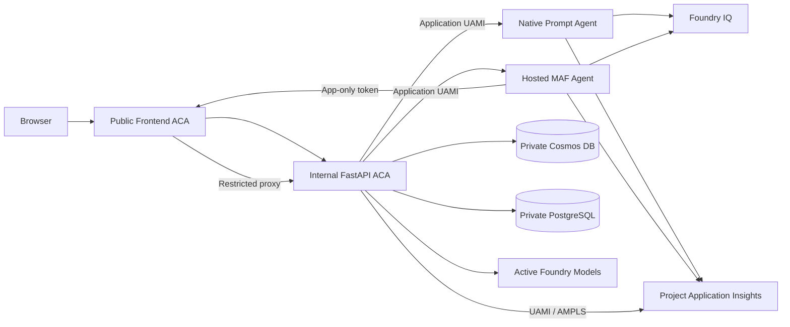

# Agentic AI Memory - Dual Foundry Support Chat

Reference implementation of a secure customer-support chat application with five
memory layers, Foundry IQ retrieval, and two user-selectable agents hosted in one
Microsoft Foundry project.

The current product and architecture source of truth is
[`docs/PRD-Solution-Challenges-1-5.md`](docs/PRD-Solution-Challenges-1-5.md).
[`docs/IMPLEMENTATION-PLAN.md`](docs/IMPLEMENTATION-PLAN.md) is the delivery record,
not an alternative architecture.

## Current architecture

| Agent | Runs in | Capabilities |
| --- | --- | --- |
| **Foundry Prompt Agent** | Native Foundry Prompt Agent | Foundry IQ `knowledge_base_retrieve` only |
| **Hosted Agent Framework** | Foundry Hosted Agent using Microsoft Agent Framework | Foundry IQ plus protected order, profile, and semantic-memory tools |

Agent selection is required for a new conversation and immutable afterward. Both
agents emit the same normalized AG-UI stream, but they intentionally have different
application capabilities.



FastAPI remains the authentication, authorization, conversation registry,
persistence, tool-policy, and public API boundary. The Hosted Agent never receives
direct application-data roles.

## What is implemented

- **Backend** (`backend/`) - FastAPI application with AG-UI SSE chat, owner-scoped
  conversation/profile/memory APIs, remote Foundry adapters, an app-only Hosted
  tool gateway, privacy-safe telemetry, and bounded liveness/readiness endpoints.
- **Agent contracts** (`agent_contracts/`) - separate versioned prompts, strict
  application-tool schemas, runtime state, citation/result envelopes, and
  normalized agent events.
- **Native Prompt release** (`setup/agents/`) - idempotently publishes an immutable
  Prompt Agent definition containing exactly one Foundry IQ MCP tool.
- **Hosted MAF agent** (`agents/customer-support-maf/`) - uses
  `FoundryChatClient`, `Agent`, and `ResponsesHostServer` with Hosted Responses
  protocol `2.0.0`.
- **Frontend** (`frontend/`) - Vite + Lit SPA with a login-first Entra gate,
  immutable agent selection, Markdown/citation streaming, and a constrained A2UI
  subset for internal tool cards.
- **Infrastructure** (`infra/`) - Terraform for Foundry Basic Setup, Container Apps,
  Search, Cosmos DB, PostgreSQL, ACR, private endpoints, monitoring, managed
  identities, and least-privilege RBAC.
- **Direct Foundry release** (`scripts/release_foundry_assets.sh`) - configures
  Search/Foundry IQ and publishes the Prompt Agent without setup containers.
- **Private setup job** (`setup/postgres/`) - the only retained Container Apps Job,
  used for PostgreSQL bootstrap inside the VNet.

## Five memory layers

1. **Session memory** - Foundry conversations plus bounded in-memory runtime
   mappings and per-conversation locks.
2. **Conversation history** - Cosmos DB, partitioned and queried by tenant-scoped
   authenticated user ID.
3. **Semantic conversation memory** - PostgreSQL with pgvector and an async
   managed-identity connection pool.
4. **User profile memory** - owner-partitioned Cosmos DB profile documents.
5. **Enterprise knowledge** - Foundry IQ backed by Azure AI Search knowledge
   sources and returned citations.

The backend is intentionally pinned to one replica because Redis-based distributed
session coordination is not part of this implementation.

## Security and networking

| Component | Network exposure | Identity model |
| --- | --- | --- |
| Frontend Container App | Public | Entra delegated user tokens; app-only Hosted tool route |
| Backend Container App | Internal ACA ingress | Application UAMI and backend token validation |
| Foundry agent account/project and models | Public only | Entra/RBAC only; local auth disabled |
| Azure AI Search / Foundry IQ | Public only | Entra/RBAC only; local auth disabled |
| Azure Container Registry | Public plus private endpoint | Entra/RBAC only; admin and anonymous pull disabled |
| Cosmos DB | Private endpoint only | Application UAMI; local auth disabled |
| PostgreSQL | Private endpoint only | Entra managed identity; password auth disabled |
| Application Insights / Log Analytics | Public Foundry platform path plus private AMPLS path for ACA | Foundry project connection; backend UAMI |

The public Foundry, Search, and ACR endpoints are required by non-VNet-injected
Foundry runtimes. Foundry and Search intentionally have no private endpoints. ACR
retains a private path for Container Apps image pulls.

Foundry uses Basic Setup with platform-managed agent state. Standard Setup and BYO
Storage are intentionally not used because tenant policy disables Storage
shared-key access.

The Foundry project is connected to the workspace-based Application Insights
resource. Prompt platform traces, Hosted MAF traces/dependencies, backend telemetry,
and Foundry diagnostics use the same project workspace. Foundry tracing requires
public ingestion and a connection string; this is the documented exception to the
managed-identity-only preference. Trace reads remain Entra/RBAC-controlled with
30-day retention. Full Foundry traces can contain user, model, retrieval, and tool
content.

### Authorization boundaries

- Browser APIs require a validated single-tenant Entra token with
  `access_as_user`.
- User ownership keys are derived as `tid:oid`; APIs do not accept caller-supplied
  user IDs.
- The backend uses a user-assigned managed identity for Foundry, Cosmos DB,
  PostgreSQL, Search, ACR, and telemetry.
- The Hosted Agent uses its Foundry-created service principal only to request the
  `AgentTools.Invoke` application role.
- Hosted gateway tokens must be application-only, contain the required role, and
  come from an allowlisted principal. Delegated `scp` tokens are rejected.
- Tool dispatch verifies the stored user/session binding before accessing data.
- Conversation DTOs use explicit allowlists and exclude private runtime IDs,
  owner keys, ETags, and Cosmos metadata.
- Authenticated profile and memory APIs intentionally return only the current
  user's profile and memory content. Telemetry excludes that content, identities,
  messages, tokens, and tool arguments.

## Async runtime model

- Azure-backed stores and runtimes are asynchronous and expose explicit
  initialize/close lifecycles.
- Cosmos uses `azure.cosmos.aio.CosmosClient`.
- PostgreSQL uses
  `asyncpg.create_pool(..., min_size=2, max_size=10)`.
- Runtime Azure SDK and HTTP clients are asynchronous.
- Agent streams are consumed with `async for`.
- Synchronous JWT/JWKS work is isolated from the event loop.
- Shutdown closes credentials, clients, pools, and refresh tasks.
- Persistence and remote invocation failures are surfaced rather than converted to
  success-shaped fallbacks.

## Run locally

Local mode uses mock users and mock agent runtimes. It does not require Azure.

### Backend

Requires [uv](https://docs.astral.sh/uv/) and Python 3.11:

```bash
cd backend
uv venv --python 3.11
uv pip install --python .venv/bin/python -e ../agent_contracts -e .
.venv/bin/python -m uvicorn agent_memory_backend.server:app --port 8000
```

### Frontend

Requires Node.js 20+:

```bash
cd frontend
npm install
npm run dev
```

Open http://localhost:5175. The frontend proxies `/api` to
`http://localhost:8000`.

Mock users are `user-alice`, `user-bob`, and `user-charlie`. Mock orders are
`ORD-001` (shipped), `ORD-002` (processing), and `ORD-003` (delivered). The local
Prompt mock remains knowledge-only; order-tool behavior belongs to the Hosted MAF
mock.

## Entra app registration

Terraform manages Azure subscription resources, but the SPA/API app registration
is intentionally manual because it requires Entra directory permissions such as
Application Administrator or `Application.ReadWrite.All`.

Create or update it with:

```bash
AZURE_CONFIG_DIR="$HOME/.azure-365" \
  ./scripts/create_entra_app.sh \
    --frontend-url https://<frontend-fqdn> \
    --localhost
```

The script:

- exposes the delegated `access_as_user` scope;
- defines the `AgentTools.Invoke` application role;
- configures v2 access tokens and SPA redirect URIs;
- preauthorizes Azure CLI for test-token acquisition;
- prints the tenant and client values required by Terraform.

For v2 access tokens, configure the backend user-token audience as the client-ID
GUID. Hosted identity token acquisition still uses
`api://<client-id>/.default`.

Example authenticated request:

```bash
TOKEN=$(az account get-access-token \
  --scope api://<client-id>/access_as_user \
  --query accessToken -o tsv)

curl -H "Authorization: Bearer $TOKEN" \
  https://<frontend-fqdn>/api/me
```

## Deployment model

1. Configure `infra/terraform.tfvars` from
   `infra/terraform.tfvars.example`.
2. Provision Azure resources and RBAC with Terraform.
3. Run `scripts/release_foundry_assets.sh all` to configure Search/Foundry IQ and
   publish the native Prompt Agent directly.
4. Build backend, frontend, PostgreSQL bootstrap, and Hosted MAF images with ACR
   Tasks; local Docker is not required.
5. Run the VNet-integrated PostgreSQL bootstrap job.
6. Deploy the Hosted MAF image to the Foundry project.
7. Assign `AgentTools.Invoke` to the generated Hosted Agent principal and add that
   principal to the backend allowlist.
8. Deploy backend/frontend images and enable agents only after readiness and live
   acceptance pass.

`scripts/deploy_images.sh` builds the application, PostgreSQL bootstrap, and Hosted
MAF images through ACR and updates the Container Apps and PostgreSQL job.
`scripts/assign_hosted_agent_access.sh` idempotently assigns the Hosted application
role.

Hosted Agent source-code deployment without a container image is currently preview.
The implementation keeps the established container deployment and will reassess the
source option after general availability.

Hosted images are tagged with `agent_release_id`. Use a new value for every
release; the deployment helper does not prevent overwriting an existing tag.
The active Hosted image repository is `customer-support-maf-hosted`;
`customer-support-maf` is retained only as a rollback artifact. Obsolete
`kb-setup` and `prompt-agent-release` repositories are not retained.

## Repository layout

```text
agent_contracts/  Versioned prompts, strict tools, and runtime/event contracts
agents/           Foundry Hosted Microsoft Agent Framework source
backend/          Packaged FastAPI trust boundary, stores, gateway, and agent adapters
frontend/         Componentized Vite + Lit SPA and constrained A2UI tool cards
infra/            Terraform infrastructure, networking, identities, and RBAC
setup/            Direct Foundry IQ/Prompt release code and PostgreSQL bootstrap
scripts/          Entra, direct Foundry release, image deployment, and role assignment
docs/             Current PRD and implementation delivery record
```
