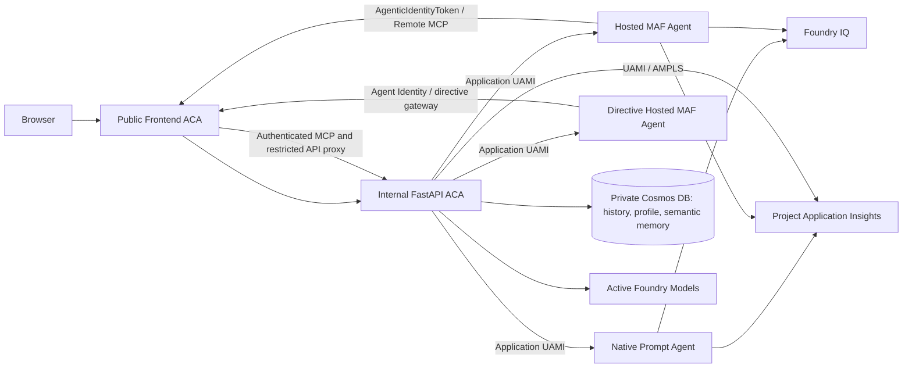

# Agentic AI Memory - Foundry Agent Chat

Reference implementation of a secure agent chat application with five memory
layers, Foundry IQ retrieval, two support agents, and a separately deployed
directive RAG agent in one Microsoft Foundry project.

The current product and architecture source of truth is
[`docs/PRD-Solution-Challenges-1-5.md`](docs/PRD-Solution-Challenges-1-5.md).
[`docs/IMPLEMENTATION-PLAN.md`](docs/IMPLEMENTATION-PLAN.md) is the delivery record,
not an alternative architecture.

## Current architecture

| Agent | Runs in | Capabilities |
| --- | --- | --- |
| **Foundry Prompt Agent** | Native Foundry Prompt Agent | Foundry IQ `knowledge_base_retrieve` only |
| **Hosted Agent Framework** | Foundry Hosted Agent using Microsoft Agent Framework | Foundry IQ, an Agent Identity-authenticated order MCP tool, and app-session profile/memory tools |
| **Directive Assistant** | Separate Foundry Hosted Agent using Microsoft Agent Framework | Eight strict backend directive tools for discovery, long-form content, comparisons, linked directives, and mandatory-status labeling; enabled for the current internal pilot |

Agent selection is required for a new conversation and immutable afterward. All
configured agents emit the same normalized AG-UI stream, but they intentionally
have different application capabilities. The Directive Assistant is visible in
the current pilot environment; its independent enablement and visibility gates
remain the rollback controls.



FastAPI remains the authentication, authorization, conversation registry,
persistence, tool-policy, and public API boundary. The Hosted Agent never receives
direct application-data roles.

Publishing the stable endpoint to Microsoft 365 Copilot or Teams does not change
these runtime boundaries. Those channels currently suppress streaming and citation
rendering. Stateless Agent Identity-authenticated MCP tools such as order lookup
remain available, while owner-scoped profile and conversation memory require the
application-created user/session binding and are not exposed as app-only published
channel tools.

## What is implemented

- **Backend** (`backend/`) - FastAPI application with AG-UI SSE chat, owner-scoped
  conversation/profile/memory APIs, remote Foundry adapters, an app-role-protected
  stateless MCP endpoint, a session-bound Hosted tool gateway, privacy-safe
  telemetry, and bounded liveness/readiness endpoints.
- **Agent contracts** (`agent_contracts/`) - separate versioned prompts, strict
  application-tool schemas, runtime state, citation/result envelopes, and
  normalized agent events.
- **Native Prompt release** (`setup/agents/`) - idempotently publishes an immutable
  Prompt Agent definition containing exactly one Foundry IQ MCP tool.
- **Hosted MAF agent** (`agents/customer-support-maf/`) - uses
  `FoundryChatClient`, `Agent`, and `ResponsesHostServer` with Hosted Responses
  protocol `2.0.0`.
- **Directive Hosted MAF agent** (`agents/directive-rag-maf/`) - separately
  packaged GPT-5.6 agent with exactly eight RequestContext-backed gateway tools
  and no support IQ, order, profile, memory, or direct data-plane access.
- **Frontend** (`frontend/`) - Vite + Lit SPA with a login-first Entra gate,
  immutable agent selection, Markdown/citation streaming, and a constrained A2UI
  subset for internal tool cards.
- **Infrastructure** (`infra/`) - Terraform for Foundry Basic Setup, Container Apps,
  Search, Cosmos DB, ACR, private endpoints, monitoring, managed
  identities, and least-privilege RBAC.
- **Direct Foundry release** (`scripts/release_foundry_assets.sh`) - configures
  Search/Foundry IQ and publishes the Prompt Agent without setup containers.

## Five memory layers

1. **Session memory** - Foundry conversations plus bounded in-memory runtime
   mappings and per-conversation locks.
2. **Conversation history** - Cosmos DB, partitioned and queried by tenant-scoped
   authenticated user ID.
3. **Semantic conversation memory** - owner-partitioned Cosmos DB documents with
   3,072-dimensional cosine vector search.
4. **User profile memory** - owner-partitioned Cosmos DB profile documents.
5. **Enterprise knowledge** - Foundry IQ backed by Azure AI Search knowledge
   sources and returned citations.

The backend is intentionally pinned to one replica because Redis-based distributed
session coordination is not part of this implementation.

## Security and networking

| Component | Network exposure | Identity model |
| --- | --- | --- |
| Frontend Container App | Public | Entra delegated user tokens; app-only Hosted tool route |
| Backend Container App | Internal ACA ingress | Application UAMI and backend token validation |
| Foundry agent account/project and models | Public only | Entra/RBAC only; local auth disabled |
| Azure AI Search / Foundry IQ | Public only | Entra/RBAC only; local auth disabled |
| Azure Container Registry | Public plus private endpoint | Entra/RBAC only; admin and anonymous pull disabled |
| Cosmos DB | Private endpoint only | Application UAMI; local auth disabled |
| Application Insights / Log Analytics | Public Foundry platform path plus private AMPLS path for ACA | Foundry project connection; backend UAMI |

The public Foundry, Search, and ACR endpoints are required by non-VNet-injected
Foundry runtimes. Foundry and Search intentionally have no private endpoints. ACR
retains a private path for Container Apps image pulls.

Foundry uses Basic Setup with platform-managed agent state. Standard Setup and BYO
Storage are intentionally not used because tenant policy disables Storage
shared-key access.

The Foundry project is connected to the workspace-based Application Insights
resource. Prompt platform traces, Hosted MAF traces/dependencies, backend telemetry,
and Foundry diagnostics use the same project workspace. Foundry tracing requires
public ingestion and a connection string; this is the documented exception to the
managed-identity-only preference. Trace reads remain Entra/RBAC-controlled with
30-day retention. Full Foundry traces can contain user, model, retrieval, and tool
content.

Agent 365 export is a separate destination. The Hosted Agent identity must have
`Agent365.Observability.OtelWrite`, and exported spans must include both
`gen_ai.agent.id` and `microsoft.tenant.id`. An Agent 365 authorization or
eligibility failure does not disable Application Insights ingestion or change an
agent response.

Agent 365 ingestion is also tenant-gated. At least one user in the tenant must
have a Microsoft 365 E7 or Microsoft Agent 365 license assigned; having only
Microsoft 365 Copilot or E5 is not the documented ingestion entitlement. Without
an eligible assignment, Agent 365 can return HTTP `200` with
`partialSuccess: null` while silently discarding the entire request. After the
first eligible run, wait about five minutes and verify the agent ID in Defender
`CloudAppEvents`; HTTP success alone is not acceptance. See the official
[Agent 365 observability prerequisites](https://learn.microsoft.com/en-us/microsoft-agent-365/developer/direct-open-telemetry-integration#prerequisites)
and
[troubleshooting flow](https://learn.microsoft.com/en-us/microsoft-agent-365/developer/direct-open-telemetry-troubleshooting#verifying-ingestion).

### Authorization boundaries

- Browser APIs require a validated single-tenant Entra token with
  `access_as_user`.
- User ownership keys are derived as `tid:oid`; APIs do not accept caller-supplied
  user IDs.
- The backend uses a user-assigned managed identity for Foundry, Cosmos DB,
  Search, ACR, and telemetry.
- Foundry Agent Service performs the Agent Identity token exchange for the
  `customer-support-tools-mcp` `RemoteTool` connection and sends the resulting
  token to `/api/mcp/`. The Hosted MCP descriptor supplies both the server URL
  and project connection ID; application code does not implement `fmi_path`
  exchange.
- The shared project Agent Identity has only `AgentTools.Invoke`. Each published
  Hosted Agent identity is granted its own `AgentTools.Invoke` and
  `Agent365.Observability.OtelWrite` assignments. The directive identity has no
  direct Search, Cosmos, Blob, mandate, or model data-plane role.
- Hosted MCP and gateway tokens must be application-only, contain the required role, and
  come from an allowlisted principal. Delegated `scp` tokens are rejected.
- Stateless order lookup is exposed through MCP without impersonating a user.
  Profile and conversation-memory dispatch still verifies the stored user/session
  binding before accessing owner-scoped data.
- The MAF `Agent.id` uses the platform-provided
  `FOUNDRY_AGENT_INSTANCE_CLIENT_ID`, keeping Agent Framework spans and Agent 365
  export aligned with the authorized Agent Identity. Agent Server uses the
  platform-provided `FOUNDRY_AGENT_TENANT_ID` when present; otherwise startup
  bridges the deployment's `ENTRA_TENANT_ID` before observability initializes.
  The create-response route then establishes Agent 365 `BaggageBuilder` context
  with the resolved tenant and published identity after inbound trace-context
  extraction. This ensures `invoke_agent` and child spans receive both required
  identity attributes before exporter eligibility filtering.
- Conversation DTOs use explicit allowlists and exclude private runtime IDs,
  owner keys, ETags, and Cosmos metadata.
- Authenticated profile and memory APIs intentionally return only the current
  user's profile and memory content. Telemetry excludes that content, identities,
  messages, tokens, and tool arguments.

## Async runtime model

- Azure-backed stores and runtimes are asynchronous and expose explicit
  initialize/close lifecycles.
- Cosmos history, profile, and semantic-memory stores use
  `azure.cosmos.aio.CosmosClient`.
- Runtime Azure SDK and HTTP clients are asynchronous.
- Agent streams are consumed with `async for`.
- Synchronous JWT/JWKS work is isolated from the event loop.
- Shutdown closes credentials, clients, pools, and refresh tasks.
- Persistence and remote invocation failures are surfaced rather than converted to
  success-shaped fallbacks.

## Run locally

Local mode uses mock users and mock agent runtimes. It does not require Azure.

### Backend

Requires [uv](https://docs.astral.sh/uv/) and Python 3.11:

```bash
cd backend
uv venv --python 3.11
uv pip install --python .venv/bin/python -e ../agent_contracts -e .
.venv/bin/python -m uvicorn agent_memory_backend.server:app --port 8000
```

### Frontend

Requires Node.js 20+:

```bash
cd frontend
npm install
npm run dev
```

Open http://localhost:5175. The frontend proxies `/api` to
`http://localhost:8000`.

Mock users are `user-alice`, `user-bob`, and `user-charlie`. Mock orders are
`ORD-001` (shipped), `ORD-002` (processing), and `ORD-003` (delivered). The local
Prompt mock remains knowledge-only; order-tool behavior belongs to the Hosted MAF
mock.

## Entra app registration

Terraform manages Azure subscription resources, but the SPA/API app registration
is intentionally manual because it requires Entra directory permissions such as
Application Administrator or `Application.ReadWrite.All`.

Create or update it with:

```bash
AZURE_CONFIG_DIR="$HOME/.azure-365" \
  ./scripts/create_entra_app.sh \
    --frontend-url https://<frontend-fqdn> \
    --localhost
```

The script:

- exposes the delegated `access_as_user` scope;
- defines the `AgentTools.Invoke` application role;
- configures v2 access tokens and SPA redirect URIs;
- preauthorizes Azure CLI for test-token acquisition;
- prints the tenant and client values required by Terraform.

For v2 access tokens, configure the backend user-token audience as the client-ID
GUID. Hosted identity token acquisition still uses
`api://<client-id>/.default`.

Example authenticated request:

```bash
TOKEN=$(az account get-access-token \
  --scope api://<client-id>/access_as_user \
  --query accessToken -o tsv)

curl -H "Authorization: Bearer $TOKEN" \
  https://<frontend-fqdn>/api/me
```

## Deployment model

1. Configure `infra/terraform.tfvars` from
   `infra/terraform.tfvars.example`.
2. Provision Azure resources and RBAC with Terraform.
3. Run `scripts/release_foundry_assets.sh all` to configure Search/Foundry IQ and
   publish the native Prompt Agent directly.
4. Build backend, frontend, and Hosted MAF images with ACR Tasks; local Docker is
   not required.
5. Deploy the Hosted MAF image to the Foundry project.
6. Configure the generated Hosted Agent identity, including the application MCP
   and Agent 365 roles plus the MCP connection ID:

   ```bash
   AZURE_CONFIG_DIR="$HOME/.azure-365" COPILOT_HOME="$HOME/.copilot" \
     ./scripts/assign_hosted_agent_access.sh \
       --principal-id <hosted-agent-principal-id> \
       --api-app-id <application-client-id> \
       --azd-project-dir agents/customer-support-maf
   ```

   This step requires Application Administrator or Global Administrator.
7. Deploy backend/frontend images and enable agents only after readiness and live
   acceptance pass.

`scripts/deploy_images.sh` builds the application and Hosted MAF images through ACR
and updates the Container Apps.
`scripts/build_hosted_agent_image.sh --agent directive --tag <release>` builds
the directive image independently; the deployment script's default support-agent
behavior is unchanged.
`scripts/assign_hosted_agent_access.sh` idempotently assigns `AgentTools.Invoke`
to both the shared project and published Agent Identities, assigns
`Agent365.Observability.OtelWrite` only to the published identity, then configures
the nested Hosted Agent azd environment with the application MCP connection ID and
tenant ID plus the concrete Foundry project endpoint required by `azd deploy`.
Use `--no-app-tools-connection` for the directive package because its local
function wrappers call the authenticated gateway and do not use the support MCP
connection. Pass `--agent-type directive`; before enablement, add both the
published principal and shared project Agent Identity to Terraform variable
`directive_hosted_agent_principal_ids`.
This role assignment does not license or onboard the tenant for Agent 365
ingestion. Verify that an eligible Microsoft 365 E7 or Microsoft Agent 365 license
is assigned to at least one tenant user before treating downstream telemetry as a
release gate.
The deployment input uses the concrete existing-project URL so `azd provision`
cannot replace the platform-generated `FOUNDRY_PROJECT_ENDPOINT` with a circular
reference.
The checked-in `agent.yaml` mirrors the Hosted Agent runtime contract and is
validated by `azd ai agent doctor` before deployment.

Hosted Agent source-code deployment without a container image is currently preview.
The implementation keeps the established container deployment and will reassess the
source option after general availability.

Hosted images are tagged with `agent_release_id`. Use a new value for every
release; the deployment helper does not prevent overwriting an existing tag.
The active Hosted image repository is `customer-support-maf-hosted`;
`customer-support-maf` is retained only as a rollback artifact. Obsolete
`kb-setup` and `prompt-agent-release` repositories are not retained.

## Repository layout

```text
agent_contracts/  Versioned prompts, strict tools, and runtime/event contracts
agents/           Foundry Hosted Microsoft Agent Framework source
backend/          Packaged FastAPI trust boundary, stores, gateway, and agent adapters
frontend/         Componentized Vite + Lit SPA and constrained A2UI tool cards
infra/            Terraform infrastructure, networking, identities, and RBAC
setup/            Direct Foundry IQ and Prompt Agent release code
scripts/          Entra, direct Foundry release, image deployment, and role assignment
docs/             Current PRD and implementation delivery record
```
