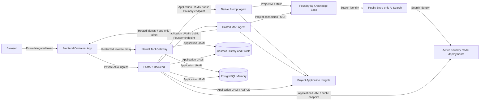

# PRD - Agentic AI Memory: Challenges 1-5

**Status:** Current reference specification

This document is the reusable source of truth for the implemented product and
architecture. It describes only the current design; rollout history, superseded
alternatives, temporary workarounds, and environment-specific resource names are
intentionally excluded.

## 1. Product goal

Deliver a secure customer-support chat application that combines five memory
layers with grounded enterprise retrieval. Before starting a conversation, the
user selects one of two agents hosted in the same Microsoft Foundry project:

1. **Foundry Prompt Agent** - a native, versioned Prompt Agent with Foundry IQ as
   its only tool.
2. **Hosted Agent Framework** - a Microsoft Agent Framework agent deployed as a
   Foundry Hosted Agent with Foundry IQ and protected application tools.

Both agents use the same AG-UI streaming contract. Agent choice is required for a
new conversation and immutable afterward.

## 2. Governing decisions

| Area | Current decision | Rationale |
| --- | --- | --- |
| Foundry topology | One Foundry Basic Setup account and project contains both logical agents, model deployments, and the Foundry IQ connection | Keeps model, connection, identity, agent, and telemetry governance together |
| Model hosting | The same active Foundry account serves agent models, backend chat/embedding calls, and Foundry IQ query planning | Eliminates the legacy duplicate AI account while retaining identity-scoped model access |
| Agent implementations | Native Prompt Agent plus Foundry-hosted Microsoft Agent Framework | Compares native and code-based agents without moving the trust boundary |
| Prompt Agent capability | Foundry IQ `knowledge_base_retrieve` only | Keeps the native agent knowledge-only and prevents application-tool access |
| Hosted MAF capability | Foundry IQ plus order, profile, and memory tools | Supports application actions while keeping data access behind FastAPI |
| Retrieval | Foundry IQ only | Removes classic RAG, no-retrieval modes, and runtime retrieval switching |
| Agent selection | Explicit for new chats and immutable per conversation | Prevents silent behavior changes and state corruption |
| Failover | No automatic cross-agent failover | A conversation remains bound to its original runtime and state |
| Trust boundary | FastAPI owns authentication, authorization, persistence, tool policy, and public DTOs | Models and Hosted runtime identities never become application-data authorities |
| Foundry state | Basic Setup platform-managed state | Avoids BYO Storage requirements that conflict with tenant policy |
| Networking | Public Entra/RBAC-only Foundry and Search; dual-path public/private ACR; private Cosmos DB, PostgreSQL, and backend ingress | Supports non-VNet-injected Foundry runtimes while protecting application data |
| Backend identity | User-assigned managed identity | Avoids application secrets for Azure data-plane access and Foundry invocation |
| Hosted identity | Foundry-created service principal | Hosted Agent preview does not support assigning the application UAMI |
| Session coordination | Bounded in-memory cache and one backend replica | Redis is intentionally absent |
| Infrastructure | Terraform manages Azure resources; Entra app registration remains manual | Separates subscription governance from directory governance |
| Observability | One workspace-based Application Insights resource receives backend, Prompt, Hosted MAF, and Foundry telemetry | Provides a single operational view with RBAC-restricted, 30-day retention |
| Release execution | Foundry IQ and Prompt publication run directly; only PostgreSQL bootstrap remains a Container Apps Job; Hosted MAF remains container-based | Removes unnecessary setup images while retaining private-network bootstrap and supported Hosted deployment |

## 3. Scope

### In scope

- Challenge 01: current-conversation session memory.
- Challenge 02: durable owner-partitioned conversation history.
- Challenge 03: semantic conversation memory in PostgreSQL with pgvector.
- Challenge 04: durable user profile memory.
- Challenge 05: grounded retrieval through Foundry IQ.
- User-selectable native Prompt and Hosted MAF agents.
- AG-UI streaming, Markdown/citation rendering, and constrained A2UI tool cards.
- Entra user authentication and application-only Hosted Agent authorization.
- Terraform-managed Azure infrastructure and RBAC.
- Privacy-safe telemetry, readiness, release, and rollback controls.

### Out of scope

- Classic application-side RAG or a no-retrieval production mode.
- Changing agents inside an existing conversation.
- Automatic failover between agents.
- Direct application-data roles for the Hosted Agent identity.
- Redis or multi-replica backend coordination.
- Foundry preview memory as a replacement for application-owned memory.
- Terraform management of the Entra app registration.
- Jump VM, Bastion, or other interactive network-diagnostics infrastructure.

## 4. Architecture



The FastAPI backend is the policy-enforcement point. It authenticates users,
derives tenant-scoped ownership, creates remote state, persists routing, invokes
both agents, normalizes remote events, emits AG-UI, and mediates all application
tools.

The frontend is public. The backend uses internal Container Apps ingress and is
reachable from the frontend environment, not directly from the internet.

## 5. Agent architecture

### 5.1 Native Foundry Prompt Agent

Logical name: `customer-support-prompt`

- Uses `PromptAgentDefinition`.
- Uses a dedicated knowledge-only prompt and prompt hash.
- Is published as immutable versions with prompt, tool, and release metadata.
- Has exactly one attached tool: the project-managed-identity Foundry IQ MCP
  connection with `allowed_tools=["knowledge_base_retrieve"]`.
- Has no function tools and no backend function-call continuation loop.
- Cannot invoke the order gateway, profile store, or semantic-memory gateway.
- Can retrieve only data exposed by the configured Foundry IQ knowledge base and
  authorized to the Foundry project identity.

### 5.2 Foundry Hosted Microsoft Agent Framework agent

Logical name: `customer-support-maf-hosted`

- Uses `FoundryChatClient`, `Agent`, and `ResponsesHostServer`.
- Runs inside Foundry with Hosted Responses protocol `2.0.0`.
- Uses `agent-framework-foundry==1.10.1` and
  `agent-framework-foundry-hosting==1.0.0a260709`.
- Uses the shared Foundry IQ MCP connection.
- Exposes four async application tools:
  - `get_user_context`;
  - `get_order_status`;
  - `check_memory`;
  - `update_user_profile`.
- Reads trusted `user_id`, `session_id`, and `call_id` from Foundry request
  context, never from model arguments.
- Acquires an application token with its Foundry-created identity and calls the
  protected gateway through the public frontend.
- Limits function invocation to five iterations.
- Sets `store=False`; durable application routing and transcripts remain owned by
  the backend.

### 5.3 Shared contracts

`agent_contracts/` is the single source for:

- `AgentType`;
- separate Prompt Agent and Hosted MAF prompts and SHA-256 versions;
- strict application-tool definitions and Pydantic argument models;
- result and citation envelopes;
- runtime descriptors and private runtime state;
- normalized streaming events.

The browser and model-visible schemas never contain user, tenant, principal, or
session ownership fields.

## 6. Foundry IQ retrieval

- Foundry IQ is the only production retrieval architecture.
- Azure AI Search hosts the knowledge base and its knowledge sources.
- The current knowledge base combines order and return-policy sources.
- Both agents call `knowledge_base_retrieve` through the project connection.
- The connection uses `ProjectManagedIdentity` and the Search audience.
- Grounded claims include citations returned by Foundry IQ.
- Missing or failed retrieval is surfaced; the system never silently falls back to
  another retrieval path.
- The Prompt Agent's lack of application tools is a capability boundary, not a
  promise that the shared knowledge base contains no order data.

## 7. Identity and authorization

### 7.1 End-user authentication

- Production browser requests use single-tenant Entra delegated
  `access_as_user`.
- The backend validates signature, issuer, tenant, audience, expiry, and required
  scope.
- `user_id` is derived as `tid:oid`, with `sub` only as a subject fallback.
- Caller-supplied user or tenant identifiers are never accepted as authority.
- Mock header authentication is local-only and rejected when
  `APP_ENV=production`.

### 7.2 Azure identity matrix

| Principal | Required access |
| --- | --- |
| Backend application UAMI | ACR pull, active Foundry invocation, trusted user impersonation, remote conversation create/delete, chat/embedding model use, Cosmos data, PostgreSQL, Search read, and telemetry publish |
| Frontend UAMI | ACR pull |
| PostgreSQL bootstrap UAMI | ACR pull and PostgreSQL Entra administration used to grant the application principal least-privilege database access |
| Foundry project managed identity | Foundry user, Search index read, ACR pull, Log Analytics read, and Foundry IQ connection authentication |
| Hosted Agent service principal | Backend `AgentTools.Invoke` application role only |
| Search system identity | Active Foundry model access required by the knowledge base |
| Deployment principal | Foundry project management, active model invocation, and Search service/index contribution used by direct IQ and Prompt releases |

The backend custom Foundry consumer role is scoped to the project. It includes
endpoint interaction, trusted-user impersonation, and the Foundry `agents/write`
and `agents/delete` data actions because Foundry maps runtime conversation
create/delete operations to those actions.

### 7.3 Hosted application-tool gateway

- The Hosted Agent obtains an application-only token for
  `api://<application-client-id>/.default`.
- Token validation expects the application client-ID GUID as the audience.
- The token must contain `roles: ["AgentTools.Invoke"]`.
- Tokens containing delegated `scp` claims are rejected.
- The caller object ID must be in the Hosted Agent principal allowlist.
- The gateway resolves the stored conversation using both trusted user ID and
  Hosted session ID before dispatch.
- Only allowlisted tool names can be dispatched.
- The public frontend route has a bounded request body and rate limiting, then
  proxies to the internal backend.
- The Hosted identity receives no Cosmos DB, PostgreSQL, Search, or other
  application-data role.

## 8. Networking

| Service | Exposure | Authentication | Decision |
| --- | --- | --- | --- |
| Frontend Container App | Public | Entra for user APIs; app-only Entra for Hosted tool route | Public application entry point |
| Backend Container App | Internal ACA ingress | Validated frontend/user request or Hosted gateway token | Never directly internet-addressable |
| Foundry agent account/project and models | Public endpoint only | Entra/RBAC only; local auth disabled | Hosts both agents and all application/knowledge-base model deployments |
| Azure AI Search / Foundry IQ | Public endpoint only | Entra/RBAC only; local auth disabled | Avoids private DNS that the non-injected Hosted runtime cannot resolve |
| Azure Container Registry | Public endpoint plus private endpoint | Entra/RBAC only; admin and anonymous pull disabled | Hosted runtime pulls publicly; ACA resolves and pulls privately |
| Cosmos DB | Private endpoint only | Application UAMI; local auth disabled | Protects history and profile data |
| PostgreSQL Flexible Server | Private endpoint only | Entra managed identity; password auth disabled | Protects semantic memory |
| Application Insights / Log Analytics | Public platform path plus private AMPLS path for ACA | Backend uses UAMI; Foundry project uses its App Insights connection | Unifies Prompt, Hosted, backend, and platform telemetry |

Foundry uses Basic Setup without outbound VNet injection. Standard Setup with BYO
Storage, Cosmos DB, and Search is not used because the tenant policy disables
Storage shared-key access. Platform-managed Foundry agent state is accepted.

Foundry and Search do not have private endpoints or private DNS zones. ACR keeps a
private endpoint so Container Apps can pull through the VNet while the Hosted Agent
platform pulls from the public endpoint. Application Insights public ingestion and
local authentication are enabled as a documented platform exception because Foundry
project tracing uses an Application Insights connection string. Trace access remains
Entra/RBAC-controlled, and ACA telemetry continues to resolve through AMPLS.

## 9. Five memory layers

### F1 - Session memory

- Foundry conversations are authoritative remote runtime state.
- Hosted MAF additionally has a Foundry Hosted session.
- The backend keeps bounded in-memory runtime mappings and per-conversation locks.
- Durable Cosmos metadata restores remote mappings after restart.
- The backend remains pinned to one replica while Redis is absent.
- Overlapping turns return `409 CONVERSATION_BUSY`.

### F2 - Conversation history

- Cosmos DB history is partitioned by `/user_id`.
- Point reads, writes, deletes, and list queries always use the authenticated
  partition.
- Schema v3 stores agent type, release metadata, and private remote runtime state.
- Updates use ETag `IfNotModified` conditions.
- Public DTOs use explicit allowlists and never expose owner keys, physical agent
  names, Foundry conversation IDs, Hosted session IDs, response IDs, ETags, or
  Cosmos metadata.

### F3 - Semantic conversation memory

- Azure Database for PostgreSQL Flexible Server uses pgvector.
- The async pool is created with
  `asyncpg.create_pool(..., min_size=2, max_size=10)`.
- Production authentication uses the backend UAMI and a nonblocking async token
  refresh cache.
- A private bootstrap job creates the principal, extension, schema, and
  least-privilege grants.
- Every query is parameterized and scoped to the authenticated user.
- Hosted MAF calls `check_memory` only when the user explicitly asks to recall a
  prior conversation.
- The Prompt Agent has no semantic-memory tool.

### F4 - User profile memory

- Cosmos DB profiles are partitioned by `/user_id`.
- Reads and patches execute only under authenticated backend context.
- Hosted MAF uses `get_user_context` when personalization is relevant.
- Hosted MAF uses `update_user_profile` only for durable facts explicitly stated
  by the user.
- Profile updates validate strict outer schemas and reject unknown fields.
- The Prompt Agent has no profile tools.
- Profile data is not dynamically injected into the system prompt.

### F5 - Knowledge retrieval

- Foundry IQ provides grounded enterprise retrieval for both agents.
- Knowledge sources, indexes, and citations are governed independently from
  application history, profile, and semantic-memory stores.
- The project managed identity reads Search; neither end-user tokens nor model
  arguments authorize retrieval.

## 10. Conversation and API contract

### Chat request

```json
{
  "message": "What is the return policy?",
  "conversation_id": null,
  "agent_type": "foundry-prompt"
}
```

`agent_type` is required and accepts only `foundry-prompt` or
`agent-framework`. There is no retrieval-mode field.

### Chat behavior

- A new chat creates and durably maps application and remote state before model
  invocation.
- Existing chats reject an agent mismatch with
  `409 CONVERSATION_AGENT_IMMUTABLE`.
- Responses use AG-UI Server-Sent Events and return `X-Conversation-ID`.
- Remote runtime events are normalized before public emission.
- Runtime failures emit sanitized `RUN_ERROR`; no cross-agent failover occurs.
- Transcript and private runtime state are saved before `RUN_FINISHED`.
- If the initial durable write fails, newly created remote state is cleaned up.

### Other endpoints

- `/agents` - available agents and fixed Foundry IQ retrieval capability.
- `/conversations*` - owner-scoped summaries, details, title updates, and deletion.
- `/profile*` - owner-scoped profile operations.
- `/memories*` - owner-scoped semantic-memory operations.
- `/health/live` - process liveness only.
- `/health/ready` - bounded concurrent dependency and runtime checks.
- `/internal/agent-tools/{tool_name}` - app-only Hosted Agent gateway.

## 11. Async and lifecycle requirements

- Store and runtime methods are `async def`.
- Stores and runtimes expose `initialize()`/`close()` or `connect()`/`close()`.
- Cosmos uses `azure.cosmos.aio.CosmosClient`.
- PostgreSQL uses `asyncpg`; no synchronous database client exists.
- Agent output is consumed with async iteration.
- Runtime Azure SDK and HTTP clients are asynchronous.
- Synchronous JWT/JWKS work is isolated with `asyncio.to_thread`.
- No blocking network or database call runs on the event loop.
- Shutdown closes clients, pools, credentials, and refresh tasks.
- Errors are surfaced; broad catches do not return success-shaped fallbacks.

## 12. Frontend requirements

- In Entra mode, validate authentication before rendering the application shell or
  requesting user-scoped data.
- Show unauthenticated users a dedicated Microsoft Entra ID sign-in screen; Entra
  is the only production identity provider.
- Start interactive authentication only from the explicit sign-in action. Expired
  sessions return to the sign-in screen instead of triggering API-initiated popups.
- Show **Foundry Prompt Agent** and **Hosted Agent Framework** before the first
  turn.
- Lock selection after a conversation ID exists.
- Changing a locked selection starts a new conversation.
- Restore only safe agent metadata from history.
- Show a fixed Foundry IQ indicator; no RAG selector exists.
- Hide unavailable agents rather than relabeling or substituting them.
- Clear user-scoped state and cancel streams when identity changes.
- Ignore late async results from a previous identity.
- Render Markdown and citations directly; use the constrained A2UI subset only for
  normalized internal tool cards.

## 13. Observability and readiness

- The Foundry project has an explicit connection to the project Application
  Insights resource.
- Prompt Agent platform spans, Hosted MAF OpenTelemetry traces/dependencies, backend
  telemetry, and Foundry account diagnostics target the same workspace-backed
  observability boundary.
- The active Foundry account exports `Audit`, `RequestResponse`,
  `AzureOpenAIRequestUsage`, `Trace`, and `AllMetrics` through its diagnostic
  setting.
- Backend telemetry uses UAMI through AMPLS and privacy allowlists.
- Safe dimensions include agent type, prompt/release version, dependency, duration,
  token counts, tool count, citation count, and sanitized error code.
- Application-authored telemetry excludes identities, prompts, messages, profile
  data, memory contents, tool arguments, access tokens, and retrieval bodies.
- Foundry full tracing is an explicit exception: platform traces can contain user,
  model, retrieval, and tool content. Access is RBAC-restricted and workspace
  retention is 30 days.
- Additional Agent Framework sensitive-data instrumentation remains disabled to
  avoid duplicate content capture.
- Dependency readiness checks run concurrently with bounded timeouts.
- Readiness returns sanitized dependency names, status, duration, and error type.
- Agent readiness validates configured clients and feature flags; it does not
  require agent-definition read permissions.
- Deep agent invocation, retrieval, and tool authorization are deployment
  acceptance checks, not liveness probes.
- Liveness performs no dependency calls.

## 14. Infrastructure, release, and operations

- Terraform provisions networking, Container Apps, Foundry, model deployments,
  Search, Cosmos DB, PostgreSQL, ACR, monitoring, managed identities, and RBAC.
- The Entra SPA/API registration is created separately because it requires
  directory permissions distinct from subscription deployment permissions.
- `scripts/release_foundry_assets.sh` runs Search/Foundry IQ setup and native Prompt
  Agent publication directly with the authenticated deployment principal.
- The VNet-integrated PostgreSQL bootstrap is the only setup Container Apps Job.
- Hosted MAF remains a container image in ACR and a Foundry Hosted Agent deployment.
- Hosted Agent source-code deployment without a container is preview and remains a
  future simplification to reassess after general availability.
- Prompt definitions are immutable, versioned releases.
- Hosted images use release-ID tags. The deployment process must supply a unique
  `agent_release_id` for each release to prevent tag overwrite and preserve image
  rollback; the helper script does not enforce uniqueness.
- The prior `customer-support-maf` repository is retained only as a Hosted Agent
  rollback artifact; active releases use `customer-support-maf-hosted`.
- Prompt and Hosted prompt hashes are tracked independently.
- Prior agent and Container App revisions are retained for rollback.
- Feature flags control admission of new conversations to each agent.
- Disabling an agent never reroutes an existing conversation.
- Destructive removal of an active Foundry generation requires a separate approved
  cleanup after its rollback window.
- Terraform plans must not replace or delete active application data services or
  agent state without explicit approval.

## 15. Acceptance criteria

- One Foundry Basic Setup project contains both logical agents.
- No legacy Foundry account, Foundry/Search private endpoint, stale private DNS
  zone, setup UAMI/job, jump VM, or Bastion remains.
- Only the PostgreSQL bootstrap Container Apps Job remains.
- The Prompt Agent definition contains exactly one tool: Foundry IQ
  `knowledge_base_retrieve`.
- Hosted MAF runs in Foundry and exposes Foundry IQ plus the four protected
  application tools.
- The backend has no production Agent Framework hosting dependency.
- Both agents produce the same normalized AG-UI contract and grounded citations.
- Backend Foundry invocation uses managed identity against the public Entra-only
  endpoint.
- Hosted application-tool traffic crosses only the documented public frontend
  route and terminates at the internal backend.
- Delegated tokens, missing roles, and non-allowlisted principals cannot invoke the
  Hosted tool gateway.
- Cross-user isolation holds across frontend state, sessions, Foundry state,
  Cosmos DB, PostgreSQL, and gateway dispatch.
- Conversation routing is immutable and overlapping turns are rejected.
- Strict schemas reject unknown tools, malformed input, extra fields, and identity
  injection.
- Unauthenticated users see no application shell or user-scoped data, and cached
  sessions are validated before the workspace loads.
- ETag conflicts and persistence failures never produce success-shaped responses.
- Private remote runtime IDs, Cosmos metadata, and data belonging to other users
  never appear in public APIs. Authenticated profile and memory endpoints
  intentionally return the current user's profile and memory content.
- Application-authored telemetry never contains owner information, profile data,
  memory content, or other sensitive payloads; RBAC-restricted Foundry full traces
  are the documented platform exception.
- Cosmos DB, PostgreSQL, and backend ingress remain private.
- Foundry, Search, and ACR public access remains Entra/RBAC-only, with local,
  admin, anonymous, and password authentication disabled as applicable.
- The application remains async end to end and closes all resources cleanly.
