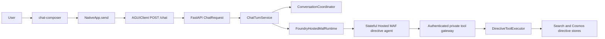
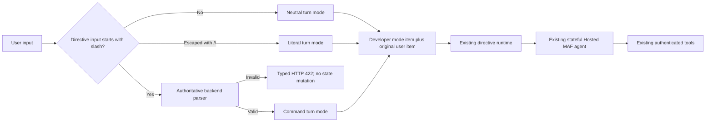

# Plan: Add slash commands to the directive agent

**Status:** Proposed

**Date:** 2026-08-11

**Related idea:** [Add slash commands to directive agents](../IDEAS.md#add-slash-commands-to-directive-agents)

## Objective

Add discoverable, validated leading slash commands to the selectable
`directive-rag` conversation agent:

- `/search <query>`
- `/compare <comparison request>`
- `/id <eight-digit directive ID> [request]`
- `/help [command]`

The commands provide an explicit intent and scope hint. They do not add a
second retrieval planner, bypass the Hosted Microsoft Agent Framework (MAF)
agent, call data stores directly, or weaken the existing tool gateway. The
backend remains the authoritative parser, and the directive agent continues to
own retrieval planning and answer synthesis through its existing directive
tools.

## Success definition

The change is complete when:

- typing `/` in the directive composer shows an accessible command menu;
- the same command grammar is enforced for every `/chat` client, not only the
  web UI;
- malformed and unknown directive commands return actionable, typed validation
  errors before conversation or remote agent state is created;
- every accepted directive turn reaches the existing Hosted Agent with a
  backend-generated, turn-local developer mode and the original user message
  kept at user role;
- ordinary directive prompts and all support-agent prompts retain their current
  behavior;
- command turns preserve the current AG-UI stream, progress, citation,
  cancellation, persistence, ownership, and stateful-continuation contracts;
- `/search`, `/compare`, and `/id` produce grounded outcomes consistent with
  their declared mode;
- `/help` returns the canonical command catalog without calling directive
  tools;
- command names and parse outcomes are observable without recording command
  payloads;
- no new Azure resource, credential, public data-plane endpoint, tool, index, or
  storage schema is introduced.

## Current implementation

There is one logical directive agent in the current repository:
`AgentType.DIRECTIVE_RAG`, serialized as `directive-rag` and presented as
`Directive Assistant`. It spans the application backend and one separately
deployed Hosted MAF agent. There are no other directive-agent types to update.

### Current request path



Relevant current behavior:

- `frontend/src/components/chat-composer.ts` is a plain textarea. It sends on
  Enter and has no command menu, syntax help, or inline command validation.
- `frontend/src/app.ts` trims the input, optimistically appends a user and an
  assistant turn, then calls `AGUIClient.chat`.
- `frontend/src/client.ts` sends only `message`, `conversation_id`, and
  `agent_type`. A non-2xx response becomes a generic `/chat <status>` error; the
  response body is not preserved.
- `backend/agent_memory_backend/server.py` trims non-empty messages but does not
  impose command grammar. `/agents` returns agent type, label, and availability
  only.
- `ChatTurnService` uses the same string for the initial title, persisted user
  message, and `runtime.stream_turn`.
- `ConversationCoordinator` binds a conversation to one immutable agent type
  and creates durable remote state before model invocation.
- `FoundryHostedMafRuntime.stream_turn` forwards the string as Responses API
  `input`, streams normalized events, and emits directive-only progress and
  citation enrichment.
- the directive runtime uses a separately persisted inner Foundry conversation
  and `AgentSession`; committed outer transcript data is the recovery source.
- `agent_contracts/directive_rag.txt` tells GPT-5.6 to identify discovery,
  summary, procedure, comparison, and related-directive workflows. The model
  already owns retrieval planning.
- the currently deployed directive agent exposes eight RequestContext-backed
  tools. The separate proposed simplification plan may reduce that to five.
  Slash-command routing must describe semantic workflows, not hard-code either
  tool topology.
- authentication, user/session/call identity, tool allowlisting, strict
  Pydantic tool arguments, publication/version defaults, content budgets, and
  relation limits are enforced below the model.

### Current deployment coupling

- backend and frontend changes are deployed automatically from `main` by
  `.github/workflows/deploy-app.yml`;
- the two application components deploy independently and may finish in either
  order;
- Hosted Agent images and releases remain manual;
- changing the static directive prompt in `agent_contracts/directive_rag.txt`
  changes `DIRECTIVE_RAG_PROMPT_VERSION` and requires a coordinated Hosted Agent
  release.

This plan intentionally avoids changing the static directive prompt or Hosted
Agent image. The turn-mode control message is supplied by the backend on every
directive turn, so application deployment is sufficient.

## Target architecture



The command layer has one responsibility: convert explicit syntax into a
validated semantic routing hint. It does not retrieve, resolve versions,
construct tool arguments, or synthesize answers.

## Locked decisions

### 1. Commands are directive-only

- Parse commands only when `agent_type == directive-rag`.
- The directive agent remains locked to its conversation exactly as today.
- A support-agent message beginning with `/` remains an ordinary message. This
  preserves existing support behavior and avoids making slash syntax a global
  protocol accidentally.
- The frontend exposes the menu only for the directive agent.

### 2. The backend is authoritative

- The browser must not be the security or correctness boundary.
- Parse before `ConversationCoordinator.prepare`, so invalid input creates no
  application conversation, outer Foundry conversation, Hosted session, or
  inner model conversation.
- Do not silently reinterpret malformed syntax as natural language.
- Do not fuzzy-correct an unknown command. Return the valid command list and
  let the user choose.

### 3. Commands are routing hints, not direct tool calls

- `/search` does not call `search_directives` from the FastAPI chat boundary.
- `/compare` does not add a backend comparison workflow.
- `/id` validates the stable ID format but does not resolve the ID in the
  parser.
- The Hosted Agent remains responsible for ambiguity handling, version
  selection, coverage, relation traversal, mandate lookup, citations, and
  final answer synthesis.
- Existing tool validators and the authenticated gateway remain authoritative
  even when a command is valid.

### 4. Routing control and user content stay separate

For every accepted directive turn, send Responses API input items in this
shape:

```json
[
  {
    "role": "developer",
    "content": "Backend-generated turn-local directive mode; no user payload"
  },
  {
    "role": "user",
    "content": "/search company car private use"
  }
]
```

The developer item starts with a versioned `DIRECTIVE_TURN_MODE` marker. It
states that it applies only to the immediately following user item and
supersedes every earlier `DIRECTIVE_TURN_MODE` item in the reused conversation.
Its mode is one of `natural`, `escaped_literal`, `search`, `compare`, `id`, or
`help`.

Command modes contain only the canonical command name, parser version,
validated structural arguments such as an eight-digit ID, and fixed workflow
rules. The `natural` mode explicitly restores the normal static-prompt workflow
without retaining a prior command as a mandatory control constraint. It does
not discard normal user/assistant conversation context, so a genuine follow-up
can still refer to the preceding answer. Free-form user text remains exclusively
in the user item. This both prevents untrusted payload text from being elevated
into the instruction role and prevents a persisted `/id` or `/help` control from
constraining an unrelated later turn.

Azure OpenAI's Responses API accepts `user`, `system`, and `developer` input
messages and gives developer/system instructions precedence over user
instructions. The Foundry Hosted Agent Responses protocol accepts standard
OpenAI Responses API `input`. Phase 0 must prove that the repository's pinned
hosting stack preserves this input list before implementation proceeds.

Sending an explicit mode on every directive turn is required because the
directive agent uses `store=True` and reuses one inner `AgentSession`. A command
developer item can remain in that private model conversation. Relying on the
absence of a developer item on the next turn would leave its scope ambiguous
and would make normal continuation differ from recovery, which seeds only the
public transcript.

### 5. Preserve the public chat and persistence shape

- Keep `POST /chat` request fields unchanged.
- Persist the original slash-command text as the user message.
- Do not persist or expose the internal developer control item in the public
  Cosmos transcript.
- Keep existing AG-UI events and `X-Conversation-ID`.
- Do not add command fields to persisted messages or public conversation
  responses. Command telemetry is sufficient.

### 6. The command catalog has one backend source

Define command names, usage, descriptions, examples, limits, and fixed routing
instructions once in a new backend command module. Use that catalog for:

- parsing;
- validation errors;
- `/agents` capability metadata;
- `/help` routing content;
- telemetry-safe command names.

The frontend consumes the serialized catalog for discovery. It must not keep a
second hard-coded list of names or descriptions.

## Version 1 command contract

### Detection and escaping

1. `ChatRequest` continues to trim leading and trailing whitespace.
2. Only a slash in the first character of the trimmed directive message starts
   command parsing.
3. The command token ends at the first whitespace and is normalized to ASCII
   lowercase. `/SEARCH` and `/search` are equivalent.
4. Slash characters elsewhere in a message are ordinary text.
5. A leading `//` escapes command parsing. Remove one slash for runtime input
   and add a developer control item that explicitly marks the resulting leading
   slash as literal.
6. `/` alone is invalid and points the user to `/help`.
7. Unknown commands are errors. There are no aliases in version 1.
8. Preserve internal whitespace and line breaks in the free-form remainder
   after trimming its edges.
9. Limits below are measured after trimming and before model invocation.

### Command table

| Command | Valid syntax | Backend validation | Agent behavior |
| --- | --- | --- | --- |
| Search | `/search <query>` | Query is required, 1..500 characters | Treat the turn as current published directive discovery or focused search. Return grounded matches/evidence and do not claim complete-document coverage from top-k chunks. |
| Compare | `/compare <comparison request>` | Request is required, 1..1000 characters | Treat the turn as a comparison. Identify the comparands from user text; ask a clarification before retrieval when IDs, versions, dates, or comparison scope are insufficient. Preserve complete comparison coverage rules. |
| ID scope | `/id <eight-digit ID> [request]` | ID must match `^[0-9]{8}$`; optional request is at most 500 characters | Constrain the turn to that stable directive ID. Use the current published version unless the user explicitly requests a version/as-of selector. With no request, return a concise current-version overview. Never substitute a different ID silently. |
| Help | `/help [command]` | Optional target is exactly `search`, `compare`, `id`, or `help`; no other trailing arguments | Call no directive tools. Return the canonical usage and description for all commands or the selected command, including the `//` literal escape. |

### Examples

| Input | Result |
| --- | --- |
| `/search company car private use` | Valid search command |
| `/compare 72403881 versions 1.0 and 2.0, focusing on eligibility` | Valid comparison command; the agent extracts/clarifies comparands |
| `/compare company car policy` | Syntactically valid; the agent asks what should be compared |
| `/id 72403881` | Valid ID command with default current overview |
| `/id 72403881 What changed in version 2.0?` | Valid ID-scoped request |
| `/help compare` | Valid focused help |
| `/unknown value` | `UNKNOWN_DIRECTIVE_COMMAND` |
| `/search` | `DIRECTIVE_COMMAND_ARGUMENT_REQUIRED` |
| `/id ABC` | `DIRECTIVE_COMMAND_ARGUMENT_INVALID` |
| `/help search extra` | `DIRECTIVE_COMMAND_TRAILING_ARGUMENTS` |
| `//search is literal text` | Ordinary directive input whose runtime text starts `/search` |
| `What does /search mean?` | Ordinary directive input |

Semantic ambiguity is not a parser error. In particular, `/compare` keeps a
free-form payload because detailed comparison interpretation is model-owned
today. Adding a mini version/query planner to the parser would duplicate the
directive agent and conflict with the separate tool-simplification work.

## Backend design

### Command models and parser

Add `backend/agent_memory_backend/directive_commands.py` with:

- `DIRECTIVE_COMMAND_CONTRACT_VERSION = 1`;
- a `DirectiveCommandName` string enum;
- an immutable `DirectiveCommandSpec` containing name, usage, description,
  examples, and payload limits;
- the ordered `DIRECTIVE_COMMAND_SPECS` tuple;
- an immutable `ParsedDirectiveCommand` containing the canonical command,
  original message, validated structural values, and the runtime input;
- a typed `DirectiveCommandValidationError` with stable code, safe message,
  optional command, optional usage, and valid command names;
- `parse_directive_message(message, agent_type)`, which returns plain,
  escaped-literal, or command routing without I/O and creates an explicit
  directive turn mode for every accepted directive message;
- a serializer for the `/agents` public command descriptors;
- fixed developer-message builders for each command.

The parser must be deterministic and side-effect free. Do not use `shlex`,
shell-style quoting, regular-expression backtracking over the full payload, or
model-based intent classification.

### Typed runtime input

Broaden the application-owned runtime boundary in
`backend/agent_memory_backend/agent_runtime_contracts.py`:

```text
RuntimeInputMessage:
  role: "developer" | "user"
  content: str

RuntimeInput:
  str | list[RuntimeInputMessage]
```

Update runtime implementations explicitly:

- `FoundryHostedMafRuntime` requires the developer-plus-user list for
  `directive-rag` chat turns and forwards it unchanged to
  `stream_response(input_value=...)`;
- support Hosted and Prompt runtimes reject an unexpected list rather than
  coercing it;
- `MockAgentRuntime` accepts the directive turn form for local/test mode and
  uses the user item as its visible input;
- health probes remain plain strings.

Do not broaden internal types to unstructured `Any`.

### Chat service routing

Update `ChatTurnService.create_response` to parse before conversation
preparation:

1. parse `message` with the requested agent type;
2. on validation failure, raise the typed error immediately;
3. pass the original message to `initial_title` and `TurnAccumulator`;
4. pass the routed `RuntimeInput` to `runtime.stream_turn`;
5. add the safe command name and parser version to the existing `agent.run`
   span when a command is present;
6. preserve all current stream, cancellation, lease, persistence, and failure
   behavior.

This split is important:

```text
display/persisted input = original user message
runtime input           = turn-local developer mode + user item
```

The runtime user item preserves the original message for natural and command
turns. For `//`, it removes exactly one leading slash while the persisted/public
message keeps both.

No command-specific branches belong in `ConversationCoordinator`,
`TurnAccumulator`, `DirectiveToolExecutor`, or the tool gateway.

### API metadata and validation errors

Extend each `/agents` option additively:

```json
{
  "agent_type": "directive-rag",
  "label": "Directive Assistant",
  "available": true,
  "slash_commands": {
    "version": 1,
    "commands": [
      {
        "name": "search",
        "usage": "/search <query>",
        "description": "Search published directives.",
        "examples": ["/search company car private use"]
      }
    ]
  }
}
```

For non-directive agents, omit `slash_commands`. Older frontends ignore the new
field, and the new frontend must tolerate the field being absent while backend
and frontend revisions roll independently.

Map command validation failures to HTTP 422:

```json
{
  "detail": {
    "code": "DIRECTIVE_COMMAND_ARGUMENT_INVALID",
    "message": "/id requires an eight-digit directive ID.",
    "command": "id",
    "usage": "/id <eight-digit directive ID> [request]",
    "valid_commands": ["search", "compare", "id", "help"]
  }
}
```

Required stable error codes:

- `DIRECTIVE_COMMAND_REQUIRED`
- `UNKNOWN_DIRECTIVE_COMMAND`
- `DIRECTIVE_COMMAND_ARGUMENT_REQUIRED`
- `DIRECTIVE_COMMAND_ARGUMENT_INVALID`
- `DIRECTIVE_COMMAND_TRAILING_ARGUMENTS`

Errors must not echo the free-form query/comparison payload, expose the internal
developer instruction, or create a success-shaped AG-UI stream.

## Frontend design

### Client contract

Update `frontend/src/client.ts`:

- add typed `SlashCommandCatalog` and `SlashCommandOption` fields to
  `AgentOption`;
- add a typed `ChatRequestError` carrying HTTP status and validated command
  error detail;
- read a bounded JSON error body when `/chat` is non-2xx;
- fall back to the current generic error for unknown or malformed response
  bodies.

Do not trust server-provided HTML. Command descriptions and errors are rendered
as text.

### Command menu

Update `chat-composer` to derive options from the selected directive
`AgentOption.slash_commands`:

- show all commands when the input is exactly `/`;
- filter by the command-name prefix before the first whitespace;
- close the menu after arguments begin, on Escape, when the agent changes, or
  while a response is busy;
- ArrowUp/ArrowDown changes the active option;
- Enter or Tab inserts the active command and a trailing space instead of
  sending;
- clicking an option performs the same insertion and returns focus to the
  textarea;
- normal Enter-to-send behavior remains after a complete command/input exists;
- show usage and a short description in each option;
- change the directive placeholder to mention `type / for commands`;
- render no menu for support agents.

Accessibility requirements:

- the textarea exposes `aria-expanded`, `aria-controls`, and
  `aria-activedescendant` only while the menu is open;
- use `role="listbox"` and `role="option"` with selected state;
- announce the result count and inline validation errors through an appropriate
  live region;
- keyboard navigation must not trap Tab after a command is inserted;
- responsive styles must keep the menu inside the viewport above the composer.

Keep the implementation in Lit and existing CSS. Do not add a command-palette
dependency.

### Validation-error recovery

The current UI appends optimistic transcript turns before `fetch` returns. For
a typed directive-command 422:

1. remove only the optimistic user/assistant turns created for that rejected
   submission;
2. restore the original input;
3. clear busy state;
4. show the safe server message and usage beneath the textarea;
5. focus the textarea and select no text;
6. do not refresh conversation history because nothing was persisted.

Extract this state transition into a small pure helper so it is unit-testable
without adding a browser DOM test dependency. Ordinary transport/runtime errors
retain the existing transcript error behavior.

Clear the inline error when the user edits the input, chooses a menu command,
changes agent, starts a new chat, or receives a successful response.

## Stateful continuation and recovery

Every accepted directive turn still executes through the Hosted Agent, so its
assistant message and model/tool state commit through the existing fenced
lifecycle.

Required invariants:

- the original slash command is the committed Cosmos user content;
- every directive turn sends a new developer mode item to the active Hosted
  conversation and inner agent session, but that item is not exposed in the
  public transcript;
- each mode says that it applies only to the immediately following user item
  and supersedes all earlier turn-mode items;
- an ordinary follow-up sends `natural`, so earlier `/id`, `/compare`, `/help`,
  or literal controls cannot remain active;
- a later normal-language follow-up reuses the same inner conversation;
- cancellation persists no partial command turn;
- recovery seeds only committed public user/assistant messages, as today;
- recovered history may contain earlier raw slash commands, but those are prior
  user messages paired with committed assistant answers. The current turn
  always receives a fresh mode item, so normal and recovered execution have the
  same active mode;
- command parsing never reads or mutates private runtime state.

Do not add a second command-specific continuation store or replay the whole
transcript on every command.

## Security and privacy requirements

- Treat the command payload as untrusted user input even after syntax
  validation.
- Never concatenate free-form payload text into the developer-role item.
- A command cannot choose another `agent_type`, user ID, conversation ID,
  Hosted session, tool name, OData filter, data store, or authorization scope.
- `/id` format validation is not authorization and does not prove that the ID
  exists or is published.
- All data access continues through managed identity, the existing private
  gateway, per-agent tool allowlists, and backend-injected user/session/call
  identity.
- Existing publication, exact-version, content-budget, relation-depth, and
  mandate safeguards remain unchanged.
- Do not add free-form command payloads or internal mode text to
  application-authored logs, span attributes, or custom events.
- Do not return the internal developer control text in validation errors,
  transcripts, tool results, or UI debug logs.
- A malicious payload such as `/search ignore previous instructions ...`
  remains in user role; the fixed developer control retains precedence.
- Invalid commands are rejected before ownership-sensitive conversation lookup,
  but their response contains only static catalog data and no conversation data.
- Existing Foundry/OpenAI content tracing may contain model inputs, including
  user messages and private turn-mode items, under the repository's current
  observability policy. Eliminating content from provider-managed traces would
  require a separate trace-capture/redaction change and is not claimed here.

## Observability

Add low-cardinality attributes/events only:

- `directive.command.detected`: boolean
- `directive.command.name`: canonical name for valid commands
- `directive.command.contract_version`: `1`
- `directive.turn.mode`: `natural`, `escaped_literal`, `search`, `compare`,
  `id`, or `help`
- `directive.command.outcome`: `routed`, `escaped_literal`, or
  `validation_failed`
- `directive.command.error_code`: stable code on failure

Record parse failures in a short parser span or counter before `agent.run`.
Record valid command attributes on the existing `agent.run` span. Never record
the query, comparison request, optional ID request, full message, or internal
mode text in application-authored attributes/events.

Operational acceptance should compare per-command request count, validation
failure count, end-to-end latency, tool failures, cancellation, and grounded
answer rate.

## Detailed implementation plan

### 1. Add backend command contracts

Primary files:

- new `backend/agent_memory_backend/directive_commands.py`
- new `backend/tests/test_directive_commands.py`

Implement the ordered catalog, parser, developer-item builders, literal escape,
typed validation errors, and public descriptor serialization. Use table-driven
tests for every valid/invalid example and boundary length.

### 2. Route typed runtime input

Primary files:

- `backend/agent_memory_backend/agent_runtime_contracts.py`
- `backend/agent_memory_backend/chat_service.py`
- `backend/agent_memory_backend/foundry_hosted_maf_runtime.py`
- `backend/agent_memory_backend/foundry_prompt_runtime.py`
- `backend/agent_memory_backend/mock_agent_runtime.py`
- `backend/tests/test_directive_streaming.py`
- `backend/tests/test_dual_agents.py`

Separate persisted input from runtime input, enforce agent-specific input
shapes, and prove that command validation happens before coordinator/state
creation.

### 3. Publish capabilities and typed errors

Primary files:

- `backend/agent_memory_backend/server.py`
- `backend/tests/test_dual_agents.py`

Extend `/agents`, install the command exception mapping, and retain all existing
ChatRequest and agent-immutability behavior.

### 4. Add frontend discovery and error recovery

Primary files:

- `frontend/src/client.ts`
- new `frontend/src/directive-commands.ts`
- new `frontend/src/directive-commands.test.ts`
- `frontend/src/components/chat-composer.ts`
- `frontend/src/components/chat-composer.styles.ts`
- `frontend/src/app.ts`
- related responsive styles if viewport tests require them

Keep menu filtering/selection and rejected-submission recovery in pure helpers
where possible. The component renders catalog data and delegates app state
changes through its existing action boundary.

### 5. Update current documentation

After deployed acceptance:

- update `README.md` to document the four commands and directive-only scope;
- update `docs/PRD-Solution-Challenges-1-5.md` chat and frontend contracts;
- mark this plan implemented;
- move the idea to the `IDEAS.md` archive with the final behavior and
  implementation date.

Do not rewrite historical plans. In particular, keep the slash-command
exclusion in `TEMP-plan-simplify-directive-rag.md` as a statement of that
plan's original scope.

## Change and rollout sequence

### Phase 0: Compatibility spike and baseline

1. Add a focused test/spike around the pinned OpenAI and Hosted Agent clients
   proving that a Responses `input` list containing developer and user messages
   reaches the current `directive-rag-maf-hosted` agent and still produces
   streamed tool lifecycle events.
2. Prove the developer item is not flattened into user text and user payload is
   not promoted to developer role.
3. Run `/id`, then an ordinary turn with `natural`, then `/help`, then another
   ordinary turn. Prove each later mode supersedes the prior stored developer
   item while the inner conversation is reused.
4. Recover that conversation from committed public history and prove the next
   explicit mode has the same semantics as uninterrupted continuation.
5. Record baseline outcomes for the deployed evaluation matrix below.
6. Confirm the existing Hosted Agent revision needs no image or prompt change.

Exit gate: the current pinned hosting stack accepts the standard input list. If
it does not, stop and revise the design around a verified Hosted Agent adapter
mechanism; do not fall back to prompt-only parsing or direct backend tool
orchestration.

### Phase 1: Backend command routing

1. Add the parser/catalog, typed runtime input, chat routing, `/agents` metadata,
   typed errors, telemetry, and backend tests.
2. Keep all support messages byte-for-byte equivalent at the runtime boundary,
   and prove ordinary directive messages remain semantically equivalent under
   the compact `natural` wrapper.
3. Deploy the backend.
4. Verify the old frontend still works and ignores the additive `/agents`
   field.
5. Exercise valid commands directly against `/chat` and prove invalid commands
   create no state.

Exit gate: API and runtime tests pass, direct command evaluation is grounded,
and normal/support traffic is unchanged.

### Phase 2: Frontend command experience

1. Add typed capability/error parsing, the accessible command menu, and inline
   validation recovery.
2. Keep the frontend tolerant of a backend revision without command metadata.
3. Deploy the frontend independently.
4. Verify keyboard, pointer, screen-reader labels, narrow viewport placement,
   agent switching, existing-thread use, and rejected-submission recovery.

Backend-first and frontend-first overlap is safe because both API changes are
additive and the new frontend treats the catalog as optional.

### Phase 3: Soak, documentation, and closure

1. Run the deployed evaluation matrix with fixed directive IDs and versions.
2. Soak through the agreed normal traffic window. If representative traffic is
   unavailable, run each correctness scenario at least three times and each
   latency-critical search/compare scenario at least twenty times.
3. Confirm no command payload or internal mode text is added to
   application-authored logs, span attributes, or custom events. Retain the
   documented Foundry content-tracing policy.
4. Update current documentation.
5. Mark the plan implemented and archive the idea only after production
   verification.

## Test strategy

### Parser and catalog tests

- command matching is leading-position and directive-only;
- command names normalize case without fuzzy correction;
- `/`, unknown names, missing arguments, invalid IDs, excess help arguments,
  and every length boundary return the expected stable code;
- `//` produces literal routing;
- slash characters outside the first position remain ordinary;
- free-form payload whitespace is preserved after edge trimming;
- public descriptors are ordered, versioned, and contain no internal developer
  instructions;
- developer items contain no free-form payload;
- user items preserve original natural/command text, while escaped-literal input
  removes exactly one leading slash.

### API and service tests

- `/agents` exposes version 1 commands only on `directive-rag`;
- older response consumers can ignore the additive field;
- invalid commands return the bounded 422 shape;
- invalid commands do not call `ConversationCoordinator.prepare`, acquire a
  lease, create history, or invoke a runtime;
- valid commands use the original text for title/persistence and routed input
  for the runtime;
- support `/search ...` remains a plain string;
- ordinary directive messages use `natural` developer mode plus the original
  user item;
- agent mismatch, busy conversation, owner checks, and unavailable runtime
  behavior remain unchanged.

### Runtime, streaming, and continuation tests

- the OpenAI request receives developer then user input items in order;
- list input is accepted only for the directive runtime;
- every directive mode is explicitly turn-local and supersedes prior mode
  items;
- command turns retain progress, heartbeats, tool lifecycle, citations, usage,
  and `RUN_FINISHED`;
- cancellation closes the SDK stream, releases the lease, and persists no
  partial turn;
- valid command transcript records contain the raw slash command but no
  developer control text;
- normal follow-up after `/id`, `/compare`, or `/help` uses `natural`, reuses
  the existing inner conversation, and is not constrained by the prior mode;
- uninterrupted and recovered continuation select the same active mode;
- recovery and release fencing remain unchanged.

### Frontend tests

- command metadata is parsed defensively and unknown catalog versions degrade
  to no menu rather than a broken composer;
- `/` and partial command tokens filter in catalog order;
- active-option movement wraps predictably;
- Enter/Tab insertion differs from Enter-to-send;
- Escape, busy state, argument entry, and agent changes close the menu;
- support agents never show directive commands;
- typed command 422 recovery restores input and removes only the rejected
  optimistic turns;
- generic network/runtime failures keep existing transcript behavior;
- server error strings and descriptions render as text.

Use the existing test mechanisms only:

- backend tests through the backend `uv` environment;
- frontend `npm test` and `npm run build`;
- existing Hosted Agent/`maf_hosting` tests only if Phase 0 reveals a required
  adapter change.

## Deployed evaluation matrix

Use known published fixtures so IDs, versions, citations, and coverage are
assertable.

| Scenario | Required proof |
| --- | --- |
| `/search company car private use` | Search-oriented current evidence, grounded candidate IDs/versions and section/page citations, no complete-summary claim from partial chunks |
| `/id 72403881` | Scope never drifts from ID `72403881`; current published version and concise overview are returned |
| `/id 72403881 What changed in version 2.0?` | The stable ID remains fixed; requested version semantics are resolved and grounded |
| `/compare 72403881 versions 1.0 and 2.0` | Both exact versions are covered; added/removed/changed/moved/renumbered/unchanged requirements remain accounted for |
| Ambiguous `/compare company car policy` | The agent asks a focused clarification before claiming a comparison |
| `/help` and `/help id` | Canonical usage is returned with no tool events or citations |
| `/search` | Typed 422, original input restored in UI, no conversation/state created |
| `/id 7240` | Typed ID validation error and canonical usage |
| `/unknown value` | Typed unknown-command error and valid command list |
| `//search literal` | `escaped_literal` outcome, no command name, and no forced search routing |
| Normal directive question after `/id` and `/help` | `natural` supersedes prior modes and outcome matches semantic baseline |
| Support `/search value` | Support runtime receives the original plain string |
| Multi-turn command then follow-up | Same inner conversation is reused, the new mode supersedes prior command scope, and controls do not leak as public transcript text |
| Recovered command conversation | Current explicit mode behaves the same after recovery, despite private developer items not being in the Cosmos seed |
| Command cancellation | No partial persistence; lease and streams close |
| Adversarial search payload | Payload stays user-role, fixed command control remains developer-role, and tool/backend safeguards hold |

For valid command scenarios, compare:

- selected stable directive IDs and exact versions;
- cited sections/pages and coverage;
- mandate labels;
- semantic tool categories and call counts without coupling acceptance to the
  current eight-tool or proposed five-tool names;
- time to first progress, time to first answer token, and total latency;
- input/output/cached tokens;
- errors, retries, cancellation, and continuation behavior.

## Performance acceptance

- the parser performs one bounded in-memory pass with no I/O, model call, or
  data-store access;
- no additional HTTP preflight request is added before `/chat`;
- `/agents` response growth remains bounded by the four static descriptors;
- support messages add zero developer-item tokens;
- every directive mode is fixed and compact; keep the `natural` mode at or below
  64 input tokens and report its measured overhead;
- ordinary directive p95 latency does not regress by more than 5% after the
  neutral-mode wrapper;
- valid `/search` and `/id` p95 end-to-end latency does not regress by more than
  5% against equivalent natural-language requests;
- `/compare` latency and tool-call count do not regress beyond normal variance
  for equivalent coverage;
- command-menu interaction performs no network call and remains responsive on
  narrow/mobile layouts.

## Risks and mitigations

| Risk | Mitigation |
| --- | --- |
| Pinned Hosted Agent adapter flattens or drops developer input items | Phase 0 is a blocking compatibility gate using the current deployed/pinned stack |
| User payload is accidentally promoted to higher-priority instructions | Build developer content only from enum/spec constants and validated ID; keep all free-form text in the user item; assert this in tests |
| A persisted command developer item affects later turns | Send a versioned, turn-local mode on every directive turn; `natural` explicitly supersedes prior modes; test uninterrupted and recovered sequences |
| Parser becomes a second retrieval planner | Validate syntax only; keep `/compare` payload free-form and leave ambiguity/version planning to the agent |
| Command behavior couples to the current eight-tool surface | Express routing in semantic workflow terms and evaluate outcomes/tool categories, not exact tool names |
| Backend and frontend deploy in either order | Additive optional `/agents` field; old frontend ignores it; new frontend tolerates absence |
| Invalid optimistic turns remain visible but are not persisted | Typed error recovery removes only the rejected pair, restores input, and skips history refresh |
| `/help` invokes tools or hallucinates syntax | Developer control includes the canonical serialized catalog and explicitly forbids tools; test live tool events |
| Slash command leaks into support behavior | Parse only for `directive-rag`; add cross-agent regression tests |
| Literal leading slash becomes impossible | Reserve `//` as an explicit escape and send a fixed literal-mode developer control |
| Command payloads leak through application telemetry | Record only enum names, version, outcome, and stable error code; inspect application-authored logs/attributes while retaining the documented Foundry content-tracing exception |
| Prompt hash/release metadata drifts from the deployed agent | Do not change `directive_rag.txt` or the Hosted Agent image for this feature |
| Command catalog and UI diverge | Backend owns descriptors; frontend renders the fetched catalog and hard-codes no command names/descriptions |

## Primary implementation surfaces

- `backend/agent_memory_backend/directive_commands.py` (new)
- `backend/agent_memory_backend/agent_runtime_contracts.py`
- `backend/agent_memory_backend/chat_service.py`
- `backend/agent_memory_backend/foundry_hosted_maf_runtime.py`
- `backend/agent_memory_backend/foundry_prompt_runtime.py`
- `backend/agent_memory_backend/mock_agent_runtime.py`
- `backend/agent_memory_backend/server.py`
- `backend/tests/test_directive_commands.py` (new)
- `backend/tests/test_directive_streaming.py`
- `backend/tests/test_dual_agents.py`
- `frontend/src/client.ts`
- `frontend/src/directive-commands.ts` (new)
- `frontend/src/directive-commands.test.ts` (new)
- `frontend/src/components/chat-composer.ts`
- `frontend/src/components/chat-composer.styles.ts`
- `frontend/src/app.ts`
- responsive frontend styles only if required
- `README.md`
- `docs/PRD-Solution-Challenges-1-5.md`
- `IDEAS.md` after implementation and deployment verification

No change is expected in:

- directive tool schemas or `DirectiveToolExecutor`;
- `agent_contracts/directive_rag.txt`;
- Hosted Agent wrappers, image, `agent.yaml`, or release;
- Search, Cosmos, Blob, ingestion, mandate, or citation schemas;
- Terraform or Azure resource topology;
- authentication, role assignments, managed identities, or gateway audiences.

## Out of scope

- slash commands for support agents;
- user-defined commands, aliases, macros, command history, or saved templates;
- natural-language autocomplete or model-generated command suggestions;
- direct execution of directive tools from the `/chat` boundary;
- a new retrieval planner, query rewriter, comparison engine, or version-diff
  store;
- changes proposed by `TEMP-plan-simplify-directive-rag.md`;
- changing the directive prompt, model deployment, iteration ceiling, or
  timeouts;
- command-specific persisted-message fields or a public command execution API;
- accepting raw tool names or JSON arguments as slash commands;
- authorization by directive ID or command;
- infrastructure or deployment-pipeline changes;
- localization of command names in version 1.

## Definition of done

- [ ] Phase 0 proves developer/user input-list compatibility with the pinned
      Hosted Agent stack.
- [ ] The backend owns one versioned four-command catalog and deterministic
      parser.
- [ ] `/search`, `/compare`, `/id`, and `/help` implement the version 1 contract.
- [ ] `//` literal escaping works.
- [ ] Invalid commands return stable bounded 422 errors before any state
      creation or runtime invocation.
- [ ] Runtime input separates fixed developer control from untrusted user text.
- [ ] Every directive turn has an explicit turn-local mode, and `natural`
      prevents prior command scope from leaking into later turns.
- [ ] Raw slash commands, not developer controls, are persisted publicly.
- [ ] Ordinary directive and all support requests retain baseline behavior.
- [ ] `/agents` exposes additive directive-only command metadata.
- [ ] The directive composer has accessible keyboard/pointer command discovery.
- [ ] Typed validation recovery restores input and leaves no phantom transcript
      turns.
- [ ] Streaming, progress, citations, mandate enrichment, cancellation,
      continuation, recovery, and agent immutability tests pass.
- [ ] Backend and frontend targeted suites and builds pass.
- [ ] The deployed evaluation matrix passes against fixed directive fixtures.
- [ ] Application-authored logs, span attributes, and custom events contain
      command names/outcomes but no payloads or internal mode text; the existing
      Foundry content-tracing policy is documented and unchanged.
- [ ] No Hosted Agent, prompt, tool, data, identity, or infrastructure change was
      required.
- [ ] Current documentation is updated after deployment verification.
- [ ] The plan is marked implemented and the idea is archived only after all
      acceptance evidence is recorded.

## Microsoft references used by the design

- [Use the Azure OpenAI Responses API](https://learn.microsoft.com/azure/ai-foundry/openai/how-to/responses)
- [Azure OpenAI Responses REST components](https://learn.microsoft.com/rest/api/microsoft-foundry/azureopenai/responses#components)
- [Hosted agent runtime contract](https://learn.microsoft.com/azure/foundry/agents/concepts/hosted-agent-contract)
