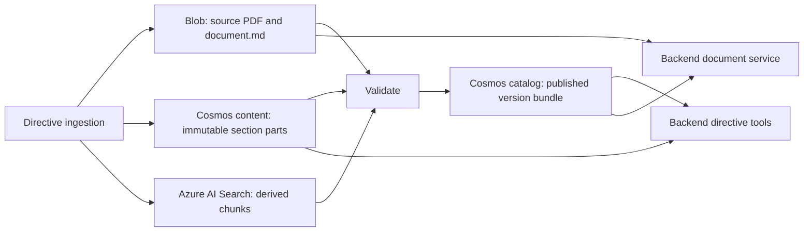

# Plan: Cosmos-authoritative directive content

**Status:** Implemented

**Date:** 2026-07-25

**Related idea:** [Consolidate directive content authority in Cosmos](../IDEAS.md#consolidate-directive-content-authority-in-cosmos)

**Implementation note:** The final state was implemented as a destructive cutover.
Legacy records are not migrated or read through compatibility fallbacks; directive
versions must be republished.

## Objective

Make Cosmos DB the single runtime authority for exact-version directive
manifests, precomputed summaries, and section content. Keep the complete
canonical Markdown and source PDF in private Blob Storage.

The change must reduce runtime reads without changing the agent tools, public
document APIs, directive/version semantics, citations, content budgets, source
bytes, or Search behavior.

## Locked decisions

- The published catalog version item is the exact-version bundle. It contains
  the existing flattened version metadata plus the manifest, summary, artifact
  generation ID, and private Blob artifact locators.
- The bundle keeps the existing deterministic item ID
  `version:{directive_version_id}` and catalog partition key `directive_id`.
- One Cosmos point read of that bundle must satisfy an exact-version manifest or
  summary request and supply the Blob locator for complete Markdown or PDF
  access.
- Section text is stored as immutable, generation-scoped items in a new
  `directive_content` Cosmos container.
- The content container is partitioned by `/directive_version_id`. This keeps
  every selected section for one exact version in one logical partition without
  accumulating every version of a directive under `/directive_id`.
- Section text is excluded from Cosmos indexing. Section reads use item ID plus
  partition key; Azure AI Search remains the searchable projection.
- A section is normally one Cosmos item. A section that would exceed the
  application item-size ceiling is split into deterministic ordered parts and
  reconstructed byte-for-byte at runtime.
- Blob Storage retains only the immutable source PDF, complete canonical
  Markdown, quarantine artifacts, and operationally required migration backups.
  New section, manifest, and summary blobs stop after cutover.
- Search chunks remain derived data. Their schema, embeddings, ranking,
  publication filters, and citation metadata are outside this change.
- The backend and ingestion job continue using managed identity through the
  existing private network. No keys, SAS tokens, public endpoints, or direct
  Hosted Agent data-plane access are introduced.
- Migration compatibility is temporary. The final implementation has one
  Cosmos path for manifest, summary, and section content and no permanent
  storage-mode switch.

## Target read contract

The counts below apply when the caller supplies an exact stable directive ID and
exact directive version ID.

| Operation | Catalog reads | Content reads | Blob reads |
| --- | ---: | ---: | ---: |
| Exact-version manifest | 1 point read | 0 | 0 |
| Exact-version summary | 1 point read | 0 | 0 |
| Selected section content | 1 point read | One point read per selected section part | 0 |
| Complete canonical Markdown | 1 point read | 0 | 1 complete text download |
| Source PDF | 1 point read | 0 | 1 streamed download |

Current-version, version-label, and as-of-date resolution can still require a
pointer read or partition-scoped version query before the exact-version path.
That resolution behavior is not changed by this plan.

## Current state and reason for change

Ingestion currently writes five artifact classes to Blob Storage:

1. Source PDF.
2. Complete canonical Markdown.
3. One Markdown blob per section.
4. Summary JSON.
5. Manifest JSON.

It also writes complete manifest and summary payloads to separate Cosmos items.
Runtime then reads:

- manifests from Cosmos;
- summaries from Blob;
- sections from Blob;
- complete Markdown and PDFs from Blob.

The current backend exact-version helper first reads the version item, then
`get_manifest()` reads the same version item again and finally reads the
manifest item. Manifest, summary, complete Markdown, PDF, and section operations
therefore perform more catalog reads than their contracts require.

The current manifest and summary Cosmos IDs include the source hash but not the
processing/artifact-generation hash. Reprocessing the same source with a
changed processing configuration or nondeterministic summary can overwrite
those Cosmos items before the new artifact generation is fully published. The
target bundle removes that independently visible staged state.

## Target architecture



The catalog bundle is the visibility boundary. Blob artifacts and section items
can exist before publication, but runtime code must not discover or read them
unless a published version bundle references their generation.

## Data contracts

### 1. Published version bundle

Keep the current catalog container, item ID, and partition key. Add an explicit
artifact schema version and embed the runtime payloads:

```json
{
  "id": "version:30336958:v1",
  "type": "version",
  "artifact_schema_version": "2.0",
  "directive_id": "30336958",
  "directive_version_id": "30336958:v1",
  "source_hash": "...",
  "processing_hash": "...",
  "artifact_generation_id": "...",
  "publication_state": "published",
  "manifest": {},
  "summary": {},
  "artifacts": {
    "canonical_blob_name": ".../generations/.../document.md",
    "source_blob_name": ".../source.pdf"
  },
  "section_content": {
    "s0001-purpose": {
      "part_count": 1
    }
  }
}
```

The existing `DirectiveMetadata` fields remain flattened at the top level so
version listing, current resolution, relation traversal, and
`public_version()` retain their current behavior.

Add a strict `PublishedDirectiveVersion` contract in `directive_contracts`.
Validation must prove:

- top-level, manifest, and summary directive IDs and version IDs agree;
- source hashes agree;
- the manifest artifact generation ID equals the top-level artifact generation
  ID;
- every manifest section has exactly one section-content descriptor;
- every descriptor has a positive part count;
- Blob locators are relative catalog-owned names, never URLs;
- only `publication_state=published` records are returned at runtime.

`DirectiveMetadata.schema_version` continues to describe the metadata contract.
The new `artifact_schema_version` independently describes the manifest,
summary, content-reference, and artifact-locator layout. Do not overload or
replace the metadata schema field during this migration.

Use a fully serialized JSON size check before any external writes. Set the
application ceiling for the published bundle to 1,800,000 bytes, leaving margin
below the Cosmos 2 MB item/request limit. If the bundle exceeds the ceiling,
ingestion must fail with the measured size and directive version. It must not
silently fall back to Blob or a second Cosmos read, because either fallback
would violate the target read contract.

### 2. Manifest contract

Introduce manifest schema `2.0`.

Keep the semantic fields required by the agent:

- directive and version identity;
- source hash and artifact generation ID;
- total pages and tokens;
- ordered section metadata;
- section content hashes;
- Search chunk IDs.

Remove these Blob implementation fields from the version 2 manifest:

- `summary_blob_name`;
- `manifest_blob_name`;
- per-section `blob_name`.

Keep `canonical_blob_name` and `source_blob_name` in the private bundle
`artifacts` object rather than in the agent-facing manifest projection.

During migration, retain a separately named legacy schema model for manifest
`1.0`; do not make all old and new fields optional on one permanent model.
The temporary dual-schema bundle model may also accept top-level
`manifest_blob_name` and `summary_blob_name` solely so the previous backend
image remains deployable during the rollback window. New runtime code ignores
those fields, and Phase 5 removes them and the transitional model.

### 3. Summary contract

Keep the existing `DirectiveSummary` semantic shape. Embed its validated JSON
inside the version bundle instead of storing another live summary item and Blob
copy.

The summary tool must return the same summary, coverage calculation, citation
metadata, and typed failures as today.

### 4. Section-content items

Create one item per section unless size splitting is required:

```json
{
  "id": "section:<deterministic-sha256>",
  "type": "section_content",
  "directive_id": "30336958",
  "directive_version_id": "30336958:v1",
  "artifact_generation_id": "...",
  "section_id": "s0001-purpose",
  "section_ordinal": 0,
  "part_ordinal": 0,
  "part_count": 1,
  "part_hash": "...",
  "section_hash": "...",
  "content": "## 1. Purpose\n...",
  "run_id": "...",
  "created_at": "..."
}
```

Derive the item ID in shared contract code from artifact generation ID, section
ID, and part ordinal. Hash the composite key so arbitrary section characters
never become Cosmos item-ID syntax.

Set the maximum fully serialized section-content item size to 1,500,000 bytes.
For oversized sections:

1. Split deterministically at a newline when possible and at a Unicode-safe
   character boundary otherwise.
2. Preserve every character; concatenating parts must reproduce the original
   section exactly.
3. Store a hash for each part and the complete section hash on every part.
4. Record the part count in the version bundle.
5. Reject a prepared generation before publication if any serialized part
   still exceeds the ceiling.

The size check must measure the exact JSON serialization sent to Cosmos, not
token count or Python string length.

### 5. Current pointer

Replace the current pointer's legacy artifact fields with an explicit schema:

```json
{
  "id": "current",
  "type": "current",
  "directive_id": "30336958",
  "directive_version_id": "30336958:v1",
  "version_label": "1",
  "source_hash": "...",
  "processing_hash": "...",
  "artifact_generation_id": "...",
  "effective_from": "2025-01-01",
  "run_id": "...",
  "activated_at": "..."
}
```

The pointer identifies the active published version; it is not another
manifest, summary, content, or Blob-locator authority. Refactor
`activate_current()` so it validates the published bundle and copies only the
fields above. It must not index `manifest_blob_name` or `summary_blob_name` from
the version record. Preserve the existing no-op behavior when version, source,
processing, and artifact generation are already active.

During migration, legacy pointer fields can remain until the old backend
rollback window closes, but new runtime code must ignore them.

### 6. Content-container policy

Provision `directive_content` in the existing `directives` database:

- partition key: `/directive_version_id`;
- partition key version: `2`;
- indexing mode: consistent;
- exclude `/content/?` from indexing;
- retain indexed identity, type, generation, section, run, and timestamp fields
  for verification and controlled cleanup;
- use the existing account/database private endpoint and DNS path.

The current database-scoped app reader and ingestion contributor assignments
already cover a new container in that database. Verify those scopes in the
Terraform plan and deployment checks; do not add redundant account-wide roles.

## Publication protocol

Refactor generation publication so no staged manifest or summary can replace
the currently published generation.

For each changed directive:

1. Extract and parse the canonical directive as today.
2. Generate the summary and Search chunks as today.
3. Compute the existing artifact generation hash from processing hash,
   canonical Markdown hash, and normalized summary hash. Persist it explicitly
   as `artifact_generation_id`.
4. Build the version 2 manifest, section-content items, private artifact
   locators, and published bundle entirely in memory.
5. Validate every contract, identity, hash, part count, and serialized size
   before writing any external resource.
6. Write the immutable source PDF and complete canonical Markdown to Blob.
7. Create immutable section-content items in Cosmos. On an existing item ID,
   compare generation, part hash, section hash, and content; fail on any
   collision instead of overwriting.
8. Read back and validate every section-content item for the prepared
   generation.
9. Stage, publish, and validate the derived Search chunks using the existing
   flow.
10. Write review findings, staged run diagnostics, and relations with the
    artifact generation ID. Do not write live manifest or summary alias items.
11. Atomically upsert the single published version bundle. Use ETag conditions
    when replacing an existing exact version so concurrent ingestion runs
    cannot silently overwrite each other.
12. Point-read the bundle and compare its artifact generation ID and normalized
    payload hash with the prepared bundle.
13. Activate the current pointer and reconcile Search current/generation flags
    as today.

If Blob, section-content, or Search validation fails, the existing version
bundle remains unchanged. Newly written immutable artifacts are unreferenced
and can be removed later by generation-aware cleanup.

If catalog publication fails after Search publication, immediately run the
existing Search generation compensation/retirement path before failing the
ingestion run. The catalog bundle must never point to unvalidated Search or
content data.

## Ingestion implementation

### 1. Shared generation and serialization helpers

- Move artifact-generation-ID calculation out of Blob path construction into a
  named, independently tested helper.
- Add deterministic section-content item-ID and splitting helpers.
- Add canonical JSON serialization and exact byte-size helpers used by both
  tests and repositories.
- Keep artifact generation identity sensitive to processing configuration,
  canonical Markdown, and summary output, matching current behavior.
- Keep `artifact_generation_id` distinct from Search's existing generation
  reconciliation, which remains keyed by source and processing hashes. This
  plan does not change Search generation identity or filters.

### 2. Cosmos content repository

Add an ingestion-side repository responsible only for section content:

- `check_access()`;
- immutable create-or-compare writes;
- exact point-read validation;
- generation inventory for verification;
- dry-run and execute cleanup of unreferenced generations;
- client lifecycle.

Do not add general queries to the runtime path.

### 3. Catalog repository

- Replace separate live manifest and summary writes with one version bundle
  write.
- Refactor `stage_version()` so its staging record uses the artifact generation
  ID and normalized bundle hash rather than removed manifest/summary Blob
  fields.
- Include `artifact_generation_id` in staging, review, relation, version, and
  current records where it helps diagnostics and verification.
- Keep `is_unchanged()` based on source and processing hashes during the
  migration window. Artifact schema mismatch means "migration required," not
  "source changed," and must never trigger Document Intelligence extraction,
  summarization, embedding, or Search publication.
- Let the dedicated migration command upgrade unchanged legacy versions from
  their validated existing artifacts. After backfill, make ingestion fail with
  an explicit migration-required error if a hash-unchanged legacy record is
  encountered; do not silently reprocess it.
- Change published-manifest inventory to validate the manifest embedded in each
  published version record.
- Remove source-hash-derived manifest and summary item creation after cutover.
- Add ETag-safe replacement for an existing exact-version bundle.

### 4. Blob repository and artifact publication

Final-mode `_publish_artifacts()` writes and validates only:

- immutable source PDF;
- immutable complete canonical Markdown.

Remove new writes for:

- section Markdown blobs;
- summary JSON blobs;
- manifest JSON blobs.

Retain quarantine behavior. Add hash-aware existence validation so publication
proves the Blob content, not only the name, matches the prepared generation.

### 5. Cross-store verification

Update `verify` so every published version proves:

- the version bundle validates and is below the application size ceiling;
- its source PDF and canonical Markdown exist in Blob with matching hashes;
- every manifest section has the declared number of content parts;
- every part has the correct identity and hashes;
- concatenated parts match the manifest section hash;
- section order, section count, and token totals match the manifest;
- published Search chunk IDs/counts match the manifest;
- current pointers reference published version generations;
- no published version remains on legacy artifact schema after final cutover.

Report catalog versions, content sections, content parts, split sections, Blob
artifacts, Search chunks, and orphan generations separately.

## Backend implementation

### 1. One-read catalog API

Add `get_published_version()` that performs exactly one `read_item` using
`version:{directive_version_id}` and `directive_id`, validates the complete
bundle, and returns the typed contract.

Replace `get_version_record()` with a thin compatibility wrapper over the same
single-read bundle operation, or migrate its call sites and remove it. Do not
let one operation call both methods. Manifest and summary access must project
from the returned bundle rather than call another getter.

Keep version listing, current pointer, version-label, as-of, and relation
behavior unchanged.

### 2. Runtime content repository

Add a read-only `DirectiveContentRepository` using the new content container.
It must:

- accept only a validated published bundle and selected manifest sections;
- derive exact item IDs and use `directive_version_id` as the partition key;
- perform bounded concurrent point reads under the existing directive tool
  timeout;
- preserve requested manifest order regardless of completion order;
- validate type, directive ID, version ID, artifact generation ID, section ID,
  ordinals, part counts, part hashes, and complete section hash;
- raise `DirectiveDataUnavailable` for missing, corrupt, mixed-generation, or
  invalid content;
- never return a successful partial section when one declared part is missing.

Use a small fixed concurrency bound, initially eight, and measure it with one,
five, and twenty selected sections before changing it.

### 3. Directive tools

- `get_directive_manifest`: one bundle point read; return the semantic manifest
  and existing coverage/citation envelope.
- `get_precomputed_summary`: one bundle point read; return the embedded summary
  and existing coverage/citation envelope; perform no Blob read.
- `get_directive_content`: one bundle point read, preserve current section-ID
  validation, token budget, cursor, maximum sections, continuation, ordering,
  citations, and error codes, then fetch selected content only from Cosmos.
- Keep search, related-directive, mandate, and resolution behavior unchanged.
- Do not expose Blob names, Cosmos item IDs, partition keys, generation storage
  records, account names, or URLs in model-visible tool payloads.

After legacy migration support is removed, drop `DirectiveArtifactRepository`
from `DirectiveToolExecutor`; Blob access remains only in the document service.

### 4. Complete Markdown and source PDF

Refactor `DirectiveDocumentService._resolve_published_version()` to call the
one-read bundle API.

- Complete Markdown reads `artifacts.canonical_blob_name`, downloads one Blob,
  and preserves the existing response model.
- PDF reads `artifacts.source_blob_name`, keeps lazy chunk streaming, and
  preserves filename sanitization, ETag, cache, media type, and security
  headers.
- Validate Blob locators before calling the SDK exactly as today.

### 5. Service lifecycle and readiness

- Construct and inject `DirectiveContentRepository` in
  `backend_services.py`.
- Add it to managed startup, shutdown, readiness, and enabled-state checks.
- Treat catalog, content, Search, mandates, and Blob as required directive data
  dependencies while the Directive Assistant is enabled.
- Keep sanitized `DirectiveDataUnavailable` and tool error behavior.

## Configuration and infrastructure

Add:

- Terraform variable `directive_content_container_name`, default
  `directive_content`;
- Terraform `azurerm_cosmosdb_sql_container` with the partition and indexing
  policy above;
- Terraform output `directive_content_container`;
- backend setting and environment variable `DIRECTIVE_CONTENT_CONTAINER`;
- ingestion setting and environment variable `DIRECTIVE_CONTENT_CONTAINER`;
- local environment examples and configuration tests.

Pass the setting through:

- `infra/compute.tf`;
- `infra/directive_ingestion_job.tf`;
- backend and ingestion configuration classes;
- release/deployment scripts that verify configured resources.

No new Cosmos account, database, private endpoint, private DNS zone, managed
identity, or role definition should appear in the Terraform plan.

## Migration and cutover

### Phase 0: Baseline and size proof

Before implementation:

1. Record current request counts and p50/p95 latency for manifest, summary,
   one-section, five-section, twenty-section, complete Markdown, and PDF
   time-to-first-byte operations.
2. Record section and bundle serialized-size distributions for every fixture and
   deployed published directive.
3. Confirm every projected version bundle is below 1,800,000 bytes.
4. Confirm deterministic splitting handles every section above 1,500,000 bytes.
5. Record Cosmos request charge and throttling for the representative read
   matrix.

Stop and revise the bundle design if any existing published version cannot meet
the one-item size ceiling.

### Phase 1: Additive infrastructure and dual-schema reader

1. Provision the empty content container and configuration.
2. Deploy a backend that understands legacy schema `1.0` and bundle schema
   `2.0`.
3. Keep legacy Blob reads only for schema `1.0`.
4. Add content-container readiness without changing current data.
5. Verify all existing directive operations still use the legacy path
   successfully.

### Phase 2: New-write path and migration command

1. Implement version 2 writes for newly processed directives.
2. Temporarily dual-write legacy section, manifest, and summary blobs so the
   previous backend image remains a deployment rollback option.
3. Add `directive-ingest migrate-cosmos-content` with:
   - `--dry-run`;
   - optional `--directive-id`;
   - resumable per-version progress;
   - no Search or model calls;
   - explicit migrated, skipped, failed, and byte-count reporting.
4. For each legacy published version, read its existing complete Markdown,
   manifest, summary, and section blobs; validate all identities and hashes;
   recompute the artifact generation ID and verify it against the existing
   generation path; write immutable section-content items; and finally replace
   the version item with a version 2 bundle.
5. Preserve temporary legacy top-level Blob pointers and the old Cosmos
   manifest/summary items during this phase so an old backend image can still
   run.
6. Never update the version item when any source artifact or content validation
   fails.
7. Block overlapping `run-daily`, `reconcile-documents`, and migration
   executions during the backfill. The release procedure must verify no
   ingestion execution is active before starting migration and must not start a
   routine reconciliation until migration completes or is explicitly stopped.

### Phase 3: Backfill and verify

1. Run migration dry-run and compare projected counts and sizes with the
   baseline.
2. Migrate a non-current historical version first.
3. Verify its manifest, summary, selected sections, complete Markdown, PDF, and
   Search citations byte-for-byte or field-for-field as appropriate.
4. Migrate one current version and run the same checks.
5. Migrate the remaining corpus in bounded batches.
6. Run cross-store verification and require zero legacy published versions,
   missing parts, hash mismatches, or unexpected orphan generations.
7. Run the directive evaluation suite and compare tool outputs and citations
   against the baseline.

### Phase 4: Cosmos-only runtime and writes

1. Make schema `2.0` mandatory for published runtime access.
2. Disable legacy Blob reads for summary and sections.
3. Stop dual-writing section, summary, and manifest blobs.
4. Confirm new and unchanged ingestion runs preserve idempotency.
5. Soak with telemetry for at least one normal ingestion cycle and the agreed
   directive-agent traffic window.

### Phase 5: Cleanup and simplification

After the rollback window closes:

1. Dry-run a generation-aware cleanup inventory.
2. Delete only legacy section, summary, and manifest blobs for verified version
   2 records. Preserve `document.md`, `source.pdf`, and quarantine paths.
3. Delete obsolete live `manifest:*` and `summary:*` Cosmos items after proving
   no legacy reader remains.
4. Remove temporary legacy contracts, dual-write mode, migration command,
   compatibility pointers, and storage-mode branches.
5. Update the plan status and archive the idea only after deployed acceptance.

Blob soft delete remains the recovery boundary during cleanup.

## Rollback

Before Phase 5:

- deploy the previous backend image;
- keep temporary legacy pointers/items and dual-written Blob artifacts;
- leave the additive content container and immutable content items in place;
- do not reverse or delete successful version 2 data;
- rerun migration safely after correcting the failure.

Within a migration operation, the published version item is changed only after
all target data validates. A failed migration therefore leaves that version on
schema `1.0`.

After Phase 5, rollback is forward-only: redeploy the current schema code and
republish a generation from source PDF/canonical processing or restore through
the configured Cosmos/Blob backup facilities. The old Blob-section runtime is
no longer a supported fallback.

## Test plan

### Contract and serialization tests

- Version 2 manifest and published bundle validation.
- Rejection of mismatched directive, version, source, and artifact generation
  IDs.
- Deterministic artifact generation and content item IDs.
- Exact serialized bundle and content-item size enforcement.
- Deterministic Unicode-safe section splitting.
- Exact reconstruction across newline, table, Unicode, and boundary cases.
- Generation changes when processing, canonical Markdown, or summary changes.

### Ingestion tests

- Section content is written and validated before catalog publication.
- A missing/corrupt section prevents version-bundle replacement.
- Immutable ID collision with different bytes fails explicitly.
- Search failure leaves the old version bundle active.
- Catalog publication failure triggers Search generation compensation.
- Final-mode Blob writes contain only source PDF and complete Markdown.
- Migration inventory detects legacy schema without treating unchanged source
  bytes as changed.
- During migration, hash-unchanged legacy records are not sent through
  extraction, summarization, embedding, or Search publication.
- `stage_version()` and `activate_current()` do not depend on removed legacy
  Blob fields.
- Verification catches part-count, ordering, hash, Blob, Search, and pointer
  mismatches.
- Migration is dry-run safe, resumable, idempotent, and makes no Search/model
  calls.

### Backend tests

- Manifest operation performs exactly one catalog `read_item`.
- Summary operation performs exactly one catalog `read_item` and zero Blob
  reads.
- Section operation performs exactly one catalog `read_item`, the expected
  content point reads, and zero Blob reads.
- Complete Markdown performs one catalog point read and one Blob text read.
- PDF performs one catalog point read and one lazy streamed Blob read.
- Selected section order, token limits, cursor, continuation, citations, and
  tool envelopes remain unchanged.
- Split section parts reconstruct exactly despite out-of-order completion.
- Missing, corrupt, duplicate, and mixed-generation parts produce the existing
  typed unavailable/error contract.
- No private Blob or Cosmos locator appears in model-visible output.
- Content repository lifecycle and readiness are required only under configured
  directive data mode.

### Infrastructure and release validation

- `terraform fmt -check`.
- `terraform validate`.
- Non-destructive Terraform plan containing only the new container,
  configuration, and expected application/job revisions.
- Existing targeted backend and ingestion tests.
- Full existing backend and ingestion test suites.
- Live preflight, migration dry-run, cross-store verify, and directive-agent
  evaluation.

## Performance and operational acceptance

Acceptance requires:

- the exact read matrix above, enforced by tests;
- zero Blob requests for manifest, summary, and section-content operations;
- lower p95 latency than the recorded baseline for summary and representative
  section reads;
- no more than 5% p95 regression for complete Markdown or PDF time to first
  byte;
- no Cosmos 429 responses at twice the expected concurrent directive-tool load;
- measured request charge and item sizes within the provisioned/serverless
  operating envelope;
- zero missing/corrupt content items and zero mixed-generation responses;
- unchanged public tool, API, citation, and document bytes;
- no Search relevance or coverage regression;
- no new public network access or credential-based data access.

If Cosmos section reads do not improve latency, do not retain both paths. Stop
the cutover and use the baseline data to revise item sizing, concurrency, or
container throughput before proceeding.

## Documentation updates

Update directly related documentation to state the final ownership model:

| Data | Authority | Runtime access |
| --- | --- | --- |
| Version metadata | Cosmos catalog | Point read/query |
| Manifest | Cosmos published version bundle | One point read |
| Summary | Cosmos published version bundle | One point read |
| Section content | Cosmos content container | Selected point reads |
| Complete Markdown | Blob Storage | Bundle locator plus one Blob read |
| Source PDF | Blob Storage | Bundle locator plus streamed Blob read |
| Search chunks/vectors | Azure AI Search | Derived retrieval projection |

Update `README.md`, the directive PRD/deployment documentation, environment
examples, and operational runbooks. Do not describe Search or retained Blob
exports as an alternative source of truth.

## Primary implementation surfaces

- `directive_contracts/directive_contracts/models.py`
- `setup/directive_ingest/src/directive_ingestion/reconcile.py`
- `setup/directive_ingest/src/directive_ingestion/catalog_repository.py`
- New ingestion Cosmos section-content repository
- `setup/directive_ingest/src/directive_ingestion/blob_repository.py`
- `setup/directive_ingest/src/directive_ingestion/config.py`
- `setup/directive_ingest/src/directive_ingestion/cli.py`
- `setup/directive_ingest/tests/`
- `backend/agent_memory_backend/directive_catalog.py`
- New backend `DirectiveContentRepository`
- `backend/agent_memory_backend/directive_tools.py`
- `backend/agent_memory_backend/directive_documents.py`
- `backend/agent_memory_backend/backend_services.py`
- `backend/agent_memory_backend/config.py`
- `backend/tests/test_directive_tools.py`
- `backend/tests/test_directive_documents.py`
- `backend/tests/test_config.py`
- `infra/directive_data.tf`
- `infra/directive_ingestion_job.tf`
- `infra/compute.tf`
- `infra/variables.tf`
- `infra/outputs.tf`
- `scripts/deploy_directive_ingestion.sh`
- Related environment examples and architecture documentation

## Out of scope

- Moving source PDFs or complete canonical Markdown into Cosmos.
- Changing source-PDF ingestion.
- Changing Azure AI Search retrieval, ranking, chunking, embeddings, or the
  separate duplicate-planning simplification.
- Changing agent prompts, tool names, request schemas, public document routes,
  citations, mandate behavior, or relation traversal.
- Deduplicating identical section content across directive versions.
- Keeping a permanent dual Blob/Cosmos section-content fallback.

## Official platform constraints

- [Azure Cosmos DB service quotas and limits](https://learn.microsoft.com/azure/cosmos-db/concepts-limits)
- [Azure Cosmos DB partitioning](https://learn.microsoft.com/azure/cosmos-db/partitioning)
- [Azure Cosmos DB transactional batch limits](https://learn.microsoft.com/azure/cosmos-db/transactional-batch)
