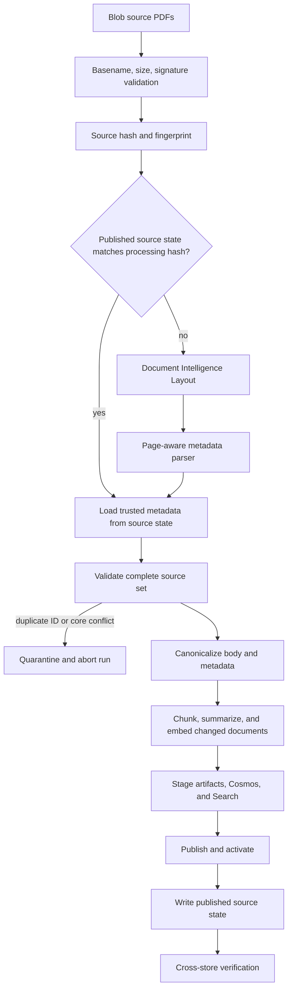

# Plan: Rebuild directive ingestion for page-aware Czech metadata

**Status:** Implemented and deployed

**Date:** 2026-08-14

**Completed:** 2026-08-15

## Completion evidence

The destructive v2 rebuild completed against the two approved source PDFs:

- `MP/23/0141:v1`;
- `MP/25/0277:v1.1`.

The published corpus contains 45 current Search documents, 2 catalog versions,
82 content records, 4 required artifacts, and 2 source-state records. The
empty mandate snapshot is active, an unchanged rerun skipped both sources, and
the final state digest is
`a62d5c8bb6a2c0ace77ccab451eb0ba9415531c5f62b5d3980cfa59d9c2d8c30`.

Compatible backend, frontend, and Directive Hosted Agent images were deployed.
Live document, PDF, conditional ETag, retrieval, citation, and agent-chat
checks passed. The ingestion job remains in nonpublishing `maintenance` mode.
The protected PDFs remain unchanged, while the complete legacy Search graph
`directive-kb-v1` -> `directive-chunks-ks-v1` -> `directive-chunks-v1` was
deleted through the guarded finalizer.

## Objective

Replace the demo-oriented directive ingestion contract with a clean,
current-version-only ingestion path for the actual Czech PDF layouts.

The new implementation must:

- treat the source filename as an opaque PDF basename, not as directive
  metadata;
- extract authoritative metadata from pages 1 and 2;
- support directive numbers containing letters, digits, and approved
  separators;
- support numeric decimal version labels;
- ingest one current version per directive in each source corpus;
- mark every successfully parsed document as current and valid without
  applying effective-date gating;
- preserve page-2 administrative content in canonical Markdown without adding
  typed metadata fields;
- rebuild Cosmos DB, Azure AI Search, and generated artifacts from scratch;
- keep source-document storage, managed identities, private networking, and
  the manual ingestion-job operating model.

Backward compatibility with the existing eight-digit demo identifiers,
document-control tables, Search index, Cosmos records, or generated artifact
paths is explicitly not required.

## Locked decisions

- The migration is a clean rebuild, not an in-place data migration.
- Existing directive catalog, content, mandate, Search, and generated artifact
  data may be destroyed.
- The `directive-source` Blob container is preserved.
- Source filenames carry no directive identity or version semantics.
- Filename validation remains only for storage and request safety.
- Pages 1 and 2 are the authoritative metadata region.
- No document-control table is required.
- Directive numbers are strings and may contain letters, digits, slashes,
  dots, underscores, and hyphens.
- Version labels are numeric decimal strings.
- Each source corpus may contain only one current version for a normalized
  directive number.
- Every successfully parsed document has `is_current = true` and
  `is_valid = true`.
- Preserve the original `DirectiveMetadata` fields and meanings. Add only
  `is_valid`.
- Keep `aliases`, `status`, `effective_to`, `language`, and `document_type`.
- Retain the existing `document_type` contract and set it to `directive` for
  this ingestion phase.
- Keep storage keys and source fingerprints internal. They are not directive
  metadata, Search metadata, citation metadata, or agent-facing fields.
- Preserve non-core page-1/page-2 content in canonical Markdown rather than
  adding typed catalog fields.
- Effective dates are metadata. They do not delay publication or change
  validity in this phase.
- Missing or contradictory core metadata remains an ingestion failure. The
  `is_valid` business flag must not be used to hide an extraction failure.
- Existing source upload and deletion remain manual and do not trigger the
  Container Apps job.
- Historical-source ingestion, validity workflows, and review UI are out of
  scope.

## Generalized document structure

The parser must support a two-page metadata region without depending on
document-specific wording, values, names, organizations, or coordinates.

### Page 1

Page 1 is the primary source for core metadata:

| Semantic field | Contract rule |
| --- | --- |
| document title | Required |
| directive number | Required and authoritative |
| version label | Required numeric decimal |
| effective date | Required |

The footer may repeat core fields. Repeated values are confirmations and must
agree semantically with the primary values.

Unlabelled cover-page text is not promoted into authoritative metadata until
its business meaning is represented by a configured semantic field. It remains
available in raw extraction evidence and canonical page content.

### Page 2

Page 2 provides core-field confirmations and administrative content:

| Content category | Contract rule |
| --- | --- |
| title | Optional confirmation |
| directive number | Optional confirmation |
| version label | Required confirmation when present |
| effective date | Required confirmation when present |
| all other administrative content | Preserve in normalized canonical Markdown |

Core values repeated across pages must compare semantically after
normalization. Administrative content is not interpreted into people, roles,
distribution, applicability, supersession, related-standard, attachment-count,
or declared-page-count metadata in this phase.

## Success definition

The work is complete when:

- an arbitrary safe PDF basename passes source upload and discovery without
  supplying identity metadata;
- page-1 core metadata is extracted into normalized typed fields;
- repeated page-1/page-2 metadata compares semantically despite formatting
  differences;
- the page-2 layout is parsed without depending on the old document-control
  table;
- page-2 administrative content is preserved in canonical Markdown and remains
  searchable;
- `DirectiveMetadata` retains every original field and adds only `is_valid`;
- no page-2 administrative field is added to Cosmos catalog metadata, Search
  metadata, citations, or tool contracts;
- equivalent date and version formatting compares semantically;
- conflicting page-1/page-2 core metadata aborts publication;
- every published source has `is_current = true` and `is_valid = true`;
- duplicate normalized directive IDs in one source corpus abort the complete
  run before Search, summary, or publication work;
- raw slash-bearing directive IDs never appear in Cosmos item IDs, generated
  Blob path segments, or backend route path segments;
- the rebuilt Search index retrieves Czech directive content and filters by
  current and valid state;
- agent tools accept string directive IDs and return grounded citations;
- the frontend document viewer opens cited PDFs without deriving identity from
  filenames;
- a second run over unchanged sources skips Document Intelligence,
  summarization, embeddings, and publication;
- cross-store verification succeeds after the clean rebuild.

## Current implementation impact

This change crosses the complete directive path.

### Source discovery and source management

`directive_contracts/directive_contracts/source_files.py` currently requires:

```text
<eight-digit-id>-<name>-v<number>.pdf
```

`setup/directive_ingest/src/directive_ingestion/source.py` parses that filename
before extraction and stores `directive_id_hint` and `version_hint`.

The backend source manager and frontend upload UI use the same semantic
filename contract:

- `backend/agent_memory_backend/directive_sources.py`
- `backend/agent_memory_backend/server.py`
- `frontend/src/source-documents.ts`
- `frontend/src/components/source-documents-rail.ts`

All of these surfaces must change together.

### Metadata extraction

`setup/directive_ingest/src/directive_ingestion/canonical.py` currently:

- requires the first HTML or Markdown table;
- requires English keys such as `Directive ID`, `Version`, `Status`, and
  `Effective date`;
- requires extracted values to match filename hints;
- requires status to be `Current` or `Superseded`;
- supports only eight-digit relation targets;
- requires a Markdown H1 and at least one body heading.

The old document-control parser can be deleted. No compatibility branch is
needed.

### Identity contracts

Eight-digit assumptions exist in:

- `directive_contracts/directive_contracts/models.py`;
- `agent_contracts/tools.py`;
- ingestion catalog validation and relation extraction;
- backend directive document response models and routes;
- backend tool argument validation;
- frontend citation and document-reference validation;
- tests and demo fixtures.

Changing only ingestion would produce data that the backend, agent tools, and
frontend reject.

### Idempotency

The ingestion runner currently performs an unchanged check before Document
Intelligence by using the ID and version parsed from the filename. Once
filenames become opaque, that lookup is impossible.

A source-state lookup keyed by filename/content fingerprint is therefore part
of the required design. Omitting it would make every daily run repeat paid
Document Intelligence, summary, and embedding work.

### Storage identities

Human-readable directive numbers containing separators are valid data fields
but unsafe as:

- Cosmos item IDs;
- generated Blob path segments;
- URL route path segments;
- mandate assignment item-ID suffixes.

The rebuilt schema must separate human-readable identifiers from storage-safe
keys.

## Target ingestion flow



The runner becomes explicitly two-pass:

1. discover, extract or load metadata, and validate the complete source set;
2. process and publish only after corpus-level validation succeeds.

This prevents duplicate identifiers or mandate mismatches from being detected
after expensive model work.

## Target identity model

### Human-readable identity

Keep the original domain-facing fields:

- `directive_id`: normalized source number;
- `version_label`: source display value;
- `directive_version_id`: deterministic display identity composed from the
  normalized directive number and normalized version.

These values are suitable for Search filters, tool JSON, citations, logs, and
user-facing output. Numeric version normalization is a transient processing
operation and is not a new metadata field.

### Storage-safe identity

Compute internal technical values:

- `directive_storage_key`: SHA-256 of the normalized `directive_id`;
- `directive_version_storage_key`: SHA-256 of normalized `directive_id`, a NUL
  separator, and the normalized version;
- `source_fingerprint`: SHA-256 of the exact source basename, a NUL separator,
  and `source_hash`.

Use full lowercase 64-character hexadecimal hashes. Do not truncate them.
These values are storage locators only. Do not add them to
`DirectiveMetadata`, Search documents, citations, tool arguments, or public
backend responses.

Conceptually:

```text
directive_storage_key =
  sha256(utf8(normalized_directive_id))

directive_version_storage_key =
  sha256(utf8(normalized_directive_id + "\0" + normalized_version))

source_fingerprint =
  sha256(utf8(source_filename + "\0" + source_hash))
```

Centralize these operations in an internal shared helper. Ingestion and backend
storage repositories must not reimplement identity normalization.

### Directive-ID normalization

Normalize extracted directive numbers as follows:

1. apply Unicode NFKC normalization;
2. trim leading and trailing whitespace;
3. collapse repeated internal whitespace;
4. remove whitespace immediately around `/`, `.`, `_`, and `-`;
5. uppercase alphabetic characters with Unicode-aware casing;
6. reject control characters;
7. reject empty values and values longer than the chosen contract limit;
8. reject `:` so `:v` remains an unambiguous display-version delimiter.

Permit Unicode letters and digits plus spaces, `/`, `.`, `_`, and `-`.

Store both the normalized value and the original extracted evidence in
diagnostic findings. The normalized value is authoritative for uniqueness.

### Version normalization

- Accept only `^\d+(?:\.\d+)?$`.
- Parse with `Decimal`.
- Preserve the first authoritative source spelling as `version_label`.
- Use the normalized decimal form for equality and identity.
- Treat numerically equivalent decimal spellings as the same version.
- Do not accept commas, semantic versions, suffixes, or arbitrary strings in
  this phase.

## Target metadata contract

Bump the directive metadata schema only because validation changes and
`is_valid` is added. Preserve all original fields:

| Field | Type | Required |
| --- | --- | --- |
| `schema_version` | literal `2.0` | Yes |
| `directive_id` | normalized string | Yes |
| `directive_version_id` | string | Yes |
| `version_label` | numeric string | Yes |
| `title` | string | Yes |
| `aliases` | list of strings | Yes, may be empty |
| `status` | literal `Current` | Yes |
| `is_current` | literal `true` | Yes |
| `is_valid` | literal `true` | Yes |
| `effective_from` | ISO date | Yes |
| `effective_to` | ISO date or null | No |
| `language` | string; set to `cs` | Yes |
| `document_type` | existing `directive` or `sub_directive` | Yes |
| `source_filename` | safe basename | Yes |
| `source_hash` | 64-char hex | Yes |
| `processing_hash` | 64-char hex | Yes |

Set `status = "Current"`, `is_current = true`,
`is_valid = true`, `effective_to = null`, and `document_type = "directive"`.
Preserve `aliases`; use an empty list when no aliases are available.

Do not add people, organizations, roles, signatures, applicability,
distribution, supersession, related standards, attachment count, declared
page count, safe storage keys, or source fingerprints to this contract.

## Metadata authority and conflict rules

### Required core fields

The required core fields are:

- title;
- directive ID;
- version;
- effective date.

Authority order:

1. labelled page-1 cover value;
2. page-1 footer confirmation or fallback;
3. page-2 header/table confirmation;
4. page-2 footer confirmation.

Every reliably extracted duplicate must agree semantically:

- compare versions numerically rather than textually;
- compare dates after typed date parsing;
- compare directive numbers after identifier normalization.

A contradictory core value is fatal because publishing an uncertain identity
would corrupt every downstream key.

### Non-core page content

Do not parse administrative page content into typed metadata. Preserve it in
the generated canonical Markdown metadata section in source reading order.

Record a bounded `ReviewFinding` when table or list structure is ambiguous but
all source text can still be preserved through the ordered-text fallback.
Warnings do not set `is_valid = false`; they are ingestion-quality findings,
not business-validity decisions. Fail ingestion if non-decorative page content
cannot be accounted for without omission.

## Detailed implementation plan

### Phase 1: Build representative fixtures

1. Obtain at least three representative PDFs:
   - a text-based directive using the dominant page layout;
   - another text-based directive covering any known label, value-length, or
     layout variation;
   - a scanned or mixed-content PDF if scans exist in the corpus.
2. Include matching pages 1 and 2 from each PDF.
3. Capture the complete Document Intelligence `analyzeResult` JSON using the
   configured API version.
4. Redact only business content that is not needed for parser tests. Preserve:
   - `content`;
   - `pages[].lines`;
   - line and word spans;
   - polygons/bounding regions;
   - paragraphs and paragraph roles;
   - tables, cells, row/column indexes, and spans;
   - styles if returned.
5. Store sanitized response fixtures under
   `setup/directive_ingest/tests/fixtures/`.
6. Add expected core metadata JSON and expected first-two-page canonical
   Markdown for each response.
7. Confirm whether all production PDFs use pages 1 and 2 for metadata and
   whether any use alternative labels.

Do not implement positional parsing from images alone.

### Phase 2: Replace semantic filename validation

In `directive_contracts`:

1. Remove `DirectiveSourceIdentity`,
   `DIRECTIVE_SOURCE_FILENAME_PATTERN`, and
   `parse_directive_source_filename`.
2. Add one shared `validate_directive_source_basename` helper.
3. Accept any basename that:
   - is non-empty;
   - is at most 255 characters;
   - ends in `.pdf`, case-insensitively;
   - contains no `/`, `\`, NUL, or control characters;
   - is neither `.` nor `..`.
4. Preserve the exact accepted filename for Blob access and display.

In ingestion:

1. Remove `directive_id_hint`, `version_hint`,
   `metadata_version_matches`, and `directive_version_id_hint` from
   `SourceDocument`.
2. Keep source name, source hash, content, and private provenance.
3. Detect duplicate source names and duplicate content hashes explicitly.
4. Keep direct-child Blob-prefix enforcement and ETag-conditional downloads.
5. Keep PDF signature and corpus-size checks.

In backend and frontend:

1. Apply the same basename rules to list, upload, delete, audit, and UI
   validation.
2. Continue create-only upload behavior.
3. Change source-manager help text to explain that identity is read from the
   first two pages.
4. Do not remove size, signature, traversal, direct-child, authorization, or
   create-only protections.

### Phase 3: Expand the Document Intelligence extraction contract

Refactor `ExtractedDocument` so it retains page-aware structured data instead
of only Markdown, page spans, and table count.

Add immutable structures for:

- page number and dimensions;
- ordered page lines with text, spans, and polygon;
- paragraph text, role, spans, and bounding regions;
- table cells with page, row, column, text, and polygon;
- Markdown/content spans for body reconstruction.

The REST request may continue using `prebuilt-layout` and
`outputContentFormat=markdown`. No custom model is planned initially.

Parsing requirements:

- validate all response collection types before constructing records;
- reject malformed spans rather than silently defaulting to misleading
  offsets;
- preserve source reading order and coordinates;
- expose helpers for page text, page-role paragraphs, label anchors, and
  content slicing by page;
- keep operation URL validation and existing retry behavior.

### Phase 4: Add a deterministic Czech metadata parser

Create a dedicated module, for example:

```text
setup/directive_ingest/src/directive_ingestion/metadata.py
```

Do not keep metadata extraction embedded in `canonical.py`.

#### Label normalization

For label matching only:

- apply NFKC;
- casefold;
- remove Czech diacritics;
- collapse whitespace;
- normalize punctuation around `:` and `.`;
- compare against an explicit alias registry.

Preserve original accents and spelling in extracted values.

Maintain a versioned alias registry only for core metadata categories:

- directive-number labels;
- version labels;
- effective-date labels;
- title roles or anchors when Document Intelligence does not assign a title
  role.

Populate the concrete aliases from approved, sanitized corpus analysis outside
this plan. Cover every configured alias with tests.

#### Page-1 extraction

1. Prefer a page-1 paragraph with Document Intelligence role `title`.
2. Fall back to the dominant central cover-page line after excluding:
   - page headers and footers;
   - known metadata labels;
   - page counters;
   - empty or logo-derived text.
3. Extract the labelled directive number.
4. Extract footer number, version, and effective date confirmations.
5. Require title, directive ID, version, and effective date after applying
   fallback and confirmation rules.

#### Page-2 extraction

Use core-field label anchors to extract only directive-number, version, and
effective-date confirmations.

Preserve the complete remaining page content as canonical Markdown:

1. use Document Intelligence table cells when a coherent table is returned;
2. preserve cell row/column order without mapping cells to typed metadata;
3. when a table is absent or fragmented, reconstruct ordered text blocks from
   lines and bounding regions;
4. retain headings, labels, values, and list order;
5. exclude only recognized page headers, footers, and page counters that are
   already represented by core metadata or manifest page information.

Do not hard-code names, organizations, absolute pixel coordinates, or a single
page size.

#### Czech dates

Accept:

- `d.m.yyyy`;
- `dd.mm.yyyy`;
- optional whitespace around date separators.

Convert to `datetime.date`, reject impossible dates, and serialize as ISO.

#### Parse result

Return:

- a typed candidate containing the original metadata fields plus `is_valid`;
- field-level evidence containing page number and source text;
- normalized canonical content for the first two pages;
- warnings for non-core content-reconstruction ambiguity;
- errors for missing or conflicting core metadata.

The evidence is for diagnostics and tests. Do not place polygons or raw
Document Intelligence responses in Search documents or model-visible
citations.

### Phase 5: Rebuild canonical document generation

Delete the old first-table document-control parser.

Generate canonical Markdown in two parts:

1. a deterministic `# <title>` and `## Metadata` section generated from the
   typed metadata;
2. the directive body from page 3 onward, preserving headings, lists, and
   tables.

The generated metadata section should:

- span pages 1-2 for citation purposes;
- include the core metadata in a deterministic compact header;
- preserve all non-core page-1/page-2 text without converting it to typed
  metadata;
- retain tables, lists, and labels in source reading order;
- avoid duplicating recognized page headers, footers, and counters.

Body processing should:

- remove recognized page headers and footers from repeated body content;
- retain body tables atomically as today;
- derive sections from Markdown headings and Document Intelligence paragraph
  roles;
- support Czech numbered headings;
- fall back to one body section with a warning when no reliable headings are
  available;
- stop treating absence of tables or body headings as a fatal error.

Update section slugging to be deterministic for Czech Unicode text. Section
IDs may use a safe transliterated slug or a content hash, but must remain
stable across identical reprocessing.

Remove the old control-table relation extraction and broad eight-digit
reference scan. Do not create `DirectiveRelation` records from page-1/page-2
administrative content. Keep the existing relation contract and backend tool
compatible with an empty relation set; a future explicit, separately approved
relation parser can populate it.

### Phase 6: Version shared contracts

Update `directive_contracts/directive_contracts/models.py`:

- add `is_valid`;
- set language to `cs`;
- relax directive-ID validators;
- preserve `aliases`, `status`, `effective_to`, and `document_type`;
- bump metadata and dependent artifact schema versions;
- add `is_valid` to `DirectiveChunk` so the Search filter is represented in the
  typed contract;
- update `PublishedDirectiveVersion` storage-ID validation to compute the safe
  item ID without adding a safe-key field to directive metadata;
- keep safe storage keys outside public metadata, Search, citation, and tool
  models.

Update `agent_contracts/tools.py`:

- replace eight-digit validators with shared normalized-string rules;
- validate that a supplied display `directive_version_id` belongs to the
  supplied `directive_id`;
- keep argument length and result-count limits;
- keep historical-search safety rules even though the initial rebuilt corpus
  contains only current versions.

Keep the existing citation metadata fields. Continue returning directive ID,
directive version ID, version label, effective date, section, and page
evidence. Do not add or expose safe storage hashes.

### Phase 7: Add source-state idempotency

Store source-state records as internal JSON artifacts in the existing
directive artifact container. This avoids changing the public metadata model
or introducing a catalog partition that cannot be known before extraction.

Suggested internal path:

```text
source-state/<source_fingerprint>/<processing_hash>.json
```

Suggested internal record:

```json
{
  "type": "source_state",
  "source_filename": "...",
  "source_hash": "...",
  "source_fingerprint": "...",
  "processing_hash": "...",
  "directive_metadata": {},
  "artifact_generation_id": "...",
  "publication_state": "published"
}
```

Rules:

- write source state only after Search, catalog, content, and artifacts are
  published and validated;
- point-read the deterministic Blob name before Document Intelligence;
- trust it only when source fingerprint, processing hash, publication state,
  and referenced published bundle all match;
- treat missing or inconsistent state as changed;
- changing the filename intentionally changes the fingerprint and triggers
  reprocessing;
- changing parser behavior requires a processing-version bump and triggers
  reprocessing;
- never use a source-state record to bypass full source-set uniqueness
  validation;
- treat the record as internal ingestion state, not directive metadata or a
  public artifact.

### Phase 8: Refactor reconciliation

Split the current `_prepare` operation into:

1. `discover_sources`;
2. `extract_or_load_metadata`;
3. `validate_source_set`;
4. `prepare_changed_documents`;
5. `stage_documents`;
6. `publish_documents`;
7. `record_source_states`;
8. `verify`.

Corpus validation:

- normalize every directive ID;
- reject duplicate directive IDs even when versions or filenames differ;
- set every item to current and valid;
- reject duplicate directive-version keys;
- ensure mandate IDs refer to the normalized current corpus;
- collect all metadata failures, quarantine their PDFs, and abort the run;
- perform no summary, embedding, Search stage, or catalog publication when
  corpus validation fails.

`validate` CLI behavior must change because filenames no longer expose IDs:

- run source safety checks;
- run Document Intelligence metadata extraction when no trusted source state
  exists;
- validate the source set and mandate CSV;
- do not summarize, embed, or publish.

`verify` must resolve current source files through source-state records rather
than filename hints.

### Phase 9: Rebuild Cosmos storage

Recreate the directive containers during the maintenance window to remove
existing demo data, but retain the original partition-key contract.

#### Catalog

Keep the `/directive_id` partition key and human-readable `directive_id`
property.

Use safe item IDs:

- `version:<directive_version_storage_key>`;
- `current`;
- `review:<directive_version_storage_key>:<generation-key>`;
- `staging:<directive_version_storage_key>:<generation-key>`;
- hashed relation IDs if explicit relation records are introduced later.

Compute safe item IDs inside the repository. Do not add their hash inputs or
outputs to `DirectiveMetadata`.

#### Content

Keep the `/directive_version_id` partition key. Existing section-content item
IDs are already hash-based; verify that no newly generated item ID embeds the
raw directive number.

#### Mandates

Keep the `/user_id` partition and recreate the container to remove old data.

Build assignment item IDs with `directive_storage_key`, not raw
`directive_id`.
Continue returning statuses keyed by human-readable normalized directive IDs.

Update the mandate CSV before the first rebuilt run. Existing eight-digit demo
values will otherwise fail validation.

### Phase 10: Rebuild Azure AI Search

Create `directive-chunks-v2`; do not mutate the existing index in place.

Preserve the existing Search metadata fields and add only filterable,
retrievable `is_valid`. Keep:

- directive ID and version ID;
- version label;
- title and aliases;
- status, `is_current`, and effective dates;
- section and page fields;
- content kind and language;
- source, processing, publication, and generation fields.

Do not add storage keys or page-2 administrative fields to Search metadata.
The canonical first-two-page section makes administrative content searchable
through the existing `content` field.

Set the document language to Czech. Evaluate `cs.microsoft` or the supported
Czech analyzer for title/content fields against a representative query set
before locking the index definition. The embedding deployment can remain
`text-embedding-3-large`.

Default runtime filters become:

```text
publication_state eq 'published'
and is_current eq true
and is_valid eq true
```

Update index compatibility validation for `is_valid` and the widened string-ID
contract.

### Phase 11: Update artifact paths

Generated artifacts must use only safe keys:

```text
directives/
  <directive_storage_key>/
  <directive_version_storage_key>/
  <source_hash>/
  source.pdf
  generations/<artifact_generation_id>/document.md
```

Do not include raw directive IDs in Blob names.

Keep human IDs inside manifests and metadata. Preserve immutable source PDFs
and generation-specific canonical Markdown.

### Phase 12: Update backend directive access

Update catalog, mandates, artifacts, and directive-document services to compute
safe item/path identities internally while preserving existing human metadata.

Replace raw-ID path parameters with query parameters:

```text
/directives/document?directive_id=<encoded>&directive_version_id=<encoded>
/directives/source?directive_id=<encoded>&directive_version_id=<encoded>
```

Validate and normalize both human identifiers, compute the safe catalog item ID
internally, and verify that the resolved bundle matches the requested values.
Do not rely on percent-encoded slashes inside route parameters.

Update source-manager endpoints to use basename validation only. Keep:

- dedicated Entra application-role authorization;
- create-only upload;
- streaming size limit;
- PDF signature checks;
- safe telemetry;
- explicit deletion confirmation;
- no ingestion trigger.

### Phase 13: Update agent and frontend behavior

Agent/backend tool changes:

- accept normalized alphanumeric directive IDs with approved separators;
- search human IDs as exact normalized values;
- continue presenting the human directive number;
- keep existing citation metadata unchanged;
- keep `get_related_directives` operational with an empty result when no
  explicit relation records exist.

Frontend changes:

- accept the actual source filenames;
- remove the example eight-digit filename instruction;
- remove filename-to-directive parsing from `directive-documents.ts`;
- validate citation human IDs using the new shared rules;
- build query-parameter document/source URLs from existing citation fields;
- display Czech IDs and version labels unchanged;
- preserve filename encoding and Content-Disposition safety.

### Phase 14: Observability and review findings

Add safe metrics/log fields:

- source filename;
- source hash prefix only if existing telemetry conventions allow it;
- metadata parser version;
- existing document type;
- page count;
- extraction outcome;
- warning codes;
- duplicate-ID outcome;
- changed/skipped status.

Do not log:

- PDF content;
- full Document Intelligence response;
- administrative page content;
- raw model prompts;
- storage coordinates not already approved for telemetry.

Suggested finding codes:

- `metadata_duplicate_confirmation_missing`;
- `metadata_administrative_content_order_ambiguous`;
- `metadata_administrative_table_fallback`;
- `body_heading_fallback`.

Core metadata errors should use typed exceptions rather than review findings.

## Infrastructure impact

| Area | Required change |
| --- | --- |
| Document Intelligence | No new resource or RBAC; keep prebuilt Layout initially |
| Source Blob container | Preserve container and data |
| Artifact Blob container | Preserve container; purge generated directive and source-state prefixes |
| Cosmos catalog | Recreate with retained `/directive_id` partition key |
| Cosmos content | Recreate with retained `/directive_version_id` partition key |
| Cosmos mandates | Recreate to remove demo assignments |
| Azure AI Search | Create `directive-chunks-v2`, then delete the legacy v1 knowledge base, knowledge source, and index |
| Container Apps job | Deploy new image and processing-version setting |
| Backend app | Point to rebuilt contracts/index and query-parameter routes |
| Frontend | Deploy source and viewer changes |
| Managed identities/RBAC | No new permissions expected |
| Private endpoints/DNS | No change expected |
| OpenAI deployments | No change expected |

Change:

```text
DIRECTIVE_PROCESSING_VERSION=directive-v2-czech-layout
DIRECTIVE_SEARCH_INDEX=directive-chunks-v2
```

The first run will process every source and consume Document Intelligence,
summary-model, and embedding capacity. Validate that the current two-hour job
timeout and 2-GiB memory limit are sufficient for the production corpus before
cutover.

## Destructive rebuild runbook

Perform the rebuild in a maintenance window. There is no dual-read or
dual-write compatibility period.

### Preconditions

1. Merge and test all contract, ingestion, backend, frontend, and Terraform
   changes together.
2. Capture representative Document Intelligence fixtures.
3. Update the mandate CSV to the new normalized directive IDs.
4. List and checksum the source container.
5. Confirm no ingestion job execution is active.
6. Record current Terraform outputs and target resource names.
7. Confirm the operator understands that derived directive data will be
   destroyed.

### Reset

1. Disable or stop new directive requests during the maintenance window.
2. Delete the catalog, content, and mandate Cosmos containers with the guarded
   reset command, then run Terraform to recreate the same named resources with
   their existing partition keys. Do not manipulate Terraform state manually.
3. Purge generated `directives/`, `source-state/`, and obsolete quarantine
   prefixes from `directive-artifacts`.
4. Do not delete or mutate `directive-source`.
5. Create/bootstrap `directive-chunks-v2`.
6. Keep the v1 knowledge base, knowledge source, and index only until v2
   verification finishes, then delete that graph in dependency order.

Implement a guarded reset script or command that:

- prints exact account, database, container, index, and artifact prefix;
- refuses to touch the source container;
- requires an explicit environment-specific confirmation token;
- refuses to run while an ingestion execution is active;
- fails closed on partial cleanup.

### Deploy and ingest

1. Apply Terraform container and environment changes.
2. Deploy the ingestion image.
3. Run managed-identity `preflight`.
4. Run metadata-only `validate`.
5. Inspect normalized IDs and warnings before publication.
6. Run the full ingestion job once.
7. Run cross-store `verify`.
8. Deploy or enable the compatible backend and frontend.
9. Run live directive-tool and document-viewer smoke tests.
10. Delete the old Search knowledge base, knowledge source, and index after
    acceptance.

### Recovery

Because old derived data is intentionally discarded, recovery is a rebuild:

1. correct parser, contract, configuration, or source input;
2. bump the processing version when parser semantics changed;
3. reset partial derived data;
4. rerun ingestion from the preserved source container.

No data-conversion rollback is planned.

## Test plan

### Source basename tests

- accept arbitrary safe PDF basenames;
- accept spaces, Czech Unicode, underscores, multiple dots, and uppercase
  `.PDF`;
- reject `/`, `\`, control characters, empty names, overlong names, and
  non-PDF extensions;
- reject invalid PDF signatures;
- retain ETag-conditional Blob downloads;
- ensure backend list/upload/delete and frontend validation agree.

### Identity tests

- normalize whitespace around approved separators;
- normalize case deterministically;
- keep distinct directive numbers distinct after normalization;
- generate deterministic full-length keys;
- ensure numerically equivalent decimal versions compare equal and different
  decimal versions do not;
- ensure raw slash IDs never occur in storage IDs or generated paths;
- reject duplicate normalized directive IDs across different filenames.

### Page-1 parser tests

- extract title from paragraph role;
- exercise title fallback;
- parse central and footer directive-number labels;
- parse all accepted date spacing variants;
- parse representative numeric decimal versions;
- reject missing core fields;
- reject contradictory footer values.

### Page-2 parser tests

- preserve a structured table-cell response in canonical Markdown;
- preserve the coordinate/line fallback response in canonical Markdown;
- retain labels, values, tables, and ordered lists without typed
  administrative metadata;
- produce no structured relation from administrative-page identifiers;
- confirm duplicate number/version/date values;
- emit warnings when structure is ambiguous but all text is preserved;
- fail when non-decorative first-two-page text would be omitted.

### Canonical and chunking tests

- generate the metadata section without a source document-control table;
- include only original metadata fields plus `is_valid` in typed metadata;
- preserve first-two-page administrative content as searchable Markdown;
- exclude repeating headers and footers from body chunks;
- preserve body tables atomically;
- preserve Czech characters;
- map metadata to pages 1-2;
- map body sections to correct pages;
- produce a fallback body section when headings are absent;
- keep deterministic section and chunk IDs.

### Reconciliation tests

- first run extracts and publishes;
- unchanged second run calls none of Document Intelligence, summary,
  embedding, Search write, or publication methods;
- processing-version change forces reprocessing;
- filename change forces reprocessing;
- duplicate directive ID aborts before model work;
- metadata failure quarantines source bytes and prevents all publication;
- source state is written only after complete publication;
- inconsistent source state is never treated as unchanged;
- every source metadata record is current and valid.

### Storage and runtime tests

- validate retained Cosmos partition keys and safe item-key shapes;
- validate source-state Blob point reads;
- validate mandate lookup by safe key with human-ID responses;
- validate v2 Search schema and default filters;
- assert Search contains no storage-key or administrative metadata fields;
- resolve directives by string ID;
- keep the original citation metadata shape;
- open canonical Markdown and source PDF through query-parameter routes;
- return an empty successful related-directives result when no explicit
  relation records exist;
- verify cross-store counts, hashes, current pointers, and artifact locators.

### End-to-end acceptance tests

1. Upload an actual-name PDF through the source manager.
2. Confirm no job starts automatically.
3. Run metadata validation and inspect extracted core values and preserved
   first-two-page content.
4. Run ingestion.
5. Ask the directive agent to find the document by title and by directive
   number.
6. Verify effective date, version, administrative-content retrieval, and page
   citations.
7. Open the canonical document and PDF from a citation.
8. Run ingestion again and verify a complete unchanged skip.

## Failure behavior

| Condition | Result |
| --- | --- |
| Unsafe basename or non-PDF content | Reject before source commit/processing |
| Missing title, directive ID, version, or effective date | Quarantine and abort run |
| Conflicting page confirmations | Quarantine and abort run |
| Duplicate normalized directive ID in corpus | Abort complete run before model work |
| Administrative structure is ambiguous but all text is retained | Publish with bounded warning |
| Non-decorative first-two-page content would be omitted | Quarantine and abort run |
| Document Intelligence unavailable | Fail run; no publication |
| Summary/embedding failure | Fail changed document; no activation |
| Search/Cosmos publication mismatch | Retire staged Search generation and fail |
| Source-state write failure | Fail verification; next run reprocesses safely |

## Risks and mitigations

| Risk | Mitigation |
| --- | --- |
| Document Intelligence reading order differs from visual layout | Use captured structured responses and coordinate-aware tests |
| Page-2 table is not detected | Provide line/anchor fallback |
| Generic ID regex captures dates or section numbers | Parse only from known labels and normalize strictly |
| Slash IDs break storage or routing | Use deterministic safe keys everywhere unsafe |
| Administrative content is ambiguous | Preserve ordered canonical text and emit warnings |
| Related-directives tool has no derived graph | Return an empty result; keep references searchable in canonical content |
| Duplicate current directives publish partially | Validate full corpus before model or publication work |
| Daily ingestion becomes expensive | Add published source-state point reads |
| Czech retrieval quality degrades | Set language to `cs` and evaluate Czech analyzer with query fixtures |
| Clean rebuild causes application outage | Use a declared maintenance window and verify before re-enabling |
| Old mandate IDs invalidate first run | Update and validate mandate CSV before reset |
| First full run exceeds job limits | Benchmark representative corpus and adjust timeout/memory if required |

## Blockers and required inputs

The implementation should not begin until these are available:

1. At least one complete representative PDF for each supported layout family.
2. Sanitized Document Intelligence `analyzeResult` fixtures from that PDF.
3. Confirmation of core metadata label variants across the corpus.
4. Confirmation that metadata is always confined to pages 1 and 2.
5. Confirmation that directive body content starts after page 2. If it can
   start on page 2, fixtures must define a deterministic geometric boundary
   between administration and body content.
6. Approval to include first-two-page administrative content in canonical
   artifacts, Search content, embeddings, and summarization under the existing
   access-control and data-classification model. Otherwise, define the
   redaction or model-exclusion policy first.
7. The replacement mandate mapping using actual directive IDs.
8. A representative corpus count/page-size estimate for first-run capacity.

The following contingency is not a blocker yet:

- If prebuilt Layout cannot reliably extract core metadata or preserve
  first-two-page reading order after fixture-based tuning, evaluate a custom
  Document Intelligence model on the existing resource. Do not introduce an
  LLM fallback for authoritative identity metadata.

## Primary implementation surfaces

### Shared contracts

- `directive_contracts/directive_contracts/source_files.py`
- `directive_contracts/directive_contracts/models.py`
- `directive_contracts/directive_contracts/artifacts.py`
- `directive_contracts/directive_contracts/__init__.py`
- `agent_contracts/tools.py`
- `agent_contracts/models.py`

### Ingestion

- `setup/directive_ingest/src/directive_ingestion/source.py`
- `setup/directive_ingest/src/directive_ingestion/document_intelligence.py`
- new `setup/directive_ingest/src/directive_ingestion/metadata.py`
- `setup/directive_ingest/src/directive_ingestion/canonical.py`
- `setup/directive_ingest/src/directive_ingestion/chunking.py`
- `setup/directive_ingest/src/directive_ingestion/reconcile.py`
- `setup/directive_ingest/src/directive_ingestion/catalog_repository.py`
- `setup/directive_ingest/src/directive_ingestion/content_repository.py`
- `setup/directive_ingest/src/directive_ingestion/search_repository.py`
- `setup/directive_ingest/src/directive_ingestion/mandate_projection.py`
- `setup/directive_ingest/src/directive_ingestion/config.py`
- `setup/directive_ingest/src/directive_ingestion/cli.py`
- `setup/directive_ingest/tests/`

### Backend and agent

- `backend/agent_memory_backend/directive_sources.py`
- `backend/agent_memory_backend/directive_catalog.py`
- `backend/agent_memory_backend/directive_content.py`
- `backend/agent_memory_backend/directive_search.py`
- `backend/agent_memory_backend/directive_documents.py`
- `backend/agent_memory_backend/directive_mandates.py`
- `backend/agent_memory_backend/directive_tools.py`
- `backend/agent_memory_backend/server.py`
- `backend/tests/`
- `agents/directive-rag-maf/tests/`

### Frontend

- `frontend/src/source-documents.ts`
- `frontend/src/components/source-documents-rail.ts`
- `frontend/src/directive-documents.ts`
- `frontend/src/client.ts`
- related frontend tests

### Infrastructure and operations

- `infra/directive_data.tf`
- `infra/directive_ingestion_job.tf`
- `infra/compute.tf`
- `infra/variables.tf`
- `scripts/deploy_directive_ingestion.sh`
- new guarded derived-data reset script
- backend and deployment documentation

## Out of scope

- ingesting multiple source versions of one directive in the same corpus;
- determining validity from dates, signatures, or approval workflow;
- publishing a document as business-invalid;
- historical-PDF backfill;
- review or metadata-correction UI;
- automatic ingestion on upload;
- automatic retirement when a source file is deleted;
- custom Document Intelligence training unless prebuilt Layout proves
  insufficient;
- LLM extraction of authoritative metadata;
- typed extraction of page-2 administrative fields;
- automatic typed relation extraction from administrative or body text;
- changing authentication, managed identities, private networking, or source
  manager authorization.

## Definition of done

- All locked decisions are represented in shared contracts and tests.
- No semantic filename parser remains.
- No eight-digit directive-ID validator remains on an active directive path.
- Metadata extraction is deterministic, page-aware, and fixture-backed.
- `DirectiveMetadata` retains all original fields and adds only `is_valid`.
- Page-2 administrative content is preserved in canonical Markdown and not
  published as typed metadata.
- All published documents are current and valid.
- Duplicate directive IDs fail before expensive processing.
- Source-state idempotency is proven.
- Cosmos containers are cleanly rebuilt with retained partition contracts and
  safe internal item IDs; Search is rebuilt with only `is_valid` added.
- Generated artifact paths contain no raw directive IDs.
- Backend tools, unchanged citation metadata, and query-parameter document
  viewing work with slash-bearing IDs.
- The clean rebuild runbook succeeds against the preserved source container.
- Managed-identity preflight and cross-store verification pass.
- A representative Czech retrieval evaluation passes by title, directive
  number, first-two-page administrative content, and body content.
