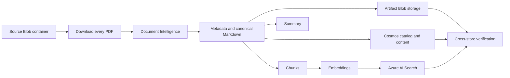
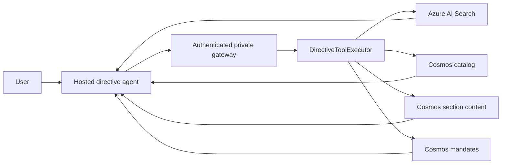
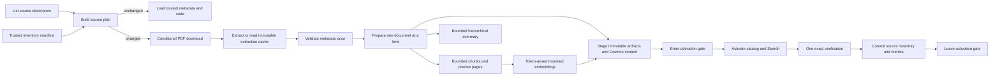

# Plan: Harden and optimize directive ingestion

**Status:** Proposed

**Date:** 2026-08-16

**Related plans:**

- [Rebuild directive ingestion for page-aware Czech metadata](TEMP-plan-directive-document-processing-v2.md)
- [Simplify the directive RAG pattern](TEMP-plan-simplify-directive-rag.md)
- [Read directive source PDFs from Blob storage](TEMP-plan-directives-from-blob.md)

## Objective

Improve directive ingestion and retrieval without weakening the current
approval, identity, publication, rollback, coverage, citation, or managed
identity boundaries.

The work has four goals:

1. Make every model and embedding request provably bounded.
2. Eliminate repeated source downloads, extraction, validation, and connection
   setup where the same immutable input has already been verified.
3. Reduce peak memory and make ingestion throughput tunable under explicit
   resource and provider limits.
4. Simplify the ingestion coordinator and model-visible retrieval contract so
   each component has one clear responsibility.

This plan builds on the completed v2 document-processing design. It does not
replace the page-aware Czech metadata parser, storage identities, generation
hashing, exact-corpus reconciliation, or current rollback model.

## Success definition

The work is successful when:

- no Search chunk exceeds the configured chunk or embedding input limit;
- no summary request exceeds its configured input limit, including a single
  oversized section and the final synthesis request;
- an approved changed source is submitted to Document Intelligence at most once
  across validation and publication when its validation cache remains intact;
- unchanged Blob sources require no PDF body download during the normal
  validate, publish, and publication-verification path;
- the standard publication path performs one exhaustive public-state
  verification, not two equivalent verifications;
- peak resident memory stays below 70 percent of the configured job memory on a
  maximum supported test corpus;
- online directive reads never observe mixed catalog and Search generations
  during current-version activation;
- generic summary coverage is described as input coverage rather than a claim
  that every fact survived model summarization;
- chunk citations use the narrowest page range supported by canonical source
  provenance;
- every ingestion execution records bounded stage, byte, token, request, retry,
  cache, and peak-memory metrics without recording document content;
- the active agent prompt and tool list advertise only capabilities populated
  by the deployed corpus;
- the current eight-tool surface is consolidated according to
  `TEMP-plan-simplify-directive-rag.md`, with relation traversal additionally
  gated while v2 ingestion continues to publish no relations;
- unchanged-source behavior, transactional compensation, source approval,
  mandate publication, and security tests continue to pass;
- deployed relevance and citation evaluation shows no regression.

Line count and raw concurrency are not success criteria. The resulting system
must be easier to reason about and must remain fail-closed.

## Current state

### Offline path



The deployment workflow performs:

1. managed-identity preflight;
2. metadata validation;
3. operator confirmation and approval evidence validation;
4. approved `run-daily` execution;
5. a separate read-only `verify` execution.

`run_daily()` already calls `verify()` before clearing the publication marker.
The standalone execution therefore repeats public-state verification
immediately after a successful run.

### Online path



The model never receives the source PDF directly. It receives selected Search
chunks, a precomputed summary, a manifest, or exact section content through
gateway tool results.

### Confirmed constraints and inefficiencies

| Area | Current behavior | Consequence |
| --- | --- | --- |
| Table chunking | A table larger than `DIRECTIVE_CHUNK_TOKEN_LIMIT` remains one atomic chunk | Embedding input can exceed the provider limit and fail the whole document |
| Summary batching | A section larger than the batch limit is emitted as one batch; final synthesis is not recursively bounded | Summary requests can exceed the model context limit |
| Source access | Blob discovery downloads all PDFs sequentially before processing | Unchanged corpora still incur full source traffic and memory use |
| Preflight | Source access downloads the first complete PDF | An access check performs unnecessary data transfer |
| Validation and publication | A changed source is extracted in both separate job executions | Document Intelligence latency and cost are duplicated |
| Verification | `run_daily()` verifies internally and the deployment script starts another `verify` execution | Artifact, Cosmos, and Search checks are repeated |
| Canonical provenance | One Python integer is stored for each source character | Large extracted documents amplify memory use substantially |
| Metadata | Metadata is parsed during validation and again in `parse_canonical()` | Duplicate CPU work and duplicate parser failure surface |
| Chunk assembly | Growing candidate strings are tokenized repeatedly | Sections with many small blocks incur avoidable CPU work |
| Embeddings | Batches of 16 execute sequentially | Provider latency is not overlapped |
| Document preparation | Extraction, summary, embeddings, and most publication work are serial across documents | Corpus completion time grows close to linearly |
| Publication visibility | Catalog current activation precedes Search current reconciliation | Online traffic can briefly observe different current generations |
| Gateway transport | A new `httpx.AsyncClient` is created for each tool and state call | TCP/TLS connections are not pooled |
| Runtime Search | Every intent requests 50 candidates | Up to 400 documents can be transferred for eight intents |
| Summary coverage | Every input section ID is recorded as covered | Runtime can interpret input coverage as semantic summary coverage |
| Chunk pages | Every chunk inherits the complete section page range | Citations can be broader than the evidence |
| Historical behavior | v2 forces every source to current and rejects duplicate directive IDs | Historical comparison is advertised but the corpus cannot supply it |
| Relations | v2 publishes `relations=()` and rejects relation records | Relation traversal is advertised but always empty |
| Diagnostics | Run records contain counts but no duration, bytes, tokens, requests, retries, cache hits, or memory | Performance work cannot be ranked from production evidence |
| Retention | Staging, review, quarantine, and run diagnostics have no explicit lifecycle | Operational storage grows without a documented retention policy |

## Scope

### In scope

- bounded table and summary processing;
- chunk-level page provenance;
- lightweight Blob source inventory and unchanged-source planning;
- immutable Document Intelligence extraction caching;
- one-pass metadata reuse;
- incremental document preparation and compact provenance maps;
- deduplicated validation and verification;
- fail-closed cross-store activation;
- bounded provider concurrency and retry policy;
- process-lifetime gateway connection pooling;
- measured Search candidate tuning;
- capability-aligned agent tools and instructions;
- ingestion stage telemetry and diagnostic retention;
- behavior-preserving decomposition of `reconcile.py`;
- tests, deployment sequencing, rollback, and operational evidence.

### Out of scope

- automatic publication immediately after source upload;
- removal of the human approval gate;
- historical PDF backfill or validity inference;
- relation extraction or relation-review UI;
- changing the source PDF metadata layout rules;
- replacing Azure AI Search, Cosmos DB, Blob storage, Document Intelligence, or
  the Hosted Agent;
- changing mandate status into a retrieval filter;
- introducing a cross-request cache of mutable catalog bundles;
- changing the managed-identity trust boundary;
- changing the language model solely to improve performance.

## Locked safety invariants

The implementation must preserve these invariants:

1. A source is read under a listed Blob ETag or version condition. A mutation
   during validation fails the run.
2. Source inventory, environment, validation, and mandate approval digests must
   match immediately before publication.
3. Validation caches and inventory records are optimization hints, never
   independent publication authority.
4. Every cache hit is verified against source hash, extractor identity, schema,
   and payload hash before use.
5. A cache miss or invalid cache falls back to extraction; it never becomes a
   skipped document.
6. Search chunks, catalog bundles, content parts, source states, and artifacts
   retain deterministic identities and exact generation checks.
7. Staged records are not model-visible.
8. A failed activation either restores the previous generation or leaves a
   fail-closed recovery marker.
9. The backend continues to enforce current-version defaults, exact-version
   authority, result limits, continuation, user identity, and citations.
10. No optimization silently truncates content or converts an error into an
    apparently successful result.
11. Processing changes that alter canonical content, chunk boundaries, summary
    output, or page provenance require a new `DIRECTIVE_PROCESSING_VERSION`.
12. Performance telemetry must not contain source text, prompts containing
    source text, user identity, access tokens, or complete provider responses.

## Target architecture



### Target single-document flow

For one source PDF:

1. List its name, ETag, version ID, size, and last-modified value without
   downloading the body.
2. Compare the descriptor with the last committed source inventory.
3. If the descriptor matches, reuse the committed source hash and metadata.
4. If it differs or is unknown, download the PDF under `If-Match`, validate the
   PDF signature, and calculate SHA-256.
5. Look up an immutable extraction cache by source hash and extractor identity.
6. On a valid cache hit, deserialize the strict extraction contract. On a miss,
   call Document Intelligence and write the immutable cache before returning
   validation evidence.
7. Extract metadata once and retain the validated candidate in the source plan.
8. Validate the complete set of directive IDs, versions, and mandates using
   lightweight metadata records.
9. During approved publication, reload one changed extraction at a time,
   canonicalize it, generate bounded chunks and summary, embed bounded chunks,
   and release large intermediate objects before moving to the next document.
10. Stage all candidate records without affecting current reads.
11. Enter a short activation gate, switch catalog and Search current state,
    verify the candidate generation exactly once, then commit source states and
    the source inventory.
12. Leave the gate only after the committed state is safe for online reads.

## 1. Bounded chunk and embedding inputs

### Required behavior

Every chunk passed to the embedding API must satisfy:

```text
token_count(chunk.content) <= min(
    DIRECTIVE_CHUNK_TOKEN_LIMIT,
    DIRECTIVE_EMBEDDING_MAX_INPUT_TOKENS
)
```

Add `DIRECTIVE_EMBEDDING_MAX_INPUT_TOKENS` with a conservative provider-specific
default. Validate configuration at startup and include the value in
`processing_hash`.

### Table algorithm

Replace the oversized atomic-table exception with deterministic row packing:

1. Parse the normalized Markdown table into header, separator, and data rows.
2. If the complete table fits, retain the current atomic behavior.
3. Otherwise repeat the header and separator in each table chunk.
4. Greedily add complete data rows while the encoded candidate remains within
   the effective limit.
5. If one row does not fit with the header, split the row's cell text with the
   existing token splitter and emit explicit continuation fragments.
6. Do not apply prose overlap across table chunks. Repeated headers provide the
   required table context.
7. Preserve deterministic order and calculate each chunk ID from the final
   bounded content.
8. Emit a warning finding for split tables and a blocking error only when a
   structurally valid bounded representation cannot be produced.

The canonical Markdown remains unchanged. Only the Search chunk projection is
split.

### Prose and mixed content

- Tokenize each source block once.
- Maintain a conservative running count from cached block counts.
- Perform exact candidate tokenization only near the configured limit and for
  the final chunk.
- Split any individual prose block that exceeds the limit before grouping.
- Assert the final token count for every emitted chunk.

### Failure behavior

- Never send an oversized item to the embedding API.
- Return a document-scoped preparation error if the bounded invariant cannot be
  satisfied.
- Quarantine the source under the existing failure mechanism.
- Do not publish a partial chunk set.

### Primary files

- `setup/directive_ingest/src/directive_ingestion/chunking.py`
- `setup/directive_ingest/src/directive_ingestion/config.py`
- `setup/directive_ingest/src/directive_ingestion/reconcile.py`
- `setup/directive_ingest/tests/test_metadata_canonical.py`
- `setup/directive_ingest/tests/test_ingestion_contracts.py`
- `setup/directive_ingest/tests/test_reconcile_v2.py`

## 2. Bounded hierarchical summaries

### Required behavior

Every summary request must be checked immediately before dispatch. A single
section, a batch, and final synthesis are subject to the same hard input limit.

### Summary unit model

Introduce an internal immutable unit:

```python
@dataclass(frozen=True, slots=True)
class SummaryUnit:
    text: str
    section_ids: tuple[str, ...]
    input_token_count: int
    level: int
```

This is an ingestion-internal type, not a new public contract.

### Hierarchical algorithm

1. Convert each canonical section to one or more bounded units.
2. Split an oversized section on canonical blocks.
3. If one block is oversized, split it with the bounded token splitter.
4. Pack units into batches not exceeding `DIRECTIVE_SUMMARY_BATCH_TOKENS`.
5. Summarize batches and retain the exact union of input section IDs.
6. If the combined batch summaries exceed the synthesis limit, repeat the same
   batching operation at the next level.
7. Continue until one bounded final synthesis request remains.
8. Reject an empty model response at any level.
9. Record input and output tokens, request count, depth, and section IDs.

### Coverage semantics

Do not claim that a generative summary proves semantic preservation of every
fact. For the first release:

- keep the existing `DirectiveSummary` wire shape;
- define `covered_section_ids` explicitly as sections supplied to the complete
  summary tree;
- validate that every manifest section was supplied exactly once at level zero;
- report `coverage_complete` as complete input processing;
- update agent and backend wording so this is not presented as claim-level
  coverage.

A future structured claim-to-section summary contract is separate work.

### Configuration

- Keep `DIRECTIVE_SUMMARY_FULL_DOCUMENT_TOKENS` as the strategy threshold.
- Treat `DIRECTIVE_SUMMARY_BATCH_TOKENS` as a hard per-request input limit.
- Add `DIRECTIVE_SUMMARY_MAX_LEVELS` as a defensive limit.
- Include all behavior-affecting values in `processing_hash`.

### Primary files

- `setup/directive_ingest/src/directive_ingestion/summaries.py`
- `setup/directive_ingest/src/directive_ingestion/config.py`
- `directive_contracts/directive_contracts/models.py` for documentation only
- `backend/agent_memory_backend/directive_tools.py`
- `agent_contracts/directive_rag.txt`
- summary and reconciliation tests

## 3. Compact canonical provenance and precise chunk pages

### Current issue

Canonical table replacement builds a list containing one source offset for each
character. The peak includes the source text, output characters, replacement
fragments, offset list slots, and Python integer objects.

### Target representation

Replace the per-character list with sorted provenance segments:

```python
@dataclass(frozen=True, slots=True)
class ProvenanceSegment:
    output_start: int
    output_end: int
    source_start: int
    source_end: int
    page_from: int
    page_to: int
```

Requirements:

- adjacent segments with identical linear mapping and page range are merged;
- replacements such as normalized tables point to the source table span;
- lookups use binary search;
- section page ranges are calculated from intersecting segments;
- chunk page ranges are calculated from the subset of segments represented by
  that chunk;
- provenance segments are not persisted unless required for diagnostics;
- canonical Markdown bytes and section ordering remain deterministic.

For split table chunks, use the source table page range. For prose split inside
a multi-page block, use the narrowest intersecting provenance segments that can
be calculated safely. It is preferable to retain a slightly broad range than to
invent a narrower unsupported citation.

### Memory behavior

Canonical preparation must release:

- downloaded source bytes once the immutable source artifact is confirmed;
- raw extraction objects after canonical blocks and metadata are materialized;
- canonical provenance after manifest, content, and chunks are constructed;
- embedding input strings after Search records are built.

### Primary files

- `setup/directive_ingest/src/directive_ingestion/canonical.py`
- `setup/directive_ingest/src/directive_ingestion/chunking.py`
- `setup/directive_ingest/src/directive_ingestion/reconcile.py`
- `setup/directive_ingest/tests/test_metadata_canonical.py`

## 4. Source descriptors and committed inventory

### Source interface

Split source listing from body retrieval:

```python
@dataclass(frozen=True, slots=True)
class SourceDescriptor:
    source_name: str
    kind: str
    locator: str
    etag: str | None
    version_id: str | None
    size: int
    last_modified: datetime | None


@dataclass(frozen=True, slots=True)
class SourceIdentity:
    source_name: str
    source_hash: str
```

The source adapter exposes:

```text
list_descriptors() -> list[SourceDescriptor]
download(descriptor) -> SourceDocument
```

Blob downloads retain `If-Match` and version guards. The local adapter may read
and hash content during planning because it has no service-generated ETag with
equivalent mutation guarantees.

### Committed inventory

Add one compact, integrity-protected artifact record:

```json
{
  "schema_version": "1.0",
  "type": "source_inventory",
  "run_id": "20260816T...",
  "entries": [
    {
      "source_name": "directive.pdf",
      "etag": "\"...\"",
      "version_id": null,
      "size": 123456,
      "last_modified": "2026-08-16T06:00:00Z",
      "source_hash": "sha256",
      "source_state_blob": "source-state/.../processing-hash.json"
    }
  ],
  "inventory_hash": "sha256"
}
```

Properties:

- the path is stable and updated with an ETag compare-and-swap;
- entries are sorted by normalized source name;
- the record is committed only after successful exact verification;
- it is not part of the public catalog;
- a descriptor match requires name, ETag or version ID, and size agreement;
- a missing, corrupt, or legacy inventory causes safe full download fallback;
- an ETag change with identical PDF content updates provenance without forcing a
  new generation;
- source deletion is detected from the descriptor set before publication.

### Source state changes

Extend `PublishedSourceState` with optional:

- `source_etag`;
- `source_version_id`;
- `source_size`;
- `source_last_modified`.

Keep the fields optional so old state records remain readable. Refactor source
state methods to accept `SourceIdentity` rather than requiring a
`SourceDocument` containing PDF bytes.

### Preflight

Replace the full first-PDF download with:

1. `get_container_properties()`;
2. list at most one source descriptor;
3. if a source exists, conditionally read only the first byte to prove data-read
   permission.

The backend source repository already demonstrates the container-properties and
listing pattern.

### Primary files

- `setup/directive_ingest/src/directive_ingestion/source.py`
- `setup/directive_ingest/src/directive_ingestion/source_state_repository.py`
- new `setup/directive_ingest/src/directive_ingestion/source_inventory.py`
- `setup/directive_ingest/src/directive_ingestion/reconcile.py`
- `setup/directive_ingest/tests/test_source.py`
- `setup/directive_ingest/tests/test_preflight.py`
- `setup/directive_ingest/tests/test_stateful_orchestration_v2.py`

## 5. Immutable extraction cache

### Cache identity

Calculate an extractor identity hash from:

- Document Intelligence model ID (`prebuilt-layout`);
- Document Intelligence API version;
- requested content format;
- parser schema version;
- any feature flags that change the returned structural contract.

Do not include chunking, embedding, or summary settings. A processing-version
change that does not change extraction should reuse the same extraction.

Cache key:

```text
extraction-cache/{source_hash}/{extractor_identity_hash}.json.gz
```

### Cache payload

```json
{
  "schema_version": "1.0",
  "type": "document_intelligence_extraction",
  "source_hash": "sha256",
  "extractor_identity_hash": "sha256",
  "model_id": "prebuilt-layout",
  "api_version": "...",
  "service_model_version": null,
  "result_hash": "sha256",
  "created_at": "...",
  "extraction": {}
}
```

Capture service model/version metadata when the response supplies it. Store the
strict parsed extraction contract rather than an unchecked arbitrary response.

### Validation workflow

For a changed source:

1. calculate source hash;
2. load and verify the immutable cache;
3. call Document Intelligence only on a miss;
4. strictly parse the result;
5. write the cache create-only with SHA-256 metadata;
6. extract and validate metadata;
7. issue validation evidence that includes source hash, extractor identity, and
   extraction result hash.

### Publication workflow

1. Revalidate source descriptors and approval evidence.
2. Load the same cache by exact identity.
3. Confirm the result hash matches validation evidence.
4. Fail publication if a cache expected by approved evidence is missing or
   mismatched; do not silently accept a newly different extraction.
5. Permit an explicit revalidation command to regenerate evidence when the
   cache has been intentionally removed.

This makes the approved extraction reproducible even if the managed service
changes behavior between the validation and publication executions.

### Retention

Cache entries are immutable and not model-visible. Retain at least through the
approval and rollback window. A lifecycle policy may delete unreferenced entries
after the agreed operational retention period.

### Primary files

- `setup/directive_ingest/src/directive_ingestion/document_intelligence.py`
- new `setup/directive_ingest/src/directive_ingestion/extraction_cache.py`
- `setup/directive_ingest/src/directive_ingestion/blob_repository.py`
- `setup/directive_ingest/src/directive_ingestion/reconcile.py`
- `scripts/deploy_directive_ingestion.sh`
- extraction, approval, and failure-boundary tests

## 6. One-pass metadata and incremental preparation

### Metadata reuse

Change `parse_canonical()` to accept the already validated metadata candidate:

```text
parse_canonical(source_identity, extraction, candidate, processing_hash)
```

Remove its unconditional call to `extract_metadata()`. Keep one defensive
identity validation ensuring the candidate belongs to the source and processing
hash.

### Lightweight validation snapshot

The validation snapshot retains only:

- source descriptor and identity;
- validated directive metadata candidate;
- extraction-cache locator and hash;
- validation findings;
- source-state/publication disposition.

It must not retain every PDF byte array and full extraction object.

### Preparation loop

Prepare changed documents with a bounded pipeline:

1. load one extraction cache;
2. build canonical Markdown and compact provenance;
3. generate bounded summary and chunks;
4. generate embeddings through a bounded provider queue;
5. construct the immutable prepared publication object;
6. release extraction and provenance before loading the next large document.

Initially keep canonical preparation concurrency at one. External summary and
embedding requests may overlap within configured limits after peak memory is
measured.

### Primary files

- `setup/directive_ingest/src/directive_ingestion/metadata.py`
- `setup/directive_ingest/src/directive_ingestion/canonical.py`
- `setup/directive_ingest/src/directive_ingestion/reconcile.py`
- new `setup/directive_ingest/src/directive_ingestion/preparation.py`
- metadata, orchestration, and memory-load tests

## 7. Deduplicated integrity validation

### Validation probes

Extract small reusable probes:

- catalog bundle identity;
- current pointer identity;
- source and canonical artifact identity;
- content-part identity;
- Search chunk identity and visibility;
- source-state identity.

Each probe returns a typed result or raises the existing integrity error. Do not
create one mode-heavy validator with boolean flags.

### Run-scoped cache

Use a `ValidationContext` for one execution:

- artifact hash by `(blob_name, etag)`;
- catalog bundle by stable slot and ETag;
- content-part validation by bundle generation;
- Search visibility result by query and the latest write epoch.

Invalidate Search and catalog cache entries after writes. Never share this cache
across job executions or online requests.

### Verification contract

- The unchanged-source planner performs lightweight state and descriptor
  validation.
- `run_daily()` performs one complete exact-corpus verification before clearing
  the publication marker.
- The deployment workflow consumes the verification evidence emitted by
  `run_daily()` instead of immediately starting an equivalent second
  verification.
- A separate `verify` execution remains available for independent audit,
  incident response, and deployment procedures that did not run publication.
- Add a deep source-content audit mode that redownloads and rehashes source PDFs.
  Routine verification may trust a service-generated ETag/version match plus the
  previously committed SHA-256.

### Primary files

- `setup/directive_ingest/src/directive_ingestion/reconcile.py`
- new `setup/directive_ingest/src/directive_ingestion/verification.py`
- `setup/directive_ingest/src/directive_ingestion/blob_repository.py`
- `setup/directive_ingest/src/directive_ingestion/catalog_repository.py`
- `setup/directive_ingest/src/directive_ingestion/content_repository.py`
- `setup/directive_ingest/src/directive_ingestion/search_repository.py`
- `scripts/deploy_directive_ingestion.sh`
- verification and failure-boundary tests

## 8. Fail-closed cross-store activation

### Problem

Cosmos catalog and Azure AI Search cannot participate in one distributed
transaction. The current order updates the catalog current pointer before Search
finishes current-generation reconciliation.

### Activation gate

Add one catalog control record in the `_control` partition:

```json
{
  "id": "directive-publication-gate",
  "type": "publication_gate",
  "directive_id": "_control",
  "state": "committed",
  "committed_revision": "sha256",
  "candidate_revision": null,
  "run_id": "20260816T...",
  "updated_at": "...",
  "_etag": "..."
}
```

States:

- `committed`: online reads may proceed;
- `activating`: online directive tools fail with the existing retryable
  data-unavailable envelope;
- `recovery_required`: online directive tools remain fail-closed until rollback
  or recovery verification completes.

### Publication order

1. Stage artifacts, content, Search chunks, and catalog bundles.
2. Publish records that are not yet current.
3. Compare-and-swap the gate from `committed` to `activating`.
4. Activate catalog current pointers and reconcile Search current chunks.
5. Validate the candidate generation and current corpus.
6. Record source states and committed source inventory.
7. Compare-and-swap the gate to `committed` with the new revision.
8. On failure, restore the previous snapshots before returning the gate to the
   previous committed revision.
9. If rollback cannot be proved, set `recovery_required`.

The gate is entered only for the short live-mutation window, not while Document
Intelligence, summaries, or embeddings are running.

### Online behavior

The backend reads the gate before executing directive catalog, Search, content,
relation, or summary operations. Mandate-only access remains coupled to a
selected directive and should use the same gate.

Do not cache `committed` across requests until deployment measurements prove a
bounded cache can preserve the fail-closed transition. Connection pooling is
allowed; publication-state caching is not.

### Deployment dependency

Deploy backend gate awareness before ingestion is allowed to create
`activating`. During the compatibility window, absence of the gate means the
legacy committed state.

### Primary files

- `setup/directive_ingest/src/directive_ingestion/catalog_repository.py`
- new `setup/directive_ingest/src/directive_ingestion/publication_gate.py`
- `setup/directive_ingest/src/directive_ingestion/reconcile.py`
- `backend/agent_memory_backend/directive_catalog.py`
- `backend/agent_memory_backend/directive_tools.py`
- publication and gateway tests

## 9. Bounded concurrency and provider resilience

### Sequence

Do not add concurrency until source memory and telemetry work is complete.

Initial configurable limits:

- Document Intelligence analyses: 2;
- summary requests: 2;
- embedding batches: 2;
- canonical document preparation: 1;
- publication transaction: 1.

Defaults remain conservative under the current 1-vCPU, 2-GiB Container Apps Job.
Increase job resources only after the maximum-corpus memory and CPU profile is
available.

### Embedding batches

Pack by both:

- maximum item count;
- maximum tokens per individual item;
- configured maximum aggregate tokens per request.

Keep chunk order stable when concurrent responses complete out of order.

### Retry policy

Create a small shared provider retry helper with:

- explicit retryable HTTP status and SDK exception allowlists;
- `Retry-After` support;
- bounded exponential backoff with jitter;
- per-operation deadline;
- attempt metrics;
- no retry for validation, authentication, authorization, schema, or content
  limit failures.

Do not add a broad catch-and-retry wrapper around publication transactions.

### Primary files

- `setup/directive_ingest/src/directive_ingestion/document_intelligence.py`
- `setup/directive_ingest/src/directive_ingestion/summaries.py`
- `setup/directive_ingest/src/directive_ingestion/search_repository.py`
- `setup/directive_ingest/src/directive_ingestion/config.py`
- new `setup/directive_ingest/src/directive_ingestion/provider_retry.py`
- `infra/directive_ingestion_job.tf`
- provider and orchestration tests

## 10. Gateway pooling and measured Search tuning

### Gateway transport

Replace per-call clients with one injected process-lifetime
`httpx.AsyncClient`:

- share it between directive tool and agent-state calls;
- configure explicit connect, keep-alive, and total connection limits;
- preserve per-request bearer token acquisition and headers;
- close it during host shutdown;
- do not cache tool data or authenticated user results.

Apply the same transport abstraction in:

- `maf_hosting/gateway.py`;
- `agents/directive-rag-maf/src/directive-rag-maf/gateway_tools.py`.

### Search candidates

Keep 50 candidates per intent until baseline relevance is recorded. Then
evaluate:

```text
candidate_count = min(
    configured_cap,
    max(configured_floor, max_results * configured_multiplier)
)
```

Candidate reduction may ship only when:

- answer correctness does not regress;
- citation precision/recall does not regress;
- focused and discovery retrieval are evaluated separately;
- multi-intent RRF stability is preserved;
- Search throttling and latency improve or remain neutral.

Add configuration rather than embedding a new unexplained constant.

### Primary files

- `maf_hosting/gateway.py`
- `agents/directive-rag-maf/src/directive-rag-maf/gateway_tools.py`
- `backend/agent_memory_backend/directive_search.py`
- backend and Hosted Agent configuration
- gateway and retrieval evaluation tests

## 11. Agent contract alignment

### Tool consolidation

Implement the detailed migration in
`TEMP-plan-simplify-directive-rag.md`:

- `get_directive(view="metadata" | "manifest" | "summary")`;
- one `search_directives` tool for discovery and focused retrieval;
- `get_directive_content`;
- `get_user_directive_mandates`;
- `get_related_directives` only when relation capability is enabled.

### Capability gating

The existing simplification plan targets five tools unconditionally. Amend it
before implementation so model-visible capabilities reflect deployed data:

- `DIRECTIVE_RELATIONS_ENABLED=false` for the current v2 corpus removes
  `get_related_directives` from the Hosted Agent tool list and relation
  instructions from the prompt;
- `DIRECTIVE_HISTORY_ENABLED=false` removes instructions promising historical
  comparison, while the backend may retain exact-version safeguards for future
  compatibility;
- enabling either capability requires deployment evidence that the catalog
  contains the corresponding supported records.

The current v2 environment therefore exposes four tools after consolidation.
The backend can retain the fifth relation handler so capability enablement does
not require a storage rewrite.

### Coverage and citations

- Describe summary coverage as complete processing of input sections.
- Continue requiring manifests and exact content for comprehensive or tailored
  answers.
- Use chunk-specific page ranges for Search citations.
- Keep full section page ranges for exact section-content citations.
- Preserve mandate lookup after final source selection.

### Primary files

Use the complete file and compatibility sequence from
`TEMP-plan-simplify-directive-rag.md`, plus:

- `agent_contracts/directive_rag.txt`;
- Hosted Agent deployment configuration;
- relation/history capability tests.

## 12. Telemetry and retention

### Ingestion metrics

Add a bounded `IngestionRunMetrics` collector with stages:

- source listing;
- source download;
- extraction cache read/write;
- Document Intelligence;
- metadata validation;
- canonicalization;
- chunking;
- summary;
- embeddings;
- Blob staging;
- Cosmos content staging;
- Search staging/publication;
- catalog staging/publication;
- activation;
- verification;
- cleanup.

Record per run:

- stage duration;
- source count and bytes listed/downloaded;
- cache hits, misses, invalidations, and fallbacks;
- Document Intelligence request and poll counts;
- summary request count, hierarchy depth, input tokens, and output tokens;
- embedding request, item, and token counts;
- Search action, query, and visibility-poll counts;
- Cosmos point reads, queries, writes, conflicts, and retries where observable;
- artifact bytes read and written;
- retry and throttle counts by provider;
- peak resident memory;
- changed, skipped, repaired, quarantined, and deleted counts;
- activation-gate duration;
- success, rollback, or recovery-required result.

Record bounded per-document metrics in separate `_runs` partition documents when
the run-level record would become too large. Never record source text.

Record every attempted execution, including all-skipped and failed runs. Current
behavior records only selected successful changed runs.

### Online metrics

Add or retain:

- gateway connection reuse;
- tool duration by name;
- catalog, Search, and content operation count;
- Search intents and candidate count;
- returned result count;
- tool result bytes and estimated tokens;
- continuation call count;
- publication-gate unavailable responses;
- final citation and manifest coverage status.

### Retention

Enable item-level TTL support on the catalog container and apply explicit TTL
only to diagnostic record types. Stable publication bundles and current
pointers must not expire.

> **Operational decision (2026-08-16): deferred.** Automated Cosmos item TTL
> and Blob lifecycle rules remain disabled for the v3 rollout. With TTL and
> lifecycle management disabled, diagnostic records, extraction caches,
> quarantine artifacts, and evidence remain retained until explicitly removed.
> Revisit this decision after deployed telemetry establishes actual storage
> growth and the operational/data owner approves retention periods. Any future
> policy must remain limited to explicit diagnostic/cache record types and
> prefixes and must never match source PDFs, canonical artifacts, stable
> publication bundles, or current pointers.

Define and approve retention for:

- ingestion run summaries;
- per-document run metrics;
- staging records;
- review findings;
- extraction caches;
- quarantined source copies;
- validation and verification evidence.

Add Blob lifecycle rules only for dedicated diagnostic/cache prefixes. Never
apply a prefix rule that can match referenced source or canonical artifacts.

### Primary files

- new `setup/directive_ingest/src/directive_ingestion/metrics.py`
- `setup/directive_ingest/src/directive_ingestion/reconcile.py`
- `setup/directive_ingest/src/directive_ingestion/catalog_repository.py`
- backend runtime/search/gateway telemetry
- `infra/directive_data.tf`
- storage lifecycle Terraform
- `scripts/deploy_directive_ingestion.sh`

## Reconciliation code simplification

`setup/directive_ingest/src/directive_ingestion/reconcile.py` remains the public
coordinator but should not continue owning every detail.

Target responsibilities:

| Module | Responsibility |
| --- | --- |
| `reconcile.py` | Public commands, approval orchestration, dependency ordering, result assembly |
| `source.py` | Source descriptors and conditional content reads |
| `source_inventory.py` | Committed descriptor/hash inventory |
| `extraction_cache.py` | Immutable strict extraction cache |
| `preparation.py` | One-document canonical, summary, chunk, and embedding preparation |
| `publication.py` | Snapshot, stage, publish, activate, and compensation |
| `publication_gate.py` | Fail-closed activation state |
| `verification.py` | Reusable typed integrity probes and exact-corpus audit |
| `metrics.py` | Bounded stage and provider measurements |

Rules:

- extract behavior in small reviewable changes after characterization tests;
- do not introduce a generic DAG, plugin system, operation registry, or
  mode-heavy validator;
- keep publication ordering explicit in one coordinator method;
- retain existing exception types and compensation boundaries;
- remove compatibility wrappers only after tests and callers no longer use
  them;
- use typed values rather than `dict.get()` for published bundles and
  verification results;
- keep pure manifest, bundle, hash, and locator builders separate from I/O;
- do not combine this decomposition with unrelated storage or frontend changes.

## Data and compatibility changes

| Change | Compatibility approach |
| --- | --- |
| Source descriptor and identity types | Internal only |
| Optional source-state provenance | Old records remain readable; missing fields trigger fallback and rewrite |
| Source inventory artifact | New private artifact; absence means full fallback |
| Extraction cache artifact | New private immutable prefix; old code ignores it |
| Table splitting and page provenance | Existing Search schema; new processing version regenerates chunks |
| Hierarchical summary | Existing summary wire shape; semantics clarified |
| Activation gate | Backend treats missing record as legacy committed during additive rollout |
| Run metrics | Additive Cosmos record fields/types |
| Catalog diagnostic TTL | Stable records omit item TTL |
| Gateway client pooling | Transport-only change |
| Search candidate count | Configuration-gated after evaluation |
| Tool consolidation | Use the compatibility rollout in the existing simplification plan |
| Relation/history capability flags | Additive deployment configuration; backend handlers retained |

## Processing-version strategy

Split deployment into changes that do and do not alter generated artifacts.

No processing-version change:

- telemetry;
- gateway connection pooling;
- lightweight preflight;
- source descriptors and inventory;
- extraction cache;
- reconciliation module extraction that preserves outputs;
- activation gate;
- verification deduplication.

New processing version required:

- table-row chunk splitting;
- changed chunk grouping;
- compact provenance that changes section or chunk page ranges;
- hierarchical summary behavior;
- any prompt change that intentionally changes stored summary text.

Deploy all output-changing behavior under one new processing version to avoid
multiple full-corpus regenerations. The processing hash must include every new
limit and behavior version.

## Delivery sequence

### Phase 0: Baseline and characterization

1. Capture current deployed corpus size, bytes, pages, sections, chunks, tables,
   and summary strategy.
2. Record validate, publish, and verify wall time separately.
3. Count source downloads, Document Intelligence operations, summary requests,
   embedding requests, Search actions, and Cosmos operations.
4. Record Container Apps peak memory and CPU.
5. Capture current directive answer, citation, coverage, and Search relevance
   evaluation.
6. Save baseline evidence outside source control or in the existing deployment
   evidence location.

Exit criteria:

- every acceptance metric has a baseline or an explicit zero-error target;
- at least one oversized synthetic table and one oversized synthetic section are
  available as non-production fixtures.

### Phase 1: Add telemetry and behavior-preserving simplifications

1. Add run/stage metrics and all-attempt run records.
2. Reuse the validated metadata candidate in canonical parsing.
3. Add the lightweight preflight.
4. Extract typed validation probes with characterization tests.
5. Decompose reconciliation without changing operation order.
6. Pool gateway HTTP connections.

No processing-version change.

Exit criteria:

- generated bundle, chunk, summary, and operation-order fixtures are unchanged;
- metrics account for the complete run without source content.

### Phase 2: Source inventory and extraction cache

1. Add source descriptors and conditional body reads.
2. Add optional source-state provenance.
3. Add committed source inventory with legacy fallback.
4. Add strict extraction serialization and immutable cache.
5. Include cache identity in validation evidence.
6. Update publication to consume the approved cached extraction.
7. Update the deployment workflow to consume `run_daily()` verification evidence
   instead of immediately repeating verification.

No generated-output change is intended.

Exit criteria:

- unchanged normal runs download zero PDF bodies;
- a changed approved source performs one Document Intelligence analysis;
- corrupt or missing inventory/cache falls back or fails according to the
  locked rules;
- independent verification remains available.

### Phase 3: Bounded processing and provenance

1. Add hard embedding and summary input limits.
2. Implement table-row chunking.
3. Implement hierarchical summary reduction.
4. Replace character offset maps with provenance segments.
5. Generate chunk-specific page ranges.
6. Process changed documents incrementally.
7. set the new processing version and regenerate the corpus once.

Exit criteria:

- all model/embedding inputs satisfy configured limits;
- maximum-corpus peak memory is below the target;
- exact-corpus publication and rollback pass with regenerated outputs;
- citation evaluation confirms page ranges are equal or narrower without false
  precision.

### Phase 4: Fail-closed activation

1. Deploy backend support for the absent/committed gate.
2. Add ingestion gate state and rollback tests.
3. Enable gate transitions during activation.
4. Exercise forced failure between catalog and Search activation.
5. Verify online calls return retryable unavailable rather than mixed data.

Exit criteria:

- zero mixed-generation tool results are observed in fault-injection tests;
- failed rollback leaves `recovery_required`;
- recovery returns the exact prior or candidate committed revision.

### Phase 5: Bounded concurrency

1. Add provider semaphores and retry metrics.
2. Add token-aware embedding request packing.
3. Enable concurrency one provider at a time.
4. Compare wall time, memory, throttling, and cost after each change.
5. Adjust Container Apps Job CPU/memory only when measurements justify it.

Exit criteria:

- changed-corpus wall time improves without exceeding memory or throttle budgets;
- output order and identities remain deterministic.

### Phase 6: Agent/runtime simplification

1. Execute the compatibility sequence from
   `TEMP-plan-simplify-directive-rag.md`.
2. Amend its fixed five-tool target to capability-gated four/five behavior.
3. Deploy capability-aligned agent instructions.
4. Measure the adaptive Search candidate formula.
5. Remove old tool names only after the rollback window and deployed evaluation.

Exit criteria:

- current v2 deployment exposes four distinct tools;
- history and relation instructions are absent while their data is unavailable;
- no grounding, citation, mandate, continuation, or security regression exists.

### Phase 7: Retention and operationalization

1. Record the decision to leave automated retention disabled for the v3
   rollout and schedule a future operational/data-owner review.
2. Defer item-level Cosmos TTL until retention periods are approved.
3. Defer diagnostic-record TTL until retention periods are approved.
4. Defer Blob lifecycle policies for cache/quarantine prefixes until retention
   periods are approved.
5. Add scheduled deep source audit and alerting for `recovery_required`.
6. Document runbook, metrics, and recovery evidence.

## Test plan

### Chunking

- table exactly at the token limit;
- table one token above the limit;
- many rows requiring multiple chunks;
- one oversized row;
- Czech Unicode and Markdown escaping;
- repeated headers remain structurally valid;
- deterministic chunk IDs and ordering;
- no output exceeds either configured hard limit;
- prose overlap behavior remains unchanged;
- split tables do not receive prose overlap.

### Summaries

- document below the full-document threshold;
- one section larger than the batch limit;
- one block larger than the batch limit;
- enough batch summaries to require multiple reduction levels;
- maximum-level rejection;
- empty or malformed model output;
- exact level-zero input section coverage;
- stable source-order preservation;
- request token count checked before every provider call.

### Canonical provenance

- unchanged prose mapping;
- table replacement mapping;
- adjacent segment compaction;
- section spanning one and multiple pages;
- multiple chunks from one section receive narrow page ranges;
- table chunks retain the table's actual page range;
- no false narrowing when source provenance is ambiguous;
- memory profile fixture demonstrating sublinear provenance overhead relative to
  the previous per-character list.

### Source planning

- descriptor matches committed inventory;
- changed ETag and changed content;
- changed ETag and identical content;
- changed size;
- missing version ID;
- source added, renamed, or deleted;
- list/download race rejected by `If-Match`;
- corrupt inventory falls back safely;
- legacy source state without provenance remains readable;
- local source adapter preserves current behavior;
- preflight reads at most one byte of source content.

### Extraction cache

- cache miss then create-only write;
- valid cache hit;
- wrong source hash;
- wrong extractor identity;
- corrupt gzip/JSON;
- invalid strict extraction contract;
- mismatched result hash;
- cache collision conflict;
- cache missing after approval;
- service model metadata present and absent;
- validation and publication use exactly the same extraction result;
- invalid source remains quarantined and is not cached as successful.

### Reconciliation and verification

- all-skipped run;
- one changed source among unchanged sources;
- processing-version rebuild using cached extraction;
- source deletion and exact-corpus cleanup;
- one deep audit rather than duplicate routine checks;
- run-scoped hash cache invalidation after writes;
- existing catalog, Search, content, source-state, mandate, and artifact
  compensation tests;
- crash and recovery at every publication boundary.

### Activation gate

- absent legacy gate;
- committed to activating compare-and-swap;
- concurrent activation rejected;
- online read during activation;
- successful commit;
- failure before catalog activation;
- failure between catalog and Search activation;
- rollback success;
- rollback failure and `recovery_required`;
- next-run recovery.

### Concurrency and retry

- deterministic output under out-of-order provider completion;
- semaphores enforce configured limits;
- 429/503 with `Retry-After`;
- non-retryable 400/401/403;
- deadline exhaustion;
- partial embedding batch failure publishes nothing;
- metrics count attempts and throttles exactly.

### Runtime and agent

- HTTP client is reused across tool and state calls;
- auth headers and session binding remain per request;
- relation-disabled agent exposes no relation tool;
- history-disabled prompt promises no comparison capability;
- four/five-tool contract compatibility;
- Search candidate configurations preserve deterministic RRF;
- complete-content continuation and mandate timing remain unchanged.

### Infrastructure and scripts

- Container Apps Job remains manual and in maintenance mode between executions;
- validation evidence contains cache identity;
- approved publication consumes pinned evidence;
- normal publication does not start redundant standalone verification;
- independent verify/deep-audit execution still works;
- catalog TTL never applies to stable bundles/current pointers;
- Blob lifecycle prefixes cannot match referenced artifacts.

### Existing suites

Use existing test mechanisms only:

- directive ingestion `pytest` through its `uv` environment;
- backend `unittest` through its `uv` environment;
- Hosted Agent `python -m unittest`;
- `maf_hosting` stateful tests;
- infrastructure guard shell tests;
- frontend tests when tool presentation changes.

Do not add another test runner.

## Performance evaluation

Evaluate at least:

1. one unchanged document;
2. maximum configured unchanged corpus;
3. one changed small document;
4. one changed large document with large tables;
5. multiple changed documents;
6. processing-version rebuild with unchanged source bytes;
7. summary requiring hierarchical reduction;
8. multi-intent online search;
9. comprehensive exact-content retrieval.

Compare:

- validate, publish, activation, verification, and total wall time;
- source and artifact bytes transferred;
- provider requests, tokens, retries, throttles, and estimated cost;
- Search and Cosmos operation counts;
- peak RSS and CPU;
- gateway connection count and p50/p95 tool latency;
- Search candidate count and p50/p95 query latency;
- retrieval relevance, answer correctness, citation precision/recall, and
  coverage completion.

Performance acceptance:

- unchanged normal workflow reduces PDF body downloads to zero;
- changed approved workflow reduces Document Intelligence analysis calls from
  two to one;
- maximum-corpus peak RSS is below 70 percent of job memory;
- changed-corpus p95 ingestion time improves by at least 30 percent after
  concurrency, or the plan records why provider limits prevent that target;
- unchanged-corpus p95 workflow time improves by at least 60 percent;
- gateway calls reuse connections and do not regress p95 latency;
- candidate tuning reduces Search result transfer for small `max_results`
  requests without relevance or citation regression;
- no correctness, rollback, authorization, or publication-integrity regression.

## Deployment and migration

### Additive deployment order

1. Telemetry and behavior-preserving backend/ingestion refactors.
2. Source inventory and extraction cache with fallback disabled by default.
3. Observe cache writes, then enable cache reads.
4. Backend activation-gate awareness.
5. Ingestion activation-gate writes.
6. Output-changing ingestion image and new processing version.
7. Exact-corpus regeneration and verification.
8. Bounded concurrency, one provider at a time.
9. Agent tool compatibility backend.
10. Capability-aligned Hosted Agent.
11. Legacy tool removal and retention policies.

### Rollback

Before output-changing ingestion:

- disable inventory/cache reads and return to current full discovery;
- leave additive cache artifacts unreferenced;
- revert gateway pooling independently;
- treat an absent activation gate as committed.

After the new processing version:

- keep the previous ingestion image and processing configuration pinned;
- preserve previous catalog/source-state snapshots through the rollback window;
- do not delete old Search/artifact generations until the new corpus passes soak
  and deep audit;
- use the existing publication compensation path to restore the previous
  current generation;
- keep backend readers wire-compatible with both generations during rollback.

For activation-gate failure:

- do not bypass `recovery_required`;
- run read-only verification to determine whether the previous or candidate
  generation is complete;
- restore or complete one generation;
- compare-and-swap the gate to committed only after exact verification.

For agent simplification:

- follow the compatibility and rollback windows in
  `TEMP-plan-simplify-directive-rag.md`;
- re-enable old wrappers without reverting ingestion storage.

## Risks and mitigations

| Risk | Mitigation |
| --- | --- |
| ETag inventory is treated as content authority | Bind it to the previously committed SHA-256 and fall back on any descriptor mismatch |
| Validation cache is mistaken for publication approval | Require approval digest and exact extraction result hash; cache alone grants no authority |
| Service output changes under the same API version | Publication consumes the exact approved cached result and records service metadata when available |
| Table splitting harms semantic retrieval | Repeat headers, preserve row order, evaluate table queries, and keep canonical Markdown unchanged |
| Hierarchical summaries lose detail | Keep exact-content workflows, record input coverage honestly, and evaluate summaries separately |
| Compact provenance narrows pages incorrectly | Prefer safe broad ranges and test every replacement/split boundary |
| Concurrency causes throttling or OOM | Add after memory work, use provider semaphores, and enable one provider at a time |
| Activation gate creates temporary unavailability | Enter only during live mutation; return retryable unavailable instead of mixed data |
| Gate remains stuck after crash | Persist `recovery_required`, alert, and provide exact recovery runbook |
| TTL deletes audit data required by policy | Require retention approval and limit TTL to explicit diagnostic types/prefixes |
| Tool gating conflicts with the existing five-tool plan | Amend that plan before implementation and retain backend compatibility handlers |
| Large refactor obscures behavior changes | Separate characterization, extraction, and output-changing commits and preserve operation-order tests |

## Required decisions before implementation

1. Approve the operational retention periods for extraction cache, quarantine,
   staging/review, run metrics, and deployment evidence.
2. Approve capability-gated four/five agent tools as an amendment to the current
   fixed five-tool simplification plan.
3. Select the new processing-version value for the one full-corpus regeneration.
4. Confirm the provider-specific hard embedding and summary input limits used by
   production deployments.
5. Decide whether the deployment script should trust `run_daily()` verification
   evidence by default or retain standalone verify behind an explicit
   defense-in-depth flag.
6. Define the maximum acceptable activation-gate unavailable interval and alert
   threshold.

## Primary implementation surfaces

### Ingestion

- `setup/directive_ingest/src/directive_ingestion/source.py`
- `setup/directive_ingest/src/directive_ingestion/source_state_repository.py`
- `setup/directive_ingest/src/directive_ingestion/document_intelligence.py`
- `setup/directive_ingest/src/directive_ingestion/metadata.py`
- `setup/directive_ingest/src/directive_ingestion/canonical.py`
- `setup/directive_ingest/src/directive_ingestion/chunking.py`
- `setup/directive_ingest/src/directive_ingestion/summaries.py`
- `setup/directive_ingest/src/directive_ingestion/blob_repository.py`
- `setup/directive_ingest/src/directive_ingestion/catalog_repository.py`
- `setup/directive_ingest/src/directive_ingestion/content_repository.py`
- `setup/directive_ingest/src/directive_ingestion/search_repository.py`
- `setup/directive_ingest/src/directive_ingestion/reconcile.py`
- `setup/directive_ingest/src/directive_ingestion/config.py`
- new source inventory, extraction cache, preparation, publication gate,
  verification, retry, and metrics modules.

### Shared contracts and backend

- `directive_contracts/directive_contracts/models.py`
- `agent_contracts/tools.py`
- `agent_contracts/directive_rag.txt`
- `backend/agent_memory_backend/directive_catalog.py`
- `backend/agent_memory_backend/directive_search.py`
- `backend/agent_memory_backend/directive_tools.py`
- `backend/agent_memory_backend/agent_tool_gateway.py`

### Hosted Agent and transport

- `agents/directive-rag-maf/src/directive-rag-maf/main.py`
- `agents/directive-rag-maf/src/directive-rag-maf/gateway_tools.py`
- `maf_hosting/gateway.py`

### Infrastructure and operations

- `infra/directive_ingestion_job.tf`
- `infra/directive_data.tf`
- storage lifecycle Terraform
- `scripts/deploy_directive_ingestion.sh`
- `scripts/directive_infrastructure_guards.sh`
- operator documentation and deployment evidence.

## Definition of done

- [ ] Baseline evidence and evaluation corpus are recorded.
- [ ] Every embedding and summary input is checked against a hard limit.
- [ ] Oversized tables and sections are handled deterministically.
- [ ] Summary coverage wording reflects input processing.
- [ ] Per-character canonical offset maps are removed.
- [ ] Chunk citations use safe chunk-specific page ranges.
- [ ] Source listing and body download are separate operations.
- [ ] Unchanged normal runs download no PDF bodies.
- [ ] Validation and publication share one immutable extraction result.
- [ ] Metadata is parsed once per extraction.
- [ ] Changed documents are prepared with bounded retained memory.
- [ ] Routine integrity checks are deduplicated without weakening exact audit.
- [ ] Online reads fail closed during cross-store activation.
- [ ] Provider concurrency and retries are bounded and observable.
- [ ] Gateway HTTP connections are pooled.
- [ ] Search candidate tuning is backed by relevance evaluation.
- [ ] Agent tools and instructions match deployed history/relation capability.
- [ ] Run and online metrics contain the required measurements and no content.
- [ ] Diagnostic retention is explicit and cannot affect live publication data.
- [ ] Existing failure compensation, approval, mandate, security, and coverage
      behavior remains intact.
- [ ] Output-changing behavior ships under one new processing version.
- [ ] Rollback and `recovery_required` procedures are exercised.
- [ ] Deployed performance and retrieval acceptance criteria pass.
