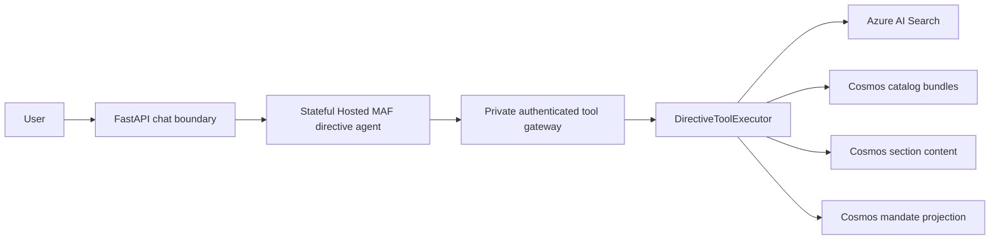

# Plan: Simplify the directive RAG pattern

**Status:** Proposed

**Date:** 2026-07-31

**Related idea:** [Simplify the directive RAG pattern](../IDEAS.md#simplify-the-directive-rag-pattern)

## Objective

Reduce the directive agent's model-visible tool surface from eight tools to five
without changing required retrieval, versioning, coverage, citation, identity,
continuation, or failure behavior.

The primary simplification is to:

1. Replace separate identity, manifest, and precomputed-summary tools with one
   exact directive-version tool that selects one bounded view.
2. Make `search_directives` the only Search tool, for both current discovery and
   focused exact-version retrieval.
3. Remove query-based resolution that performs Search and catalog reads before
   the agent often performs another Search.
4. Keep content batching, accepted-relation traversal, and user mandate lookup
   as separate capabilities because they have different safety and data-access
   contracts.
5. Deduplicate the two directive-ingestion reconciliation entry points in a
   separate behavior-preserving change after the runtime cutover.

This is a simplification plan, not a redesign of the RAG architecture. GPT-5.6
continues to own retrieval planning, and the FastAPI backend continues to own
authentication, validation, current-version defaults, exact-version safety,
content budgets, relation depth, citations, and observability.

## Success definition

The work is successful when:

- the Hosted MAF directive agent exposes exactly five tools;
- generic summaries replace separate resolution and summary calls with one
  catalog view, while complete-content workflows replace separate resolution
  and manifest calls with one manifest view;
- focused Search uses `search_directives` rather than a second overlapping
  Search tool;
- all current and historical version safeguards remain backend-enforced;
- complete-document and comparison requests still prove section coverage and
  follow explicit continuation without silent truncation;
- citation and per-user mandate enrichment remain unchanged at the public
  AG-UI and persisted-message boundaries;
- directive tool results remain suppressed from generic raw-JSON cards and use
  curated transcript labels;
- old tool names are removed after a bounded compatibility and rollback window;
- `run_daily()` and `reconcile_documents()` share one preparation path without
  changing publication order or failure compensation;
- deployed evaluation shows no grounding, coverage, security, or reliability
  regression.

Line count alone is not an acceptance criterion. The final code should be
easier to understand because each active tool has one distinct responsibility.

## Current implementation

The current request path is:



The trust boundary is sound: the Hosted Agent has no direct Search, Cosmos, or
Blob access. The unnecessary complexity is inside the tool topology and the
agent workflow, not in that security boundary.

### Current model-visible tools

| Current tool | Responsibility | Overlap |
| --- | --- | --- |
| `resolve_directive` | Resolve by stable ID or perform query Search and return candidates | Query mode overlaps `search_directives`; ID mode reads the same bundle later read by manifest/summary |
| `search_directives` | Current discovery or exact-version Search | Already has the filters needed to replace `search_within_directive` |
| `get_directive_manifest` | Read manifest from a published bundle | Reads the same bundle as resolve and summary |
| `get_directive_content` | Read exact-version section batches with continuation | Distinct and retained |
| `search_within_directive` | Search one exact version, optionally by section | Duplicates `search_directives` with stricter arguments |
| `get_related_directives` | Traverse accepted version-scoped relations | Distinct and retained |
| `get_precomputed_summary` | Read the generic summary from a published bundle | Reads the same bundle as resolve and manifest |
| `get_user_directive_mandates` | Resolve tri-state status for selected stable IDs | Distinct, identity-sensitive, and retained |

`DirectiveToolExecutor` currently has a dispatch branch and handler for each
tool. Query-based `resolve_directive` executes Search, groups candidate
directives, and performs one catalog resolution per candidate. A subsequent
narrow-answer workflow can then call `search_within_directive`, repeating
Search and performing another catalog read.

The prompt also encodes identity resolution and manifest inspection as a common
sequence rather than clearly branching by request type. Manifest inspection is
still required for complete-content planning, but the sequence is broader than
needed because:

- current discovery Search already returns stable directive and exact version
  citation metadata;
- a generic precomputed summary does not need a separate manifest response;
- a current, narrow evidence request can safely use current-only Search without
  a preliminary catalog resolution;
- one published Cosmos bundle already contains metadata, manifest, and summary.

### Prior simplification findings and disposition

| Finding | Current disposition | This plan |
| --- | --- | --- |
| GPT retrieval planning was duplicated between the agent and backend | Already fixed: GPT-5.6 supplies final intents and the backend performs direct hybrid Search plus deterministic RRF | Preserve; do not reintroduce a planner |
| Runtime directive content authority was split across stores | Already fixed: Cosmos owns published bundles and section content; Blob retains canonical Markdown and PDFs | Preserve; no storage migration |
| Agent tools overlap and force redundant calls | Still present | Primary implementation |
| Resolve, manifest, summary, and content paths repeatedly read the same published bundle | Still present across model tool calls | Consolidate metadata/manifest/summary views; retain the content read needed for each independent batch |
| `run_daily()` and `reconcile_documents()` duplicate preparation and result logic | Still present | Separate ingestion cleanup change |
| Staging and staged-relation writes appear unused by runtime readers | Runtime does not read them, but staging is a durable publication-attempt breadcrumb and run records currently record only success; staged relation IDs are transitioned to published IDs | Retain in this change; removal requires a separate operational-consumer and failure-diagnostics design |

## Locked behavior and safety invariants

The simplification must preserve all of the following.

### Version and publication behavior

- Normal Search defaults to `publication_state=published` and
  `is_current=true`.
- Historical Search is allowed only for one stable directive ID plus one exact
  directive version ID.
- Current, exact-version, version-label, and as-of-date resolution retain their
  existing meanings.
- Broad free-text Search across all historical versions is not an answer-evidence
  path. If current discovery cannot identify a stable directive, historical
  resolution requires the stable ID rather than exposing mixed-version chunks.
- Manifest, summary, content, and relation operations never return unpublished
  data.
- Exact-version Search validates that the authoritative published catalog
  bundle exists before returning derived Search evidence.
- The agent cannot submit a raw OData filter or disable current-only behavior
  without an exact-version selector.

### Coverage and answer behavior

- Generic summaries use the complete precomputed summary and its coverage
  metadata.
- Tailored summaries, procedures, eligibility guidance, and comparisons use
  complete content when it fits, otherwise ordered section batches.
- `get_directive_content` preserves section validation, token ceilings,
  per-call section ceilings, ordered output, explicit cursor continuation,
  `partial` status, and `CONTENT_TOO_LARGE`.
- Comprehensive comparisons account for added, removed, changed, moved,
  renumbered, and unchanged sections against both manifests.
- Tables, lists, exceptions, definitions, footnotes, and effective dates remain
  policy-bearing.

### Relations, identity, and citations

- Relation traversal uses accepted edges only, remains cycle-safe, and is capped
  at depth two.
- The authenticated user ID is injected by the backend and is never accepted in
  model tool arguments.
- Mandate status remains a late lookup for selected contributing stable
  directive IDs and does not affect retrieval, ranking, authorization, or
  relevance.
- Mandatory, non-mandatory, and unknown remain the only answer/citation states.
- Citations retain stable directive ID, exact version ID, version label,
  section, page range, effective date, retrieval strategy, coverage, mandate
  status, and mandate snapshot where available.

### Runtime and trust-boundary behavior

- Stateful inner Foundry conversation continuation, fenced turn lifecycle,
  recovery, leases, cancellation, heartbeat emission, and transcript commit
  remain unchanged.
- Public AG-UI event names and persisted conversation/message shapes remain
  compatible.
- The Hosted Agent continues to call only the private app gateway using its
  managed identity.
- No direct agent access to Search, Cosmos, Blob, mandate data, or user identity
  is introduced.
- `DIRECTIVE_MAX_ITERATIONS` remains at its existing default and bounds for the
  first cutover. A lower limit requires separate evaluation evidence.

## Target model-visible contract

The active Hosted Agent will expose these five tools:

| Target tool | Single responsibility |
| --- | --- |
| `get_directive` | Resolve one stable directive ID to one published version and return exactly one requested catalog view: metadata, manifest, or precomputed summary |
| `search_directives` | Execute one or more final semantic intents over current directives or one exact published version |
| `get_directive_content` | Return ordered exact-version section content with explicit continuation |
| `get_related_directives` | Traverse accepted relations from one exact published version |
| `get_user_directive_mandates` | Return tri-state mandate status for selected stable directive IDs using backend-injected identity |

This is the minimum balanced surface. Combining content, relations, or mandates
into one general `directive_rag` tool would create a mode-heavy orchestration
API, move retrieval planning into backend branches, and mix public directive
data with identity-sensitive data. Removing the mandate tool through automatic
lookup would also change the current final-source-only lookup timing. Neither
change is part of this behavior-preserving simplification.

### 1. `get_directive`

Proposed strict arguments:

```text
directive_id: required eight-digit stable ID
directive_version_id: optional exact version ID
version_label: optional exact version label
as_of: optional date
view: "metadata" | "manifest" | "summary", default "metadata"
```

Rules:

- `directive_version_id`, `version_label`, and `as_of` are mutually exclusive.
- No free-text `query` is accepted. Discovery belongs to `search_directives`.
- With no version selector, the backend resolves the current published version.
- `view` selects one bounded catalog projection, not a list of optional
  inclusions:
  - `metadata` returns public version metadata only;
  - `manifest` returns metadata, the complete ordered manifest, and the existing
    manifest coverage object;
  - `summary` returns metadata, the complete precomputed summary, and the
    existing summary coverage object.
- The tool returns only one optional large payload. It must not return manifest
  and summary together, which would waste model context for workflows that need
  only one.
- Exact lookup uses one catalog point read. Current lookup uses the current
  pointer plus the published bundle read. Label/as-of lookup retains the
  existing partition-scoped version query.
- A missing or ambiguous selector returns `status=not_found` with
  `error_code=DIRECTIVE_NOT_FOUND`.

The output keeps the current `ToolResultEnvelope`. Existing metadata, manifest,
summary, coverage, and citation field names are reused so runtime coverage and
citation enrichment do not need a second result model.

### 2. `search_directives`

Proposed strict arguments:

```text
intents: required list of 1..8 final semantic queries
directive_ids: optional list of stable eight-digit IDs
directive_version_id: optional exact version ID
section_ids: optional exact-version section IDs
max_results: 1..100, additionally bounded by backend configuration
```

Rules:

- Remove `current_only` from the final model-visible schema. The backend derives
  it: no exact version means current-only; an exact version means historical
  filtering is permitted.
- An exact version requires exactly one `directive_id`.
- `section_ids` requires that exact directive and version pair.
- Raw filter text remains forbidden.
- When an exact version is requested, first confirm the authoritative published
  catalog bundle exists, then execute Search with `current_only=false`.
- Use citation `retrieval_strategy=focused` for exact-version Search and
  `retrieval_strategy=discovery` otherwise.
- Preserve direct concurrent hybrid queries, semantic ranking, deterministic
  RRF, stable tie breakers, limits, retries, and the current result envelope.
- Do not add a second query planner, automatic query rewrite, or generic search
  mode switch.

During the compatibility release only, backend validation may accept the old
`current_only` field under its existing constraints so the previous agent image
can be rolled back. The new wrapper does not expose the field, and the final
cleanup removes it from backend validation.

### 3. Unchanged tools

`get_directive_content`, `get_related_directives`, and
`get_user_directive_mandates` keep their current public names, arguments, result
shapes, error codes, and security behavior.

Internal implementation may use typed `PublishedDirectiveVersion` objects
instead of dictionaries, but model-visible payloads remain JSON and private
catalog fields remain excluded.

## Current-to-target migration map

| Current call | Target call | Final action |
| --- | --- | --- |
| `resolve_directive(directive_id=...)` | `get_directive(..., view="metadata")` | Remove old name |
| `resolve_directive(query=...)` | `search_directives(intents=[query])`, followed by `get_directive` only if exact resolution is needed | Remove backend query-resolution path |
| `search_directives(...)` | `search_directives(...)` | Retain and simplify schema |
| `get_directive_manifest(...)` | `get_directive(..., view="manifest")` | Remove old name |
| `get_directive_content(...)` | Same | Retain |
| `search_within_directive(...)` | `search_directives(directive_ids=[...], directive_version_id=..., section_ids=...)` | Remove old name |
| `get_related_directives(...)` | Same | Retain |
| `get_precomputed_summary(...)` | `get_directive(..., view="summary")` | Remove old name |
| `get_user_directive_mandates(...)` | Same | Retain |

## Target agent workflows

Let `N` be the number of content calls required by continuation.

| Request type | Current typical calls | Target calls | Expected reduction |
| --- | --- | --- | --- |
| Current discovery or narrow question without a known ID | Resolve/Search can overlap, then focused Search, then mandates | `search_directives`, mandates | Eliminate duplicate query Search and candidate catalog fan-out |
| Current narrow question with a stable ID | Resolve, focused Search, mandates | Current-only `search_directives` filtered by ID, mandates | One model call and at least one catalog read |
| Generic summary with a known ID | Resolve, manifest, precomputed summary, mandates | `get_directive(view="summary")`, mandates | Four calls to two; three catalog bundle reads to one |
| Generic summary without a known ID | Query resolve, manifest, precomputed summary, mandates | Discovery Search, `get_directive(view="summary")`, mandates | One fewer model call and no candidate catalog fan-out |
| Tailored complete summary | Resolve, manifest, `N` content calls, mandates | `get_directive(view="manifest")`, `N` content calls, mandates | One model call and one bundle read |
| Historical narrow question | Resolve exact version, focused Search, mandates | `get_directive(view="metadata")`, exact `search_directives`, mandates | Same high-level calls, one Search contract |
| Comprehensive comparison | Two resolves, two manifests, `N` content calls, mandates | Two `get_directive(view="manifest")` calls, `N` content calls, mandates | Two model calls and two bundle reads |
| Linked-directive analysis | Resolve, relations, target resolution/retrieval, mandates | `get_directive` only where exact metadata/coverage is needed, relations, target retrieval, mandates | No forced extra view; traversal safeguards unchanged |

The prompt must not optimize for the fewest calls at the expense of coverage.
For example, a comparison still loads both complete versions or all required
section batches even though the tool list is smaller.

## Target read contract

Counts below exclude mandate lookup and apply after the caller has an exact
stable directive/version pair.

| Operation | Catalog reads | Search requests | Content reads |
| --- | ---: | ---: | ---: |
| `get_directive(view="metadata")` | 1 point read | 0 | 0 |
| `get_directive(view="manifest")` | 1 point read | 0 | 0 |
| `get_directive(view="summary")` | 1 point read | 0 | 0 |
| Current Search | 0 preliminary reads | One direct hybrid request per intent | 0 |
| Exact-version Search | 1 authority point read | One direct hybrid request per intent | 0 |
| One content batch | 1 bundle point read | 0 | Existing point reads for selected section parts |

Do not add a cross-request in-memory bundle cache in this change. Current
pointer changes, publication boundaries, independent tool calls, and rollback
clarity are more important than removing the one authority read that each
content batch currently performs.

## Detailed implementation plan

### 1. Shared tool contracts

Update `agent_contracts/tools.py`:

1. Add a strict `GetDirectiveArguments` model with the selector validator and
   `view` literal.
2. Add `section_ids` to `SearchDirectivesArguments`.
3. Make exact-version and section-filter validation explicit.
4. Remove `ResolveDirectiveArguments`,
   `SearchWithinDirectiveArguments`, and their active definitions.
5. Change `DIRECTIVE_TOOL_DEFINITIONS` to the five active tools.
6. For the compatibility release, define the four removed names separately as
   legacy backend definitions and let backend lookup validate the union.
7. Temporarily accept constrained `current_only` on the backend Search
   validator, while the new Hosted Agent wrapper omits it.
8. Delete all legacy definitions and `current_only` acceptance in the cleanup
   release.

Update `agent_contracts/__init__.py` exports accordingly. Do not add a new
dependency or a second source of tool definitions.

### 2. Typed catalog access

Update `backend/agent_memory_backend/directive_catalog.py`:

1. Replace internal dictionary-returning resolution with
   `resolve_published_version(...) -> PublishedDirectiveVersion | None`.
2. Make current-version and version-list helpers return validated
   `PublishedDirectiveVersion` objects.
3. Keep public metadata projection in one helper that accepts a typed published
   bundle and emits only `DirectiveMetadata` fields.
4. Use typed attributes in relation lookup and traversal rather than repeated
   `dict.get()` and model dump/validate cycles.
5. Preserve Cosmos item IDs, partition keys, query scope, publication checks,
   size validation, and unavailable-error mapping.

This refactor is internal only. It must not change catalog storage or add a new
contract version.

### 3. Directive executor

Update `backend/agent_memory_backend/directive_tools.py`:

1. Add `_get_directive()`:
   - resolve one typed published bundle;
   - project public metadata;
   - build the metadata, manifest, or summary payload selected by `view`;
   - reuse the current citation and coverage construction;
   - return the consistent not-found envelope.
2. Fold `_search_within()` into `_search_directives()`:
   - infer current versus exact mode from the validated arguments;
   - authority-check an exact version;
   - pass optional section IDs to `DirectiveSearchRepository.retrieve()`;
   - select `focused` or `discovery` citation strategy deterministically.
3. Keep `_content()`, `_related()`, and `_mandate_status()` behavior intact,
   changing only their internal bundle type where needed.
4. Remove the active `_resolve()`, `_manifest()`, `_search_within()`, and
   `_summary()` dispatch branches.
5. Keep small pure payload/citation helpers where they make the three
   `get_directive` views readable. Do not replace the executor with a generic
   operation registry or a mode-heavy mega-handler.
6. Preserve timeout, validation, data-unavailable, content-too-large, unknown
   section, invalid cursor, result-limit, relation-depth, and mandate-degraded
   behavior.

During the compatibility release:

- old manifest and summary names delegate to the corresponding
  `get_directive` view and keep their old payloads;
- old manifest and summary not-found calls retain the existing
  `status=error`, empty-data, `DIRECTIVE_NOT_FOUND` envelope even though the new
  `get_directive` tool uses its defined `status=not_found` envelope;
- old focused Search translates arguments into the unified Search path;
- exact-ID old resolve delegates to the metadata view and adapts the old
  `resolution_status` payload;
- query-based old resolve retains its existing implementation only for rollback
  traffic;
- compatibility code is clearly isolated and deleted in the cleanup release.

### 4. Gateway allowlist and authorization

Update `backend/agent_memory_backend/agent_tool_gateway.py`:

1. Make the active directive allowlist derive from the five active definitions.
2. In the additive backend release, allow the bounded legacy definition set for
   directive-agent sessions only.
3. Do not make legacy names available to support or Prompt Agent sessions.
4. Keep principal allowlists, session binding, agent-type immutability,
   backend-injected user identity, and error-envelope behavior unchanged.
5. Remove the legacy union after the prior agent release and rollback window
   are retired.

Do not add release-specific authorization branches unless deployment testing
proves the bounded union cannot safely support in-flight old sessions.

### 5. Hosted Agent wrappers

Update
`agents/directive-rag-maf/src/directive-rag-maf/gateway_tools.py`:

1. Add the `get_directive` wrapper with its exact selectors and `view`.
2. Add `section_ids` to `search_directives` and remove `current_only` from the
   wrapper signature.
3. Retain content, relation, and mandate wrappers unchanged.
4. Remove wrappers for resolve, manifest, focused Search, and precomputed
   summary.
5. Register exactly five functions in `DIRECTIVE_TOOLS`.
6. Preserve the shared `_invoke()` timeout and omission of `None`/empty optional
   arguments.

Update `agents/directive-rag-maf/tests/test_main.py` to assert the exact five
names and wrapper argument forwarding. Keep the iteration and stateful
`store=true` assertions.

### 6. Agent instructions

Rewrite `agent_contracts/directive_rag.txt` around decisions rather than a
mandatory call sequence:

1. Classify the request as discovery, narrow evidence, generic summary,
   tailored summary, procedure, eligibility guidance, comparison, or linked
   analysis.
2. Use current-only Search directly for discovery and narrow current evidence.
3. Use `get_directive` when a stable ID must be resolved to current,
   exact-version, label, or as-of state.
4. Request `view=summary` for a generic summary and
   `view=manifest` when planning complete/section-batched coverage.
5. Use exact-version Search for historical or section-focused evidence.
6. When a historical or as-of request lacks a stable ID, use current discovery
   to identify the stable directive first, then resolve the requested version.
   If current discovery cannot identify it, ask for the stable ID rather than
   exposing a broad multi-version evidence Search.
7. Treat multiple plausible Search matches as ambiguity: identify candidates or
   ask for clarification rather than selecting the first chunk as authority.
8. Preserve complete comparison, accepted relation, eligibility, procedure,
   mandate, citation, and incomplete-coverage rules.
9. Continue supplying final semantic intents; state explicitly that the backend
   does not rewrite or re-plan them.

Replace the blanket sequence with purpose-specific rules so the agent does not
call `get_directive` when current Search already satisfies a narrow question.
Retain manifest inspection for complete or comparative coverage, and explicitly
skip it only when the complete published precomputed summary satisfies a generic
summary request.

The existing prompt hash automatically creates a new prompt version. Do not
change model deployment or iteration limits in the same release.

### 7. Runtime progress, coverage, and citation enrichment

Update
`backend/agent_memory_backend/foundry_hosted_maf_runtime.py`:

1. Map `get_directive` to `WorkflowStage.RESOLVING`; that stage is valid for all
   three views without inspecting or exposing tool arguments.
2. Keep Search, content, relation, and mandate mappings unchanged.
3. During compatibility, retain old mappings so rollback traffic still emits
   safe progress.
4. Preserve `_coverage_counts()` field names. Manifest, summary, and content
   outputs deliberately retain their current coverage shapes.
5. Preserve late mandate-status joining and citation de-duplication.
6. Remove old progress mappings with the legacy tool cleanup.

The public workflow stages, heartbeat shape, citation event, cancellation
behavior, and final answer event remain stable. A small frontend tool-name
compatibility update is required separately below.

### 8. Frontend tool-name presentation

Update the two explicit directive-tool lists before activating the new agent:

1. In `frontend/src/converters.ts`, add `get_directive` to the directive-tool set
   so all of its results, including citation-free not-found envelopes, remain
   suppressed from the generic raw-JSON A2UI card.
2. In `frontend/src/components/chat-transcript.ts`, add a curated
   `get_directive` label such as "Directive details".
3. Keep the four legacy names in both lists during the compatibility window so
   old-agent rollback traffic renders exactly as before.
4. Remove the four legacy names in the Phase 3 cleanup after the previous agent
   can no longer receive traffic.
5. Add converter coverage for a citation-free `get_directive` not-found result
   and presentation coverage for the curated label.

This is a name-mapping update only. Do not change public tool, progress,
citation, transcript, or A2UI payload shapes.

### 9. Baseline telemetry

Use existing privacy-safe OpenTelemetry surfaces:

- `agent.run` for end-to-end duration and release ID;
- `directive.tool` for call count, duration, tool name, and failure;
- `directive.search.retrieve` for intent count and Search duration;
- model usage events for input/output/cached tokens.

If the current traces cannot count repeated tool calls per turn, add a
non-persisted total `ToolStartedEvent` counter to `TurnAccumulator` and set the
already-allowlisted `agent.tool_count` attribute on the `agent.run` span. Also
set existing safe token and citation-count attributes from accumulated events.
Do not record prompts, intents, directive content, tool arguments, user IDs, or
result payloads in telemetry.

Compare metrics by agent release ID before and after cutover.

### 10. Ingestion entry-point deduplication

Implement this after the runtime tool contract is stable, in a separate change
to `setup/directive_ingest/src/directive_ingestion/reconcile.py`:

1. Introduce a small private typed value representing prepared document
   reconciliation: discovered sources, changed preparations, validated metadata,
   and known directive IDs.
2. Extract one `_prepare_document_reconciliation()` path that performs:
   source discovery, Search resource readiness, preparation, source-set
   validation, known-ID assembly, and relation validation.
3. Extract shared result construction and successful run recording.
4. Keep `run_daily()` as the documents-plus-mandates orchestration and
   `reconcile_documents()` as documents-only orchestration.
5. Preserve operation order:
   - validate document and relation state;
   - validate mandate input in the daily path;
   - stage/publish/verify documents;
   - publish mandates in the daily path;
   - record successful run.
6. Preserve compensation behavior when Search publication, catalog publication,
   or catalog verification fails.
7. Do not combine mandate and document publication into a generic callback-based
   workflow.

Retain `stage_version()`, review records, and staged relation transitions.
There is no failed run record today, so deleting the staging breadcrumb in this
simplification would weaken operational diagnostics. A future removal proposal
must first identify every operational consumer and provide an explicit failed
publication-attempt record with equivalent audit value.

### 11. Documentation

After the final tool cutover:

- update `README.md` from eight tools to the five-tool responsibilities;
- update `docs/PRD-Solution-Challenges-1-5.md` at each current eight-tool
  reference;
- annotate
  `docs/i-want-to-tailor-my-rag-scenario-to-some.md` as the original design and
  describe the consolidated implementation where it discusses the current tool
  workflow;
- update this plan to `Implemented` only after deployed acceptance;
- archive the idea in `IDEAS.md` only after legacy aliases are removed and
  deployment is verified.

Historical implementation plans should not be rewritten to pretend they
originally used the new contract.

## Change and deployment sequence

The tool gateway and Hosted Agent are deployed independently, so a direct
one-step rename is not rollback-safe. Use one baseline/characterization change
followed by four reviewable implementation changes.

### Phase 0: Baseline and characterization

1. Freeze a representative evaluation set covering every workflow in the
   evaluation matrix below.
2. Record per-release tool calls, Search calls, catalog reads in repository
   tests, model tokens, end-to-end p50/p95 latency, error rate, citation
   completeness, and mandate completeness.
3. Add characterization tests for the current envelopes and safety boundaries
   before refactoring.
4. Confirm no external client calls directive tools directly. The private
   gateway should have only Hosted Agent callers.
5. Confirm the deployment can keep the prior backend and agent revisions
   available through the rollback window.

### Phase 1: Additive backend compatibility

1. Add the five active contracts, typed catalog access, unified executor paths,
   and legacy adapters.
2. Add frontend recognition for both new and legacy directive tool names.
3. Deploy the backend and compatibility frontend before the new agent.
4. Verify both old and new tool contracts through authenticated gateway tests.
5. Keep the current agent active.
6. Require zero changes to public chat, document, source, or conversation APIs.

Exit gate: the old agent passes its full evaluation against the compatibility
backend, direct tests of the five new calls pass, and the compatibility frontend
suppresses and labels both name sets correctly.

### Phase 2: Five-tool agent cutover

1. Confirm the compatibility frontend is active, then deploy the new directive
   agent image and prompt version.
2. Point the active directive runtime at that physical agent release using the
   existing deployment process.
3. Run the complete evaluation matrix with new conversations.
4. Continue at least one pre-existing stateful conversation and verify that
   history, tool events, citations, and transcript commit remain correct.
5. Confirm the old agent remains a viable rollback target while the backend
   accepts legacy calls.

Exit gate: functional evaluation passes, no security/coverage regression is
present, and latency/token acceptance is met.

### Phase 3: Soak and remove compatibility

1. Soak for the agreed normal traffic window. When representative traffic is
   unavailable, run every correctness scenario at least three times and each
   latency-critical summary, narrow-Search, and comparison scenario at least
   twenty times.
2. Confirm the previous agent revision cannot receive new traffic and the
   rollback decision has closed.
3. Remove legacy wrappers/definitions, query-based resolution, old dispatch
   branches, old progress mappings, temporary `current_only` acceptance, and
   the legacy gateway allowlist.
4. Remove legacy frontend tool names while retaining the five active mappings.
5. Run the full suites and deployed evaluation again.
6. Update current architecture documentation to exactly five tools.

Compatibility code is not part of the target architecture and must not remain
as an undocumented permanent fallback.

### Phase 4: Ingestion cleanup

1. Land the reconciliation-entry-point refactor separately.
2. Run ingestion contract, publication-boundary, idempotency, relation, and
   preflight suites.
3. Run `reconcile-documents` and `run-daily` in a non-production environment and
   compare operation order and result records.
4. Do not change staging or publication schemas.

### Phase 5: Close the idea

1. Verify all definition-of-done checks.
2. Mark this plan implemented.
3. Move the idea to the archive with the final design and deployment evidence.

## Rollback

### Before compatibility removal

- Reactivate the previous Hosted Agent release.
- Keep the compatibility backend and frontend deployed; they accept and present
  old and new tool names.
- Preserve all new contracts and typed internal code while diagnosing the agent
  or prompt regression.
- Do not change or roll back directive data because this plan has no storage or
  index migration.

### After compatibility removal

- Redeploy the compatibility backend and frontend revisions before reactivating
  the old agent.
- Alternatively, fix forward in the five-tool agent while leaving the current
  backend active.
- Stateful conversation recovery and deletion continue to use the existing
  mechanisms; do not edit stored inner conversation IDs manually.

### Ingestion cleanup rollback

- Revert only the private reconciliation-helper refactor.
- No data migration or cleanup is involved, so the previous orchestration can be
  redeployed against the same catalog, content, Search, Blob, and mandate data.

## Test plan

### Shared contract tests

- `get_directive` requires an eight-digit stable ID.
- Its three version selectors are mutually exclusive.
- All three `view` values validate; unknown view values fail.
- Query text and user identity are rejected.
- Unified Search rejects raw filter text and model-provided user identity.
- Exact-version Search requires exactly one stable directive ID.
- Section filters require an exact directive/version pair.
- Current-only behavior is backend-derived after compatibility cleanup.
- The final active definition set contains exactly five names.

### Catalog and executor tests

- Exact metadata, manifest, and summary views each perform one catalog bundle
  read.
- Current, label, exact-version, and as-of selectors resolve the same versions
  as the current implementation.
- Duplicate version-label matches and missing selectors return the defined
  not-found envelope.
- Legacy manifest and summary aliases retain their original not-found error
  envelope during compatibility.
- Metadata output excludes private artifact locators and section-content
  descriptors.
- Manifest and summary payloads and citations match the current field-for-field
  contract.
- Current Search uses the published/current filter.
- Exact Search first checks catalog authority, never uses the current filter,
  and forwards section IDs.
- Exact Search for a missing/unpublished catalog version does not return stale
  Search evidence.
- Direct hybrid Search, concurrent intents, deterministic RRF, tie breakers,
  limits, retries, and citation normalization remain unchanged.
- Content continuation, token budgets, section limits, cursor validation,
  unknown-section errors, ordering, and integrity checks remain unchanged.
- Related traversal remains accepted-only, depth-bounded, de-duplicated, and
  cycle-safe.
- Mandate lookup uses only injected identity and preserves degraded/unknown
  behavior.
- Legacy adapters produce the old outputs during Phase 1 and disappear in
  Phase 3.

Primary files:

- `backend/tests/test_directive_tools.py`
- existing catalog/content/Search tests under `backend/tests/`

### Gateway and Hosted Agent tests

- The new agent registers exactly five directive tools and no support or direct
  data-plane tools.
- Every wrapper forwards the intended name and arguments through the existing
  timeout path.
- The gateway permits the five names only for directive sessions.
- Cross-agent calls, mismatched principals, mismatched sessions, and
  model-supplied identity remain denied.
- During compatibility only, old names work for directive sessions and no other
  agent type.
- The prompt contains agent-owned final-intent planning, ambiguity handling,
  complete coverage, mandate, relation, eligibility, procedure, and citation
  rules.
- The prompt no longer requires a manifest for a generic precomputed summary or
  a resolve call before current narrow Search.

Primary files:

- `agents/directive-rag-maf/tests/test_main.py`
- `backend/tests/test_directive_tools.py`
- `backend/tests/test_hardening.py`
- `backend/tests/test_dual_agents.py`

### Streaming and continuation tests

- `get_directive` emits a safe resolving progress stage.
- Unified Search, content, relations, and mandates retain their current stages.
- Summary/content coverage still emits valid completed/total progress.
- Mandate results still enrich all directive citations without changing
  non-directive citations.
- Heartbeats continue while tools are slow.
- Cancellation closes the Hosted SDK stream, does not persist a partial turn,
  and releases the conversation lease.
- A multi-turn directive conversation reuses its inner conversation and does
  not replay prior transcript text.
- Turn completion/failure fencing and recovery remain unchanged across the
  agent release cutover.

Primary files:

- `backend/tests/test_directive_streaming.py`
- stateful continuation tests in `backend/tests/` and `maf_hosting/tests/`

### Frontend tests

- A citation-free `get_directive` not-found envelope produces no generic A2UI
  raw-JSON card.
- Successful new directive-tool results remain suppressed as before.
- The transcript uses the curated `get_directive` label.
- Legacy names remain recognized during compatibility and are removed with the
  final cleanup.

Primary files:

- `frontend/src/converters.test.ts`
- a focused transcript rendering test under the existing frontend test runner

### Ingestion tests

- Both public entry points call one shared document-preparation path.
- Daily reconciliation parses mandates against the same known-ID set as before.
- Documents publish before mandates in the daily workflow.
- Documents-only reconciliation never publishes mandates.
- Result counts and successful run records match the current behavior.
- Search/catalog compensation and validation failure behavior remain unchanged.
- Unchanged sources remain skipped and idempotent.
- Relation graph validation still combines changed and published sources.
- Staging, review, relation transition, current activation, and verification
  order remain unchanged.

Primary files:

- `setup/directive_ingest/tests/test_failure_boundaries.py`
- `setup/directive_ingest/tests/test_ingestion_contracts.py`
- `setup/directive_ingest/tests/test_preflight.py`
- targeted reconciliation tests added beside the existing ingestion suite

### Suite execution

Run the existing test mechanisms only:

- backend `unittest` suite through the backend `uv` environment;
- directive Hosted Agent `python -m unittest` suite;
- `maf_hosting` stateful tests;
- frontend's existing test command;
- directive ingestion `pytest` suite through its `uv` environment.

No new test runner or dependency is required.

## Deployed evaluation matrix

Use fixed directive fixtures and expected exact IDs/versions so before/after
results are comparable.

| Scenario | Required proof |
| --- | --- |
| Ambiguous discovery query | Returns grounded candidate directives or asks for clarification; does not silently choose the first chunk |
| Current narrow question | Uses current-only Search, answers from cited sections/pages, and avoids a forced preliminary catalog call |
| Stable-ID current question | Restricts Search to that ID and cites the resolved current exact version |
| Exact historical question | Returns only the requested version and never mixes current evidence |
| Historical question without a stable ID | Uses current discovery to identify the stable directive, then resolves the requested version; asks for the ID if discovery is inconclusive |
| Version-label and as-of resolution | Selects the same published versions as baseline |
| Generic summary | Uses the precomputed complete summary, reports complete coverage, and needs only `get_directive` plus mandates |
| Tailored complete summary | Reads every required section through explicit continuation and reports no silent truncation |
| Procedure | Reproduces only documented steps and identifies external procedure dependencies |
| Eligibility guidance | Separates directive requirements from user facts, requests missing facts, and remains non-authoritative |
| Comprehensive comparison | Covers both manifests and every added/removed/changed/moved/renumbered/unchanged section |
| Linked analysis | Traverses accepted edges only, stops at depth two, and remains cycle-safe |
| Mandate unavailable | Returns grounded content with `unknown`, never changes ranking/access, and exposes no user identity |
| Oversized section | Returns the typed content-too-large response and does not truncate |
| Multi-turn follow-up | Reuses stateful context, preserves exact version grounding, and commits one complete turn |
| Cancellation | Stops work, closes streams, releases leases, and persists no partial assistant turn |

For each scenario, compare:

- selected stable directive IDs and exact versions;
- cited sections/pages and coverage;
- mandate labels;
- number and sequence of tool calls;
- Search intent count;
- input/output/cached tokens;
- time to first progress, time to first answer token, and total latency;
- errors, retries, and continuation count.

## Performance and operational acceptance

Acceptance requires:

- exactly five active model-visible tools;
- generic summary uses one catalog bundle read instead of three;
- current stable-ID narrow Search requires no preliminary catalog resolution;
- exact-version Search performs one authority read and no duplicate Search path;
- comparison removes one resolve/manifest pair per compared version;
- no increase in Search requests for any fixed evaluation scenario;
- no increase in content calls or missing coverage for complete workflows;
- p95 end-to-end latency does not regress by more than 5% for any scenario and
  improves for generic summary and current narrow Search;
- p95 input tokens do not regress by more than 5%, with lower tokens expected
  where redundant tool outputs are removed;
- zero citation identity/version/section/page regressions;
- zero current-versus-historical leakage;
- zero new 401/403, timeout, cancellation, continuation, or persistence
  regressions;
- no new public endpoint, credential, data store, index, or infrastructure
  resource.

If answer quality or complete coverage regresses, do not compensate by adding
permanent aliases or a larger prompt. Fix the target contract or prompt
decision rule, rerun the evaluation, and retain the old agent until it passes.

## Risks and mitigations

| Risk | Mitigation |
| --- | --- |
| `get_directive` becomes a mode-heavy mega-tool | Limit it to one selector family and one of three views backed by the same catalog bundle; keep content, relations, and mandates separate |
| Summary responses waste context by also returning manifests | `view` selects exactly one optional payload |
| Removing query-based resolve weakens ambiguity handling | Add explicit prompt guidance and an ambiguous-discovery evaluation; validate the selected candidate with `get_directive` when exact resolution is required |
| A retired directive cannot be found through current discovery | Require its stable ID and return a clear clarification request rather than reopening broad historical evidence Search |
| Unified exact Search returns stale derived evidence | Require a published catalog authority check before exact-version Search |
| The new agent calls old names from prior context | Deploy a bounded compatibility backend first and test a pre-existing stateful conversation |
| Compatibility becomes permanent complexity | Define Phase 3 deletion as a release exit gate and exclude legacy names from final acceptance |
| Progress becomes misleading for combined catalog views | Map `get_directive` to the universally valid resolving stage and rely on existing coverage events; do not inspect sensitive arguments for progress |
| Automatic mandate simplification changes personal-data access | Keep the explicit late mandate tool and existing runtime join |
| Lowering iteration limits breaks long comparisons | Keep the current limit until post-cutover telemetry proves a safe lower bound |
| Ingestion refactor changes publication order or compensation | Land separately, use a typed preparation result, and assert call ordering/failure boundaries |
| Removing staging loses failure diagnostics | Retain staging; require an explicit replacement diagnostics design before any future deletion |
| Typed catalog refactor broadens scope | Restrict it to runtime repository return types and preserve storage/query contracts |

## Primary implementation surfaces

- `agent_contracts/tools.py`
- `agent_contracts/__init__.py`
- `agent_contracts/directive_rag.txt`
- `agents/directive-rag-maf/src/directive-rag-maf/gateway_tools.py`
- `agents/directive-rag-maf/src/directive-rag-maf/main.py`
- `agents/directive-rag-maf/tests/test_main.py`
- `backend/agent_memory_backend/directive_catalog.py`
- `backend/agent_memory_backend/directive_tools.py`
- `backend/agent_memory_backend/agent_tool_gateway.py`
- `backend/agent_memory_backend/foundry_hosted_maf_runtime.py`
- `backend/agent_memory_backend/chat_service.py` and
  `turn_accumulator.py` only if the baseline needs a total tool-call metric
- `backend/tests/test_directive_tools.py`
- `backend/tests/test_directive_streaming.py`
- related gateway, hardening, and stateful continuation tests
- `frontend/src/converters.ts`
- `frontend/src/converters.test.ts`
- `frontend/src/components/chat-transcript.ts`
- a focused transcript rendering test under `frontend/src/`
- `setup/directive_ingest/src/directive_ingestion/reconcile.py`
- targeted directive-ingestion tests
- `README.md`
- `docs/PRD-Solution-Challenges-1-5.md`
- `docs/i-want-to-tailor-my-rag-scenario-to-some.md`
- `IDEAS.md` after deployment verification

No Terraform, Search schema, Cosmos schema, Blob schema, or public API change is
expected. Frontend changes are limited to tool-name suppression, labels, and
their tests.

## Out of scope

- Slash commands such as `/search`, `/compare`, or `/id`.
- A new query planner, query rewriting model, or knowledge-base retrieval mode.
- Model deployment changes or iteration-limit tuning.
- Search chunking, embeddings, semantic configuration, RRF constants, ranking,
  or index schema.
- Free-text discovery of directives with no current published version; exact
  historical resolution remains available once the stable ID is known.
- Cosmos/Blob authority, storage layout, data migration, or republishing.
- Direct Hosted Agent access to any data plane.
- Changes to stateful continuation, recovery, transcript fencing, or retention.
- Automatic mandate lookup on every retrieval.
- Relation inference, review workflow, accepted-edge semantics, or depth limits.
- Removal of staging/review records or staged relation transitions.
- Frontend workflow, citation, or payload-shape changes beyond the required
  tool-name suppression and label mappings.
- Precomputed version diffs.
- Permanent dual contracts or feature-flagged legacy tool behavior.

## Definition of done

- [ ] Five active tool definitions and five Hosted Agent wrappers remain.
- [ ] Old tool names and compatibility validators are absent from active code.
- [ ] Query-based resolution and the second Search handler are deleted.
- [ ] Metadata, manifest, and summary views use one typed catalog resolution path.
- [ ] Required unit, integration, stateful, streaming, and ingestion suites pass.
- [ ] The deployed evaluation matrix passes with exact version and coverage
      evidence.
- [ ] Performance and operational acceptance thresholds are met.
- [ ] Rollback was proven before compatibility removal.
- [ ] Current README and PRD documentation describe five tools.
- [ ] Frontend suppression and transcript labels contain the five active names
      and no removed legacy names.
- [ ] The ingestion entry points share preparation logic without changing
      publication behavior.
- [ ] This plan is marked implemented and the idea is archived only after
      deployment verification.
